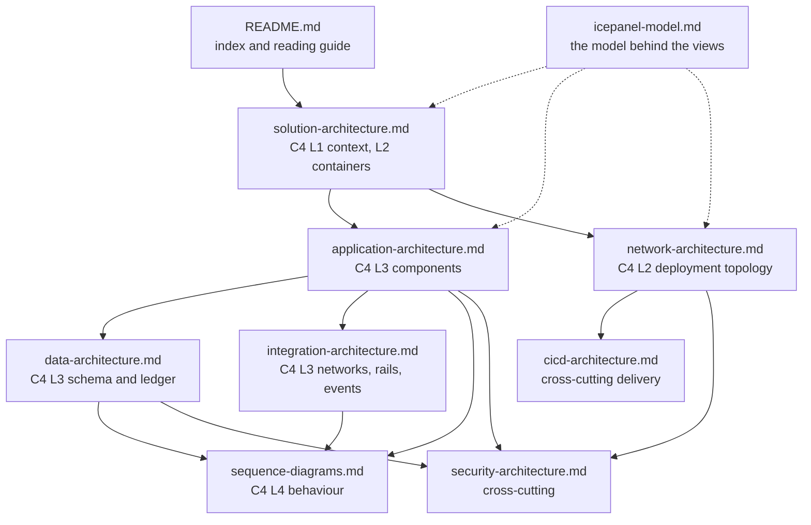

# Apivo architecture

*Which document in this set answers which question, and in what order to read them.*

**Status**: 2026-09-07 — `main @ 0461ad7`

## Contents

- [What Apivo is](#what-apivo-is)
- [The C4 ladder used here](#the-c4-ladder-used-here)
- [The document map](#the-document-map)
- [The document set](#the-document-set)
- [These documents, ADRs and specs](#these-documents-adrs-and-specs)
- [Start here for cashback](#start-here-for-cashback)
- [The maturity legend](#the-maturity-legend)
- [Regenerating and extending the set](#regenerating-and-extending-the-set)
- [Open questions and known gaps](#open-questions-and-known-gaps)

## What Apivo is

Apivo is a super app for Greek communities abroad, built and operated by one person.
It ships two products from one repository: **epiloYES**, a multilingual local newspaper in which language and place are independent axes, and **CASHBACK**, in which a member earns a share of the affiliate commission a retailer pays on their purchase.
Both run as product-scoped modular monoliths inside a single Go binary ([cmd/apivo](../../cmd/apivo)) behind an Astro frontend ([web/](../../web)) over one Postgres database, isolated by schema rather than by deployable ([ADR-0001](../adr/0001-super-app-architecture.md)).
The rules that carry legal or financial exposure are enforced by the database rather than by application discipline — I-1…I-5 for content licensing, C-1…C-10 for money ([constitution](../../.specify/memory/constitution.md), Principles VIII and IX).
The cashback alpha credits a member only from evidence a network reported, and no money leaves without a named human approver.

## The C4 ladder used here

C4 reads an architecture at four zoom levels. Every document in this set names the level it sits on, so a reader can stop climbing when the question is answered.

| Level | Question | Documents |
|---|---|---|
| **1 — Context** | Who uses Apivo, and what systems does it depend on? | [solution-architecture.md](solution-architecture.md) |
| **2 — Container** | What runs, and where? | [solution-architecture.md](solution-architecture.md), [network-architecture.md](network-architecture.md) |
| **3 — Component** | What is inside each container, and how does it fit together? | [application-architecture.md](application-architecture.md), [data-architecture.md](data-architecture.md), [integration-architecture.md](integration-architecture.md) |
| **4 — Code** | What actually happens, call by call? | [sequence-diagrams.md](sequence-diagrams.md) |

Two documents are deliberately off the ladder because they cut across every level: [security-architecture.md](security-architecture.md) and [cicd-architecture.md](cicd-architecture.md). One is the ladder itself in machine-readable form: [icepanel-model.md](icepanel-model.md).

## The document map

Every arrow reads *"refines"*: the target answers, in more detail, a question the source raised. Every document in the set is a node on this map, and nothing that is not in the set appears on it.

## The document set

| Document | The question it answers | Read it if you are |
|---|---|---|
| [solution-architecture.md](solution-architecture.md) | What is Apivo, who uses it, which systems does it touch, and what runs? | Anyone, first. A founder gets the whole shape here. |
| [application-architecture.md](application-architecture.md) | What are the modules inside the binary, what may import what, and where does each cashback stage live? | An engineer about to change code, or a reviewer judging where a change belongs. |
| [data-architecture.md](data-architecture.md) | What is the schema, which invariant does each constraint carry, and how is a member balance derived rather than stored? | Anyone touching a migration, an amount, or the ledger. |
| [integration-architecture.md](integration-architecture.md) | How do affiliate networks, the payout rail, the ledger and the outbox connect, and what is the contract at each seam? | Anyone adding a network adapter, a rail, or an event consumer. |
| [network-architecture.md](network-architecture.md) | Where does the traffic go — edge, hosts, containers, environments, databases? | Whoever is provisioning or debugging a deployment. |
| [security-architecture.md](security-architecture.md) | Who may do what, how is that proved, and which secrets exist? | A reviewer of anything touching auth, roles, money or member data. |
| [cicd-architecture.md](cicd-architecture.md) | What must pass before a change lands, and how does it reach a host? | Anyone whose build is red, or who wants to add a gate. |
| [sequence-diagrams.md](sequence-diagrams.md) | What happens, step by step, in the flows that matter — click to credit, credit to payout, poll to evidence? | Anyone who needs the behaviour rather than the structure. |
| [icepanel-model.md](icepanel-model.md) | What objects and relationships the visual model holds, and how it stays true to the tree. | Whoever maintains the IcePanel workspace ([.mcp.json](../../.mcp.json)). |

## These documents, ADRs and specs

Three bodies of writing, three different lifetimes. They are not alternatives.

- **[docs/adr/](../adr/)** — decisions that outlive a feature. One question, its context, the decision, its consequences, and the alternatives with the reason each was rejected. An accepted ADR is never edited; it is superseded by a record that names it. Five are accepted today ([index](../adr/README.md)).
- **[specs/](../../specs/)** — feature-local. Spec Kit's `spec.md`, `plan.md`, `data-model.md`, `contracts/` and `tasks.md` for one feature, in the state that feature is in. Five features exist. One is approved — `002-apivo-cashback-alpha`; the other four are drafts, and one of those, `005-provable-evidence`, has a spec and research but no plan yet.
- **docs/architecture/** (here) — the standing description of what *is*, across features. It cites both of the above and never re-decides either.

Precedence when they disagree: the [constitution](../../.specify/memory/constitution.md) wins over an ADR, an ADR wins over a spec, and **the code wins over all three as a statement of what is built today**. This set is written from the tree, and says so wherever prose elsewhere has gone stale — `specs/002-apivo-cashback-alpha/tasks.md` in particular is not a status board.

## Start here for cashback

Three documents, in this order, is about ninety minutes and covers the money end to end.

1. **[solution-architecture.md](solution-architecture.md)** — what the product is, the two-product boundary, and the ten money invariants stated once.
2. **[data-architecture.md](data-architecture.md)** — the cashback schema, the earnings state machine, and the ledger. This is where the invariants stop being claims and become constraints.
3. **[sequence-diagrams.md](sequence-diagrams.md)** — the same money walked through as behaviour: click-out, network poll, attribution, hold, confirm, withdrawal, approval, settlement.

Then, by need: [integration-architecture.md](integration-architecture.md) to add a network, [security-architecture.md](security-architecture.md) to reason about who may release money.

## The maturity legend

Used in a **Status** column throughout the set. Defined once, here.

| Label | Meaning | A real example |
|---|---|---|
| **Built** | Implemented, wired in the composition root, and covered by tests that run in CI. | The earnings state machine — the six states and the transitions between them in [state.go](../../internal/cashback/earnings/state.go), applied by [statemachine.go](../../internal/cashback/earnings/statemachine.go). The schema carries its own half: a check constraint refuses a state name outside the six, and a deferred constraint trigger refuses a state change with no `entry_transition` row recording that hop ([0013](../../internal/platform/db/migrations/0013_cashback_earnings.up.sql)). |
| **Partial** | Some of it runs; a named piece does not. The gap is stated, not implied. | Settlement records the payout and the request as paid ([settle.go](../../internal/cashback/payout/settle.go)) but nothing moves the entries `reserved → paid`; [postings.go](../../internal/cashback/earnings/postings.go) returns `ErrNotThisPackagesToPost` and no production caller supplies that posting. |
| **Specified** | Written down in a spec, not built. No table, no package, no route. | Claims and with them C-8, C-9, C-10 — [specs/003-cashback-claims/tasks.md](../../specs/003-cashback-claims/tasks.md), 45 tasks, none done. |
| **Retired** | Deliberately withdrawn. Kept in the tree only where it still earns its place, and said so. | Cloudflare Containers as a deployment target ([README.md](../../README.md)); the flat `NETWORK_DRIVER` keys, which are now *refused* at startup rather than ignored ([networks.go](../../internal/platform/config/networks.go)). |

"Partial" is the label that matters. An overstated **Built** is the only failure mode this set can produce on its own.

## Regenerating and extending the set

Every document is hand-written from the tree and cited back to it, so there is no generator to run. Keeping it true is therefore a review habit, not a build step:

- A document is refreshed by re-reading the files it cites. A citation that no longer resolves is the signal; the fastest check is `grep -o '](\.\./\.\./[^)]*)' docs/architecture/*.md` piped through a file-existence test.
- The **Status** line carries a date and a commit-ish. Change both when you change the body. A document whose status line disagrees with its content is worse than an absent document.
- A new view joins the map above, the table, and the C4 ladder table — in all three, or it is not in the set.
- The repository's house rules and the constitution's Principle I apply to these files exactly as they do to code ([constitution](../../.specify/memory/constitution.md)): sole authorship, no vendor names anywhere in the prose, British spelling, and every diagram a Mermaid block that parses.
- A decision discovered while writing does not belong here. It belongs in a new ADR, and this set then cites it.

## Open questions and known gaps

- **The commit-ish is a moving target.** This set was written as `main` moved from `c35e3d1` to `0461ad7`, which added self-registration in [internal/account](../../internal/account). Nothing in that work changes a claim made here; the HTTP surface counts were re-taken at `0461ad7`.
- **No automated link check runs in CI.** [.github/workflows/](../../.github/workflows) gates commits, migrations, brands, k8s topology, make targets and the OpenAPI document — not these files. A moved Go file breaks a citation silently.
- **The set describes the alpha, not a roadmap.** Anything a founder asks about that is not in the four maturity labels above is genuinely undecided; the constitution's Governance section lists twelve open cashback questions — Q1 and Q3 to Q13 — still carrying safe defaults rather than decisions. Q2, the regulatory posture on member balances, is the one recorded as decided.
- **No view covers the news product in depth.** epiloYES appears only where it shares substrate with cashback — the database, the binary, identity, the outbox, the deployment. Its own component view is not written.
- **Nothing checks the model against the tree.** [icepanel-model.md](icepanel-model.md) carries a source path on every one of its 74 objects, and all 74 resolve today — but only because they were checked by hand. A package renamed tomorrow leaves the model quietly wrong, exactly as a hand-written type would. The document proposes a drift gate in the manner of the `sqlc` and OpenAPI conformance checks; it is a proposal, and no such gate exists.
