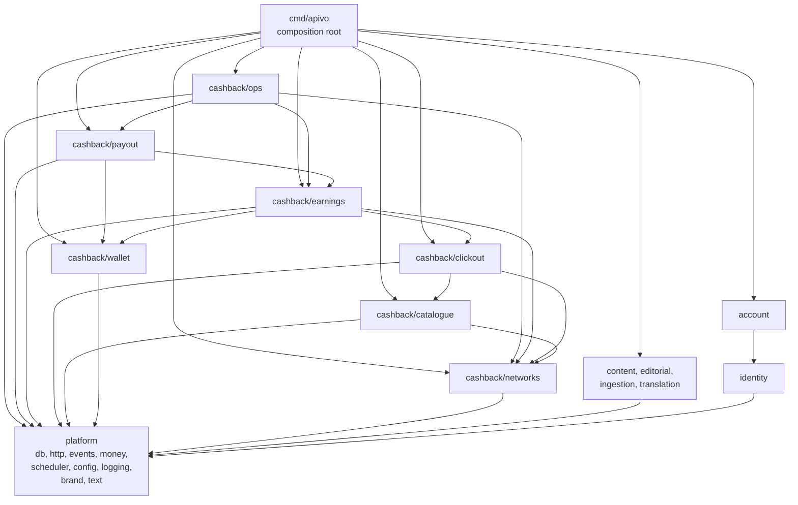
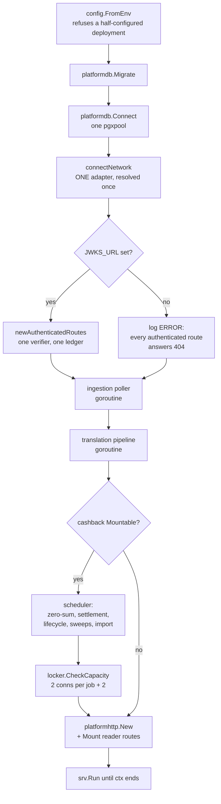
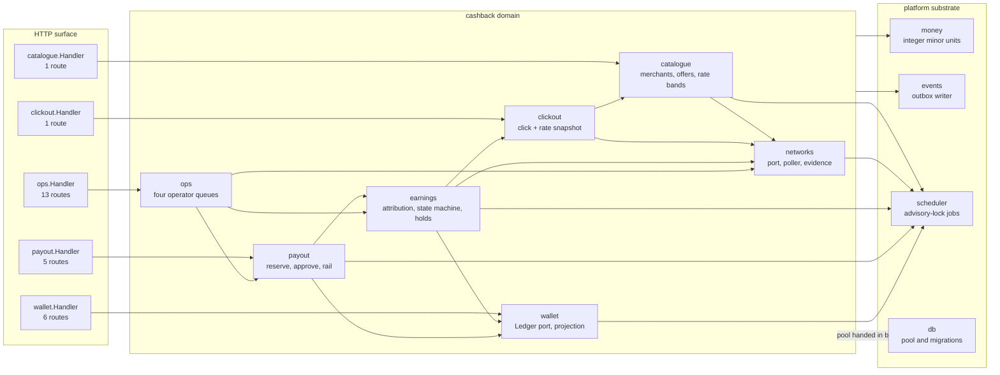
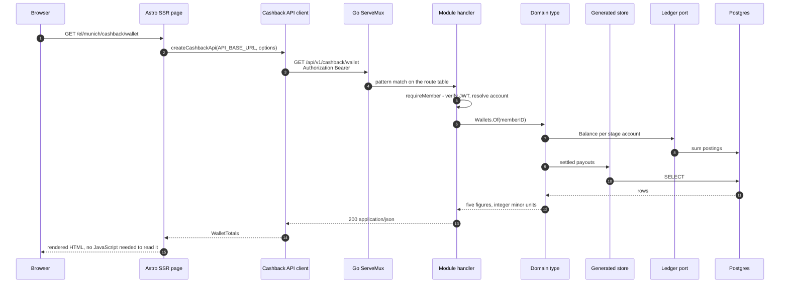

# Application architecture

*What are the modules inside the binary, what may import what, and how does a cashback request travel from a browser to a database row?*

**Status**: 2026-09-07 — `main @ 0461ad7`

## Contents

- [The modular monolith, and what enforces it](#the-modular-monolith-and-what-enforces-it)
- [The composition root](#the-composition-root)
- [The cashback components](#the-cashback-components)
- [Ports and adapters](#ports-and-adapters)
- [The store convention and generated code](#the-store-convention-and-generated-code)
- [Domain events and the outbox](#domain-events-and-the-outbox)
- [The HTTP layer](#the-http-layer)
- [The frontend application](#the-frontend-application)
- [Testing architecture](#testing-architecture)
- [Open questions and known gaps](#open-questions-and-known-gaps)

---

## The modular monolith, and what enforces it

One repository, one Go module, one deployable. Product domains are peers under [internal/](../../internal), isolated by schema, connected only by asynchronous events ([ADR-0001](../adr/0001-super-app-architecture.md)). The constitution states the same rule as a technology standard: *"no other module imports a sibling's internals. Modules communicate through interfaces defined by the consumer, wired in `cmd`. An architecture test fails the build on violations"* ([constitution](../../.specify/memory/constitution.md)).

The architecture test is [internal/arch/arch_test.go](../../internal/arch/arch_test.go). It is not a lint pass over a list of package names — it parses every `.go` file under `internal/`, derives the module of the importer and of the import from their first path segment, and judges the pair. What it checks, exactly:

| Rule | Refusal |
|---|---|
| `platform` is the bottom layer | `platform must not import sibling module "X"` |
| `identity` sits directly above it and imports only `platform` | `identity must not import module "X"` |
| A product domain may not import another product domain, **at any depth** | `domain "cashback" must not import domain "content" at any depth` |
| Sub-packages of one product domain may import each other freely | allowed, asserted by a positive fixture |
| Nothing under `internal/` may import the composition root | `must not import the composition root` |
| Only a package **directly beneath** `cashback/wallet` may import a ledger vendor SDK | `must not import ledger SDK "…"` |

Four details decide whether the rules mean anything:

- **Test files are judged too.** `_test.go` is parsed like any other file, because a test helper that imports a sibling domain couples the two exactly as production code does, and it is the likelier place for the first such import to appear.
- **The ledger-SDK rule is checked before the module filter.** A vendor SDK is by definition outside this module and would otherwise be waved through as somebody else's business. The port package itself is outside the allowance: *"a port that imports the vendor it exists to hide is the failure this rule is about"*.
- **The scan refuses to pass vacuously.** `TestModuleBoundaries` fails if it parsed zero files or saw zero imports of this module. `assertModulePath` fails if `go.mod` no longer declares the module path the rules match on. `assertLedgerSDKsDeclared` fails if `go.mod` no longer requires the SDK the vendor rule names. `checkLayers` fails if `internal/platform/` or `internal/identity/` has been renamed away, and if fewer than two *product* domains exist — `arch` itself is excluded from that count, so it cannot stand in for the second domain.
- **The rules are proved to fire.** `TestModuleBoundaryRules` runs 25 synthetic one-file package graphs through the same `checkInternal` the real scan uses, each breaking exactly one rule — or deliberately breaking none — and asserts both the reason and the file blamed. `TestBoundaryScanRefusesToPassVacuously` runs 7 trees that would produce a clean scan while checking nothing.

A second file narrows the rule to one port. [internal/arch/network_isolation_test.go](../../internal/arch/network_isolation_test.go) makes SC-008 — *adding a second affiliate network changes only its own adapter and the composition root* — structural, in two halves pointing opposite ways:

- **A. Nothing in the domain names an adapter.** Only [cmd/](../../cmd) may import `networks/awin`, `networks/fixture` or `networks/linkwise`; the port's own **test** files may too, because the conformance harness lives there and a port with no implementation cannot be exercised at all.
- **B. No adapter names anything but its port.** An adapter may import its own package, `internal/cashback/networks` (the port, *not* the generated store beneath it), `internal/platform/*`, and anything outside this module. Nothing else — not the store, not the wallet, not a sibling adapter.

Adapters are discovered by source rather than by name: a directory directly beneath the port that holds at least one non-test `.go` file without the `Code generated by` banner. That is what keeps `networks/store/` out of the adapter set without naming it. `TestNetworkAdaptersAreSealed` refuses to run with fewer than two adapters found, because SC-008 is a claim about the *second* network. `TestEveryAdapterIsReachableFromTheCompositionRoot` fails on an adapter that asserts `var _ networks.Network` and that nothing in `cmd/` imports. `TestNetworkIsolationRulesFire` proves those rules with 10 fixture graphs of its own.

Both files run with no database and no compose stack:

```sh
make arch-test     # go test ./internal/arch/...
```

### Dependency directions

Every edge below is a production (non-test) import verified in the tree. `internal/platform` is the only shared substrate; `internal/identity` is the one shared layer above it.



Three properties are worth reading off it. The cashback sub-graph is a DAG with `wallet` and `networks` at the bottom and `ops` at the top — no cycles, so a change to the ledger port cannot be answered by a change in the operator queue. **No arrow crosses between the cashback column and the news column**; the only path between them is the event stream. And nothing points back at `cmd`.

One coupling the rules permit and this document will not hide: three sub-packages import another sub-package's **generated store** rather than its domain type — `earnings` reads `clickout/store` in [lifecycle.go](../../internal/cashback/earnings/lifecycle.go), `payout` reads `earnings/store` in [withdrawal.go](../../internal/cashback/payout/withdrawal.go), [reject.go](../../internal/cashback/payout/reject.go) and [retry.go](../../internal/cashback/payout/retry.go), and `ops` reads `networks/store` in [pgstore.go](../../internal/cashback/ops/pgstore.go). Rule 4 allows it; it still means a query signature in one sub-package is load-bearing for another.

---

## The composition root

[cmd/apivo/main.go](../../cmd/apivo/main.go) is the one place modules are wired together. Nothing under `internal/` reaches back into it — that is rule 5 above, and it is what lets each module define the interfaces it needs and stay ignorant of who satisfies them.

`serve` (1,248-line file; the function runs from line 193) wires in a fixed order, and the order is the design:



What each step is deliberately doing:

- **One network adapter, resolved once.** The poller acts for a publisher account and the click-out endpoint builds its redirects with the same adapter; *"a deployment where those disagreed about which network it is connected to would issue clicks one code path could not reconcile"*. A configured network that cannot poll is reported at ERROR and does not stop start-up: the click-out endpoint still mounts and refuses each request by name, because a 404 would tell the frontend the API does not exist here.
- **One JWT verifier, shared.** Each verifier runs a background JWKS refresh loop; building one per module would mean two loops and two caches that could disagree about which keys are current.
- **`JWKS_URL` unset unmounts every authenticated surface, loudly but not fatally.** The reader path needs no bearer token, so refusing to start would take the public site down over an editorial misconfiguration. The log line names cashback explicitly when `CASHBACK_ENABLED` is on, because cashback has no anonymous surface at all — every one of its routes is behind this gate.
- **One ledger for the whole cashback surface** ([newLedger](../../cmd/apivo/main.go)). Two would be two ledgers under the memory driver — *"a wallet showing balances the withdrawal path cannot see"*.
- **Two gates, not one.** `cfg.Cashback.Enabled` is the feature flag; `cfg.Cashback.Mountable()` ([config/networks.go](../../internal/platform/config/networks.go)) additionally requires every named network to have its keys. Routes and jobs both take `Mountable`, because *"a process with cashback jobs running and no cashback routes is the half-mounted product this decision exists to refuse"*.
- **Jobs are counted, not assumed.** `registered` is incremented as each job is registered and passed to `locker.CheckCapacity`, which refuses to start a deployment whose pool cannot hold two connections per job plus two reserved — 14 for one network, 20 for two.

The scheduled jobs, all registered here:

| Job | Constant | Interval | Package |
|---|---|---|---|
| Ledger zero-sum check (C-1) | `ledger-zero-sum` | 1 minute, **a constant, not a knob** | [wallet/zerosum.go](../../internal/cashback/wallet/zerosum.go) |
| Payout settlement sweep | `cashback-payout-settlement` | 5 minutes | [payout/settle.go](../../internal/cashback/payout/settle.go) |
| Earnings lifecycle | `cashback-earnings-lifecycle` | 5 minutes | [earnings/lifecycle.go](../../internal/cashback/earnings/lifecycle.go) |
| Forward network sweep | `network-poll:<network>:<account>` | 15 minutes | [networks/sweeps.go](../../internal/cashback/networks/sweeps.go) |
| Trailing network sweep | `network-trailing-poll:<network>:<account>` | 6 hours | [networks/sweeps.go](../../internal/cashback/networks/sweeps.go) |
| Catalogue import | `cashback-catalogue-import` | 6 hours | [catalogue/schedule.go](../../internal/cashback/catalogue/schedule.go) |

Beside `main.go`, the root holds eight files: [registry.go](../../cmd/apivo/registry.go) (the network driver map), [networks.go](../../cmd/apivo/networks.go), [earnings.go](../../cmd/apivo/earnings.go), [catalogue.go](../../cmd/apivo/catalogue.go) (assembly helpers), and four operator subcommands — [connect_network.go](../../cmd/apivo/connect_network.go), [import_catalogue.go](../../cmd/apivo/import_catalogue.go), [publish_offer.go](../../cmd/apivo/publish_offer.go), [seed_cashback.go](../../cmd/apivo/seed_cashback.go).

---

## The cashback components

Eight packages under [internal/cashback/](../../internal/cashback). Seven are the product; the eighth, `scenarios`, is a test-only acceptance layer.

| Package | What it owns | Entry points | Status |
|---|---|---|---|
| [catalogue](../../internal/cashback/catalogue) | Retailers, rate bands, deeplink templates, the import job | `Importer.Run`, `Publisher.Publish`, `Browser.Browse`, `MerchantReader.Detail` | Built; `Browse` has no route |
| [clickout](../../internal/cashback/clickout) | Tracked redirects, click records, the click-time rate snapshot, the rate limit | `ClickOuts.Issue` | Built |
| [networks](../../internal/cashback/networks) | The affiliate-network port, the poller and its cursors, evidence capture, supersede, the attribution canary | `Sweeps.RunForward`, `Poller.poll`, `Superseder.Record` | Built |
| [earnings](../../internal/cashback/earnings) | Attribution, the entry state machine, hold rules, confirm and reverse, the operator review | `Lifecycle.Run`, `Entries.Open`, `Holds.Evaluate`, `Reviews.Release` | Built |
| [wallet](../../internal/cashback/wallet) | The `Ledger` port and its three drivers, balance projection, participation, export, the C-1 watchdog | `Wallets.Of`, `Ledger.Post`, `ZeroSumCheck.Run` | Built |
| [payout](../../internal/cashback/payout) | Withdrawal request and reservation, approval, rejection, the `Rail` port, retry, settlement | `Withdrawals.Request`, `Approvals.Approve`, `Settlements.Sweep` | Partial — the ledger leg of settlement is missing |
| [ops](../../internal/cashback/ops) | The four operator queues, statement import, difference derivation, accounting exports | `NewHandler`, `Derive`, `PGStore.ExportLedger` | Partial — three endpoints the frontend calls are unbuilt |
| [scenarios](../../internal/cashback/scenarios) | The quickstart's six acceptance gates, run as tests | `make cashback-scenario NAME=…` | Built |



The three edges leaving the domain box are aggregates, and two of them are weaker than they look. `money` is imported by all seven packages. `events` by six — `catalogue` publishes nothing. And the link to `db` is dotted because it is **not** an import at all: nothing under `internal/cashback/` imports `internal/platform/db`. The pool is built in the composition root and handed to each package as a `pgx` handle, which is what lets the same constructors be driven by a transaction in a test. The `scheduler` edges are drawn per package rather than from the box because only five of the seven register a job; `clickout` and `ops` are driven by requests alone.

---

## Ports and adapters

Every external dependency sits behind an interface **the consumer defines**, with a second working implementation in the repository as the proof it is swappable (constitution, technology standards). Three ports carry the cashback domain's external dependencies — the affiliate network, the money substrate and the payment rail — and a family of narrow authenticators carries its identity.

### `networks.Network` — the affiliate network port

Declared in [networks/network.go](../../internal/cashback/networks/network.go), the interface the domain needs rather than the one any network offers ([ADR-0003](../adr/0003-affiliate-network-integration.md)):

```go
type Network interface {
    ID() NetworkID
    Account() PublisherAccount
    BuildDeeplink(ctx, target DeeplinkTarget, ref IssuedClickRef) (string, error)
    FetchTransactions(ctx, window QueryWindow) (iter.Seq2[Reported, error], error)
    FetchCatalogue(ctx) (iter.Seq2[ReportedMerchant, error], error)
    Limits() Limits
}
```

| Adapter | Package | State |
|---|---|---|
| **fixture** | [networks/fixture](../../internal/cashback/networks/fixture) | Built. Scripted click → pending → approved → reversed lifecycle from recorded JSON. Asserts the port in [port.go](../../internal/cashback/networks/fixture/port.go). The local default. |
| **linkwise** | [networks/linkwise](../../internal/cashback/networks/linkwise) | Built. Implements every port method; HTTP Basic credential; joins currency from the programme list because the transaction report carries none. Its proof is the compiler: `newLinkwiseAdapter` in [registry.go](../../cmd/apivo/registry.go) returns `networks.Network`. |
| **awin** | [networks/awin](../../internal/cashback/networks/awin) | **Does not implement the port.** No `FetchTransactions`, no `Limits`. Deliberately absent from `shippedNetworks`, deferred by founder decision of 2026-09-04. |

`shippedNetworks` in [registry.go](../../cmd/apivo/registry.go) is one map from driver name to `{documented, construct}`, so a driver is **seedable and servable together or neither**. It exists because two lists once disagreed: `connect-network --driver awin` seeded a `cashback.network` row the binary then refused to poll. The map lives in the composition root and not in the domain precisely because rule A above forbids a domain package naming an adapter.

The port's contract is nine numbered rules in [network.go](../../internal/cashback/networks/network.go)'s own doc comment, and eleven in the contract documents behind it: rule 10 (one adapter serves one publisher account) is in [contracts/ports.md](../../specs/002-apivo-cashback-alpha/contracts/ports.md) and rule 11 (a catalogue entry states whether its route can carry a click reference) was added by [the Linkwise spec](../../specs/004-multi-network-linkwise/contracts/ports.md). The shared suite every adapter runs is [conformance_test.go](../../internal/cashback/networks/conformance_test.go) — seventeen `TestConformance…` cases — with [conformance_linkwise_test.go](../../internal/cashback/networks/conformance_linkwise_test.go) supplying Linkwise's row in the same table, driven through a local TLS server answering its recordings. Two of the nine rules are structural rather than behavioural: an adapter never writes to the database (the package **withholds the means** — no signature speaks a database type, and a test refuses such an import), and iteration that ends early says so by yielding `AbandonedIteration`, which is what lets a cursor advance and a catalogue import mark absentees `left_network`.

### `wallet.Ledger` — the money substrate port

Declared in [wallet/ledger.go](../../internal/cashback/wallet/ledger.go): `EnsureAccount`, `Post`, `Balance`, `History`. Three implementations, one conformance suite ([wallet/conformance_test.go](../../internal/cashback/wallet/conformance_test.go)) run against all three: [memory](../../internal/cashback/wallet/memory) (the reference — one mutex, balances literally summed), [blnk](../../internal/cashback/wallet/blnk) (production; the only package in the tree allowed to name the vendor SDK), and [postgres](../../internal/cashback/wallet/postgres) (the documented exit route for [ADR-0002](../adr/0002-cashback-money-substrate.md), kept working so the decision is reversible in days).

### `payout.Rail` — the outbound payment port

Declared in [payout/rail.go](../../internal/cashback/payout/rail.go). Two implementations: [manual](../../internal/cashback/payout/manual) (production; `Status` always answers `submitted`, because a person must say the money landed) and [stub](../../internal/cashback/payout/stub) (test double). The rail is **hard-coded** in `newPayoutRail` — a function rather than a value so the approver, the retrier and the settlement sweep each get their own, and so a deployment with a real rail changes one place.

### The narrow authenticators

Each module declares the authentication interface *it* needs — `wallet.MemberAuthenticator`, `payout.MemberAuthenticator`, `clickout.MemberAuthenticator`, `catalogue.MemberAuthenticator`, `ops.OperatorAuthenticator` — and thin adapters in [main.go](../../cmd/apivo/main.go) (`walletAuth`, `payoutAuth`, `memberAuth`, `catalogueAuth`, `newOperatorAuth`) satisfy them from the one [identity](../../internal/identity) service. This is the consumer-defines-the-interface rule at its smallest scale, and it is why no cashback package imports `identity` at all.

---

## The store convention and generated code

Every module owns its SQL. The shape is the same everywhere:

```text
internal/cashback/<pkg>/
├── queries/*.sql      # hand-written SQL, one file per concern
├── store/*.sql.go     # sqlc output — "Code generated by sqlc. DO NOT EDIT."
├── <domain>.go        # the domain types and rules
└── handlers.go        # the route table, where the module has one
```

[sqlc.yaml](../../sqlc.yaml) carries **one entry per module**, and the cashback domain applies the rule one level down — nine entries in all, seven of them cashback sub-packages. The comment in the file states why: *"a module's queries live inside the module that owns them and no module reads another's internals … a later sub-package adds its own entry beside this one instead of widening it."*

```sh
make sqlc     # docker run sqlc/sqlc:<pinned> generate
```

Three gates keep generated code honest:

- **`sqlc-drift`** in [.github/workflows/ci.yml](../../.github/workflows/ci.yml) regenerates from the migrations and fails on any difference, over the whole tree with **no paths named** — *"sqlc.yaml tomorrow is inside this check on the day it is added."* Before comparing, it finds every file carrying sqlc's own banner and fails if there are none, so an empty regeneration cannot pass the drift check; it then fails on any of those files that git is told to ignore, because `git add -A` stages nothing ignored and generated output under an ignored path would drift in silence.
- **`ts-types-drift`** does the same for TypeScript: migrations applied to a service Postgres, types regenerated into [web/src/lib/database.types.ts](../../web/src/lib/database.types.ts), `git diff --exit-code`. The generation writes to a temporary file and renames, so a failed run cannot truncate the committed types and report drift that does not exist.
- **Coverage excludes generated packages.** [scripts/coverage_gate.sh](../../scripts/coverage_gate.sh) filters `internal/(content|editorial)/store/` and `internal/cashback/*/store/` out of the profile: *"coverage there measures the generator, not our tests."*

---

## Domain events and the outbox

Cross-domain integration is asynchronous and goes through one append-only stream, `public.domain_event`. [internal/platform/events](../../internal/platform/events) is that stream's writer, dispatcher and dead-letter machinery.

- **The envelope.** [0018_domain_event_envelope](../../internal/platform/db/migrations/0018_domain_event_envelope.up.sql) adds `version`, `producer`, `subject` and `idempotency_key` to a table that has been append-only since `0001` — with **no backfill and no UPDATE statement anywhere in the migration**, so append-only holds continuously before, during and after.
- **The writer.** [outbox.go](../../internal/platform/events/outbox.go) enforces the type grammar `<producer>.<entity>.<past-tense-verb>`, refuses a type whose first segment is not the writer's own producer, and refuses the eight envelope field names at the payload's top level.
- **Atomicity is placement, not machinery.** `Append` takes a `RowQuerier`, and every cashback announcer is handed the *same* `pgx.Tx` as the state change it describes — [clickout/events.go](../../internal/cashback/clickout/events.go), [networks/events.go](../../internal/cashback/networks/events.go), [earnings/events.go](../../internal/cashback/earnings/events.go), [payout/events.go](../../internal/cashback/payout/events.go), [wallet/events.go](../../internal/cashback/wallet/events.go). Those five `Announcer` types hold one field between them, an `*events.Writer`, and no database handle at all. `ops` is the exception and is worth naming: its four types live in [ops/events.go](../../internal/cashback/ops/events.go) but the writer sits on [PGStore](../../internal/cashback/ops/pgstore.go) beside the pool, so the placement argument rests there on the `Append` call taking the same `tx` rather than on the type being unable to hold a handle. *"There is no code path that publishes an event without its state change, or commits a state change without its event."*
- **Delivery.** [0021_event_deliveries](../../internal/platform/db/migrations/0021_event_deliveries.up.sql) adds `subscriber_checkpoint`, `event_delivery` and `event_dead_letter`; the dispatcher in [dispatcher.go](../../internal/platform/events/dispatcher.go) preserves order per `(type, subject)` lane and only saves a checkpoint at a position no in-flight append can land in front of.

**Status: Partial, and the gap is the important half.** `grep -rn NewDispatcher --include=*.go . | grep -v _test` matches only the definition. [cmd/apivo/main.go](../../cmd/apivo/main.go) registers no dispatcher and no subscriber. The outbox is **write-only in the running binary**: eighteen distinct event types are appended and nothing consumes them. (Nineteen constants declare them — `cashback.transaction.unattributed` is spelled in both [networks](../../internal/cashback/networks/events.go) and [earnings](../../internal/cashback/earnings/events.go), which is one type published from two places.) The machinery is built and unit-tested; the wiring line does not exist. Nothing in the cashback money path depends on delivery today — every stage is driven by a scheduled job reading a table — but any future cross-product reaction begins with wiring a dispatcher here.

---

## The HTTP layer

### How a route comes to exist

Three steps, in this order, and each one is a place drift is refused:

1. A module builds a private `routes() map[string]http.HandlerFunc` keyed by ServeMux patterns (`"GET /api/v1/cashback/wallet"`). `NewHandler` registers exactly that map, derives its 405 `AllowTable` from the same map, and registers a catch-all on the module's prefix so every error under it is `problem+json` rather than ServeMux's `text/plain`.
2. `Patterns()` returns exactly that map's keys, sorted. All nine route-owning packages export one — [wallet](../../internal/cashback/wallet/handlers.go), [payout](../../internal/cashback/payout/handlers.go), [clickout](../../internal/cashback/clickout/handlers.go), [catalogue](../../internal/cashback/catalogue/handlers.go), [ops](../../internal/cashback/ops/handler.go), [content](../../internal/content/http.go), [editorial](../../internal/editorial/handler.go), [account](../../internal/account/tours.go), and the platform itself in [server.go](../../internal/platform/http/server.go). *"A route cannot exist without being listed."* `account` is the one that keeps two maps rather than one — `routes()` and `openRoutes()`, the latter holding `POST /api/v1/account`, which a verified person calls before this deployment has agreed they are anybody — and its `Patterns()` returns the union, so the rule holds across both.
3. The composition root mounts the handler at a `platformhttp.Route{Pattern, Handler}` ([server.go](../../internal/platform/http/server.go)). The module owns the prefix string and exports it; naming it a second time in `cmd` would be one deployment away from a subtree whose catch-all nothing reaches.

Two mount rules recur. A path is mounted **both bare and as a subtree** (`/withdrawals` and `/withdrawals/`), so a stray sub-path is answered by the module rather than redirected by ServeMux — and a POST turned into a GET by a 308 is a request that never happened. And no module is mounted on the bare `/api/v1/cashback/`: there is deliberately no `cashbackPrefix` constant, because a catch-all there would swallow every other module's 404s.

### The two-way conformance test

[cmd/apivo/openapi_routes_test.go](../../cmd/apivo/openapi_routes_test.go) lives in the composition root *because that is the only place every module's route table is in scope* — the arch test forbids the modules importing each other. It drives a server built the ordinary way and reads the document out of the response to `GET /api/v1/openapi.json` (`servedDocument`), so it reads what a client would read — not the file on disk and not the embedded bytes — and asserts in both directions:

- `TestOpenAPIDocumentDescribesEveryRegisteredRoute` — a served route the document omits fails.
- `TestOpenAPIDocumentDescribesNothingUnserved` — a documented operation nothing serves fails.
- `TestOpenAPISecurityMatchesTheAuthGate` — every operation under an authenticated prefix must carry `bearerAuth`, and every operation outside one must carry no operation-level security at all. Root-level `security: []` is asserted so unmarked operations are *public* rather than merely unstated.
- Per-module reachability probes prove `Patterns()` is not bookkeeping that drifted from its mux, catching a lost registration by the catch-all's `"no such endpoint"` detail rather than by a status code the catch-all would dress up as an ordinary answer.

[api/openapi.json](../../api/openapi.json) is additionally linted against OpenAPI 3.1 in CI, and [cmd/apivo/openapi_money_test.go](../../cmd/apivo/openapi_money_test.go) asserts the document declares no decimal money anywhere (C-6).

### The routes, by module

At `0461ad7` the document describes **44 operations over 37 paths, 26 of them cashback across 22 paths**. Counted from [api/openapi.json](../../api/openapi.json) itself; no prose elsewhere in the tree quotes a route total, which is deliberate.

| Module | Source | Operations | Gate |
|---|---|---|---|
| platform | [http/server.go](../../internal/platform/http/server.go) | 3 — `/healthz`, `/readyz`, `/api/v1/openapi.json` | open |
| content | [content](../../internal/content) | 2 — front page, article | open |
| editorial | [editorial](../../internal/editorial) | 9 — queue, sources, approvals, publication, withdrawal, provenance | bearer + `editor` |
| account | [account](../../internal/account) | 4 — self-registration, the caller's own account, product tours ×2 | bearer |
| cashback / catalogue | [catalogue/handlers.go](../../internal/cashback/catalogue/handlers.go) | 1 — `GET /cashback/merchants/{slug}` | bearer |
| cashback / clickout | [clickout/handlers.go](../../internal/cashback/clickout/handlers.go) | 1 — `POST /cashback/clickouts` | bearer |
| cashback / wallet | [wallet/handlers.go](../../internal/cashback/wallet/handlers.go) | 6 — wallet, entries, participation ×3, export | bearer |
| cashback / payout | [payout/handlers.go](../../internal/cashback/payout/handlers.go) | 5 — withdrawals ×3, payout-destinations ×2 | bearer |
| cashback / ops | [ops/handler.go](../../internal/cashback/ops/handler.go) | 13 — unattributed ×2, withdrawals ×3, held ×3, reconciliation ×3, exports ×2 | bearer + `operator` |

The operator gate wraps the **mux**, not individual routes ([ops/auth.go](../../internal/cashback/ops/auth.go)), *"so a future route cannot be added unauthenticated by omission"* and an unauthenticated probe of an unknown path is refused before it learns the path exists.

### The request path



Two things this path pins. The member's bearer token is used **server-side only** — the Astro page builds its client in frontmatter and renders the result, so the credential is never in the document and never in a page script. It is worth being exact about what that does and does not mean: the Go API is *not* private. The Hetzner Caddy configuration routes `/api/*`, `/healthz` and `/readyz` straight to the Go container and everything else to Astro ([the `apivo-routes` snippet](../../deploy/hetzner/caddy/snippets.caddy)), so the API is reachable from the internet and every guard on it is enforced in Go. What the path above rules out is a browser holding the token, not a browser reaching the API.

And no balance is read from a stored number anywhere on it: four of the five figures a wallet reports are summed from ledger postings through the port, the fifth — lifetime paid out — from settled payout rows. The withdrawal threshold returned beside them is neither; it is configuration, returned by the server so a client cannot show one figure while the server enforces another.

---

## The frontend application

[web/](../../web) is an Astro application with the Node adapter, rendered server-side. Routing is file-based and the two reader axes are independent path segments:

```text
web/src/pages/
├── index.astro, 404, 500, 503
├── go.ts                              # the setup form's destination, sets the preference cookie
├── api/cashback/clickout.ts           # POST-only, same-origin, 303 to the deeplink
├── api/tour/[tour].ts                 # POST-only, keeps the editorial token off the page
├── [lang]/                            # signin, register, setup, about, contact, faq,
│                                      #   legal, privacy, impressum, editor/*
│   └── [place]/
│       ├── index.astro, a/[id].astro  # the news surface
│       └── cashback/
│           ├── index.astro            # catalogue
│           ├── [slug].astro           # one retailer and its rate bands
│           ├── wallet.astro
│           └── withdraw.astro
└── ops/                               # held, unattributed, withdrawals, reconciliation
```

`[lang]` and `[place]` are separate segments because language and place are independent axes — the URL scheme is the only state they have. The operator pages sit **outside** the reader axes, at `/ops/*`, because an operator queue has no reading language or place.

[web/src/lib/cashback/](../../web/src/lib/cashback) is the client and its supporting rules: [api.ts](../../web/src/lib/cashback/api.ts) (one interface, an HTTP implementation, a fixture implementation), [types.ts](../../web/src/lib/cashback/types.ts), [money.ts](../../web/src/lib/cashback/money.ts) (formats from `{minor, currency}`; no decimal ever crosses the boundary), [paths.ts](../../web/src/lib/cashback/paths.ts), [ops-guard.ts](../../web/src/lib/cashback/ops-guard.ts), [ops-language.ts](../../web/src/lib/cashback/ops-language.ts), [fixtures.ts](../../web/src/lib/cashback/fixtures.ts).

### Fixture mode and the honesty band

The client carries a `source: 'api' | 'fixture'` field, and every surface renders what it is showing. The refusal is sharper here than on the reader side, and the code says why: *"Serving invented articles misleads somebody about who wrote something; serving an invented balance tells them they are owed money they are not owed, and they will act on it."*

`createCashbackApi` ([api.ts](../../web/src/lib/cashback/api.ts)) decides in this order:

1. A **per-pull-request preview**, recognised by the version stamp `pr-<n>` that only CI writes, gets fixtures deliberately — previews do not include the cashback compose file, so every call would 404 and a preview that cannot show the change defeats the reason previews exist.
2. An `APP_ENV` that is neither `dev` nor `prod` is **refused**, not defaulted: *"a value this application cannot read is not development."*
3. No `API_BASE_URL` under `APP_ENV=prod` is **refused**, and the page fails rather than rendering. A deployment that cannot reach its API knows nothing about anybody's money, and saying nothing is the only truthful alternative.
4. Anywhere else, fixtures answer and report `source: 'fixture'`.

Four things keep fixture mode from ever being mistaken for real: no visitor-controlled input can trigger it (only the CI-written version stamp); a fixture client **refuses every operator decision** with a 503 naming itself, rather than resolving silently; its click-out redirects back to the deployment rather than to a shop; and every surface renders [FixtureNotice.astro](../../web/src/components/FixtureNotice.astro) above its content, in the reading language, saying the figures are invented.

[ops-guard.ts](../../web/src/lib/cashback/ops-guard.ts) keeps two questions apart that would otherwise collapse: *may they act* (only an authenticated operator — and this is the third of three checks, behind the API and behind migration `0019`'s trigger, and the only one that can explain itself to the person at the screen) and *may they look* (with a real API, no; with fixtures, yes, because there is nothing to leak and no deployment with auth to sign into).

The one write path the cashback surface owns is [api/cashback/clickout.ts](../../web/src/pages/api/cashback/clickout.ts): a POST because it creates a row, same-origin-checked, answering `303` to the target the API returned and only to that — the member never supplies a URL, so there is no open redirect to close. It is not the frontend's only server endpoint: [api/tour/\[tour\].ts](../../web/src/pages/api/tour/%5Btour%5D.ts) is a second POST, and it exists for the same class of reason — a tour step must record progress without the editorial bearer token being put in a data attribute where any script on the page could read a credential that approves articles.

---

## Testing architecture

Five layers, each answering a different question.

| Layer | Where | What it proves | Needs a database |
|---|---|---|---|
| **Unit** | beside each file (`*_test.go`) | One type's behaviour, including pure window arithmetic ([poll_internal_test.go](../../internal/cashback/networks/poll_internal_test.go)) and the state table ([state_test.go](../../internal/cashback/earnings/state_test.go)) | no |
| **Integration** | `*_integration_test.go`, `internal/platform/db/cashback_*_test.go` | The real schema with its real constraints and triggers — an invariant is only proved by the database refusing the write | yes (`DATABASE_URL`) |
| **Conformance** | [networks/conformance_test.go](../../internal/cashback/networks/conformance_test.go), [wallet/conformance_test.go](../../internal/cashback/wallet/conformance_test.go) | One suite run against every implementation of a port — three ledgers, every network adapter | ledger suite: partly |
| **Architecture** | [internal/arch/](../../internal/arch) | The import rules, and that the rules themselves fire | no |
| **Scenarios** | [internal/cashback/scenarios](../../internal/cashback/scenarios) | The quickstart's six acceptance gates, driven through the same constructors the composition root uses | yes |

Integration tests skip with a named instruction when `DATABASE_URL` is unset — each says `run docker compose up -d postgres and set it to exercise` the particular thing that test proves, naming it, rather than skipping mutely — so the no-Docker loop stays green. But **CI always sets it** (`DATABASE_URL` is job-level `env` on the `go` job), so nothing in the invariant suite is ever silently skipped on the path to `main`.

The scenarios package is deliberately thin: *"It is not more unit coverage… This package holds no logic of its own to be wrong."* Five of the six gates run inside a transaction against the real database and roll it back; the withdrawal gate cannot, because approval commits twice by design so a slow rail cannot hold a transaction open across a network call, so it gets a scratch database of its own — `cashback.payout` is append-only, which is exactly what makes tidying impossible and remaking cheap.

Gates in [.github/workflows/ci.yml](../../.github/workflows/ci.yml): the `go` job runs `go test -race -shuffle=on` against a service Postgres, then **90% statement coverage** ([coverage_gate.sh](../../scripts/coverage_gate.sh), generated stores excluded); `cashback` runs the whole suite with the product enabled against a **real ledger container**; `cashback-no-docker` proves the repository is green with no Docker at all; and beside them `commit-hygiene`, `lint`, `sqlc-drift`, `ts-types-drift`, `openapi`, `kubeconform`, `hetzner`, `docker`, `wrangler`, `web-image`, and `frontend` at **80%** statements, branches, functions and lines ([web/vitest.config.ts](../../web/vitest.config.ts)). Four further gates are workflows of their own rather than jobs in that file: [migration-lint.yml](../../.github/workflows/migration-lint.yml), [k8s-topology.yml](../../.github/workflows/k8s-topology.yml), [make-targets.yml](../../.github/workflows/make-targets.yml) and [brand-lint.yml](../../.github/workflows/brand-lint.yml).

```sh
make vet && make test-unit    # the fast pass
make test                     # full suite against compose Postgres
make cover                    # the same, with the 90% gate applied
make arch-test                # boundaries only, no database
```

---

## Open questions and known gaps

- **The outbox has no reader.** Dispatcher, checkpoints, dead-letter table and requeue are implemented and unit-tested; nothing in [cmd/apivo/main.go](../../cmd/apivo/main.go) registers a handler. Eighteen distinct event types are written and never consumed. This is the single largest built-but-unwired component in the tree, and it is the prerequisite for anything cross-product.
- **Three endpoints the frontend calls do not exist.** [api.ts](../../web/src/lib/cashback/api.ts) calls `GET /ops/withdrawals?state=awaiting_approval`, `GET /ops/reconciliation/runs` and `POST /ops/unattributed/{id}/attribute`; none is in [ops/handler.go](../../internal/cashback/ops/handler.go)'s `routes()`. Unattributed work can be **dismissed but not attributed**. The two-way OpenAPI test cannot catch this — it compares the document with the router, and the frontend client is in neither.
- **The catalogue listing has no route.** `Browser.Browse` in [catalogue/browse.go](../../internal/cashback/catalogue/browse.go) is implemented and integration-tested, and `catalogue/handlers.go`'s route table has exactly one entry. The client calls `GET /catalogue` regardless.
- **`declaresThePort` finds one adapter, not two.** Only [fixture/port.go](../../internal/cashback/networks/fixture/port.go) carries `var _ networks.Network`; the Linkwise adapter's proof is `newLinkwiseAdapter`'s return type in the registry. Both are real compile-time proofs, but the reachability test's stricter half therefore governs one adapter. Adding the assertion to Linkwise would cost one line.
- **Only one payout rail, hard-coded.** `newPayoutRail` returns `manual.New()` and is not configurable; `payout_destination.kind` admits `sepa` and no SEPA rail exists.
- **The settlement leg does not close in the ledger.** `reserved → paid` is a legal transition in [state.go](../../internal/cashback/earnings/state.go), but [postings.go](../../internal/cashback/earnings/postings.go) returns `ErrNotThisPackagesToPost` for it and no production caller supplies the posting. This is a data-architecture fault with an application-layer cause; it is stated in full in [data-architecture.md](data-architecture.md).
- **Route counts in prose go stale quickly.** Self-registration added one path — `POST` and `GET` on `/api/v1/account`, two operations — between `c35e3d1` and its merge at `0461ad7`, moving the total from 36 paths to 37 while this set was being written. The two-way conformance test keeps the *document* and the *router* honest with each other; nothing keeps prose honest with either, which is why the count above cites the document rather than another paragraph. The account row in that table had already drifted once by the time this document was checked.
- **No component view exists for the news product.** The modules [content](../../internal/content), [editorial](../../internal/editorial), [ingestion](../../internal/ingestion) and [translation](../../internal/translation) appear here only as peers in the dependency rules.
