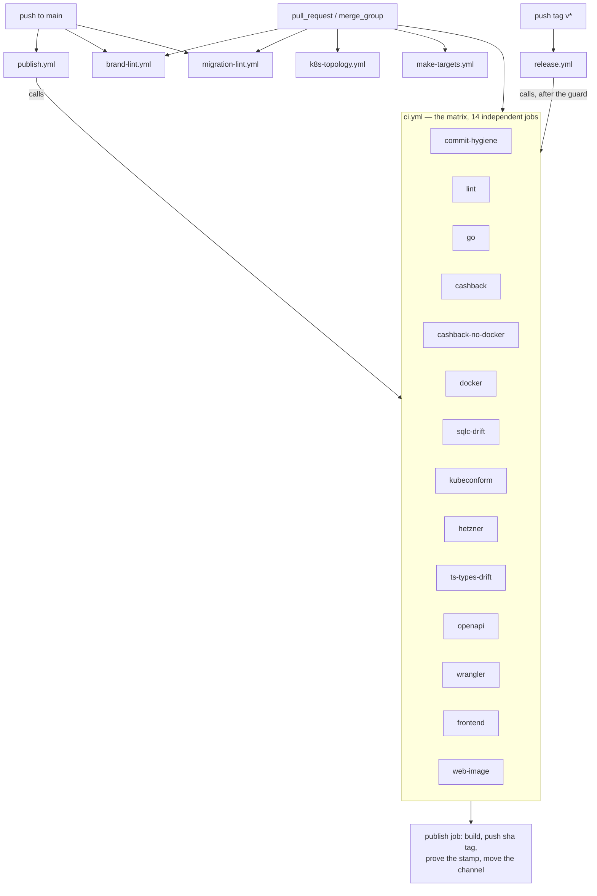
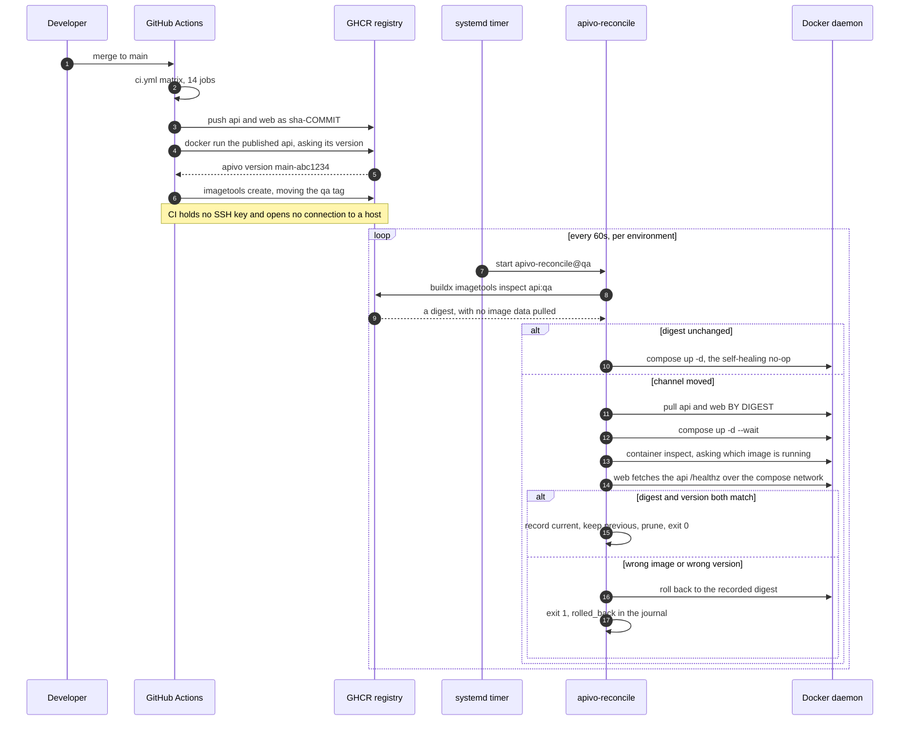
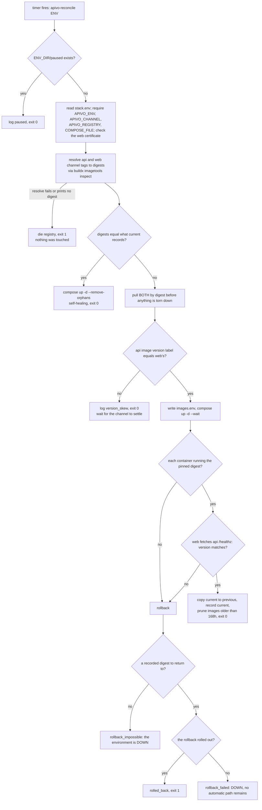
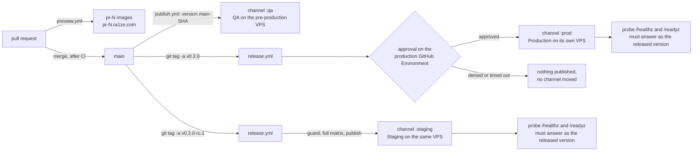

# CI/CD architecture — Apivo

*What must pass before a change lands, and by what mechanism does it end up running on a host?*

**Status**: 2026-09-07 · `main @ 0461ad7`

---

## Contents

1. [The shape of it, in one paragraph](#1-the-shape-of-it-in-one-paragraph)
2. [The workflows and what triggers each](#2-the-workflows-and-what-triggers-each)
3. [The CI job graph](#3-the-ci-job-graph)
4. [Every job in `ci.yml`](#4-every-job-in-ciyml)
5. [The four workflows outside the matrix](#5-the-four-workflows-outside-the-matrix)
6. [The quality gates, and how to reproduce each locally](#6-the-quality-gates-and-how-to-reproduce-each-locally)
7. [Commit and ref hygiene, in the order it bites](#7-commit-and-ref-hygiene-in-the-order-it-bites)
8. [The deploy mechanism: a tag moves, a host notices](#8-the-deploy-mechanism-a-tag-moves-a-host-notices)
9. [The reconciler's tick](#9-the-reconcilers-tick)
10. [Promotion: QA, Staging, Production](#10-promotion-qa-staging-production)
11. [Cutting a release, and rolling one back](#11-cutting-a-release-and-rolling-one-back)
12. [Preview environments](#12-preview-environments)
13. [Asking what is actually running, with no credentials](#13-asking-what-is-actually-running-with-no-credentials)
14. [Open questions and known gaps](#14-open-questions-and-known-gaps)

---

## 1. The shape of it, in one paragraph

CI builds two container images, pushes them to GHCR under an immutable
`sha-<commit>` tag, runs the artefact that is now in the registry and makes it
say its own version, and only then moves a channel tag — `:qa`, `:staging` or
`:prod`. **Moving the channel tag is the whole deploy.** Nothing in this
repository can reach a host: there is no SSH key in the workflows, no deploy
credential for a VPS, and no inbound endpoint on one. Each host runs
[`apivo-reconcile`](../../deploy/hetzner/bin/apivo-reconcile) once a minute per
environment, asks the registry whether its channel has moved, pulls **by
digest**, rolls out, and then proves the roll-forward — the containers must be
running the digest just pinned and the API must serve the version stamped into
the image. If any of that fails the host puts the previous digest back on the
spot, before anyone in CI knows there was a problem.

Everything upstream of that is gates. There are fourteen jobs in
[`ci.yml`](../../.github/workflows/ci.yml) and four more workflows beside it,
and each one exists because something specific once went wrong or would have
gone unnoticed.

---

## 2. The workflows and what triggers each

| Workflow | Triggers | What it is for |
|---|---|---|
| [`ci.yml`](../../.github/workflows/ci.yml) | `pull_request`, `merge_group`, `workflow_call` | The verification matrix. **No `push: main` trigger** — `publish.yml` calls it on every merge instead, so the matrix runs once per merge rather than twice. |
| [`publish.yml`](../../.github/workflows/publish.yml) | `push` to `main`, `workflow_call` | The only thing that writes to the registry. Builds, proves the stamp, moves a channel. |
| [`release.yml`](../../.github/workflows/release.yml) | `push` of a tag matching `v[0-9]+.[0-9]+.[0-9]+*`, `workflow_dispatch` | Guard, verify, approve (production only), publish, GitHub Release, probe. |
| [`preview.yml`](../../.github/workflows/preview.yml) | `pull_request` — `opened`, `synchronize`, `reopened`, `closed` | Publishes `pr-<n>` image tags; deletes them on close. |
| [`brand-lint.yml`](../../.github/workflows/brand-lint.yml) | `pull_request`, `merge_group`, `push` to `main` | ADR-0004's zero-brand-literals rule. |
| [`migration-lint.yml`](../../.github/workflows/migration-lint.yml) | `pull_request`, `merge_group`, `push` to `main`, `workflow_call` | No foreign key crosses a product schema boundary; migration numbering. |
| [`k8s-topology.yml`](../../.github/workflows/k8s-topology.yml) | `pull_request`, `merge_group`, `workflow_call` | The manifests *mean* what the contract says — not merely that they parse. |
| [`make-targets.yml`](../../.github/workflows/make-targets.yml) | `pull_request`, `merge_group`, `workflow_call` | The `Makefile`'s cashback targets guard rather than merely fail. |

Concurrency is set per workflow and the settings differ on purpose.
`ci.yml`, `brand-lint`, `migration-lint`, `k8s-topology` and `make-targets`
cancel in progress. `preview.yml` cancels per pull request — pushing three
times in a minute should build the third. **`publish.yml` and `release.yml`
are never cancelled**: a cancelled publish can leave a channel tag pointing at
an image whose proof step never ran, and every host tracking that channel
would take it within the minute
([`publish.yml`](../../.github/workflows/publish.yml), the `concurrency`
block).

---

## 3. The CI job graph



Nothing inside `ci.yml` has a `needs:` — the fourteen jobs are independent and
run in parallel. The only ordering in the whole pipeline is between workflows:
`publish` waits on the matrix, and `release` waits on the guard, then the
matrix, then (for production) a human.

Note what the graph shows about `k8s-topology` and `make-targets`: both
declare `workflow_call`, and nothing calls them. They gate pull requests and
the merge queue, and they do **not** gate the publish path. Both files say so
in their own header comments; `brand-lint` and `migration-lint` closed the same
hole by carrying a `push: main` trigger of their own.

---

## 4. Every job in `ci.yml`

### `commit-hygiene`

Checks out **the branch head, not the merge ref** — `ref: ${{
github.event.pull_request.head.sha || github.sha }}` — and then proves it did,
in a step whose only job is to be the regression test for that line. Without
it, a pull request opened by an app identity checks out a commit GitHub wrote
itself and the author lint reports the repository's own history as dirty
(#494).

It then computes a commit range (`base..head` on a pull request, `before..sha`
on a push with a real `before`, `<sha> -1` otherwise — never `..$SHA`, which
git reads as `HEAD..$SHA` and which would examine nothing and report green),
and over that range:

- greps commit messages for attribution trailers;
- `shellcheck -s sh` over the hygiene scripts and `.githooks/pre-push`;
- runs [`lint-commit-authors_test.sh`](../../scripts/lint-commit-authors_test.sh), then
  [`lint-commit-authors.sh`](../../scripts/lint-commit-authors.sh) over the range;
- runs [`lint-refs_test.sh`](../../scripts/lint-refs_test.sh) and
  [`pre-push-hook_test.sh`](../../scripts/pre-push-hook_test.sh);
- runs [`lint-refs.sh`](../../scripts/lint-refs.sh) against the head branch name,
  and again with `--from-messages` over the range;
- requires a Conventional Commit subject on every non-merge commit.

**Fails on**: an attribution trailer, an assistant or vendor identity in an
author or committer field, a ref name carrying such a name or not matching
`xcoder/<slug>`, a ref name quoted in a commit subject, a non-Conventional
subject, a shell syntax error in any hygiene script, or an empty range (a run
that examines nothing is an error, never a pass).

### `lint`

`golangci/golangci-lint-action@v9` pinned to `v2.12.2`, which must match
`GOLANGCI_LINT_VERSION` in the [`Makefile`](../../Makefile). The configuration is
[`.golangci.yml`](../../.golangci.yml): `default: none` and then eighteen linters
enabled explicitly — `errcheck`, `errorlint`, `gocritic`, `gosec`, `govet` with
`enable-all` (minus `fieldalignment` and `shadow`), `nilerr`, `noctx`,
`rowserrcheck`, `sqlclosecheck`, `staticcheck`, `unparam`, `unused` and the
rest — plus `gofmt` and `goimports` as formatters. **Fails on** any finding.
A different version on `PATH` locally does not count as having run the lint;
findings differ between them.

### `go`

Postgres 17 as a service container with a health check, `DATABASE_URL` set, so
the schema invariant tests run rather than skip. Steps: `go vet ./...`; `go vet
scripts/demo/auth.go` (which carries `//go:build ignore` so `./...` cannot see
it); `go build ./...`; then

```
go test -race -shuffle=on -covermode=atomic -coverprofile=coverage.out -coverpkg=./... ./...
```

followed by three things a passing non-verbose run would otherwise swallow: any
Postgres deadlock reports from the service container (never fails the job — no
deadlock is the expected result, and saying so is the point), the I-5
provenance drill run verbosely so the timings are on the record, and the
alpha-definition-of-done journey re-run under `TZ=Europe/Athens` because the
runners are UTC and a dropped `.UTC()` would otherwise ship green. Last:
`sh scripts/coverage_gate.sh 90 coverage.out`.

**Fails on**: a vet finding, a build error, any test failure, a race, or total
statement coverage below 90 % after the generated `store` packages are filtered
out ([`coverage_gate.sh`](../../scripts/coverage_gate.sh)).

This job is also where the OpenAPI two-way conformance and the module-boundary
tests run, because they are ordinary Go tests
([`cmd/apivo/openapi_routes_test.go`](../../cmd/apivo/openapi_routes_test.go),
[`internal/arch/arch_test.go`](../../internal/arch/arch_test.go)).

### `cashback`

**The verification of record for the money product.** Docker Desktop is
unavailable on the founder's machine, so this stack cannot be run locally at
all. Postgres and Redis as service containers; Blnk pinned by digest
(`jerryenebeli/blnk:0.15.2@sha256:796518b1…`, the same digest as
[`docker-compose.yml`](../../docker-compose.yml),
[`deploy/hetzner/compose/docker-compose.cashback.yml`](../../deploy/hetzner/compose/docker-compose.cashback.yml)
and [`deploy/k8s/cashback/`](../../deploy/k8s/cashback/) — the four drifting would
mean the stack proved here is not the stack that runs anywhere).

Two DSNs, deliberately split: `BLNK_MIGRATE_DSN` as the database owner and
`BLNK_DATA_SOURCE_DNS` as a narrow `blnk_app` role. Spike S1
([`scripts/spikes/ledger_schema/run.sh`](../../scripts/spikes/ledger_schema/run.sh))
runs **before** the ledger comes up: it creates that role, snapshots `public`,
migrates as the role and asserts nothing outside the `blnk` schema moved. Then
[`scripts/blnk_up.sh`](../../scripts/blnk_up.sh); then spike S2
([`scripts/spikes/outbox_crash/`](../../scripts/spikes/outbox_crash/)) verbosely;
then the **whole** suite with `CASHBACK_ENABLED=true`, `LEDGER_DRIVER=blnk`
against the running ledger; then the C-1 zero-sum drill verbosely, because a
green run has to mean the check was *shown* to go red on a broken ledger rather
than that it returned no rows. The Blnk container's logs are captured on
every run, pass or fail.

**Fails on**: the restricted role touching anything outside its schema, a crash
window losing a commit or a transfer, any test failing with the product mounted
and money pointed at a real ledger, or the zero-sum check not reporting a
planted imbalance.

### `cashback-no-docker`

Declares **no `services:`**, and that absence is the test. It reproduces the
founder's machine deliberately: the spike
([`scripts/spikes/no_docker/run.sh`](../../scripts/spikes/no_docker/run.sh)) unsets
every key that could reach a container and then runs the suite. **Fails on** a
suite that has quietly grown a dependency on a database or a ledger.

### `docker`

`docker build -t apivo:<sha> .`. Proves the [`Dockerfile`](../../Dockerfile)
builds from a clean checkout. **The image is never pushed from CI** — publishing
is `publish.yml`'s job, not a CI gate.

### `sqlc-drift`

Regenerates every sqlc package (`sqlc/sqlc:1.31.1`, pinned to match
`SQLC_VERSION` in the [`Makefile`](../../Makefile)), then makes three assertions in
order. First, that sqlc generated *something* — an empty regeneration would
pass a drift gate vacuously. Second, that no generated file is git-ignored,
found by grepping for the `Code generated by sqlc` banner rather than by
reading [`sqlc.yaml`](../../sqlc.yaml), so the check covers whatever the generator
actually wrote. Third, `git add -A && git diff --cached --exit-code` over the
**whole tree, with no paths named**: nothing else touched the checkout, so any
difference at all is generated code disagreeing with the schema, and a package
added to `sqlc.yaml` tomorrow is inside the gate on the day it is added.

### `kubeconform`

`ghcr.io/yannh/kubeconform:v0.8.0`, pinned by digest, `-strict -summary
-kubernetes-version 1.32.0` over [`deploy/k8s`](../../deploy/k8s) recursively.
**Fails on** a manifest that is not valid for that Kubernetes version, or that
carries a field the schema does not know.

### `hetzner`

The VPS deployment, proved without a VPS. Runs
[`apivo-reconcile_test.sh`](../../deploy/hetzner/bin/apivo-reconcile_test.sh) (27
named cases, and 14 further assertions on the recorded state and the digest
compose was pinned to, all driven through a stub `docker` that models a
registry and a daemon — including buildx's `--format` trap, faithfully),
[`apivo-previews_test.sh`](../../deploy/hetzner/bin/apivo-previews_test.sh) and
[`apivo-seed-editors_test.sh`](../../deploy/hetzner/bin/apivo-seed-editors_test.sh);
`shellcheck -s sh` over every script that runs on a deployment host, two of
which run as root there; and
[`deploy/hetzner/validate.sh`](../../deploy/hetzner/validate.sh), which renders every
environment's compose configuration in the exact file combination that
environment uses, asserts the API is unpublished in all of them and that names
are namespaced per environment, and runs both Caddyfiles through `caddy
validate` and `caddy fmt`.

The reconciler's suite runs here for the same reason `release.yml` proves its
guard before trusting it: **`apivo-reconcile` is the only thing standing
between a bad image and every environment that tracks its channel.**

### `ts-types-drift`

Applies the migrations to a service Postgres with `migrate/migrate:v4.19.1`,
pre-pulls the generator image (so a registry rate limit is reported as an
infrastructure failure and not as schema drift), regenerates
[`web/src/lib/database.types.ts`](../../web/src/lib/database.types.ts) with
`supabase@2.114.0` **into a temporary file first** and renames it in place —
a failed generation must not truncate the committed types and manufacture a
difference — then `git add -A web/src/lib` and `git diff --cached --exit-code --
web/src/lib`.

### `openapi`

`npx @redocly/cli@2.46.1 lint api/openapi.json`, pinned so the ruleset cannot
change under a green build. Severities live in
[`redocly.yaml`](../../redocly.yaml); the job fails on any error. This validates the
document against OpenAPI 3.1. Whether the document *matches the served routes*
is a different question, answered by Go tests in the `go` job.

### `wrangler`

**Retired but still proved.** Nothing deploys to Cloudflare Containers any
more; the job stays because the Worker carries the per-caller rate limit on the
editorial endpoints, which Caddy does not, and a rule nobody proves is a rule
nobody can safely port. `npx wrangler@4 deploy --dry-run --containers-rollout
none` (no credentials, uploads nothing) plus `node --test
'deploy/cloudflare/*.test.mjs'` for the routing rules. It goes when the limit
becomes Go middleware.

### `frontend`

`npm ci`, `npm run check` (`astro check`, over a `tsconfig.json` extending
`astro/tsconfigs/strictest`), `npm test` (`vitest run --coverage`, thresholds
80 % on statements, branches, functions and lines), `npm run build`.

### `web-image`

`docker build -t apivo-web:ci web/`. Build only; publishing is a deployment
concern.

---

## 5. The four workflows outside the matrix

They live outside `ci.yml` because each needs nothing the matrix sets up — no
Go toolchain, no Node, no Postgres — and a check that can answer in seconds
should not queue behind one that cannot.

| Workflow | Proves | Notable structure |
|---|---|---|
| `brand-lint` | No product name, domain, support address or colour is written into application code, a template or a migration (ADR-0004, FR-070). | Shellchecks the lint **and its test suite**, runs [`lint-brand-literals_test.sh`](../../scripts/lint-brand-literals_test.sh) before the lint itself: the cases that decide whether it stays switched on are the look-alikes it must *not* flag. |
| `migration-lint` | No foreign key crosses a product schema boundary (ADR-0001); migration versions are unique, contiguous and paired. | Both suites run **before** their lints. The numbering lint exists because all three defects it refuses are silent: golang-migrate refuses a duplicate only at migrate time, skips forever anything numbered below the highest applied version, and says nothing about an unpaired up-migration. |
| `k8s-topology` | The manifests *mean* what the contract says — "is this Service publicly routable" is valid YAML either way, and an internet-reachable ledger API is an internet-reachable way to move members' money. | [`deploy/k8s/validate_test.sh`](../../deploy/k8s/validate_test.sh) runs first and drives the validator at an empty directory: a gate that reports checks passing about files that do not exist is worse than none. |
| `make-targets` | A `Makefile` target whose dependency is **present** must **succeed**. | Nothing else in CI invokes `make`, which is how a `missing` macro that exited unconditionally once reached a pull request. While a dependency is absent, a correct guard and an unconditional failure are indistinguishable — so the positive case is the whole point. |

---

## 6. The quality gates, and how to reproduce each locally

| Gate | Where it runs | What makes it fail | Reproduce locally |
|---|---|---|---|
| **90 % Go statement coverage** | `go` | Total below 90 % after the sqlc output is filtered out — `internal/content/store/`, `internal/editorial/store/` and `internal/cashback/<pkg>/store/`, which is every generated package there is today, though the first two are named rather than matched by shape | `make cover` |
| **Race detector** | `go` (`-race`), and `make test` by default (`RACE ?= -race`) | Any data race | `make test` |
| **Real-Postgres integration tests, never skipped** | `go` (service container, `DATABASE_URL` set), `cashback` | A schema invariant test failing; a skip in CI would mean `DATABASE_URL` was not set | `make db-up && make test` |
| **Strict `golangci-lint`, pinned** | `lint` (`v2.12.2`) | Any finding from the 18 enabled linters or the two formatters | `make lint` (runs the same pinned container) |
| **`go vet`, including the ignored demo helper** | `go` | Any vet finding | `make vet`, plus `go vet scripts/demo/auth.go` |
| **Module boundaries** | `go` (ordinary tests) | An import crossing a product boundary; a scan that proves it scanned nothing | `make arch-test` |
| **OpenAPI document validity** | `openapi` (`@redocly/cli@2.46.1`) | Any error-severity rule in [`redocly.yaml`](../../redocly.yaml) | `make openapi-lint` |
| **OpenAPI two-way conformance** | `go` | A served route the document omits, or a documented path nothing serves; a `security` block disagreeing with the auth gate | `go test ./cmd/apivo/` |
| **sqlc drift** | `sqlc-drift` | Any difference anywhere in the tree after regeneration; generated output that is git-ignored; a regeneration that produced nothing | `make sqlc && git status` |
| **TypeScript type drift** | `ts-types-drift` | A difference under `web/src/lib` after regenerating from a freshly migrated database | `make ts-types && git status` |
| **`astro check` + TypeScript strictest** | `frontend` | A type error under `astro/tsconfigs/strictest` | `make web-check` |
| **80 % frontend coverage** | `frontend` | Any of statements, branches, functions or lines below 80 % over [`web/vitest.config.ts`](../../web/vitest.config.ts)'s `include` list | `cd web && npm test` |
| **Frontend build** | `frontend`, `web-image` | An Astro build failure; a Docker build failure | `make web-build` |
| **API image builds** | `docker` | A `Dockerfile` failure from a clean checkout | `docker build .` |
| **kubeconform (strict)** | `kubeconform` | A manifest invalid for Kubernetes 1.32.0 | `docker run --rm -v "$PWD/deploy/k8s:/manifests" ghcr.io/yannh/kubeconform:v0.8.0 -strict -summary -kubernetes-version 1.32.0 /manifests` |
| **k8s topology** | `k8s-topology` | A manifest that parses but exposes what must stay internal | `sh deploy/k8s/validate.sh` |
| **Migration boundary lint** | `migration-lint` | A foreign key crossing a product schema, in any shape — column or table constraint, split across lines, quoted, upper case | `make migration-lint` |
| **Migration numbering** | `migration-lint` | A duplicate version, a gap, or an up with no down | `make migration-numbering-lint` |
| **Brand literals (ADR-0004)** | `brand-lint` | A product name, colour, domain or support address outside the brand configuration | `make cashback-brand-check` |
| **Deployment configuration** | `hetzner` | A compose file that will not render, a published API port, a colliding name, an invalid or unformatted Caddyfile, a shell syntax error in a host script | `make hetzner-validate` |
| **Reconciler decisions** | `hetzner` | Any of the 27 cases in the suite — a rollback that does not happen, a digest mismatch not caught, a registry failure reported as success | `make hetzner-test` |
| **Makefile targets** | `make-targets` | A target that fails when its dependency is present | `sh scripts/make_targets_test.sh` |
| **Worker routing rules** | `wrangler` | A routing decision changing, or `wrangler.jsonc` failing to parse | `make worker-test`, `make worker-validate` |
| **Commit hygiene** | `commit-hygiene` | See [§7](#7-commit-and-ref-hygiene-in-the-order-it-bites) | `make ref-lint`; `sh scripts/lint-refs.sh --from-messages origin/main..HEAD`; `sh scripts/lint-commit-authors.sh origin/main..HEAD` |
| **The cashback stack against a real ledger** | `cashback` | See [§4](#4-every-job-in-ciyml) | **Not reproducible locally** without Docker. This job is the verification of record; a PR that bumps the ledger must say so. |

The four commands the repository asks for before a push — every one of them a
gate in the table above, run in the order that fails cheapest first:

```sh
make vet && make test-unit                                  # the fast pass
make ref-lint                                               # the branch name
sh scripts/lint-refs.sh --from-messages origin/main..HEAD   # names in history
sh scripts/lint-commit-authors.sh origin/main..HEAD         # the identities
```

---

## 7. Commit and ref hygiene, in the order it bites

Principle I of [the constitution](../../.specify/memory/constitution.md) is
NON-NEGOTIABLE: every commit is authored solely by the founder, and no
assistant or vendor is named in a commit message, a PR description, a code
comment or documentation. That single rule is enforced at six points, each
catching something the one before it cannot.

1. **Session start** — a repository hook writes `user.name` and `user.email`
   into the **local** git config at the start of every agent session, and
   points `core.hooksPath` at [`.githooks`](../../.githooks). It is written
   unconditionally because a stale value is exactly the failure being fixed: a
   development container ships its own global identity and it comes back on
   every restart. This is what stops the later gates having to fail. Where
   that hook lives is named in the constitution's *Enforcement* list under
   Principle I ([constitution.md](../../.specify/memory/constitution.md)). That
   principle also sets out the short list of files permitted to write the
   assistant and vendor names it otherwise forbids — a blocklist has to name
   what it blocks — and it says in terms that the exception is theirs alone.
   This document is not on the list, which is why the path is described here
   rather than quoted.
2. **`commit-msg` hook** — [`.githooks/commit-msg`](../../.githooks/commit-msg)
   strips attribution trailers from the message before the commit is written.
   Case-insensitive: a blocklist must over-match.
3. **`pre-push` hook** — [`.githooks/pre-push`](../../.githooks/pre-push) reads the
   **remote** ref name off git's stdin protocol and hands it to
   `lint-refs.sh`. This is the earliest point a branch name is judged and the
   only one where a rename is still free: nothing has been pushed, no pull
   request exists, no merge commit quoting the name has been written. A
   deletion (all-zero local sha) is skipped, because deleting a badly named
   branch is the remedy the lint asks for.
4. **The author/committer lint** —
   [`lint-commit-authors.sh`](../../scripts/lint-commit-authors.sh) reads the two
   identities in the **commit header**, which no message check has ever looked
   at. A development container carrying its own global git identity stamps it
   onto author *and* committer while every message-body check passes green;
   nine branches reached review that way. It is a blocklist, not an allowlist
   — an allowlist would refuse GitHub's own merge commits, a second machine,
   and any future collaborator, and would publish a personal address as CI
   policy. The script states plainly what a green run does **not** mean: it
   does not mean a human typed the code.
5. **Ref names quoted in commit subjects** — `lint-refs.sh --from-messages`
   over the range. This is the half that catches a name the branch check never
   saw: a hook skipped, a merge made by hand, a branch that reached `main` by
   some path. Only the ban applies there, not the `xcoder/<slug>` convention,
   because in a commit subject the name is already permanent and refusing it
   would offer no remedy. The constitution records 32 such merge commits
   already on `main`, left as they are deliberately
   ([constitution.md](../../.specify/memory/constitution.md), Principle I,
   *Follow-up*): they are outside every range the job is given and could not be
   corrected without rewriting shared history.
6. **The `commit-hygiene` CI job** — all of the above, server-side, plus the
   Conventional Commit subject check, plus the *proofs* of each lint before it
   is trusted.

**Only the CI job can refuse a merge.** A hook is per-clone opt-in and can be
skipped with `--no-verify`, and one in a container that no longer exists proves
nothing about a branch that is already pushed. The hooks exist to make the
mistake cheap to fix, not to be the reason it cannot be made.

The blocklists in `lint-refs.sh` and `lint-commit-authors.sh` are duplicated
rather than shared, and [`lint-refs_test.sh`](../../scripts/lint-refs_test.sh)
asserts the two lists stay identical — a token added to one and not the other
is the next blind spot.

Rule 2 of `lint-refs.sh` — every branch is `xcoder/<slug>` — is not a milder
restatement of rule 1. Rule 1 refuses a name nobody may use; rule 2 refuses a
name nobody *has* used, which is what catches the next tool's default prefix
that no blocklist has heard of.

---

## 8. The deploy mechanism: a tag moves, a host notices

This is the interesting part, and the ordering of the last three steps in
[`publish.yml`](../../.github/workflows/publish.yml) is the whole safety property.

1. Both images are built and pushed under an **immutable `sha-<commit>` tag**.
   The version is stamped through a `VERSION` file written at the context root
   (git-ignored, never committed), which the [`Dockerfile`](../../Dockerfile) turns
   into `-ldflags="-s -w -X main.version=$(cat VERSION 2>/dev/null || echo dev)"`.
   The `dev` fallback is why the proof in step 2 is not optional: a build with
   no `VERSION` file still builds, and only running it catches that.
   Both images also carry
   `org.opencontainers.image.version` as a standard OCI label — not decoration:
   the reconciler reads it off the image to learn what the artefact calls
   itself.
2. **The artefact that is now in the registry** — not a local build that
   resembles it — is run: `docker run --rm "$REGISTRY/api@$DIGEST" version`,
   and the output must be exactly `apivo version <version>`. A build whose
   stamp did not land fails here, with the channel tag still pointing wherever
   it pointed before. It sits in the registry addressable by commit, which is
   exactly what you want when working out why it was rejected.
3. **The channel tag moves**, via `docker buildx imagetools create`, which
   re-points a tag at an existing manifest without pulling or rebuilding — so
   the digest a channel names is always a digest that was proven.

That is the deploy. There is no step four.



**The security property, stated plainly.** No CI job holds an SSH key. No
workflow holds a deploy credential for a VPS. No host runs an inbound endpoint
for a deploy, and there is no webhook to forge or replay. CI writes to the
registry; hosts read from it; neither can reach the other. The host pulls with
a **read-only** PAT (`read:packages`). A push-based deploy would need an
inbound endpoint, a shared secret and a credential in CI that can reach the
host; this needs none of the three, and it converges after a network partition
without anyone re-triggering anything
([`apivo-reconcile@.timer`](../../deploy/hetzner/systemd/apivo-reconcile@.timer)).

---

## 9. The reconciler's tick

[`apivo-reconcile`](../../deploy/hetzner/bin/apivo-reconcile) takes one argument —
the environment name, arriving from a systemd unit instance, therefore
user-supplied text, therefore validated as lowercase alphanumeric with dashes
before it becomes a container name or a file path.



Details that carry weight:

- **A tag is what an environment tracks; a digest is what it runs.** Every
  container on every environment is pinned by digest, so "what is running in
  staging" has one answer that cannot drift under a tag someone moved.
- **The quiet path still runs `compose up -d`** — without `--wait` — and that
  is the self-healing property, not a redundant call. A container that died,
  was OOM-killed or was stopped by hand comes back on the next tick, which is
  why there is no separate "is anything down" alarm to write.
- **The two channel tags do not move atomically.** `publish.yml` points
  `api:<channel>` and `web:<channel>` in two separate registry calls and a host
  may tick between them. Rolling out a new API beside the previous web would
  report success, because the only version assertion is against the API. So a
  version-label mismatch is a `version_skew` log and `exit 0`: the channel has
  not been consumed, and the next tick sixty seconds later sees the matched
  pair.
- **The roll-forward is proved twice.** `compose up -d --wait` returning 0
  means every container reported healthy by its own healthcheck — necessary and
  not sufficient, because the *previous* container answers a healthcheck just
  as happily if the new one never replaced it. So `docker container inspect`
  must report the digest just pinned, and then the web container fetches the
  API's `/healthz` across the compose network and the version it serves must
  equal the image's label. That last check proves the network path, readiness
  and the stamp in one request, using Node's built-in fetch, so no extra image
  is needed on the host.
- **`previous` names a rollout that once served**, never merely one that was
  attempted: it is written only after the new state is proven. The automatic
  rollback reads `current` (which still holds the last good state, since
  `record_state` runs only on success); `previous` is what
  [`apivoctl rollback`](../../deploy/hetzner/bin/apivoctl) uses for break-glass, and
  that command pauses reconciliation because it diverges the host from its
  channel.
- **Image pruning is filtered by age** (`until=168h`) rather than bare. Every
  image here is pulled by digest and therefore untagged, and an untagged image
  is what `docker image prune` calls dangling: a bare prune would be entitled
  to delete the very thing the rollback needs.
- **The maintenance switch**: `touch /etc/apivo/<env>/paused`. Without it, a
  reconciler fights an operator mid-investigation and destroys the evidence
  within the minute.
- **Systemd hardening**: `ProtectSystem=strict`, `ReadWritePaths=/var/lib/apivo
  /run/docker.sock`, `NoNewPrivileges=yes`, `PrivateTmp=yes`, and
  `ProtectHome=read-only` rather than `yes` — the GHCR credential lives in
  `/root/.docker/config.json` and `ProtectHome=yes` would make every pull
  unauthorised on a host where `docker pull` by hand works.
  `BUILDX_CONFIG=/var/lib/apivo/buildx` is there because buildx *writes* under
  `$HOME` before it will inspect anything; the alternative would have been
  handing the unit write access to the credential file to buy a scratch
  directory
  ([`apivo-reconcile@.service`](../../deploy/hetzner/systemd/apivo-reconcile@.service)).
- **The same unit is the manual deploy**: `systemctl start apivo-reconcile@qa`.
  The path a person takes at 2am is the path that has run unattended a thousand
  times.
- **The log is one JSON object per line** on stdout, captured by journald, for
  the same reason the API emits JSON at `APP_ENV=prod`: it is what an agent
  reads to answer "what happened to my deploy" without a shell on the box.
  `journalctl -u apivo-reconcile@qa -o cat | jq`.

All of this has a test suite that runs in CI on every pull request —
`apivo-reconcile_test.sh`, 27 named cases against a stub `docker`, covering the
registry that will not answer, the half-moved channel, the container that came
up healthy on the wrong image, the API serving the wrong version, the
first-ever rollout that fails and has nothing to fall back to, and the rollback
that fails as well.

---

## 10. Promotion: QA, Staging, Production



| | QA | Staging | Production |
|---|---|---|---|
| **Trigger** | every push to `main` | a pre-release tag, `v0.2.0-rc.1` | a final semver tag, `v0.2.0` |
| **Gate** | none — automatic, unattended | none — automatic | one human approval, on the `production` GitHub Environment |
| **Channel** | `:qa` | `:staging` | `:prod` |
| **Version stamped** | `main-<short sha>` | the tag | the tag |
| **Host** | pre-production VPS | the same VPS | its own VPS (not provisioned) |
| **URL recorded** | `https://ra1ze.com` | empty | empty |
| **Status** | serving | host ready, never released to | does not exist |

The status column is not a formality: **a release to a channel whose URL is
empty is refused before anything is published**, for staging exactly as much as
for production
([`release.yml`](../../.github/workflows/release.yml), *Refuse a release to an
environment that does not exist*). An empty value in
[`deploy/hetzner/environments.env`](../../deploy/hetzner/environments.env) is the
guard, not a gap: a channel moved to an environment nobody can probe is a
deploy nobody checked. Filling the URL in is the last step of provisioning a
host.

The URLs live in a committed file rather than in a settings screen for the
reason this repository applies everywhere else: a value that lives only in a
dashboard has no history, no review and no diff when it changes. Three things
read that file — `release.yml`, `preview.yml` and
[`scripts/env_status.sh`](../../scripts/env_status.sh).

Staging is not a smaller QA. QA keeps a Postgres container and is reset without
a conversation; staging runs against a real Supabase project (the *nonprod*
one) so that release-candidate migrations meet connection limits, pooling and
managed-service failure modes before production does. Sharing one database
between them is the tempting shortcut and the one to avoid: the API migrates on
boot, QA deploys on every merge, and a shared schema would have QA migrating
the database staging is running against ([ENVIRONMENTS.md](../ENVIRONMENTS.md)).

---

## 11. Cutting a release, and rolling one back

The full procedure is [docs/RELEASING.md](../RELEASING.md). The pipeline, in
order:

1. **Guard** — [`release_guard.sh`](../../scripts/release_guard.sh), with its own
   test suite and the notes generator's run **first**. The tag must be strict
   SemVer 2.0.0 with a `v` prefix, **annotated** (`git cat-file -t` says `tag`
   — a lightweight tag is not a deliberate release act), and its commit
   reachable from `origin/main`. If a GitHub Release for the tag already
   exists, the tag must still point at the commit that Release records: the
   guard reads that commit back out of the Release body, which
   [`release_notes.sh`](../../scripts/release_notes.sh) writes into every Release
   this pipeline publishes. Re-releasing the same commit passes — that is the
   rollback. A **moved** tag is refused: a published version names one commit
   forever.
2. **Verify** — the full CI matrix on the tagged commit, by calling `ci.yml`.
3. **Approve** — final tags only. Reviewers are configured on the `production`
   GitHub Environment, deliberately not in any file this repository can change.
   The `publish` job's condition accepts `approve` as `success` or `skipped`
   but the `release` job's condition does **not** accept a merely-skipped
   `publish`: a denied approval must stop the pipeline, or the approval is
   decoration.
4. **Publish** — `publish.yml`, called with the tag and the channel it earned.
5. **Move the channel** — the deploy.
6. **GitHub Release** — idempotent (`gh release edit` when one exists,
   `gh release create` otherwise), because re-releasing a tag is the documented
   rollback and a 422 after the channel had already moved was a red run for a
   rollback that in fact happened. A pre-release tag is published as a
   pre-release; build metadata is stripped first, so the `-` that decides is
   the one before `+`.
7. **Probe** — `GET /healthz` and `GET /readyz`, which must answer 200 **and
   report the version being released**. A 200 alone would be answered just as
   happily by the previous container. Retries are `--retry 20 --retry-delay 15`
   — about five minutes, which covers the whole pull-based path: up to a minute
   before the host's timer fires, then the pull, the rollout and the schema
   migration on boot. The gate on this job is that **the channel moved**, not
   that the release job succeeded: once a channel has moved the environment
   will change, and it must be probed even if publishing the Release afterwards
   failed. A release nobody probed is a failed release and exits non-zero.

**Dry run**: Actions → release → *Run workflow*, pick the **tag** under "Use
workflow from", leave `dry_run` checked. Guard, matrix and note generation run;
nothing is published, no channel moves, no Release is created. The workflow
refuses to run from a branch ref.

**Rollback is re-releasing the previous tag** — the same workflow with
`dry_run` unchecked. There is no separate mechanism, so the rollback path is
exactly as tested as the release path. Beneath it sits the host's own last line
of defence (§9): a rollout that does not come up, or comes up on the wrong
image or serving the wrong version, is rolled back by the reconciler before any
of this is needed. Note that the channel still points at the broken build, so
the next tick tries it again — fix it forward, or move the channel back.

**Migrations are forward-only.** There are no down-migrations in a release
path, so a rollback re-deploys old code against the migrated schema. The
append-only design is what makes that safe, and it is a constraint on how
migrations are written rather than a property of the pipeline. A migration that
will take longer than `APIVO_WAIT_TIMEOUT` (180s by default) on a real dataset
needs the timeout raised in `/etc/apivo/<env>/stack.env` **before** the release,
not after it has been rolled back for being slow.

---

## 12. Preview environments

A running copy of every open pull request, at `pr-<n>.ra1ze.com`, within about
a minute of the images being built.

- [`preview.yml`](../../.github/workflows/preview.yml) builds both images on
  `opened`, `synchronize` and `reopened`, stamps `VERSION` as `pr-<n>`, and
  pushes `api:pr-<n>` and `web:pr-<n>`. It is **not gated on the CI matrix**,
  deliberately: a preview is for looking at a change, and the change most worth
  looking at is often the one whose tests are still red. CI's verdict is on the
  pull request page; this is the thing next to it you can click.
- Fork pull requests are **skipped, not failed**: GitHub grants those runs a
  read-only token whatever the `permissions:` block asks for, so `packages:
  write` is unobtainable, and a red cross on an outside contributor's first
  pull request is a poor way to say "previews are for branches in this
  repository".
- On `closed` — merge or abandonment alike — the workflow **deletes the two
  image tags**. That is the entire teardown signal. It probes both
  `/orgs/<owner>/` and `/users/<owner>/` because the wrong one answers 404 and
  guessing would make teardown fail silently on the account type nobody tested.
  A failed listing must never look like an empty one; both the API's errors are
  kept and printed rather than discarded.
- `GITHUB_TOKEN` can publish package versions and frequently **cannot delete
  them**, so the job uses `secrets.PREVIEW_CLEANUP_TOKEN` when configured and
  falls back to the automatic token otherwise. Without the PAT, previews are
  still published and only exact teardown is lost.
- On the host,
  [`apivo-previews`](../../deploy/hetzner/bin/apivo-previews) runs every minute
  ([`apivo-previews.timer`](../../deploy/hetzner/systemd/apivo-previews.timer),
  offset from the environment reconcilers so two rollouts do not pull over the
  same uplink at once). **The registry is the list**: a `pr-*` tag with no
  stack gets a preview created, database first; a stack with no tag is
  destroyed and its database dropped. Teardown is therefore the *absence* of
  something rather than the arrival of a message — a webhook can be missed,
  dropped, delivered twice or forged; an absent tag converges every minute
  forever. `APIVO_PREVIEW_MAX` (5 by default) caps concurrent previews.
- A preview has its own database and runs neither feed polling nor translation
  (`POLL_INTERVAL=0`, `TRANSLATION_INTERVAL=0` in
  [`docker-compose.preview.yml`](../../deploy/hetzner/compose/docker-compose.preview.yml)).
  It does **not** run without auth: `apivo-previews` copies QA's Supabase URL,
  anon key and `JWKS_URL` into the preview and copies QA's editor rows into the
  preview's own database, so a reviewer can sign in to the editorial screens
  they opened the preview to look at. Only public values cross — the anon key
  ships to every browser that loads QA and the JWKS endpoint is published; the
  service-role key is in no env file on the host. Auth is all-or-nothing: with
  any of the three missing from QA, the preview comes up on fixtures and says
  so ([ENVIRONMENTS.md](../ENVIRONMENTS.md)).

---

## 13. Asking what is actually running, with no credentials

```sh
sh scripts/env_status.sh          # or: make env-status
sh scripts/env_status.sh --json
```

At most two plain HTTPS requests per environment — `/healthz`, then `/readyz`
if the first answered. No credentials, no SSH key, no registry
token, no VPS access — so an agent that has merged a pull request can find out
whether the environment has caught up without being handed anything that could
break one. It reports what each environment **serves**, which is the only
account of a deployment that cannot be wrong: a channel tag says what should be
running and a host's state file says what it believes it started; `/healthz`
says what answered.

It distinguishes four states. `up` with `ready=yes`; `up` with `ready=no`,
which means the process is up and the database is not — "the deploy failed" and
"the deploy worked and Supabase is unreachable" have entirely different fixes;
`down`, meaning the URL is recorded and `/healthz` did not answer; and
`absent`, meaning that environment has no URL recorded and has not been
provisioned, which today is the truth about production. `absent` is not
counted as a failure — an environment nobody has provisioned is not an
environment that is broken. The exit code is
non-zero if any environment that is supposed to exist is not fully serving, so
it composes into a shell chain without anything having to parse it.

To ask the same questions of the *configuration* rather than of a running
environment, with no host either:

```sh
make hetzner-validate   # every environment's compose rendered, both Caddyfiles validated
                        # and format-checked. It depends on hetzner-test, so the
                        # reconciler's 27 decisions are proved first, every time.
```

On a host, [`apivoctl`](../../deploy/hetzner/bin/apivoctl) is the operator's
console — deliberately a convenience over docker and systemd, never the way
things are deployed, "because then the way things are deployed would live on a
box instead of in a repository". Its own header tells agents they do not have a
shell there and do not need one.

---

## 14. Open questions and known gaps

**`k8s-topology` and `make-targets` do not gate the publish path.** Both
declare `workflow_call` and nothing calls them; `publish.yml`'s `verify` job
calls `ci.yml` alone. So a manifest topology violation or a broken `Makefile`
target merged through a green pull request is published to QA regardless. Both
files name the gap in their own headers and say it closes with one line in
`publish.yml`. `brand-lint` and `migration-lint` avoided it by carrying a
`push: main` trigger — but those run *beside* `publish.yml`, not before it, so
a brand literal or a boundary-crossing foreign key merged to `main` still
reaches QA while the lint that refuses it is still running.

**The `frontend` coverage threshold measures an include list, not the app.**
[`web/vitest.config.ts`](../../web/vitest.config.ts) names the files coverage is
computed over, one by one — the middleware, the reader, cashback, editorial and
tour libraries, the CSRF and secure-request helpers, the string catalogues, and
one endpoint. 80 % is 80 % of those. Every `.astro` page is outside the list,
along with the generated types, the ambient declarations, the fixtures and the
Supabase adapter; the file says why for each. So a new page with no tests does
not move the number, and a new library file only does so once somebody adds it
to `include`.

**`RELEASING.md` says all three environment URLs are empty; QA's is not.**
[`environments.env`](../../deploy/hetzner/environments.env) sets
`APIVO_QA_URL=https://ra1ze.com`. It changes nothing mechanically — QA is not a
release target, and the guard only reads the staging and production values —
but the sentence in [RELEASING.md](../RELEASING.md) is stale.

**The README's deployment table is stale in the other direction.** It records
all three environments as "Provisioned: not yet", while
[ENVIRONMENTS.md](../ENVIRONMENTS.md) — which declares itself the single source
of truth for what runs where — records QA as provisioned and serving and
staging's host as ready. This document follows ENVIRONMENTS.md. Two files
answering the same question differently is the failure the single-source rule
exists to prevent, and correcting the README is a one-line change nobody has
made.

**No release has ever been cut.** Staging's host is ready and has never had a
release; production does not exist. So the guard, the approval gate, the
GitHub Release step and the probe have been exercised by their test suites and
by dry runs, not by a real release to a real environment. The first production
release will be the first time that path runs end to end — which is precisely
the risk staging exists to retire, and staging cannot retire it until its URL
is recorded.

**The `cashback` job cannot be reproduced locally.** Docker Desktop is
unavailable on the founder's machine, so the ledger, Redis and every test that
needs them run only in CI. That job is the verification of record for the money
product; there is no second opinion available before a merge.

**The editorial rate limit is not in force.** It exists only in the retired
Cloudflare Worker, which CI still validates as the reference implementation.
Porting it to Go middleware is required before anything is publicly reachable,
and deleting the `wrangler` job is what that unblocks.

**Preview teardown degrades quietly without a PAT.** With no
`PREVIEW_CLEANUP_TOKEN`, `GITHUB_TOKEN` usually cannot delete package versions;
the job fails loudly and says so, but until someone acts, a closed pull
request's images stay in the registry and the host keeps serving its preview
until `APIVO_PREVIEW_MAX` evicts it.

**Nothing gates the version stamp on a preview or a QA build against the
reconciler's version-skew check.** `publish.yml` moves `api:<channel>` and
`web:<channel>` in two calls, and the reconciler's `version_skew` path exists
to survive a host ticking between them. If a publish half-fails — one tag
moved, the other not — the skew is permanent and the environment stops rolling
forward with only an `info`-level journal line to say why. That is the
deliberate choice (a half-published pair should be loud rather than silently
deployed), but nothing alerts on it.
