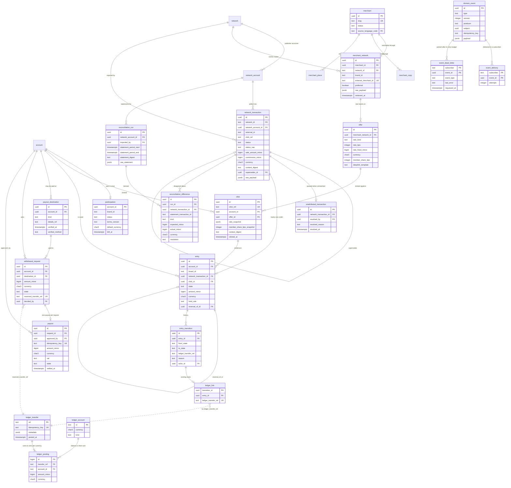
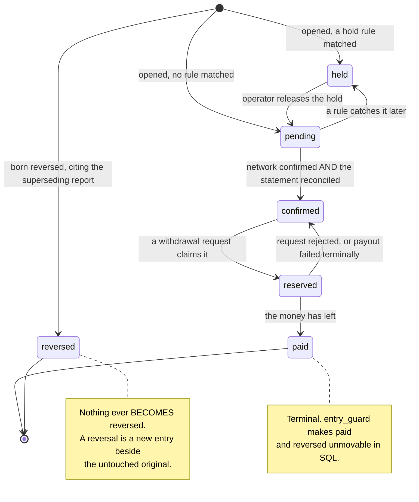
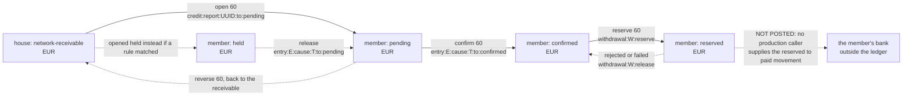

# Data architecture

*What shape does a member's money take on disk, and what stops any part of it from lying?*

**Status** — 2026-09-07, `main @ 0461ad7`.

## Contents

1. [The schema by bounded context](#1-the-schema-by-bounded-context)
2. [The cashback core, as an entity relationship diagram](#2-the-cashback-core-as-an-entity-relationship-diagram)
3. [How money is represented, and why not floats](#3-how-money-is-represented-and-why-not-floats)
4. [Double entry: accounts, postings, and the check that runs every minute](#4-double-entry-accounts-postings-and-the-check-that-runs-every-minute)
5. [The ten money invariants](#5-the-ten-money-invariants)
6. [The earnings lifecycle](#6-the-earnings-lifecycle)
7. [One euro through the ledger accounts](#7-one-euro-through-the-ledger-accounts)
8. [Exactly once](#8-exactly-once)
9. [Append-only rows, and the triggers that enforce them](#9-append-only-rows-and-the-triggers-that-enforce-them)
10. [Provenance: the news model, and its cashback analogue](#10-provenance-the-news-model-and-its-cashback-analogue)
11. [Type generation as a single source of truth](#11-type-generation-as-a-single-source-of-truth)
12. [Data lifecycle, residency and retention](#12-data-lifecycle-residency-and-retention)
13. [Open questions and known gaps](#13-open-questions-and-known-gaps)

---

## 1. The schema by bounded context

One Postgres database holds three schemas, and the boundary between them is a
privilege grant rather than a convention.

| Schema | Owns | Created by |
|---|---|---|
| `public` | The news product — `source_item`, `translation`, `article`, `article_place` — plus the shared reference data both products read (`account`, `place`, `language`) and the `domain_event` stream that is the only channel between them. | [0001_init.up.sql](../../internal/platform/db/migrations/0001_init.up.sql) |
| `cashback` | Every cashback table: networks, merchants, offers, clicks, evidence, entries, payouts, reconciliation, participation. | [0010_cashback_schema.up.sql](../../internal/platform/db/migrations/0010_cashback_schema.up.sql) onward |
| `ledger` | The exit-route double-entry ledger: `account`, `transfer`, `posting`, and the `balances` view. Self-contained, so it can be lifted into its own database unchanged. | [0022_pg_ledger.up.sql](../../internal/platform/db/migrations/0022_pg_ledger.up.sql) |

Migration 0010 is the container and the permission model, written before the
first cashback table exists. It creates a `NOLOGIN` group role
`cashback_domain`, grants it usage on its own schema, and then grants exactly
four things across the boundary: `select` on `public.account`, `public.place`
and `public.language`, and `select, insert` on `public.domain_event`. Every
news table is deliberately ungranted. A cashback query that reaches for
`article` fails with a permission error rather than succeeding and creating a
coupling nobody notices.

The same boundary is asserted from three other directions:
[cashback_boundary_test.go](../../internal/platform/db/cashback_boundary_test.go)
proves the role reaches only the shared reference data;
[cashback_catalogue_test.go](../../internal/platform/db/cashback_catalogue_test.go)
`TestNoForeignKeyLeavesTheCashbackSchemaForANewsTable` asks `pg_constraint`
rather than the migration text; and
[scripts/lint-migrations.sh](../../scripts/lint-migrations.sh), run by
[migration-lint.yml](../../.github/workflows/migration-lint.yml), refuses a
foreign key crossing a product schema in review.

### The cashback migrations, one line each

| Migration | What it adds |
|---|---|
| [0010](../../internal/platform/db/migrations/0010_cashback_schema.up.sql) | The `cashback` schema, the `cashback_domain` role, and the grants that are the product boundary. |
| [0011](../../internal/platform/db/migrations/0011_cashback_catalogue.up.sql) | `network`, `network_account`, `merchant`, `merchant_network`, `merchant_copy`, `merchant_place`, `offer`. |
| [0012](../../internal/platform/db/migrations/0012_cashback_clicks_evidence.up.sql) | `click` and `network_transaction` — the two evidence tables, both immutable, plus the supersede chain. |
| [0013](../../internal/platform/db/migrations/0013_cashback_earnings.up.sql) | `entry`, `entry_transition`, `unattributed_transaction`, `ledger_link`. |
| [0014](../../internal/platform/db/migrations/0014_cashback_payout.up.sql) | `payout_destination`, `withdrawal_request`, `payout`. |
| [0015](../../internal/platform/db/migrations/0015_cashback_reconciliation.up.sql) | `reconciliation_run` (immutable) and `reconciliation_difference` (mutable, because it exists to be resolved). |
| [0016](../../internal/platform/db/migrations/0016_cashback_provenance_view.up.sql) | The `cashback.provenance` view (C-7) and the `ledger_zero_sum` view plus its three functions (C-1). |
| [0017](../../internal/platform/db/migrations/0017_participation.up.sql) | `participation`, the member's opt-in, one row per account for ever. |
| [0018](../../internal/platform/db/migrations/0018_domain_event_envelope.up.sql) | `version`, `producer`, `subject`, `idempotency_key` on `domain_event`. No backfill, so append-only holds continuously. |
| [0019](../../internal/platform/db/migrations/0019_operator_role.up.sql) | The `operator` role, `payout_insert_guard()`, and a migration that refuses to apply if any historical payout was approved by a non-operator. |
| [0020](../../internal/platform/db/migrations/0020_ledger_schema_setting.up.sql) | Makes the C-1 check's target schema a setting rather than a literal. |
| [0021](../../internal/platform/db/migrations/0021_event_deliveries.up.sql) | `subscriber_checkpoint`, `event_delivery`, `event_dead_letter`. |
| [0022](../../internal/platform/db/migrations/0022_pg_ledger.up.sql) | The `ledger` schema: three tables, the zero-sum trigger, the non-negative trigger, the `balances` view. |
| [0023](../../internal/platform/db/migrations/0023_network_account_backfill_from.up.sql) | `network_account.backfill_from` — where a first poll starts, refused as a guess. |
| [0024](../../internal/platform/db/migrations/0024_unattributed_queue_guards.up.sql) | No deletes on the unattributed queue, and a recorded resolution cannot be erased. |
| [0025](../../internal/platform/db/migrations/0025_click_context_index.up.sql) | The partial index the per-device hold rule reads. |
| [0026](../../internal/platform/db/migrations/0026_network_rate_limit_per_minute.up.sql) | `rate_limit_per_second` becomes `rate_limit_per_minute`, values multiplied by sixty. |
| [0027](../../internal/platform/db/migrations/0027_ledger_link_per_entry.up.sql) | A transfer reference is unique per entry, not outright: one reservation transfer covers several entries. |
| [0028](../../internal/platform/db/migrations/0028_reconciliation_statement_once.up.sql) | `statement_digest`, generated, so a retried import is the same run. |
| [0029](../../internal/platform/db/migrations/0029_reconciliation_difference_identity.up.sql) | `statement_transaction_id`, and a shape check that also forbids the fields each kind must *not* carry. |
| [0030](../../internal/platform/db/migrations/0030_reconciliation_difference_verdict.up.sql) | `resolution` (`explained` \| `absorbed`), and the all-or-none rule widened to four columns. |
| [0031](../../internal/platform/db/migrations/0031_accounting_export_indexes.up.sql) | Keyset indexes for the accounting exports. |
| [0032](../../internal/platform/db/migrations/0032_entry_one_credit_per_report.up.sql) | `entry_one_per_report` becomes a partial unique index: one report backs at most one *credit*, and a reversal may cite it too. |
| [0033](../../internal/platform/db/migrations/0033_network_reporting_lag_minutes.up.sql) | `network.reporting_lag_minutes` — the forward cursor never passes ground the network has not covered. |

---

## 2. The cashback core, as an entity relationship diagram



Three conventions in that diagram are worth stating rather than inferring.

**`char3` is `char(3)`.** Every currency column is declared
`char(3)` beside a `check (... ~ '^[A-Z]{3}$')`; the diagram writes `char3`
only because the notation has no room for the parentheses. There is no
currency type and no lookup table: membership of the ISO-4217 register is
reference data that changes, and an embedded copy would go stale and start
refusing real currencies ([money.go](../../internal/platform/money/money.go)).

**The dotted relationships are references, not foreign keys.**
`ledger_link.ledger_transfer_ref` and `withdrawal_request.reserved_transfer_ref`
are text that happens to match `ledger.transfer.ref`. That is deliberate: the
ledger is reached only through a port (ADR-0002), it may live in another
database entirely, and a foreign key would forbid that. The three `ledger_*`
entities are `ledger.account`, `ledger.transfer` and `ledger.posting` — the
in-repository implementation of the port; with `LEDGER_DRIVER=blnk` those rows
live in Blnk's own schema and the seam is unchanged.

**The `account`, `domain_event`, `event_delivery` and `event_dead_letter`
entities are in `public`.** They are drawn here because cashback rows point at
them, not because cashback owns them.

Four cardinalities carry rules that are easy to misread:

- `network_transaction ||--o| entry` — **at most one credit per report**, from
  the partial unique index in
  [0032](../../internal/platform/db/migrations/0032_entry_one_credit_per_report.up.sql).
  A reversal entry may cite the same report; `entry_reversed_at_most_once`
  keeps a credit reversed at most once.
- `click ||--o{ entry` — a click may back a credit and, later, the reversal
  that undoes it. `entry_click_belongs_to_member` is a composite foreign key
  on `(click_id, account_id)`, so a credit can only cite a click *the same
  member* made.
- `network_transaction ||--o| network_transaction` — the supersede chain.
  `network_transaction_superseded_once` forbids forks and
  `network_transaction_one_root` (partial unique on `(network_id, external_id)
  where supersedes_id is null`) forbids second roots. One root plus no forks
  is one path, and one path has exactly one tip. Nothing is ever marked
  superseded, because that would be an edit.
- `withdrawal_request ||--o| payout` — `payout_one_per_request` plus the
  composite key `payout_pays_the_requested_amount` on `(request_id,
  amount_minor, currency)`. A payout cannot restate what was approved.

---

## 3. How money is represented, and why not floats

Every amount in this repository is an `int64` of **minor units** beside an
explicit ISO-4217 code. There is no `numeric`, no `float`, no `money` type and
no decimal string in a money position, in Go or in SQL.

In Go that is [internal/platform/money/money.go](../../internal/platform/money/money.go):

```go
type Amount struct {
    Minor    int64
    Currency Currency
}
```

The package's own doc comment states the three rules it exists to hold:
currency is never implicit and never coerced (adding one currency to another
is an error, not a conversion); overflow is detected and returned rather than
wrapped, because "a silently wrapped int64 is a balance that reads as its own
negation"; and rounding is never silent — `Amount.Split(rate, mode)` returns
the remainder as a first-class value so the caller can post it and keep the
transfer summing to zero. There is no default rounding mode:
`ErrInvalidRounding` refuses the zero value, because "the direction money
rounds in is a policy decision, not a language default".

Rates are basis points, not percentages: `BasisPoints` with
`BasisPointsScale = 10000`, matching `offer.rate_bps between 0 and 10000` in
[0011](../../internal/platform/db/migrations/0011_cashback_catalogue.up.sql).
Four percent is `400`. That is C-6 read wider than money columns — it is about
never introducing a fractional type that Go and TypeScript will disagree
about.

At the API boundary, `Amount` marshals to `{"minor": …, "currency": …}` and
`ErrNotMinorUnits` refuses minor units that are a decimal, an exponent, or a
number in quotes. The constitution's "no decimal ever crosses an API boundary"
is a rejection on the way in, not only a promise on the way out.

### The one place decimals exist, and how they are read

Networks publish decimal strings. Linkwise reports `"19.51"`. Turning that into
minor units is the single most dangerous conversion in the product, and it has a
file of its own:
[networks/linkwise/amounts.go](../../internal/cashback/networks/linkwise/amounts.go).
Its header records the measurement:

> `float64(x) * 100` truncated to an integer is wrong on 573 of the 10,000
> hundredths from 0.00 to 99.99. The first is 0.29, which parses to a float
> whose hundred-fold is 28.999999999999996 and truncates to 28. […] `float64(x)
> * 100` ROUNDED is exact at retail sizes […] and stops being exact somewhere
> above 1e12 minor units […] So that route is not wrong, it is wrong
> eventually, which is worse: it passes every test written at the scale of a
> shopping basket.

So no float is constructed at any step. The string is split at the point, the
fraction padded to two places, the halves concatenated, and the result parsed
once as an integer. A value with three decimal places is **refused**, not
rounded, because a third place means the two-decimal assumption is wrong for
that programme and rounding it away would hide the evidence.

The companion problem is which currency an amount is in.
[networks/linkwise/currencies.go](../../internal/cashback/networks/linkwise/currencies.go)
opens by stating that the transaction report carries no currency field at all,
and that across the 334 programmes the recorded account is joined to, 329
report in EUR, three in PLN and two in USD. A declared default would be right
98.5 % of the time and silently store zloty as euro. So the currency is a join
against the programme list, cached for an hour, and a programme the list does
not carry is `ErrUnknownProgrammeCurrency` — an error, never a fallback,
because "a window that cannot be read is visible; a window read in the wrong
currency is not."

### How the schema holds the same line

- Every money column is `bigint` beside a format-checked `char(3)`:
  `entry.amount_minor`, `network_transaction.sale_amount_minor` and
  `commission_minor`, `withdrawal_request.amount_minor`, `payout.amount_minor`,
  `offer.rate_fixed_minor`, `reconciliation_difference.expected_minor` and
  `actual_minor`, `ledger.posting.amount_minor`.
- `ledger.posting_account_holds_currency` is a composite foreign key on
  `(account_id, currency)` into `ledger.account (id, currency)`. A posting in a
  currency its account does not hold is not *checked*; it is unrepresentable.
- `cashback.ledger_zero_sum` casts `sum()`'s numeric to `bigint`, so no
  fractional type reaches Go even through an aggregate.
- [cashback_catalogue_test.go](../../internal/platform/db/cashback_catalogue_test.go)
  `TestNoFractionalMoneyTypeExistsInTheCashbackSchema` asks `pg_attribute` for
  any `numeric`, `float4`, `float8` or `money` column anywhere in the schema —
  tables, views and materialised views alike — and fails on the first. It keeps
  answering for tables a later migration has not written yet.
- [openapi_money_test.go](../../cmd/apivo/openapi_money_test.go) asserts the
  same at the HTTP boundary: no decimal type, and no bare integer of minor
  units without its currency beside it.

---

## 4. Double entry: accounts, postings, and the check that runs every minute

### The port

[internal/cashback/wallet/ledger.go](../../internal/cashback/wallet/ledger.go)
defines the whole of what the domain knows about money storage:

```go
type Ledger interface {
    EnsureAccount(ctx context.Context, ref AccountRef, currency money.Currency) (LedgerAccountID, error)
    Post(ctx context.Context, transfer Transfer) (TransferRef, error)
    Balance(ctx context.Context, account LedgerAccountID, currency money.Currency) (money.Amount, error)
    History(ctx context.Context, account LedgerAccountID, window Window) (iter.Seq2[Posting, error], error)
}
```

`AccountRef` has exactly two shapes and unexported fields, so the zero value is
invalid rather than ambiguous:

- `MemberAccount(memberID, stage)` where `Stage` is one of `StageHeld`,
  `StagePending`, `StageConfirmed`, `StageReserved`. The zero value is
  deliberately not a stage.
- `HouseAccount(name)`, where the name comes from configuration and never from
  a literal in domain code.

A member does not have *a* balance. A member has up to four stage accounts per
currency, and the wallet the member sees is a projection over them
([wallet/projection.go](../../internal/cashback/wallet/projection.go)). Nothing
is stored: `Balance` sums postings, every time.

The port's contract is asserted by one suite,
[wallet/conformance_test.go](../../internal/cashback/wallet/conformance_test.go),
run against all three implementations — `memory` (the reference, one mutex,
nothing cached), `blnk` (production, the only package permitted to import the
vendor SDK), and `postgres` (the documented exit route). Its eight clauses
include: `Post` is atomic; replay under the same key returns the original
reference and records nothing, while replay with a *different* transfer under
the same key is `ErrIdempotencyConflict`; no currency conversion anywhere;
balances are always summed, never stored; and **a member stage account may
never go negative** — `ErrInsufficientFunds` — while house accounts are exempt,
because they are the boundary of the closed set and a ledger where nothing may
go negative has nothing able to fund its first credit.

### The house accounts

[wallet/house.go](../../internal/cashback/wallet/house.go) names two, both
configured rather than literal:

| Purpose | Key | What it is for |
|---|---|---|
| `RoundingRemainder` | `HOUSE_ACCOUNT_ROUNDING` | The sub-minor-unit fraction that rounding in the member's favour costs (D6). |
| `ClawbackLoss` | `HOUSE_ACCOUNT_CLAWBACK` | A loss absorbed after a reversal that arrives once the money has already been paid out (Q3). |

`NewHouseAccounts` refuses two purposes configured to one name
(`ErrHouseNameShared`), on the reasoning that balances derive from postings and
nothing else, so one account holding both purposes' postings is one figure that
answers neither question and no later query can pull them apart.

A third house account, `HOUSE_ACCOUNT_NETWORK_RECEIVABLE`, is read straight from
configuration by the composition root
([cmd/apivo/earnings.go](../../cmd/apivo/earnings.go)) and is the account every
credit actually comes out of. **The other two are required in production
configuration and posted to by nothing.** `grep` for `RoundingRemainder`,
`ClawbackLoss` or `EnsureAll` outside tests finds only their definitions. The
rounding remainder is *computed* — `Share.Rounding` in
[earnings/share.go](../../internal/cashback/earnings/share.go) — and then left
in the receivable. Zero-sum still holds, because `Share.Member +
Share.Remainder` is the commission exactly; what is missing is the attribution,
not the money. See [§13](#13-open-questions-and-known-gaps).

### The split

[earnings/share.go](../../internal/cashback/earnings/share.go) is the policy
layer over `money.Split`:

```go
const MemberFavour = money.RoundCeil
```

Q4 leaves the percentages open and fixes the direction: the share is
configuration, "the direction is a product promise". Applied to a credit,
ceiling rounds up; applied to a debit it rounds toward zero, so a reversal takes
back no more than exact arithmetic says. `ShareOf` reads the rate from the
**click**, never from the offer as it stands now, and applies it to the
commission the network **actually reported**, not the one the band predicted.
It returns three figures: `Member`, `Remainder` (which is what the transfer's
other side must carry) and `Rounding` (what the favourable direction cost).
`DefaultMemberShare` is `6000` basis points — 60 %, founder decision Q4 of
2026-09-06 ([catalogue/publish.go](../../internal/cashback/catalogue/publish.go)).

### The zero-sum check

C-1 is the one invariant that lives outside our own schema, and Principle VIII
prices that exception: the invariant must be verified continuously by a check
that fails loudly, and an in-repository implementation must be kept working.

The query is migration 0016's `cashback.ledger_zero_sum`, one row per ledger
currency with its net in minor units. It resolves its own target schema through
`cashback.ledger_balance_relation()`, which draws a distinction the first
version of it missed: *not installed here* returns null and the view is empty,
but *present and unreadable* **raises**, because "a check that cannot see them
must fail rather than report zero rows".

The running of it is
[wallet/zerosum.go](../../internal/cashback/wallet/zerosum.go), a scheduler job
with four outcomes and four different behaviours:

| Outcome | Behaviour |
|---|---|
| Every currency nets zero | One DEBUG line naming how many currencies it vouches for. |
| No rows at all | A **different** DEBUG line. "The ledger is clean" and "there was nothing to sum" must never be the same sentence — which is why the `where net_minor <> 0` a reader expects is applied in Go, not in SQL. |
| A currency ≠ 0 | ERROR per currency with the delta, returns `ErrOutOfBalance`, repeats every tick while the imbalance stands, and never stops the process. |
| The query fails | Reported as a failure *of the check*, explicitly not as `ErrOutOfBalance` — "no imbalance" is the silent pass the invariant exists to prevent. |

`ZeroSumInterval` is `time.Minute` and is a constant, not a setting: "a cadence
an environment variable could set is a cadence an environment variable could set
to never, which […] would be an off switch for a constitutional invariant
dressed up as tuning."

### What `invariants_test.go` proves

[wallet/invariants_test.go](../../internal/cashback/wallet/invariants_test.go)
closes the loop the conformance suite leaves open. It has two tests, and the
design is in what each refuses to accept as evidence.

`TestANonZeroCurrencySumFailsTheC1Check` posts a real transfer through the
Postgres implementation of the port, points the zero-sum check at the schema
those postings landed in, and requires it to read zero for a currency it can
only have learned from the wallet's own rows. Then it plants an imbalance
**behind the port's back, in raw SQL**, and demands two things: that the check
goes red naming the exact currency and delta, and that Postgres refuses the
state at COMMIT by SQLSTATE `P0001` *and by the trigger's own message* — a bare
SQLSTATE assertion would stay green with the C-1 trigger removed, since other
`RAISE`s share it.

`TestACrossCurrencyOffsetFailsTheC1Check` poses a transfer that nets to zero
only *across* two currencies. "Per currency" is the load-bearing phrase in C-1,
and this is the test that makes it load-bearing.

Both use `XTS` and `XXX`, currencies posted nowhere else in the repository, so
a row carrying them can only have come from the drill; and everything runs in a
transaction that is never allowed to commit.

The equivalent from the schema side is
[cashback_provenance_test.go](../../internal/platform/db/cashback_provenance_test.go)
`TestLedgerZeroSumCanActuallySeeAnImbalance` and
`TestLedgerZeroSumReportsNoNonZeroCurrency`; and
[wallet/postgres/schema_test.go](../../internal/cashback/wallet/postgres/schema_test.go)
proves the triggers refuse illegal raw SQL rather than only illegal port calls.

---

## 5. The ten money invariants

Quotations are verbatim from
[.specify/memory/constitution.md](../../.specify/memory/constitution.md),
Principle IX.

| # | The invariant, quoted | Enforced by | Where |
|---|---|---|---|
| **C-1** | "A member balance is never stored as a settable number. It exists only as the sum of immutable ledger postings, and every posting belongs to a transfer whose postings sum to zero per currency." | Deferred constraint trigger `ledger.posting_zero_sum` (per transfer, per currency); the `ledger.balances` view derives every balance from postings; `Transfer.Validate` refuses an unbalanced transfer before any I/O; the `ledger_zero_sum` view and its one-minute job. | [0022](../../internal/platform/db/migrations/0022_pg_ledger.up.sql), [0016](../../internal/platform/db/migrations/0016_cashback_provenance_view.up.sql), [wallet/ledger.go](../../internal/cashback/wallet/ledger.go), [wallet/zerosum.go](../../internal/cashback/wallet/zerosum.go). Tests: [wallet/invariants_test.go](../../internal/cashback/wallet/invariants_test.go), [wallet/conformance_test.go](../../internal/cashback/wallet/conformance_test.go), [cashback_provenance_test.go](../../internal/platform/db/cashback_provenance_test.go). **Named Principle VIII exception, ADR-0002.** |
| **C-2** | "A cashback credit cannot exist without a reference to exactly one network transaction record and, through it, at most one click record. Credits with no evidence are unrepresentable." | `entry.network_transaction_id uuid NOT NULL REFERENCES cashback.network_transaction(id)`; composite FK `entry_click_belongs_to_member (click_id, account_id)`; trigger `entry_evidence_guard()` requiring the entry to cite *the* click the network named; `entry_guard()` freezing the evidence columns. | [0013](../../internal/platform/db/migrations/0013_cashback_earnings.up.sql). Tests: [cashback_earnings_test.go](../../internal/platform/db/cashback_earnings_test.go) `TestCashbackEarningsRejectIllegalWrites`, `TestEntryMoneyFactsAreFrozen`. |
| **C-3** | "Network transaction records, click records and imported statements reject UPDATE, DELETE and TRUNCATE. A status change is a new superseding record, never an edit." | Triggers `click_immutable`/`click_no_truncate`, `network_transaction_immutable`/`_no_truncate`, `reconciliation_run_immutable`/`_no_truncate`, all on `public.raise_immutable()`; the supersede chain and its three uniqueness rules; the DB-computed `content_digest`. | [0012](../../internal/platform/db/migrations/0012_cashback_clicks_evidence.up.sql), [0015](../../internal/platform/db/migrations/0015_cashback_reconciliation.up.sql). Tests: [cashback_evidence_test.go](../../internal/platform/db/cashback_evidence_test.go) `TestClickIsImmutable`, `TestNetworkTransactionIsImmutable`, `TestSupersessionKeepsExactlyOneCurrentRow`, `TestNetworkTransactionDigestIsComputedByTheDatabase`; [cashback_reconciliation_test.go](../../internal/platform/db/cashback_reconciliation_test.go). |
| **C-4** | "A payout row cannot exist without a non-null named human approver. The row IS the approval, exactly as `article.approved_by` is for news." | `payout.approved_by uuid NOT NULL REFERENCES public.account(id)`; trigger `payout_insert_guard()` requiring role `operator`, read under a lock; `account_role_guard()` freezing an operator's role while a payout references them; migration 0019 refusing to apply against historical non-operator approvals; `payout_guard()` freezing the approval after insert. | [0014](../../internal/platform/db/migrations/0014_cashback_payout.up.sql), [0019](../../internal/platform/db/migrations/0019_operator_role.up.sql). Tests: [cashback_operator_role_test.go](../../internal/platform/db/cashback_operator_role_test.go) `TestPayoutApproverMustHoldTheOperatorRole`, `TestOperatorDemotionRaceIsSerialized`; [cashback_payout_test.go](../../internal/platform/db/cashback_payout_test.go) `TestPayoutApprovalIsFrozen`. |
| **C-5** | "Every outbound payout carries a unique idempotency key with a database uniqueness constraint, derived deterministically from the withdrawal request. A retry cannot create a second payout." | `payout.idempotency_key text GENERATED ALWAYS AS ('payout:' \|\| request_id::text) STORED NOT NULL` plus `payout_idempotency_key_unique`; `payout_one_per_request`; composite FK `payout_pays_the_requested_amount`; `ledger.transfer_one_per_idempotency_key`; derived keys in Go. | [0014](../../internal/platform/db/migrations/0014_cashback_payout.up.sql), [0022](../../internal/platform/db/migrations/0022_pg_ledger.up.sql), [payout/approval.go](../../internal/cashback/payout/approval.go) (which reads the key back *from the generated column* rather than recomputing it). Tests: [payout/exactly_once_test.go](../../internal/cashback/payout/exactly_once_test.go), [cashback_payout_test.go](../../internal/platform/db/cashback_payout_test.go) `TestConcurrentDoubleSubmitProducesOnePayout`. |
| **C-6** | "All monetary amounts are integer minor units with an explicit ISO-4217 currency code. Floating point in a money column, or a posting without a currency, is rejected by the schema. No decimal ever crosses an API boundary." | `bigint` beside format-checked `char(3)` on every money column; `ledger.posting_account_holds_currency`; the `money` package with no float path; the OpenAPI money shape. | [0011](../../internal/platform/db/migrations/0011_cashback_catalogue.up.sql)–[0015](../../internal/platform/db/migrations/0015_cashback_reconciliation.up.sql), [0022](../../internal/platform/db/migrations/0022_pg_ledger.up.sql), [money.go](../../internal/platform/money/money.go). Tests: [cashback_catalogue_test.go](../../internal/platform/db/cashback_catalogue_test.go) `TestNoFractionalMoneyTypeExistsInTheCashbackSchema`, [openapi_money_test.go](../../cmd/apivo/openapi_money_test.go). |
| **C-7** | "For any member payout, one query returns the full chain — payout, approver, ledger postings, cashback entries, network transaction evidence, click, and the offer rate at click time — in under five minutes." | The `cashback.provenance` view, joined through D9's reservation transfer reference; `ledger_link` as the posting seam, with its composite FK into `entry_transition (id, entry_id, ledger_transfer_ref)`. | [0016](../../internal/platform/db/migrations/0016_cashback_provenance_view.up.sql), [0013](../../internal/platform/db/migrations/0013_cashback_earnings.up.sql), [0027](../../internal/platform/db/migrations/0027_ledger_link_per_entry.up.sql). Tests: [cashback_provenance_test.go](../../internal/platform/db/cashback_provenance_test.go) `TestCashbackProvenanceAnswersTheWholeChain`, `TestCashbackProvenanceCoversAnOperatorAttributedEntry`. |
| **C-8** | "a claim decision row cannot exist without a non-null, non-blank named human decider. The row IS the decision, exactly as `article.approved_by` IS the approval." | **Nothing — there is nothing yet to enforce.** No `claim` or `claim_decision` table, no Go package, no route. | [specs/003-cashback-claims/](../../specs/003-cashback-claims/) — 45 tasks, none done. The constitution amendment admitting C-8..C-10 *is* ratified, so this is unbuilt work rather than blocked work. |
| **C-9** | "a decision rejects UPDATE, DELETE and TRUNCATE. Reversing one is a new decision citing the one it supersedes, never an edit, and the member's record shows both." | **Nothing yet.** The *pattern* is already implemented and tested next door: `entry_transition_immutable`, `unattributed_transaction_guard()` refusing to erase a resolution, `payout_guard()`. | [0013](../../internal/platform/db/migrations/0013_cashback_earnings.up.sql), [0024](../../internal/platform/db/migrations/0024_unattributed_queue_guards.up.sql), [0014](../../internal/platform/db/migrations/0014_cashback_payout.up.sql). |
| **C-10** | "a claim that resolves in the member's favour does so through the evidence-backed paths that already exist […] the only remaining remedy is a **goodwill** transfer from a named house account, recorded and reported as goodwill. Cashback passed on and money given away are never the same row." | **Half enforced.** The C-2 half — an evidence-free credit is unrepresentable — holds today. The goodwill house account does not exist: `HouseAccountsConfig` has three fields, `Rounding`, `Clawback`, `NetworkReceivable`. | [config/cashback.go](../../internal/platform/config/cashback.go). Q10 (goodwill budget) and Q13 (second approver) are open. |

---

## 6. The earnings lifecycle

The table is [earnings/state.go](../../internal/cashback/earnings/state.go),
written as data rather than as a switch "because this is the design, and it
should be possible to read the design in one screen". The six strings match
`entry_state_known` in
[0013](../../internal/platform/db/migrations/0013_cashback_earnings.up.sql)
exactly.



| State | Meaning | Ledger stage account |
|---|---|---|
| `held` | Credited under a hold rule; counts toward nothing member-facing. | `StageHeld` |
| `pending` | Reported, not confirmed. Visible, never spendable. | `StagePending` |
| `confirmed` | Confirmed **and** reconciled: the only bucket counting toward the threshold. | `StageConfirmed` |
| `reserved` | Claimed by a withdrawal request. | `StageReserved` |
| `paid` | Left for the member's destination. | none |
| `reversed` | The network took it back. | none |

`CanOpen` admits three states — `held`, `pending`, `reversed` — and never
`confirmed` ("that would mean Apivo decided a commission was final, which is
the network's to say"), never `reserved` or `paid`.

**The absent arrows are the design**, and `state.go` says why for each:

- Nothing ever *becomes* `reversed`. A reversal is a new entry citing the
  superseding report, carrying `reversal_of_id`, born reversed; the original is
  left exactly as it was. Enforced twice — `entry_guard()` makes `paid` and
  `reversed` terminal, and
  [cashback_earnings_test.go](../../internal/platform/db/cashback_earnings_test.go)
  `TestReversalLeavesAnAuditablePair` refuses a reversal that changed the
  original's state.
- Nothing leaves `paid` or `reversed`. A network reversing after payout is Q3's
  absorbed loss against the house, never a state change.
- `confirmed` never returns to `pending`; un-confirmation is a reversal.
  Otherwise a confirmed balance would mean "confirmed for now", and the
  withdrawal threshold rests on it meaning more than that.
- `reserved` returns only to `confirmed`, never to `pending`: nothing about a
  failed payout unconfirms money the network confirmed.
- `held → pending`, not `held → confirmed`. Releasing a hold asserts the entry
  is ordinary, not that the network confirmed it, and an operator can only
  assert the first.

Two further rules make the machine an accounting machine rather than a status
column.

**Legality is separate from success.** `CanFollow` answers false for a self-move,
mirroring `entry_transition_states_differ`, so a no-op retry is a caller's
answer rather than a constraint violation deep inside a write.
`ErrIllegalTransition` distinguishes "not a state", "settled, nothing follows"
and "cannot become".

**No state without its posting (D7).** `entry_transition.ledger_transfer_ref` is
`NOT NULL`, so `Entries.apply`
([earnings/statemachine.go](../../internal/cashback/earnings/statemachine.go))
posts first and records second. The database holds the same rule from the other
side: the deferred constraint trigger `entry_state_requires_transition` fails at
COMMIT if `entry.state` moved with no transition row recording that same hop.
Its own comment names what it does *not* catch — repeating a hop already
recorded once — "because a guard whose comment overclaims is worse than no
guard". The error taxonomy on the Go side is deliberately three-valued:
`ErrEntryMoved` (an optimistic-state miss, before any I/O cost), `ErrNotPosted`
(the ledger refused; the entry is unchanged) and `ErrNotRecorded` (money moved,
the row did not — never swallowed).

---

## 7. One euro through the ledger accounts

A member clicks a 4 % band promising 60 % of the commission. The retailer sells
€25.00, so the network reports `commission_minor = 100, currency = 'EUR'`.
`ShareOf` divides it at the click-time snapshot: `Member = 60`, `Remainder = 40`,
`Rounding = 0`.



Reading it:

1. **Opening.** `postingsFor` with `from == ""` moves the member's share out of
   `HouseAccount(receivable)` and into `MemberAccount(member, StagePending)`.
   The remaining 40 stays in the receivable, which is what makes the transfer
   sum to zero. The key is `credit:report:<report-uuid>:to:<state>` — keyed on
   the **report**, not the entry, so a retry after a rolled-back insert re-posts
   to the transfer the first attempt made instead of crediting twice
   ([earnings/open.go](../../internal/cashback/earnings/open.go)).
2. **Stage to stage.** Confirming, holding and releasing move between two of the
   member's own accounts. The member's total does not change; what changes is
   which bucket counts toward the threshold. The key is
   `entry:<entry>:cause:<cause>:to:<state>` — the cause is in it because an
   entry can make the same move twice, and a key of entry and states alone would
   make the second move a replay of the first.
3. **Reversing.** Money goes back out of whichever stage held it and into the
   receivable — **never** the clawback account, which absorbs a loss already
   paid out and cannot recover (Q3). Conflating the two "would show the business
   a loss it did not take".
4. **Reserving.** `MemberAccount(confirmed) → MemberAccount(reserved)` for the
   covering set, one transfer, keyed `withdrawal:<request>:reserve`. Release is
   `withdrawal:<request>:release` — distinct by one word, because sharing the
   key would make the release a *replay*, the ledger would return the original
   reference and record nothing, and the money would stay reserved while every
   table said it had come back. There is deliberately no one-open-request
   constraint on `withdrawal_request`: the reservation *is* the double-spend
   defence, backed by the ledger's refusal to let a member stage account go
   negative.
5. **Paying.** `postingsFor` returns `ErrNotThisPackagesToPost` for
   `to == StatePaid`, on the correct reasoning that only the withdrawal knows
   the destination. **No production caller supplies that posting.**
   `Settlements.recordArrival`
   ([payout/settle.go](../../internal/cashback/payout/settle.go)) writes
   `payout.state = 'settled'` and `withdrawal_request.state = 'paid'` and touches
   no entry. The consequence is stated plainly in
   [§13](#13-open-questions-and-known-gaps): after settlement the same money is
   visible twice in the member's wallet.

---

## 8. Exactly once

Three different duplicates threaten this product, and each has its own defence.

### A network re-reporting the same transaction

Most of every trailing sweep re-reads windows already read; that is the entire
mechanism by which `pending` becomes `confirmed`. So an unchanged re-report has
to be free.

`cashback.network_transaction_guard()`
([0012](../../internal/platform/db/migrations/0012_cashback_clicks_evidence.up.sql))
computes `content_digest` **in the database** with `sha256` over
`click_ref ∥ status_raw ∥ status ∥ sale ∥ commission ∥ currency ∥ transacted_at`,
separated by `chr(31)` so two different splits cannot produce one digest. It
deliberately does not hash `raw_payload`: networks put response timestamps and
pagination metadata in a payload, which would make every re-report look like a
change. A caller-supplied digest is discarded — "the caller is not the authority
on it".

`network_transaction_unique_report UNIQUE (network_id, external_id,
content_digest)` then makes an identical re-report a no-op.
[networks/supersede.go](../../internal/cashback/networks/supersede.go) reports
which of three things happened, as an `Outcome` rather than a boolean:
`OutcomeFirstReport`, `OutcomeSuperseded` (facts changed, a new row names the
old, which is untouched) and `OutcomeUnchanged` (nothing written, nothing
wrong). The loser of a supersede race gets `ErrSupersededConcurrently` from
`network_transaction_superseded_once` and re-reads rather than forking history.

### One report crediting a member twice

[0032](../../internal/platform/db/migrations/0032_entry_one_credit_per_report.up.sql)
replaced the plain `entry_one_per_report UNIQUE (network_transaction_id)` from
0013 with a partial unique index:

```sql
create unique index entry_one_per_report
    on cashback.entry (network_transaction_id)
 where reversal_of_id is null;
```

One report backs at most one **credit**. The exclusion is needed because an
operator rejecting a held entry has no superseding report to cite, so the
reversal legitimately cites the credit's own report;
`entry_reversed_at_most_once UNIQUE (reversal_of_id)` keeps a credit reversed at
most once, so "two debits, one clawback" stays unrepresentable from the other
direction. The pair is asserted by
[cashback_earnings_test.go](../../internal/platform/db/cashback_earnings_test.go)
`TestOneReportEarnsOneCreditAndMayBeRejectedAgainstIt`.

The same index is what makes the opening idempotency key safe: keyed on the
report, one report earns one entry, so one report earns one opening transfer.

### Paying a member twice

`payout.idempotency_key` is `GENERATED ALWAYS AS ('payout:' || request_id::text)
STORED`. A caller cannot supply it, so a retry cannot mint a new one even by
accident — "derivation is what makes a retry safe, and a caller-chosen key is
exactly how a retry stops being one". `payout_idempotency_key_unique` turns a
double submit into a `23505`, and
[payout/approval.go](../../internal/cashback/payout/approval.go) reads the key
back *from the generated column* rather than recomputing it in Go, so there is
never a second authority on the one thing C-5 rests on.

Approval is two-phase on purpose: one transaction locks the request, records the
decision, resolves the brand from the reserved entries and inserts the payout
row; the rail is called **outside** any transaction, afterwards.

[payout/exactly_once_test.go](../../internal/cashback/payout/exactly_once_test.go)
is eight tests, each a race someone would otherwise have to argue about:
`TestTwoOperatorsApprovingAtOnceProduceOnePayout`,
`TestApprovingTheSameRequestTwiceProducesOnePayout`,
`TestATimeoutFollowedByARetryPaysOnce`,
`TestATerminalFailureReleasesExactlyOnce`,
`TestTwoRetriesAtOnceProduceOnePayment`,
`TestAPaymentWhoseAnswerWasLostIsNotPaidTwice`,
`TestAnApprovalAndARetryRecordingAtOnceKeepOnePayment`, and
`TestADatabaseThatHasGoneAwayDecidesNothing`.

### And in the ledger underneath all three

`ledger.transfer_one_per_idempotency_key` is a plain unique constraint, and the
adapter never advises around it: of N concurrent posts of one key the index lets
exactly one commit, and the losers read the winner back and answer with its
reference or with `ErrIdempotencyConflict`. "Same transfer" is decided by
content — postings as a *multiset* of `(account, amount)`, `Reference` byte for
byte, `Metadata` key for key — so order is not identity but multiplicity is.

---

## 9. Append-only rows, and the triggers that enforce them

Immutability here is a trigger, never a withheld privilege. Migration 0010 says
why it grants `update` and `delete` anyway: "the tables that must never change
[…] are protected by immutability TRIGGERS, which no grant can bypass, rather
than by withheld privileges, which a later GRANT could quietly undo."

| Table | Refuses | Trigger | Migration |
|---|---|---|---|
| `cashback.click` | UPDATE, DELETE, TRUNCATE | `click_immutable`, `click_no_truncate` | [0012](../../internal/platform/db/migrations/0012_cashback_clicks_evidence.up.sql) |
| `cashback.network_transaction` | UPDATE, DELETE, TRUNCATE | `network_transaction_immutable`, `_no_truncate`; `network_transaction_guard()` on insert | [0012](../../internal/platform/db/migrations/0012_cashback_clicks_evidence.up.sql) |
| `cashback.entry` | DELETE, TRUNCATE; and identity, evidence, brand, amount and currency frozen on UPDATE; `paid`/`reversed` terminal | `entry_no_delete`, `entry_no_truncate`, `entry_guard()`, `entry_evidence_guard()` | [0013](../../internal/platform/db/migrations/0013_cashback_earnings.up.sql) |
| `cashback.entry_transition` | UPDATE, DELETE, TRUNCATE | `entry_transition_immutable`, `_no_truncate` | [0013](../../internal/platform/db/migrations/0013_cashback_earnings.up.sql) |
| `cashback.ledger_link` | UPDATE, DELETE, TRUNCATE | `ledger_link_immutable`, `_no_truncate` | [0013](../../internal/platform/db/migrations/0013_cashback_earnings.up.sql) |
| `cashback.unattributed_transaction` | DELETE, TRUNCATE; report and detection time frozen; a recorded resolution cannot be erased | `unattributed_transaction_no_delete`, `_no_truncate`, `unattributed_transaction_guard()` | [0013](../../internal/platform/db/migrations/0013_cashback_earnings.up.sql), [0024](../../internal/platform/db/migrations/0024_unattributed_queue_guards.up.sql) |
| `cashback.payout_destination` | Owner, rail, details reference and creation time frozen; verification one-way and final | `payout_destination_guard()` | [0014](../../internal/platform/db/migrations/0014_cashback_payout.up.sql) |
| `cashback.payout` | DELETE, TRUNCATE; approver, brand, request, amount, currency, rail and submission time frozen; `settled` terminal | `payout_no_delete`, `payout_no_truncate`, `payout_guard()` | [0014](../../internal/platform/db/migrations/0014_cashback_payout.up.sql) |
| `cashback.reconciliation_run` | UPDATE, DELETE, TRUNCATE | `reconciliation_run_immutable`, `_no_truncate` | [0015](../../internal/platform/db/migrations/0015_cashback_reconciliation.up.sql) |
| `cashback.participation` | DELETE, TRUNCATE; identity frozen; terms re-statable only by the `left → active` rejoin | `participation_guard()`, `participation_no_truncate` | [0017](../../internal/platform/db/migrations/0017_participation.up.sql) |
| `public.domain_event` | UPDATE, DELETE, TRUNCATE | `raise_immutable()` triggers from 0001; 0018 adds columns with constant defaults and **no backfill**, so append-only holds continuously | [0001](../../internal/platform/db/migrations/0001_init.up.sql), [0018](../../internal/platform/db/migrations/0018_domain_event_envelope.up.sql) |
| `public.event_delivery` | UPDATE, DELETE, TRUNCATE | `event_delivery_immutable`, `_no_truncate` | [0021](../../internal/platform/db/migrations/0021_event_deliveries.up.sql) |
| `ledger.account`, `ledger.transfer`, `ledger.posting` | UPDATE, DELETE, TRUNCATE | `ledger.raise_immutable()` — a copy inside the schema, so lifting the schema out drags nothing from `public` | [0022](../../internal/platform/db/migrations/0022_pg_ledger.up.sql) |

Two tables in the money path are deliberately **mutable**, and both say so:
`cashback.reconciliation_difference` exists to be worked through and resolved,
and `cashback.entry.state` moves — that is what the state machine is. In both
cases the mutability is bounded by an all-or-none rule
(`reconciliation_difference_resolution_all_or_none`, over four columns after
0030) or by a guard that freezes everything except the columns the machine owns.

A cross-cutting pattern worth naming: **a decision is who, when and why,
together**. `num_nonnulls(...) in (0, 3)` appears on the unattributed queue and
`in (0, 4)` on reconciliation differences; `withdrawal_request` splits it into
`decision_all_or_none` plus `rejection_has_reason`. "Half a resolution is a
queue item that looks handled and is not."

---

## 10. Provenance: the news model, and its cashback analogue

The news side has been running this pattern since
[0001_init.up.sql](../../internal/platform/db/migrations/0001_init.up.sql), and
the cashback money model is a deliberate transposition of it. Quotations are
from the constitution, Principles II–VI.

| Invariant | Quoted | Enforced by |
|---|---|---|
| **I-1** Human approval | "An article cannot exist without a named human approver." | `article.approved_by NOT NULL REFERENCES account` — a row in `article` *is* the approval; drafts are unrepresentable there. |
| **I-2** Provenance at retrieval | "Provenance is captured at retrieval, in the same transaction as the content. Never at publish time. A `source_item` with no provenance must be impossible to create." | `NOT NULL` and not-blank constraints on `source_item`'s own provenance columns, plus the snapshot trigger that fills them from the source. |
| **I-3** Immutable evidence | "`source_item` is immutable. It is legal evidence of what was retrieved and under what terms." | `raise_immutable()` triggers on UPDATE, DELETE and TRUNCATE; extended to `translation` (lineage) and `domain_event` (append-only). |
| **I-4** Licence snapshot | "Licence terms are snapshotted at retrieval. Publishers change terms; the defence rests on what applied at the time." | `source_item.licence_snapshot NOT NULL` and never blank. |
| **I-5** Total traceability | "Every published sentence is traceable to source, licence, model, prompt version and approver — by query, in under five minutes." | The `article_provenance` view (0001, widened by [0002](../../internal/platform/db/migrations/0002_roles_withdrawal_costs.up.sql) and [0008](../../internal/platform/db/migrations/0008_provenance_headline_places.up.sql)). Any schema change that breaks it fails the invariant suite. |

The correspondence is one-to-one, and 0016 says so in its own header — "C-7 is
cashback's `article_provenance`":

| News | Cashback |
|---|---|
| `article.approved_by NOT NULL` (I-1) | `payout.approved_by NOT NULL` + operator role guard (C-4) |
| `source_item` immutable (I-3) | `click`, `network_transaction`, `reconciliation_run` immutable (C-3) |
| `licence_snapshot` at retrieval (I-4) | `click.rate_snapshot` and `member_share_bps_snapshot` at click time (FR-013) |
| `article_provenance`, one query (I-5) | `cashback.provenance`, one query (C-7) |

`cashback.provenance` joins payout → approver → withdrawal request →
`entry_transition` → entry → `ledger_link` → `network_transaction` → click →
offer → `merchant_network` → merchant. The seam that makes it a single join is
D9's reservation transfer: the entries a payout pays are exactly the entries
whose reservation transition carries `withdrawal_request.reserved_transfer_ref`,
so no foreign key has to be kept in step by hand.

Two join choices in that view are load-bearing. The click is `left join`ed,
because an operator-attributed entry legitimately has none. The network
transaction is **not**, because C-2 makes it mandatory. And the view carries
both `c.rate_snapshot` (what governed the credit) and
`o.rate_bps as offer_rate_bps_current` (what is published now, carried only so
an auditor can see whether it moved) — never confusing the two.

---

## 11. Type generation as a single source of truth

The migrations are the schema. Everything else that describes a row is
generated from them, and CI fails on drift in both directions.

**Go.** [sqlc.yaml](../../sqlc.yaml) declares one generated package per module,
so a module's queries live inside the module that owns them and no module reads
another's internals: `internal/content`, `internal/editorial`, and one entry per
cashback sub-package (`catalogue`, `networks`, `clickout`, `earnings`, `wallet`,
`payout`, `ops`). Hand-written SQL in `queries/*.sql`, generated `store/*.sql.go`
beside it, committed. `make sqlc` regenerates through the pinned
`sqlc/sqlc:1.31.1` image.

The gate is the `sqlc-drift` job in
[ci.yml](../../.github/workflows/ci.yml). It regenerates, then does two things
before comparing. First it counts files carrying sqlc's own banner and fails if
there are none — "sqlc generated nothing, so the drift gate would pass on an
empty regeneration". Then it checks that no generated file is git-ignored,
because "drift there could never fail this job". Only then does it `git add -A`
and `git diff --cached --exit-code` over the *whole tree*, with no paths named,
so a package added to `sqlc.yaml` tomorrow is inside the check on the day it is
added.

**TypeScript.** The `ts-types-drift` job migrates a service Postgres from the
same migration directory, runs `supabase@2.114.0 gen types typescript` against
it into `web/src/lib/database.types.ts`, and fails on any diff. It writes to a
temporary file in the destination directory and renames — a rename within one
filesystem — so a failed generation cannot truncate the committed types and
report a difference that does not exist. The generator image is pre-pulled, so
a registry rate limit is reported as an infrastructure failure rather than as
schema drift.

**The HTTP contract.** [api/openapi.json](../../api/openapi.json) is the third
generated-adjacent artefact, and it is checked in both directions:
[openapi_routes_test.go](../../cmd/apivo/openapi_routes_test.go) compares the
served route table against the document each way, and the `openapi` CI job lints
the document against OpenAPI 3.1.

---

## 12. Data lifecycle, residency and retention

### Residency

The database is Supabase (Postgres), EU region
([README.md](../../README.md)); production gets its own EU project and the
nonprod environments share one
([docs/ENVIRONMENTS.md](../../docs/ENVIRONMENTS.md)). The application runs as
containers on a Hetzner VPS in the EU, "so GDPR residency is a property of the
host rather than a setting". **Neither the Hetzner hosts nor the Supabase
projects are provisioned yet** — the README's own table says "not yet" for all
three environments — so residency today is a decided design rather than a
running fact.

### What the schema deliberately does not store

- **Bank details.** `payout_destination.details_ref` is "a reference into the
  store that holds the actual bank details, never the details themselves.
  Losing this database must not be losing anybody's IBAN." The vault behind that
  reference is not implemented (see [§13](#13-open-questions-and-known-gaps)).
- **Network credentials.** `network_account.credential_ref` is "a KEY INTO
  CONFIGURATION naming where this account's credential lives — never the
  credential itself" (ADR-0003). Credentials are `config.Secret` and are never
  logged.
- **Device fingerprints.** `click.context_digest` is "a privacy-minimised device
  or context digest, sufficient for abuse rules and no more (FR-022). Never a
  raw fingerprint, never an address." It is nullable, and the partial index in
  [0025](../../internal/platform/db/migrations/0025_click_context_index.up.sql)
  is partial precisely because "a click with no context digested is not a device
  and can never match the rule".

### Lifecycle

Leaving is a status, not a deletion. `cashback.participation_guard()` refuses
DELETE outright, in those words: "participation is closed, never deleted
(FR-003): leaving is a status and a date, and the financial record built on it
outlives the preference." Rejoining is the one legal re-statement of the
accepted terms, proved by
[cashback_participation_test.go](../../internal/platform/db/cashback_participation_test.go)
`TestRejoiningRestatesTheAcceptance`.

Every financial row outlives the preference by construction: `entry`,
`entry_transition`, `ledger_link`, `payout` and `network_transaction` all refuse
DELETE, so an erasure request cannot be satisfied by dropping rows from the
money path. What the design says should happen instead —
`identity.account.deleted` closing participation and flagging in-flight
withdrawals while never deleting financial rows — is
[specs/002-apivo-cashback-alpha/tasks.md](../../specs/002-apivo-cashback-alpha/tasks.md)
T126 and is **not built**; there is also no dispatcher wired to deliver such an
event (see below).

### Retention

There is no automated deletion anywhere in this repository, and no retention job
exists. That is the recorded default, not an oversight: the constitution's
Governance section lists data retention periods among the founder-level open
questions with the default "no automated deletion", and names two cashback
questions that turn on it —

- **Q8, click-log retention.** "Ties directly to the still-deferred news
  retention question. *Default*: no automated deletion, consistent with the
  2026-08-14 decision."
  ([specs/002-apivo-cashback-alpha/spec.md](../../specs/002-apivo-cashback-alpha/spec.md))
- **Q11, evidence retention.** "How long are receipts kept, and are they deleted
  on account deletion given they evidence a money decision? *Default: no
  automated deletion, matching the news retention default; the question is
  flagged because a receipt is more personal than a click log.*"
  ([specs/003-cashback-claims/spec.md](../../specs/003-cashback-claims/spec.md))

Q11 concerns claim receipts, which do not exist yet — the claims feature is
unbuilt in its entirety. Both questions are recorded here rather than answered:
resolving them is a founder decision, and specs, plans and code must not
silently resolve one.

---

## 13. Open questions and known gaps

**Built and not honest about it — none found.** Every gap below is either
stated in the code that has it or is recorded as an open founder question.

### Gaps in the data model as it runs

1. **The money loop does not close in the ledger.** `reserved → paid` is legal in
   [state.go](../../internal/cashback/earnings/state.go) and `entry.state = 'paid'`
   is storable, but `postingsFor` returns `ErrNotThisPackagesToPost` for
   `to == StatePaid` and **no production caller supplies the posting**.
   `Settlements.recordArrival` writes `payout.state = 'settled'` and
   `withdrawal_request.state = 'paid'` and touches no entry. After settlement the
   member's wallet therefore shows the same money twice: in `Reserved`, summed
   from ledger postings that were never debited, and in `PaidOut`, summed from
   `cashback.payout`. No test covers it —
   [payout/settle_integration_test.go](../../internal/cashback/payout/settle_integration_test.go)
   asserts only that the withdrawal request reads `paid`. This is the single
   largest correctness gap in the money model.
2. **Two of the three house accounts are configured and unused.**
   `HOUSE_ACCOUNT_ROUNDING` and `HOUSE_ACCOUNT_CLAWBACK` are required under
   `APP_ENV=prod` and no posting path names either. The D6 remainder is computed
   and left in the receivable, so `.env.example`'s description of it moving to
   its own account does not describe running code. Zero-sum is unaffected; the
   loss is attribution, not solvency.
3. **Payout destinations cannot be created or verified through the API.**
   `POST /payout-destinations` returns 503 in every deployment, because
   [cmd/apivo/main.go](../../cmd/apivo/main.go) passes `nil` for the details
   vault and no implementation of it exists anywhere in the tree.
   `Destinations.Verify` has no route and no production caller. Since
   `withdrawal_request_guard()` refuses an unverified destination, the withdrawal
   path cannot be completed through the API alone.
4. **The outbox has no reader.** Nineteen cashback event types are appended
   transactionally with the state changes that cause them, and
   [events/dispatcher.go](../../internal/platform/events/dispatcher.go),
   `subscriber_checkpoint`, `event_delivery` and `event_dead_letter` are all
   implemented and unit-tested — but nothing calls `NewDispatcher` outside
   tests. In the running binary the stream is write-only, which is why T126's
   `identity.account.deleted` handling has nowhere to be registered.
5. **`entry.hold_rule` is cleared on release**, by design
   (`entry_hold_rule_iff_held`), so the record of *why* an entry was held after
   release lives only in `entry_transition`. That is intentional and stated in
   0013; it is noted here because a query over `entry` alone will not find it.
6. **The C-1 check is vacuous under `LEDGER_DRIVER=memory`.** The memory ledger
   has no rows in any database, `cashback.ledger_zero_sum` returns nothing, and
   the run logs its distinct "nothing to sum" line. That is honest, and it is
   also the local default — so a green local run is not evidence about C-1.

### Recorded founder questions this document does not answer

Q1 (which networks), Q3 (clawback posture after payout — default: absorb the
loss), Q4 (revenue share; only the *direction*, `MemberFavour`, is settled), Q5
(payout rails and threshold), Q6 (KYC and sanctions), Q7 (tax treatment and
member reporting), **Q8 (click-log retention)**, Q9 (naming), Q10 (goodwill
budget and cap), **Q11 (claim evidence retention)**, Q12 (the five-day answer),
Q13 (whether a payment above some amount needs a second named person). Q2, the
regulatory posture on member balances, is **decided** — the rebate-claim posture,
founder decision of 2026-08-24, for the alpha.

### Invariants with nothing yet to enforce

C-8, C-9 and C-10 govern claims. No `claim` or `claim_decision` table exists in
any migration, no Go package, no route, no test;
[specs/003-cashback-claims/](../../specs/003-cashback-claims/) carries 45 tasks
and none is done. The constitution amendment that admits these three invariants
is ratified, so this is unbuilt work rather than blocked work — but until it is
built, "ten invariants" describes seven that are enforced and three that are
agreed. C-10's named remedy, a goodwill house account, does not exist in
`HouseAccountsConfig`.

### A stale statement to disregard

`specs/002-apivo-cashback-alpha/tasks.md` shows many unticked items —
migrations 0010–0017, the ledger port, all three drivers, the conformance suite,
the zero-sum job — that are demonstrably present in this tree. That file is not
a status board for the data model; the migrations and the tests are.
