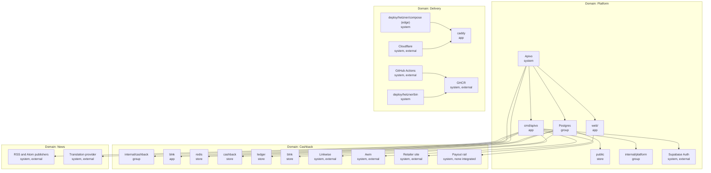

# The IcePanel model

*Which objects, connections and conventions make up Apivo's C4 model, and how that model is kept true to the tree.*

**Status**: 2026-09-07 — `main @ 0461ad7`

## Contents

- [What this document is](#what-this-document-is)
- [1. Modelling conventions](#1-modelling-conventions)
- [2. The object catalogue](#2-the-object-catalogue)
- [3. The connection catalogue](#3-the-connection-catalogue)
- [4. The model as JSON](#4-the-model-as-json)
- [5. The diagram set](#5-the-diagram-set)
- [6. How to keep it true](#6-how-to-keep-it-true)
- [7. Importing the model](#7-importing-the-model)
- [Open questions and known gaps](#open-questions-and-known-gaps)

## What this document is

IcePanel holds one model and draws many diagrams over it. A system is described as **domains** (top-level groupings), **objects** typed `system`, `actor`, `app`, `store`, `component` or `group` and arranged in a C4 hierarchy, and **connections** between those objects carrying a direction, a description and a technology. Diagrams are views over that model rather than drawings beside it, which is the property worth having: a component renamed once is renamed in every view that shows it, and a view cannot quietly disagree with another.

That property is also the risk. A model is a second description of the system, and a second description drifts. The rest of this document is the model **and** the discipline that keeps it honest: the conventions in section 1, the catalogue in sections 2 to 4, and a proposed drift check in section 6.

The model hierarchy, in one picture:



Solid arrows inside a domain read *"contains"*; the arrows leaving `cmd/apivo` and `web/` read *"calls"*. Two of those are worth naming. The one to the payout rail is drawn as a reminder that **nothing is integrated behind it** — section 3 records it as a connection from `internal/cashback/payout/manual` with the technology "None". The one from `web/` to the retailer collapses a two-step reality onto the app that starts it: the click-out endpoint answers 303 and the member's browser follows, which section 3 records as a connection from `Member`. Components are deliberately absent: the full hierarchy is section 2's job, and a diagram of seventy-four objects answers no question.

## 1. Modelling conventions

Six rules. They exist so that two people modelling the same change produce the same objects, and so a script can check the result.

### 1.1 An object's name is the repository's own name for the thing

`internal/cashback/earnings`, not "Earnings Service". `cmd/apivo`, not "API". `web/`, not "Frontend".

This is the rule that does the most work, because it removes the translation step where drift begins. A reviewer looking at a diagram can `ls` the name. A search for an object name finds the code. And an object whose name does not resolve to a path is immediately visible as either a group (allowed, see 1.3) or a mistake.

The exception is an actor, which has no path: `Reader`, `Member`, `Editor`, `Operator` are named after the roles the system actually distinguishes — three of which are the values of `account_role_known` in [0019_operator_role.up.sql](../../internal/platform/db/migrations/0019_operator_role.up.sql), and one of which (Member) is an account with a `cashback.participation` row rather than a role.

### 1.2 The type mapping

| In the tree | IcePanel type | Why |
|---|---|---|
| A Go package under `internal/` or `cmd/` | `component` | The package is the unit the [arch test](../../internal/arch/arch_test.go) judges, so it is the unit whose relationships are enforceable. |
| A process that is separately deployable and separately restartable | `app` | `cmd/apivo`, `web/`, `blnk`, `blnk-worker`, `caddy`, and the two host-side shell tools. |
| A Postgres **schema** | `store` | One database, four schemas. The schema is the boundary migration [0010](../../internal/platform/db/migrations/0010_cashback_schema.up.sql) grants against, so it is the boundary worth drawing. Modelling the database as a single store would erase the product boundary the grants create. |
| Redis | `store` | It holds no source of truth, and the description says so. |
| A third party we call over the network | `system`, tagged `external` | Ten of them: Linkwise, Awin, Supabase Auth, the RSS and Atom publishers, the chat-completions model provider, the retailer, the payout rail, Cloudflare, GitHub Actions, GHCR. |
| A third party we **run** | `app` or `store`, tagged `third-party` | Blnk and Redis are ours to operate and are inside the Apivo system; that is the honest place for them, and it is why the C-1 check can be a plain SQL query (ADR-0002). |
| A human role | `actor` | |
| A directory or grouping with no runtime identity | `group` | See 1.3. |

Files inside a package are **not** objects. That is C4 level 4, and it is answered by behaviour rather than by structure — see [sequence-diagrams.md](sequence-diagrams.md).

### 1.3 Groups are the one object type allowed a descriptive parent

IcePanel's hierarchy is system → app/store → component; components do not nest. `internal/cashback/networks/linkwise` is a child of `internal/cashback/networks` in the tree and a sibling of it in the model. Rather than invent sub-components, the **name carries the nesting**: `internal/cashback/networks/linkwise` is unambiguous wherever it appears.

Three groups exist, and each is a real directory: `internal/cashback`, `internal/platform`, and `Postgres` — the last being the only group whose name is not a path, because one database holding four schemas has no path. `internal/identity`, `internal/account`, `internal/arch` and the five epiloYES components hang directly off `cmd/apivo`, because they are not under a common directory and a group invented to hold them would be a fourth name nobody could check.

### 1.4 Every object carries its source path

Twice, deliberately: as the `sourcePath` field and as a `src:<path>` tag. The field is what a script reads; the tag is what makes the path visible in the IcePanel UI, where a reader is looking at a box rather than at JSON. Both must be a path that exists in this repository at the stated commit-ish. **An object with no source path may not be created** — if there is nothing to point at, the object is a claim rather than a description.

### 1.5 Tags are the vocabulary

| Tag | Meaning |
|---|---|
| `built` | Implemented, wired in the composition root, covered by tests that run in CI. |
| `partial` | Some of it runs; a named piece does not, and the description names it. |
| `specified` | Written down, not built. |
| `retired` | Deliberately withdrawn. |
| `test-only` | Ships no production code. |
| `external` | A third party we call. |
| `third-party` | A third party we run. |
| `src:<path>` | The source path, per 1.4. |

The four maturity labels are the same four [README.md](README.md) defines for this document set, so a box in IcePanel and a status column in a sibling document cannot say different things.

**Deployment is a tag, never a parent.** An object has exactly one parent and that parent is the product hierarchy; which host a container runs on is a `host:` tag, so a container that moves hosts does not move in the model.

No object in section 2 carries one yet. One provisioned host runs every environment that exists, so the tag would distinguish nothing a reader could not read off a one-line host list. The rule is written down for the day a second host arrives, and section 5's deployment view assumes it rather than reports it.

### 1.6 What is deliberately not drawn

- **Imports of `internal/platform/*`.** Every module imports `money`, most import `http` and `events`. An edge from every component to `internal/platform/money` would carry no information, and the [arch test](../../internal/arch/arch_test.go) is already the authority on that layer. The connections that ARE drawn to platform components are the ones with runtime consequence: the outbox append, the scheduler's advisory lock, the migration run.
- **Responses.** A request and its response are one connection. `outgoing` means "the source initiates".
- **Test-only edges.** `internal/cashback/scenarios` and `internal/arch` appear as objects, tagged `test-only`, with no connections. A conformance test that imports every adapter is not an architectural dependency.

## 2. The object catalogue

74 objects: 4 actor, 13 system, 7 app, 5 store, 3 group, 42 component. Grouped by domain, ready to type in. Every source path is a link, so a broken one is visible in review.

### 2.1 Domain: Platform

The substrate both products stand on.

| Name | Type | Parent | Technology | Description | Source path |
|---|---|---|---|---|---|
| `Apivo` | system | — | Go 1.26.5, Astro, Postgres 17 | The super app. Two products, one repository, one binary, one database, isolated by schema rather than by deployable (ADR-0001). | [.](../../.) |
| `Supabase Auth` | system | — | OIDC, JWKS, RS256 | Issues the tokens the API verifies. With JWKS_URL unset the binary mounts no authenticated route at all rather than mounting one unguarded. | [internal/identity/verifier.go](../../internal/identity/verifier.go) |
| `cmd/apivo` | app | `Apivo` | Go 1.26.5, net/http ServeMux, pgx v5 | The modular monolith. Serves the reader, editorial, account and — when CASHBACK_ENABLED — every cashback route, and runs the poll loops and the scheduled jobs beside the HTTP server. Publishes no host port in any environment. | [cmd/apivo/main.go](../../cmd/apivo/main.go) |
| `web/` | app | `Apivo` | Astro SSR, @astrojs/node, TypeScript strict | The only published HTTP surface. Renders every page server-side from the API by service name, and holds the click-out BFF. | [web/](../../web/) |
| `Postgres` | group | `Apivo` | Postgres 17 | One database, four schemas. Supabase EU in staging and production; a container in QA and locally. Schema isolation is the product boundary: migration 0010 grants cashback_domain exactly four things across it — SELECT on public.account, public.place and public.language, and SELECT, INSERT on public.domain_event, which is the only channel between the two products. | [internal/platform/db/migrations](../../internal/platform/db/migrations) |
| `public` | store | `Postgres` | Postgres schema | account, place, language, source, source_item, article, translation, translation_spend, domain_event, event_delivery, event_dead_letter, subscriber_checkpoint. | [internal/platform/db/migrations/0001_init.up.sql](../../internal/platform/db/migrations/0001_init.up.sql) |
| `internal/platform` | group | `cmd/apivo` | Go packages | The bottom layer. Importable by anyone, importing no sibling domain — rule 1 of the module boundaries. | [internal/platform](../../internal/platform) |
| `cmd/apivo/main.go` | component | `cmd/apivo` | Go | The composition root. Wiring flows one way: cmd knows every domain and no domain knows cmd. Chooses the ledger driver, the network adapter and the payout rail, and registers every scheduled job. | [cmd/apivo/main.go](../../cmd/apivo/main.go) |
| `internal/platform/config` | component | `internal/platform` | Go | One place that reads the environment. Under APP_ENV=prod every money key is required: cashback moves members' money, so it starts fully configured or not at all. The retired flat NETWORK_* keys are refused, not ignored. | [internal/platform/config](../../internal/platform/config) |
| `internal/platform/db` | component | `internal/platform` | Go, golang-migrate v4, pgx v5 | Embedded migrations and the pool. The migrations are the single source of truth for the schema, and both generators read them. | [internal/platform/db](../../internal/platform/db) |
| `internal/platform/events` | component | `internal/platform` | Go, pgx | The outbox writer and envelope, the dispatcher, checkpoints and the dead-letter lane. The WRITER is wired; NOTHING registers a dispatcher, so eighteen distinct event types are appended and none consumed — nineteen constants declare them, because cashback.transaction.unattributed is spelled in both networks and earnings. | [internal/platform/events](../../internal/platform/events) |
| `internal/platform/http` | component | `internal/platform` | Go, net/http | The server, the problem+json convention and the 405 allow-table every module derives from its own route map. | [internal/platform/http](../../internal/platform/http) |
| `internal/platform/logging` | component | `internal/platform` | Go, log/slog | Structured logging; JSON under APP_ENV=prod. | [internal/platform/logging](../../internal/platform/logging) |
| `internal/platform/money` | component | `internal/platform` | Go | money.Amount: integer minor units beside an explicit ISO-4217 code, explicit rounding modes, and JSON as {minor, currency}. No float path anywhere (C-6). | [internal/platform/money](../../internal/platform/money) |
| `internal/platform/scheduler` | component | `internal/platform` | Go, Postgres advisory locks | Runs a named job on an interval, once across a fleet. Refuses to start when the pool cannot carry two connections per job plus two reserved. | [internal/platform/scheduler](../../internal/platform/scheduler) |
| `internal/platform/brand` | component | `internal/platform` | Go, JSON | Reads the deployment's brand definition from BRAND_DIR and generates its TypeScript counterpart. No brand ships in this repository — there is none it could ship that would not be a lie about a real company. | [internal/platform/brand](../../internal/platform/brand) |
| `internal/platform/text` | component | `internal/platform` | Go | Prose helpers shared by the modules that render copy. | [internal/platform/text](../../internal/platform/text) |
| `internal/identity` | component | `cmd/apivo` | Go, lestrrat-go/jwx v3 | JWKS-backed verification and the role lookup. RoleEditor and RoleOperator live here; 'none' and symmetric algorithms are refused. Importable by any product domain, and imports only platform (ADR-0001). | [internal/identity](../../internal/identity) |
| `internal/account` | component | `cmd/apivo` | Go, pgx | The account profile and tour progress — the one thing both products genuinely share. | [internal/account](../../internal/account) |
| `internal/arch` | component | `cmd/apivo` | Go tests, go/parser | Enforcement, not a product: module boundaries, ledger-SDK sealing, adapter isolation, and tests that prove each rule actually fires and that the scan did not pass vacuously. | [internal/arch](../../internal/arch) |
| `web/src/lib/brand` | component | `web/` | TypeScript, generated | The brand definition's TypeScript counterpart, generated from the same file the Go side reads. | [web/src/lib/brand](../../web/src/lib/brand) |

### 2.2 Domain: Cashback

The money product. This is the domain the model exists for.

**Cashback is off in every environment** ([ENVIRONMENTS.md](../ENVIRONMENTS.md)). Every object below describes what the binary contains and what CI exercises, not what is serving traffic: no click rule, no hold rule, no operator gate and no ledger check has yet refused anything outside a test. A `built` tag in this table means implemented, wired in the composition root and covered in CI — it does not mean proved in production, and on this domain none of them is.

| Name | Type | Parent | Technology | Description | Source path |
|---|---|---|---|---|---|
| `Member` | actor | — | Web browser | An account that has opted into cashback. Every cashback route is authenticated; there is no anonymous click (FR-023). | [internal/cashback/wallet/participation.go](../../internal/cashback/wallet/participation.go) |
| `Operator` | actor | — | Web browser | Holds role 'operator'. The only role that may release money (C-4); introduced by migration 0019, which refuses to apply if any historical payout was approved by a non-operator. | [internal/platform/db/migrations/0019_operator_role.up.sql](../../internal/platform/db/migrations/0019_operator_role.up.sql) |
| `Linkwise` | system | — | HTTPS, HTTP Basic | Affiliate network. Reports transactions and a programme list; the transaction report carries no currency, so it is joined from the programme list. | [internal/cashback/networks/linkwise/client.go](../../internal/cashback/networks/linkwise/client.go) |
| `Awin` | system | — | HTTPS, bearer token | Affiliate network. Reachable for programmes and deeplinks only; the transaction half does not exist, so this network cannot yet credit anybody. | [internal/cashback/networks/awin/client.go](../../internal/cashback/networks/awin/client.go) |
| `Retailer site` | system | — | HTTPS | Where a click-out lands. The member is redirected 303 to a deeplink the adapter built; the network, not Apivo, observes the purchase. | [internal/cashback/networks/deeplink.go](../../internal/cashback/networks/deeplink.go) |
| `Payout rail` | system | — | None integrated | The bank or processor that would move money. NOTHING IS INTEGRATED: the only rail is the manual one, and payout_destination.kind admits 'sepa' with no SEPA rail behind it. | [internal/cashback/payout/rail.go](../../internal/cashback/payout/rail.go) |
| `blnk` | app | `Apivo` | jerryenebeli/blnk 0.15.2, pinned by digest | The production ledger (ADR-0002). Confines itself to a 'blnk' schema in Apivo's own database, so the C-1 zero-sum check is a plain SQL query over real rows rather than a distributed reconciliation. | [docker-compose.yml](../../docker-compose.yml) |
| `blnk-worker` | app | `Apivo` | jerryenebeli/blnk 0.15.2, pinned by digest | Blnk's queue worker. Present in the Hetzner cashback overlay only; the local stack and deploy/k8s run the server alone. | [deploy/hetzner/compose/docker-compose.cashback.yml](../../deploy/hetzner/compose/docker-compose.cashback.yml) |
| `cashback` | store | `Postgres` | Postgres schema | merchant, offer, click, network, network_account, network_transaction, unattributed_transaction, entry, entry_transition, ledger_link, withdrawal_request, payout, payout_destination, participation, reconciliation_run, reconciliation_difference, and the provenance view. | [internal/platform/db/migrations/0010_cashback_schema.up.sql](../../internal/platform/db/migrations/0010_cashback_schema.up.sql) |
| `ledger` | store | `Postgres` | Postgres schema | The documented exit route from Blnk: ledger.account, ledger.transfer, ledger.posting, all immutable, with a deferred zero-sum constraint trigger per transfer per currency. Kept working so ADR-0002 is reversible in days. | [internal/platform/db/migrations/0022_pg_ledger.up.sql](../../internal/platform/db/migrations/0022_pg_ledger.up.sql) |
| `blnk` | store | `Postgres` | Postgres schema, owned by Blnk | Blnk's own tables, created by its first migration as the database owner and written by blnk_app. Not ours to shape; read by the C-1 zero-sum check through the cashback.ledger_zero_sum view. | [internal/platform/db/migrations/0020_ledger_schema_setting.up.sql](../../internal/platform/db/migrations/0020_ledger_schema_setting.up.sql) |
| `redis` | store | `Apivo` | redis:7.2.4-alpine, pinned by digest | Blnk's queueing and caching. Holds NO source of truth: losing it loses throughput, not money, which is why it has no volume. | [docker-compose.yml](../../docker-compose.yml) |
| `internal/cashback` | group | `cmd/apivo` | Go packages | The cashback domain. Every sub-package owns its own queries/ and sqlc-generated store/, and exports Patterns() so the served routes can be compared with api/openapi.json in both directions. | [internal/cashback](../../internal/cashback) |
| `internal/cashback/catalogue` | component | `internal/cashback` | Go, sqlc, pgx | Imports a network's catalogue, publishes rate bands, and answers the merchant detail page. A retailer absent from a complete iteration is reconciled to 'left_network'. Browser.Browse is implemented and has NO route. | [internal/cashback/catalogue](../../internal/cashback/catalogue) |
| `internal/cashback/clickout` | component | `internal/cashback` | Go, sqlc, pgx | Issues a click: rate limit, live-offer check, mint, build the deeplink, then write the immutable click row and its outbox row in one transaction. The deeplink is built BEFORE the row, so a broken template leaves no orphan click. | [internal/cashback/clickout](../../internal/cashback/clickout) |
| `internal/cashback/networks` | component | `internal/cashback` | Go, sqlc, pgx | The affiliate-network port and everything around it: two durable cursors per publisher account, evidence capture with a database-computed digest, supersession, the attribution canary, the token bucket and the retry backoff. | [internal/cashback/networks](../../internal/cashback/networks) |
| `internal/cashback/networks/fixture` | component | `internal/cashback` | Go, recorded JSON | A complete adapter over recorded payloads: click, pending, approved, reversed. A shipped driver and the local default. Its deeplink host is under .invalid so a test suite can never send real traffic. | [internal/cashback/networks/fixture](../../internal/cashback/networks/fixture) |
| `internal/cashback/networks/linkwise` | component | `internal/cashback` | Go, net/http, HTTP Basic | Implements every method of the port and runs the shared conformance suite. A shipped driver. | [internal/cashback/networks/linkwise](../../internal/cashback/networks/linkwise) |
| `internal/cashback/networks/awin` | component | `internal/cashback` | Go, net/http, bearer | Client, catalogue and deeplink only. No FetchTransactions and no Limits, so it does not satisfy the port — proved at the compiler — and is deliberately absent from shippedNetworks (deferred by founder decision, 2026-09-04). | [internal/cashback/networks/awin](../../internal/cashback/networks/awin) |
| `internal/cashback/earnings` | component | `internal/cashback` | Go, sqlc, pgx | Attribution, the member share, the four hold rules, the six-state machine, confirmation behind two gates, reversal as a new entry, and the operator review. Every move posts first and records second. | [internal/cashback/earnings](../../internal/cashback/earnings) |
| `internal/cashback/wallet` | component | `internal/cashback` | Go, sqlc, pgx | Declares the Ledger port, the member wallet projection, participation, the export, the house accounts and the continuous C-1 zero-sum check. Four of the five wallet figures are summed from postings; none is stored. | [internal/cashback/wallet](../../internal/cashback/wallet) |
| `internal/cashback/wallet/memory` | component | `internal/cashback` | Go, one mutex | The reference implementation of the port. Balance literally sums postings. The local default and the only driver that runs with Docker unavailable; nothing survives the process. | [internal/cashback/wallet/memory](../../internal/cashback/wallet/memory) |
| `internal/cashback/wallet/blnk` | component | `internal/cashback` | Go, blnk-go v1.3.0 | The production driver. The ONLY package in the tree allowed to import a ledger vendor's SDK — enforced by internal/arch, and the reason the money substrate is swappable at all. | [internal/cashback/wallet/blnk](../../internal/cashback/wallet/blnk) |
| `internal/cashback/wallet/postgres` | component | `internal/cashback` | Go, pgx | The exit route, kept working. Its schema test proves the triggers refuse illegal raw SQL, not merely illegal port calls. | [internal/cashback/wallet/postgres](../../internal/cashback/wallet/postgres) |
| `internal/cashback/payout` | component | `internal/cashback` | Go, sqlc, pgx | Withdrawal, reservation, two-phase approval, rejection, retry, abandonment and settlement. The idempotency key is read back from the generated column rather than recomputed in Go. | [internal/cashback/payout](../../internal/cashback/payout) |
| `internal/cashback/payout/manual` | component | `internal/cashback` | Go | The only rail wired in production, hard-coded in the composition root. Submit returns a 'manual:' reference; Status ALWAYS answers submitted, because a person must say the money landed. | [internal/cashback/payout/manual](../../internal/cashback/payout/manual) |
| `internal/cashback/payout/stub` | component | `internal/cashback` | Go | A test double for the rail: timeouts, permanent failure, settle and fail on demand. | [internal/cashback/payout/stub](../../internal/cashback/payout/stub) |
| `internal/cashback/ops` | component | `internal/cashback` | Go, sqlc, pgx | The four operator queues behind one requireOperator gate that wraps the MUX, not the routes — so a route added later cannot be left open by omission. Every decision takes the operator from the token, never from the body. | [internal/cashback/ops](../../internal/cashback/ops) |
| `internal/cashback/scenarios` | component | `internal/cashback` | Go tests | Six end-to-end scenarios over a real Postgres: earn-confirm, evidence-immutable, reversal, unattributed-and-held, reconciliation, withdrawal-exactly-once. Ships no production code. | [internal/cashback/scenarios](../../internal/cashback/scenarios) |
| `web/src/pages/[lang]/[place]/cashback` | component | `web/` | Astro SSR | The member surfaces: the catalogue index, a merchant, the wallet and the withdrawal form. With API_BASE_URL unset they answer from fixtures and every one says so in a band at the top. | [web/src/pages/[lang]/[place]/cashback](../../web/src/pages/[lang]/[place]/cashback) |
| `web/src/pages/ops` | component | `web/` | Astro SSR | The four operator queues: held, unattributed, reconciliation, withdrawals. | [web/src/pages/ops](../../web/src/pages/ops) |
| `web/src/pages/api/cashback/clickout.ts` | component | `web/` | Astro endpoint | The click-out is a POST because it creates a row, and answers 303 only to the target the API returned — the member never supplies a URL, so there is no open redirect to close. | [web/src/pages/api/cashback/clickout.ts](../../web/src/pages/api/cashback/clickout.ts) |
| `web/src/lib/cashback` | component | `web/` | TypeScript | The typed client, the money helpers, the fixtures and the operator guard. It calls three endpoints nothing serves. | [web/src/lib/cashback/api.ts](../../web/src/lib/cashback/api.ts) |

### 2.3 Domain: News

epiloYES appears here only as far as it shares substrate — the binary, the database, identity, the outbox and the deployment. Its own component view is not written.

| Name | Type | Parent | Technology | Description | Source path |
|---|---|---|---|---|---|
| `Reader` | actor | — | Web browser | Anonymous. Needs no bearer token: the front page and an article are the only open product routes. | [web/src/pages/[lang]/[place]/index.astro](../../web/src/pages/[lang]/[place]/index.astro) |
| `Editor` | actor | — | Web browser | Holds role 'editor'. Approves, publishes and withdraws articles; the approval row is the approval (I-1). | [internal/identity/role.go](../../internal/identity/role.go) |
| `RSS and Atom publishers` | system | — | HTTP, RSS 2.0, Atom | The news sources. Provenance and the licence snapshot are captured in the same transaction as the item (I-2, I-4). | [internal/ingestion/fetch.go](../../internal/ingestion/fetch.go) |
| `Chat-completions model provider` | system | — | HTTPS, POST /chat/completions | Any host that speaks the chat-completions request shape the openaicompat adapter is written against. Which one is a pending founder decision, so there is no default and an incomplete configuration leaves the pipeline off. | [internal/translation/providers/openaicompat/client.go](../../internal/translation/providers/openaicompat/client.go) |
| `internal/ingestion` | component | `cmd/apivo` | Go, gofeed, pgx | Polls RSS and Atom sources and writes the item and its provenance in one transaction. source_item is immutable — it is legal evidence of what was retrieved and under what terms (I-2, I-3). | [internal/ingestion](../../internal/ingestion) |
| `internal/translation` | component | `cmd/apivo` | Go, pgx | The translation pipeline and its lineage: prompt version, model, and a spend ledger under a per-article ceiling and a monthly cap. Off unless the whole TRANSLATION_* block is set. | [internal/translation](../../internal/translation) |
| `internal/translation/providers/openaicompat` | component | `cmd/apivo` | Go, net/http | The one provider adapter: any host speaking the chat-completions request shape. | [internal/translation/providers/openaicompat](../../internal/translation/providers/openaicompat) |
| `internal/content` | component | `cmd/apivo` | Go, sqlc, pgx | The reader surface: GET /api/v1/front and GET /api/v1/articles/{id}. The only product routes that need no bearer token. | [internal/content](../../internal/content) |
| `internal/editorial` | component | `cmd/apivo` | Go, sqlc, pgx | The review queue, approval, publication, withdrawal, sources and the provenance read. An article cannot exist without a named human approver (I-1). | [internal/editorial](../../internal/editorial) |
| `web/src/pages/[lang]/[place]` | component | `web/` | Astro SSR | The front page and the article page. Language and place are independent axes and the URL is the only state they have. | [web/src/pages/[lang]/[place]/index.astro](../../web/src/pages/[lang]/[place]/index.astro) |
| `web/src/pages/[lang]/editor` | component | `web/` | Astro SSR | The editorial queue, sources, audit and sign-in screens. | [web/src/pages/[lang]/editor](../../web/src/pages/[lang]/editor) |
| `web/src/pages/go.ts` | component | `web/` | Astro endpoint | The first-run setup form's destination: composes a front page from the two axes and remembers it. | [web/src/pages/go.ts](../../web/src/pages/go.ts) |

### 2.4 Domain: Delivery

How a change reaches a host. Nothing pushes to a host; the host converges itself every minute.

One host carries this today. The pre-production VPS is provisioned and serving QA; staging's site answers on the same host and has never had a release; production is not provisioned at all ([ENVIRONMENTS.md](../ENVIRONMENTS.md)). The objects below are the mechanism, which exists and runs — not a fleet, which does not.

| Name | Type | Parent | Technology | Description | Source path |
|---|---|---|---|---|---|
| `Cloudflare` | system | — | DNS, edge TLS, CDN, WAF | DNS, edge TLS and the WAF. Cloudflare Containers is retired as a deployment target and nothing deploys there. | [README.md](../../README.md) |
| `GitHub Actions` | system | — | GitHub-hosted runners | Every gate a change passes: commit hygiene, lint, Go and cashback suites, sqlc drift, TypeScript type drift, OpenAPI validation, kubeconform, migration and brand lints. | [.github/workflows/ci.yml](../../.github/workflows/ci.yml) |
| `GHCR` | system | — | OCI registry | Holds the api and web images. A tag is what an environment tracks; a digest is what it runs. | [.github/workflows/publish.yml](../../.github/workflows/publish.yml) |
| `deploy/hetzner/compose (edge)` | system | — | Docker Compose, Caddy | One Caddy per host, in front of every environment on it. The only ports published on the whole host are 80 and 443, and the firewall admits Cloudflare ranges only. | [deploy/hetzner/compose/docker-compose.edge.yml](../../deploy/hetzner/compose/docker-compose.edge.yml) |
| `deploy/hetzner/bin` | system | — | POSIX sh, systemd timers | The host side of the deployment. Nothing pushes to a host: no CI job holds an SSH key and no webhook exists — the host converges itself every minute. | [deploy/hetzner/bin](../../deploy/hetzner/bin) |
| `caddy` | app | `deploy/hetzner/compose (edge)` | caddy:2.10-alpine | Chooses an upstream and nothing else: /api/*, /healthz and /readyz to the API, everything else to the frontend. It carries NO rate limit — the Worker that used to is no longer deployed. | [deploy/hetzner/caddy/snippets.caddy](../../deploy/hetzner/caddy/snippets.caddy) |
| `apivo-reconcile` | app | `deploy/hetzner/bin` | POSIX sh, systemd timer, every 60s | The whole deployment mechanism. Reads the environment's channel tag, resolves it to a digest without pulling, rolls forward if it differs, proves the roll-forward, and restores the previous digest if the proof fails. | [deploy/hetzner/bin/apivo-reconcile](../../deploy/hetzner/bin/apivo-reconcile) |
| `apivo-previews` | app | `deploy/hetzner/bin` | POSIX sh, systemd timer | Brings per-pull-request preview stacks up and tears them down beneath the preview domain. | [deploy/hetzner/bin/apivo-previews](../../deploy/hetzner/bin/apivo-previews) |

## 3. The connection catalogue

69 connections. Direction is `outgoing` throughout — the source initiates, and the response is not a second connection. The outward network calls and the database access paths are both here; the imports of `internal/platform/*` are not, per 1.6.

| Source | Target | Direction | Description | Technology |
|---|---|---|---|---|
| `Reader` | `web/` | outgoing | Reads the front page and an article, in a language and a place chosen in the URL. | HTTPS |
| `Member` | `web/` | outgoing | Browses retailers, clicks out, reads the wallet and asks for a withdrawal. | HTTPS |
| `Editor` | `web/` | outgoing | Reviews the queue, approves, publishes and withdraws. | HTTPS |
| `Operator` | `web/` | outgoing | Works the held, unattributed, reconciliation and withdrawal queues. | HTTPS |
| `Member` | `Retailer site` | outgoing | Arrives at the shop on a 303 carrying the network's own click-ref parameter. The purchase is observed by the network, never by Apivo. | HTTPS redirect |
| `Cloudflare` | `caddy` | outgoing | Proxies the environment's domain to the origin over a Cloudflare Origin Certificate; the host firewall admits Cloudflare ranges only. | HTTPS |
| `caddy` | `cmd/apivo` | outgoing | /api/*, /healthz and /readyz. The only thing that talks to the API, which publishes no host port in any environment. | HTTP, compose network |
| `caddy` | `web/` | outgoing | Everything else. HTTPS to the frontend container because @astrojs/node builds Astro.url from the socket. | HTTPS, compose network |
| `web/` | `cmd/apivo` | outgoing | Renders every page server-side. API_BASE_URL is the internal service name; in APP_ENV=prod an unset one is refused rather than falling back to fixtures. | HTTP, JSON |
| `web/src/lib/cashback` | `cmd/apivo` | outgoing | The typed client for the cashback surface, carrying the member's or operator's bearer token. | fetch, JSON, Bearer |
| `web/src/pages/api/cashback/clickout.ts` | `cmd/apivo` | outgoing | POST /api/v1/cashback/clickouts, then 303 to the redirect_url the API returned. | fetch, JSON, Bearer |
| `web/` | `Supabase Auth` | outgoing | Signs a member or an editor in with the JS SDK. The token that sign-in produces is the token the API verifies — the two halves of one setting. | Supabase JS SDK |
| `internal/identity` | `Supabase Auth` | outgoing | Fetches and refreshes the JWKS and verifies every bearer token. One verifier is shared by every module, so there is one refresh loop and one cache. | HTTPS, JWKS |
| `internal/cashback/clickout` | `internal/cashback/catalogue` | outgoing | LiveOffer refuses an offer outside its validity window or on a dead route, before any reference is minted. | Go |
| `internal/cashback/clickout` | `internal/cashback/networks` | outgoing | BuildDeeplink puts the minted reference in the network's own click-ref parameter — before the click row is written, so a broken template leaves no orphan click. | Go |
| `internal/cashback/catalogue` | `internal/cashback/networks` | outgoing | FetchCatalogue for the scheduled import; at publish, a probe deeplink is built through the real adapter so a template that cannot carry a reference is refused there rather than at click. | Go |
| `internal/cashback/earnings` | `internal/cashback/networks` | outgoing | Reads the evidence row a sweep stored and its normalised status. Confirmation needs both an approved report and a reconciled statement. | Go |
| `internal/cashback/earnings` | `internal/cashback/clickout` | outgoing | Matches a report's click_ref to a click, byte for byte — no trimming, no case folding. A miss is queued, never guessed. | Go |
| `internal/cashback/earnings` | `internal/cashback/wallet` | outgoing | Posts every state change through the Ledger port. Post first, record second, because entry_transition.ledger_transfer_ref is NOT NULL. | Go, Ledger port |
| `internal/cashback/payout` | `internal/cashback/earnings` | outgoing | Selects the covering confirmed entries and reserves them — the ledger is touched only after every cheap refusal has been made. | Go |
| `internal/cashback/payout` | `internal/cashback/wallet` | outgoing | Moves confirmed to reserved, and back on rejection or abandonment. The reservation IS the double-spend defence; there is deliberately no one-open-request constraint. | Go, Ledger port |
| `internal/cashback/payout` | `internal/cashback/payout/manual` | outgoing | The Rail port. Submitted outside any transaction, after the approval has committed. | Go, Rail port |
| `internal/cashback/ops` | `internal/cashback/payout` | outgoing | Approve, reject and settle a withdrawal, with the operator taken from the token. | Go |
| `internal/cashback/ops` | `internal/cashback/earnings` | outgoing | Release a held credit to pending, or reject it — which writes a new entry born reversed beside the untouched original. | Go |
| `internal/cashback/ops` | `internal/cashback/networks` | outgoing | Lists and dismisses unattributed transactions. Dismissal closes the row without crediting anybody; attribution by hand has no route. | Go |
| `cmd/apivo/main.go` | `internal/cashback/wallet/memory` | outgoing | One of three ledger drivers; LEDGER_DRIVER=memory is the local default and the only one that runs with Docker unavailable. | Go |
| `cmd/apivo/main.go` | `internal/cashback/wallet/blnk` | outgoing | One of three ledger drivers; LEDGER_DRIVER=blnk is production. BLNK_URL set beside a different driver is a startup refusal. | Go |
| `cmd/apivo/main.go` | `internal/cashback/wallet/postgres` | outgoing | One of three ledger drivers; LEDGER_DRIVER=postgres pins the zero-sum check to the 'ledger' schema rather than 0020's default. | Go |
| `cmd/apivo/main.go` | `internal/cashback/networks/fixture` | outgoing | A shipped driver in the single registry: documented and constructable together or neither. | Go |
| `cmd/apivo/main.go` | `internal/cashback/networks/linkwise` | outgoing | A shipped driver, because *linkwise.Client implements every method of the port — proved in the constructor's signature. | Go |
| `cmd/apivo/main.go` | `internal/platform/scheduler` | outgoing | Registers the zero-sum check, the settlement sweep, the earnings lifecycle, the two network sweeps and the catalogue import, then refuses to start if the pool cannot carry them. | Go |
| `internal/cashback/networks/linkwise` | `Linkwise` | outgoing | Polls the transaction report on a forward and a trailing window, and the programme list for the catalogue and the currency the report omits. | HTTPS, HTTP Basic |
| `internal/cashback/networks/awin` | `Awin` | outgoing | Programme list and deeplink only. No transaction poll exists, so nothing this network reports can become a credit. | HTTPS, bearer |
| `internal/cashback/wallet/blnk` | `blnk` | outgoing | One Blnk transaction per Transfer, referenced by the idempotency key, with postings read back from the annotation document. | HTTP, blnk-go v1.3.0 |
| `internal/cashback/wallet/postgres` | `ledger` | outgoing | ledger.account, transfer and posting: immutable, zero-sum per transfer per currency by deferred constraint trigger, member stage accounts refused a negative balance. | SQL, pgx |
| `internal/cashback/payout/manual` | `Payout rail` | outgoing | NOT INTEGRATED. Nothing is called: Submit returns a 'manual:' reference and Status always answers submitted, so an operator records the arrival by hand. | None |
| `internal/translation/providers/openaicompat` | `Chat-completions model provider` | outgoing | POST /chat/completions under a per-article ceiling and a monthly cap. Off unless the whole configuration block is present. | HTTPS, JSON |
| `internal/ingestion` | `RSS and Atom publishers` | outgoing | Polls each source on its own cadence and captures provenance and the licence snapshot at retrieval. | HTTP, gofeed |
| `internal/cashback/catalogue` | `cashback` | outgoing | merchant, merchant_network (with the verbatim payload and retrieved_at), merchant_copy, merchant_place and offer. | SQL, sqlc, pgx |
| `internal/cashback/clickout` | `cashback` | outgoing | cashback.click and its outbox row in one transaction. The table refuses UPDATE, DELETE and TRUNCATE by trigger (C-3). | SQL, sqlc, pgx |
| `internal/cashback/networks` | `cashback` | outgoing | network_transaction, unattributed_transaction and the two cursors on network_account — one transaction per poll, the cursor advanced only after the whole window is persisted. | SQL, sqlc, pgx |
| `internal/cashback/earnings` | `cashback` | outgoing | entry, entry_transition and ledger_link. entry.network_transaction_id is NOT NULL, so a credit without evidence is unrepresentable (C-2). | SQL, sqlc, pgx |
| `internal/cashback/payout` | `cashback` | outgoing | withdrawal_request, payout and payout_destination. payout.idempotency_key is GENERATED ALWAYS from the request id and uniquely constrained (C-5). | SQL, sqlc, pgx |
| `internal/cashback/ops` | `cashback` | outgoing | reconciliation_run and reconciliation_difference, and the resolution columns on the queues — all-or-none, so a half-recorded decision cannot exist. | SQL, sqlc, pgx |
| `internal/cashback/wallet` | `cashback` | outgoing | Reads entries for the wallet history and the export, and sums PaidOut from cashback.payout where state='settled'. No balance is stored anywhere. | SQL, sqlc, pgx |
| `internal/cashback/wallet` | `blnk` | outgoing | The continuous C-1 check reads cashback.ledger_zero_sum, which migration 0020 resolves to the co-located ledger's schema, once a minute, pinned transaction-locally per run. | SQL |
| `internal/content` | `public` | outgoing | Front page and article reads, resolved on the language and place axes. | SQL, sqlc, pgx |
| `internal/editorial` | `public` | outgoing | Queue, approval, publication, withdrawal, sources and the provenance view. | SQL, sqlc, pgx |
| `internal/ingestion` | `public` | outgoing | source, source_item and its provenance in the same transaction — a source_item without provenance is unrepresentable. | SQL, pgx |
| `internal/translation` | `public` | outgoing | translation and translation_spend: the lineage and the budget. | SQL, pgx |
| `internal/account` | `public` | outgoing | The account profile and tour progress. | SQL, pgx |
| `internal/identity` | `public` | outgoing | Maps a verified token's subject to public.account and reads its role. An unknown subject is refused, not created. | SQL, pgx |
| `internal/platform/events` | `public` | outgoing | Appends public.domain_event on the CALLER'S transaction handle, so an event and the state change it describes commit together or not at all. | SQL, pgx |
| `internal/platform/scheduler` | `public` | outgoing | Advisory locks, so a named job runs once across a fleet rather than once per process. | SQL, pgx |
| `internal/platform/db` | `Postgres` | outgoing | Runs the embedded migrations at start-up. The migrations are the single source of truth both generators read. | golang-migrate v4 |
| `blnk` | `blnk` | outgoing | As blnk_app: USAGE on one schema and DML on its tables, no DDL and no CREATE on the database. Migrations run separately, as the owner. | SQL |
| `blnk` | `redis` | outgoing | Queueing and caching. | Redis protocol |
| `blnk-worker` | `redis` | outgoing | Consumes the queue. | Redis protocol |
| `internal/cashback/clickout` | `internal/platform/events` | outgoing | cashback.click.created. | Go, pgx.Tx |
| `internal/cashback/networks` | `internal/platform/events` | outgoing | cashback.transaction.ingested and cashback.transaction.unattributed. | Go, pgx.Tx |
| `internal/cashback/earnings` | `internal/platform/events` | outgoing | cashback.entry.created, .state_changed, cashback.hold.released and .rejected. | Go, pgx.Tx |
| `internal/cashback/wallet` | `internal/platform/events` | outgoing | cashback.participation.started and .ended. | Go, pgx.Tx |
| `internal/cashback/payout` | `internal/platform/events` | outgoing | cashback.withdrawal.requested, .approved, .rejected, cashback.payout.failed and .settled. | Go, pgx.Tx |
| `internal/cashback/ops` | `internal/platform/events` | outgoing | cashback.unattributed.dismissed and the three reconciliation events. | Go, pgx.Tx |
| `GitHub Actions` | `GHCR` | outgoing | Publishes the api and web images on every push to main and every release tag, after every gate has passed. | docker buildx |
| `apivo-reconcile` | `GHCR` | outgoing | Resolves the environment's channel tag to a digest WITHOUT pulling, every minute. A tag is what an environment tracks; a digest is what it runs. | docker manifest inspect |
| `apivo-reconcile` | `cmd/apivo` | outgoing | Pins the digest, rolls the stack forward and proves it; restores the previous digest if the proof fails. | docker compose |
| `apivo-reconcile` | `web/` | outgoing | The same tick, the same proof, the same rollback. | docker compose |
| `apivo-previews` | `GHCR` | outgoing | Brings a per-pull-request preview stack up beneath the preview domain, and tears it down again. | docker compose |

## 4. The model as JSON

One object with `domains`, `objects` and `connections`. Ids are stable kebab-case and are the contract: a rename changes `name`, never `id`. `parentId` is `null` for a top-level object. This is the payload a small script or the IcePanel API can walk.

```json
{
  "domains": [
    {
      "id": "platform",
      "name": "Platform",
      "description": "The shared substrate both products stand on: the binary, the frontend, the database, identity, the outbox, the scheduler and the money primitive."
    },
    {
      "id": "cashback",
      "name": "Cashback",
      "description": "CASHBACK: catalogue, click-out, network ingestion, earnings, the ledger, payouts and the operator queues."
    },
    {
      "id": "news",
      "name": "News",
      "description": "epiloYES: feed ingestion, translation, the editorial queue and the reader surface."
    },
    {
      "id": "delivery",
      "name": "Delivery",
      "description": "How a change reaches a host: the build, the registry, the edge and the host-side reconciler."
    }
  ],
  "objects": [
    {
      "id": "reader",
      "name": "Reader",
      "type": "actor",
      "domainId": "news",
      "parentId": null,
      "technology": "Web browser",
      "description": "Anonymous. Needs no bearer token: the front page and an article are the only open product routes.",
      "tags": [
        "built",
        "src:web/src/pages/[lang]/[place]/index.astro"
      ],
      "sourcePath": "web/src/pages/[lang]/[place]/index.astro"
    },
    {
      "id": "member",
      "name": "Member",
      "type": "actor",
      "domainId": "cashback",
      "parentId": null,
      "technology": "Web browser",
      "description": "An account that has opted into cashback. Every cashback route is authenticated; there is no anonymous click (FR-023).",
      "tags": [
        "built",
        "src:internal/cashback/wallet/participation.go"
      ],
      "sourcePath": "internal/cashback/wallet/participation.go"
    },
    {
      "id": "editor",
      "name": "Editor",
      "type": "actor",
      "domainId": "news",
      "parentId": null,
      "technology": "Web browser",
      "description": "Holds role 'editor'. Approves, publishes and withdraws articles; the approval row is the approval (I-1).",
      "tags": [
        "built",
        "src:internal/identity/role.go"
      ],
      "sourcePath": "internal/identity/role.go"
    },
    {
      "id": "operator",
      "name": "Operator",
      "type": "actor",
      "domainId": "cashback",
      "parentId": null,
      "technology": "Web browser",
      "description": "Holds role 'operator'. The only role that may release money (C-4); introduced by migration 0019, which refuses to apply if any historical payout was approved by a non-operator.",
      "tags": [
        "built",
        "src:internal/platform/db/migrations/0019_operator_role.up.sql"
      ],
      "sourcePath": "internal/platform/db/migrations/0019_operator_role.up.sql"
    },
    {
      "id": "apivo",
      "name": "Apivo",
      "type": "system",
      "domainId": "platform",
      "parentId": null,
      "technology": "Go 1.26.5, Astro, Postgres 17",
      "description": "The super app. Two products, one repository, one binary, one database, isolated by schema rather than by deployable (ADR-0001).",
      "tags": [
        "built",
        "src:."
      ],
      "sourcePath": "."
    },
    {
      "id": "supabase-auth",
      "name": "Supabase Auth",
      "type": "system",
      "domainId": "platform",
      "parentId": null,
      "technology": "OIDC, JWKS, RS256",
      "description": "Issues the tokens the API verifies. With JWKS_URL unset the binary mounts no authenticated route at all rather than mounting one unguarded.",
      "tags": [
        "external",
        "built",
        "src:internal/identity/verifier.go"
      ],
      "sourcePath": "internal/identity/verifier.go"
    },
    {
      "id": "feed-publishers",
      "name": "RSS and Atom publishers",
      "type": "system",
      "domainId": "news",
      "parentId": null,
      "technology": "HTTP, RSS 2.0, Atom",
      "description": "The news sources. Provenance and the licence snapshot are captured in the same transaction as the item (I-2, I-4).",
      "tags": [
        "external",
        "built",
        "src:internal/ingestion/fetch.go"
      ],
      "sourcePath": "internal/ingestion/fetch.go"
    },
    {
      "id": "translation-provider",
      "name": "Chat-completions model provider",
      "type": "system",
      "domainId": "news",
      "parentId": null,
      "technology": "HTTPS, POST /chat/completions",
      "description": "Any host that speaks the chat-completions request shape the openaicompat adapter is written against. Which one is a pending founder decision, so there is no default and an incomplete configuration leaves the pipeline off.",
      "tags": [
        "external",
        "partial",
        "src:internal/translation/providers/openaicompat/client.go"
      ],
      "sourcePath": "internal/translation/providers/openaicompat/client.go"
    },
    {
      "id": "linkwise",
      "name": "Linkwise",
      "type": "system",
      "domainId": "cashback",
      "parentId": null,
      "technology": "HTTPS, HTTP Basic",
      "description": "Affiliate network. Reports transactions and a programme list; the transaction report carries no currency, so it is joined from the programme list.",
      "tags": [
        "external",
        "built",
        "src:internal/cashback/networks/linkwise/client.go"
      ],
      "sourcePath": "internal/cashback/networks/linkwise/client.go"
    },
    {
      "id": "awin",
      "name": "Awin",
      "type": "system",
      "domainId": "cashback",
      "parentId": null,
      "technology": "HTTPS, bearer token",
      "description": "Affiliate network. Reachable for programmes and deeplinks only; the transaction half does not exist, so this network cannot yet credit anybody.",
      "tags": [
        "external",
        "partial",
        "src:internal/cashback/networks/awin/client.go"
      ],
      "sourcePath": "internal/cashback/networks/awin/client.go"
    },
    {
      "id": "retailer",
      "name": "Retailer site",
      "type": "system",
      "domainId": "cashback",
      "parentId": null,
      "technology": "HTTPS",
      "description": "Where a click-out lands. The member is redirected 303 to a deeplink the adapter built; the network, not Apivo, observes the purchase.",
      "tags": [
        "external",
        "built",
        "src:internal/cashback/networks/deeplink.go"
      ],
      "sourcePath": "internal/cashback/networks/deeplink.go"
    },
    {
      "id": "payout-rail",
      "name": "Payout rail",
      "type": "system",
      "domainId": "cashback",
      "parentId": null,
      "technology": "None integrated",
      "description": "The bank or processor that would move money. NOTHING IS INTEGRATED: the only rail is the manual one, and payout_destination.kind admits 'sepa' with no SEPA rail behind it.",
      "tags": [
        "external",
        "specified",
        "src:internal/cashback/payout/rail.go"
      ],
      "sourcePath": "internal/cashback/payout/rail.go"
    },
    {
      "id": "cloudflare",
      "name": "Cloudflare",
      "type": "system",
      "domainId": "delivery",
      "parentId": null,
      "technology": "DNS, edge TLS, CDN, WAF",
      "description": "DNS, edge TLS and the WAF. Cloudflare Containers is retired as a deployment target and nothing deploys there.",
      "tags": [
        "external",
        "built",
        "src:README.md"
      ],
      "sourcePath": "README.md"
    },
    {
      "id": "github-actions",
      "name": "GitHub Actions",
      "type": "system",
      "domainId": "delivery",
      "parentId": null,
      "technology": "GitHub-hosted runners",
      "description": "Every gate a change passes: commit hygiene, lint, Go and cashback suites, sqlc drift, TypeScript type drift, OpenAPI validation, kubeconform, migration and brand lints.",
      "tags": [
        "external",
        "built",
        "src:.github/workflows/ci.yml"
      ],
      "sourcePath": ".github/workflows/ci.yml"
    },
    {
      "id": "ghcr",
      "name": "GHCR",
      "type": "system",
      "domainId": "delivery",
      "parentId": null,
      "technology": "OCI registry",
      "description": "Holds the api and web images. A tag is what an environment tracks; a digest is what it runs.",
      "tags": [
        "external",
        "built",
        "src:.github/workflows/publish.yml"
      ],
      "sourcePath": ".github/workflows/publish.yml"
    },
    {
      "id": "apivo-edge",
      "name": "deploy/hetzner/compose (edge)",
      "type": "system",
      "domainId": "delivery",
      "parentId": null,
      "technology": "Docker Compose, Caddy",
      "description": "One Caddy per host, in front of every environment on it. The only ports published on the whole host are 80 and 443, and the firewall admits Cloudflare ranges only.",
      "tags": [
        "built",
        "src:deploy/hetzner/compose/docker-compose.edge.yml"
      ],
      "sourcePath": "deploy/hetzner/compose/docker-compose.edge.yml"
    },
    {
      "id": "hetzner-bin",
      "name": "deploy/hetzner/bin",
      "type": "system",
      "domainId": "delivery",
      "parentId": null,
      "technology": "POSIX sh, systemd timers",
      "description": "The host side of the deployment. Nothing pushes to a host: no CI job holds an SSH key and no webhook exists — the host converges itself every minute.",
      "tags": [
        "built",
        "src:deploy/hetzner/bin"
      ],
      "sourcePath": "deploy/hetzner/bin"
    },
    {
      "id": "cmd-apivo",
      "name": "cmd/apivo",
      "type": "app",
      "domainId": "platform",
      "parentId": "apivo",
      "technology": "Go 1.26.5, net/http ServeMux, pgx v5",
      "description": "The modular monolith. Serves the reader, editorial, account and — when CASHBACK_ENABLED — every cashback route, and runs the poll loops and the scheduled jobs beside the HTTP server. Publishes no host port in any environment.",
      "tags": [
        "built",
        "src:cmd/apivo/main.go"
      ],
      "sourcePath": "cmd/apivo/main.go"
    },
    {
      "id": "web",
      "name": "web/",
      "type": "app",
      "domainId": "platform",
      "parentId": "apivo",
      "technology": "Astro SSR, @astrojs/node, TypeScript strict",
      "description": "The only published HTTP surface. Renders every page server-side from the API by service name, and holds the click-out BFF.",
      "tags": [
        "built",
        "src:web/"
      ],
      "sourcePath": "web/"
    },
    {
      "id": "blnk",
      "name": "blnk",
      "type": "app",
      "domainId": "cashback",
      "parentId": "apivo",
      "technology": "jerryenebeli/blnk 0.15.2, pinned by digest",
      "description": "The production ledger (ADR-0002). Confines itself to a 'blnk' schema in Apivo's own database, so the C-1 zero-sum check is a plain SQL query over real rows rather than a distributed reconciliation.",
      "tags": [
        "third-party",
        "built",
        "src:docker-compose.yml"
      ],
      "sourcePath": "docker-compose.yml"
    },
    {
      "id": "blnk-worker",
      "name": "blnk-worker",
      "type": "app",
      "domainId": "cashback",
      "parentId": "apivo",
      "technology": "jerryenebeli/blnk 0.15.2, pinned by digest",
      "description": "Blnk's queue worker. Present in the Hetzner cashback overlay only; the local stack and deploy/k8s run the server alone.",
      "tags": [
        "third-party",
        "partial",
        "src:deploy/hetzner/compose/docker-compose.cashback.yml"
      ],
      "sourcePath": "deploy/hetzner/compose/docker-compose.cashback.yml"
    },
    {
      "id": "caddy",
      "name": "caddy",
      "type": "app",
      "domainId": "delivery",
      "parentId": "apivo-edge",
      "technology": "caddy:2.10-alpine",
      "description": "Chooses an upstream and nothing else: /api/*, /healthz and /readyz to the API, everything else to the frontend. It carries NO rate limit — the Worker that used to is no longer deployed.",
      "tags": [
        "built",
        "src:deploy/hetzner/caddy/snippets.caddy"
      ],
      "sourcePath": "deploy/hetzner/caddy/snippets.caddy"
    },
    {
      "id": "apivo-reconcile",
      "name": "apivo-reconcile",
      "type": "app",
      "domainId": "delivery",
      "parentId": "hetzner-bin",
      "technology": "POSIX sh, systemd timer, every 60s",
      "description": "The whole deployment mechanism. Reads the environment's channel tag, resolves it to a digest without pulling, rolls forward if it differs, proves the roll-forward, and restores the previous digest if the proof fails.",
      "tags": [
        "built",
        "src:deploy/hetzner/bin/apivo-reconcile"
      ],
      "sourcePath": "deploy/hetzner/bin/apivo-reconcile"
    },
    {
      "id": "apivo-previews",
      "name": "apivo-previews",
      "type": "app",
      "domainId": "delivery",
      "parentId": "hetzner-bin",
      "technology": "POSIX sh, systemd timer",
      "description": "Brings per-pull-request preview stacks up and tears them down beneath the preview domain.",
      "tags": [
        "built",
        "src:deploy/hetzner/bin/apivo-previews"
      ],
      "sourcePath": "deploy/hetzner/bin/apivo-previews"
    },
    {
      "id": "postgres",
      "name": "Postgres",
      "type": "group",
      "domainId": "platform",
      "parentId": "apivo",
      "technology": "Postgres 17",
      "description": "One database, four schemas. Supabase EU in staging and production; a container in QA and locally. Schema isolation is the product boundary: migration 0010 grants cashback_domain exactly four things across it — SELECT on public.account, public.place and public.language, and SELECT, INSERT on public.domain_event, which is the only channel between the two products.",
      "tags": [
        "built",
        "src:internal/platform/db/migrations"
      ],
      "sourcePath": "internal/platform/db/migrations"
    },
    {
      "id": "schema-public",
      "name": "public",
      "type": "store",
      "domainId": "platform",
      "parentId": "postgres",
      "technology": "Postgres schema",
      "description": "account, place, language, source, source_item, article, translation, translation_spend, domain_event, event_delivery, event_dead_letter, subscriber_checkpoint.",
      "tags": [
        "built",
        "src:internal/platform/db/migrations/0001_init.up.sql"
      ],
      "sourcePath": "internal/platform/db/migrations/0001_init.up.sql"
    },
    {
      "id": "schema-cashback",
      "name": "cashback",
      "type": "store",
      "domainId": "cashback",
      "parentId": "postgres",
      "technology": "Postgres schema",
      "description": "merchant, offer, click, network, network_account, network_transaction, unattributed_transaction, entry, entry_transition, ledger_link, withdrawal_request, payout, payout_destination, participation, reconciliation_run, reconciliation_difference, and the provenance view.",
      "tags": [
        "built",
        "src:internal/platform/db/migrations/0010_cashback_schema.up.sql"
      ],
      "sourcePath": "internal/platform/db/migrations/0010_cashback_schema.up.sql"
    },
    {
      "id": "schema-ledger",
      "name": "ledger",
      "type": "store",
      "domainId": "cashback",
      "parentId": "postgres",
      "technology": "Postgres schema",
      "description": "The documented exit route from Blnk: ledger.account, ledger.transfer, ledger.posting, all immutable, with a deferred zero-sum constraint trigger per transfer per currency. Kept working so ADR-0002 is reversible in days.",
      "tags": [
        "built",
        "src:internal/platform/db/migrations/0022_pg_ledger.up.sql"
      ],
      "sourcePath": "internal/platform/db/migrations/0022_pg_ledger.up.sql"
    },
    {
      "id": "schema-blnk",
      "name": "blnk",
      "type": "store",
      "domainId": "cashback",
      "parentId": "postgres",
      "technology": "Postgres schema, owned by Blnk",
      "description": "Blnk's own tables, created by its first migration as the database owner and written by blnk_app. Not ours to shape; read by the C-1 zero-sum check through the cashback.ledger_zero_sum view.",
      "tags": [
        "third-party",
        "built",
        "src:internal/platform/db/migrations/0020_ledger_schema_setting.up.sql"
      ],
      "sourcePath": "internal/platform/db/migrations/0020_ledger_schema_setting.up.sql"
    },
    {
      "id": "redis",
      "name": "redis",
      "type": "store",
      "domainId": "cashback",
      "parentId": "apivo",
      "technology": "redis:7.2.4-alpine, pinned by digest",
      "description": "Blnk's queueing and caching. Holds NO source of truth: losing it loses throughput, not money, which is why it has no volume.",
      "tags": [
        "third-party",
        "built",
        "src:docker-compose.yml"
      ],
      "sourcePath": "docker-compose.yml"
    },
    {
      "id": "grp-cashback",
      "name": "internal/cashback",
      "type": "group",
      "domainId": "cashback",
      "parentId": "cmd-apivo",
      "technology": "Go packages",
      "description": "The cashback domain. Every sub-package owns its own queries/ and sqlc-generated store/, and exports Patterns() so the served routes can be compared with api/openapi.json in both directions.",
      "tags": [
        "built",
        "src:internal/cashback"
      ],
      "sourcePath": "internal/cashback"
    },
    {
      "id": "grp-platform",
      "name": "internal/platform",
      "type": "group",
      "domainId": "platform",
      "parentId": "cmd-apivo",
      "technology": "Go packages",
      "description": "The bottom layer. Importable by anyone, importing no sibling domain — rule 1 of the module boundaries.",
      "tags": [
        "built",
        "src:internal/platform"
      ],
      "sourcePath": "internal/platform"
    },
    {
      "id": "cmd-apivo-main",
      "name": "cmd/apivo/main.go",
      "type": "component",
      "domainId": "platform",
      "parentId": "cmd-apivo",
      "technology": "Go",
      "description": "The composition root. Wiring flows one way: cmd knows every domain and no domain knows cmd. Chooses the ledger driver, the network adapter and the payout rail, and registers every scheduled job.",
      "tags": [
        "built",
        "src:cmd/apivo/main.go"
      ],
      "sourcePath": "cmd/apivo/main.go"
    },
    {
      "id": "cashback-catalogue",
      "name": "internal/cashback/catalogue",
      "type": "component",
      "domainId": "cashback",
      "parentId": "grp-cashback",
      "technology": "Go, sqlc, pgx",
      "description": "Imports a network's catalogue, publishes rate bands, and answers the merchant detail page. A retailer absent from a complete iteration is reconciled to 'left_network'. Browser.Browse is implemented and has NO route.",
      "tags": [
        "partial",
        "src:internal/cashback/catalogue"
      ],
      "sourcePath": "internal/cashback/catalogue"
    },
    {
      "id": "cashback-clickout",
      "name": "internal/cashback/clickout",
      "type": "component",
      "domainId": "cashback",
      "parentId": "grp-cashback",
      "technology": "Go, sqlc, pgx",
      "description": "Issues a click: rate limit, live-offer check, mint, build the deeplink, then write the immutable click row and its outbox row in one transaction. The deeplink is built BEFORE the row, so a broken template leaves no orphan click.",
      "tags": [
        "built",
        "src:internal/cashback/clickout"
      ],
      "sourcePath": "internal/cashback/clickout"
    },
    {
      "id": "cashback-networks",
      "name": "internal/cashback/networks",
      "type": "component",
      "domainId": "cashback",
      "parentId": "grp-cashback",
      "technology": "Go, sqlc, pgx",
      "description": "The affiliate-network port and everything around it: two durable cursors per publisher account, evidence capture with a database-computed digest, supersession, the attribution canary, the token bucket and the retry backoff.",
      "tags": [
        "built",
        "src:internal/cashback/networks"
      ],
      "sourcePath": "internal/cashback/networks"
    },
    {
      "id": "networks-fixture",
      "name": "internal/cashback/networks/fixture",
      "type": "component",
      "domainId": "cashback",
      "parentId": "grp-cashback",
      "technology": "Go, recorded JSON",
      "description": "A complete adapter over recorded payloads: click, pending, approved, reversed. A shipped driver and the local default. Its deeplink host is under .invalid so a test suite can never send real traffic.",
      "tags": [
        "built",
        "src:internal/cashback/networks/fixture"
      ],
      "sourcePath": "internal/cashback/networks/fixture"
    },
    {
      "id": "networks-linkwise",
      "name": "internal/cashback/networks/linkwise",
      "type": "component",
      "domainId": "cashback",
      "parentId": "grp-cashback",
      "technology": "Go, net/http, HTTP Basic",
      "description": "Implements every method of the port and runs the shared conformance suite. A shipped driver.",
      "tags": [
        "built",
        "src:internal/cashback/networks/linkwise"
      ],
      "sourcePath": "internal/cashback/networks/linkwise"
    },
    {
      "id": "networks-awin",
      "name": "internal/cashback/networks/awin",
      "type": "component",
      "domainId": "cashback",
      "parentId": "grp-cashback",
      "technology": "Go, net/http, bearer",
      "description": "Client, catalogue and deeplink only. No FetchTransactions and no Limits, so it does not satisfy the port — proved at the compiler — and is deliberately absent from shippedNetworks (deferred by founder decision, 2026-09-04).",
      "tags": [
        "specified",
        "src:internal/cashback/networks/awin"
      ],
      "sourcePath": "internal/cashback/networks/awin"
    },
    {
      "id": "cashback-earnings",
      "name": "internal/cashback/earnings",
      "type": "component",
      "domainId": "cashback",
      "parentId": "grp-cashback",
      "technology": "Go, sqlc, pgx",
      "description": "Attribution, the member share, the four hold rules, the six-state machine, confirmation behind two gates, reversal as a new entry, and the operator review. Every move posts first and records second.",
      "tags": [
        "built",
        "src:internal/cashback/earnings"
      ],
      "sourcePath": "internal/cashback/earnings"
    },
    {
      "id": "cashback-wallet",
      "name": "internal/cashback/wallet",
      "type": "component",
      "domainId": "cashback",
      "parentId": "grp-cashback",
      "technology": "Go, sqlc, pgx",
      "description": "Declares the Ledger port, the member wallet projection, participation, the export, the house accounts and the continuous C-1 zero-sum check. Four of the five wallet figures are summed from postings; none is stored.",
      "tags": [
        "partial",
        "src:internal/cashback/wallet"
      ],
      "sourcePath": "internal/cashback/wallet"
    },
    {
      "id": "wallet-memory",
      "name": "internal/cashback/wallet/memory",
      "type": "component",
      "domainId": "cashback",
      "parentId": "grp-cashback",
      "technology": "Go, one mutex",
      "description": "The reference implementation of the port. Balance literally sums postings. The local default and the only driver that runs with Docker unavailable; nothing survives the process.",
      "tags": [
        "built",
        "src:internal/cashback/wallet/memory"
      ],
      "sourcePath": "internal/cashback/wallet/memory"
    },
    {
      "id": "wallet-blnk",
      "name": "internal/cashback/wallet/blnk",
      "type": "component",
      "domainId": "cashback",
      "parentId": "grp-cashback",
      "technology": "Go, blnk-go v1.3.0",
      "description": "The production driver. The ONLY package in the tree allowed to import a ledger vendor's SDK — enforced by internal/arch, and the reason the money substrate is swappable at all.",
      "tags": [
        "built",
        "src:internal/cashback/wallet/blnk"
      ],
      "sourcePath": "internal/cashback/wallet/blnk"
    },
    {
      "id": "wallet-postgres",
      "name": "internal/cashback/wallet/postgres",
      "type": "component",
      "domainId": "cashback",
      "parentId": "grp-cashback",
      "technology": "Go, pgx",
      "description": "The exit route, kept working. Its schema test proves the triggers refuse illegal raw SQL, not merely illegal port calls.",
      "tags": [
        "built",
        "src:internal/cashback/wallet/postgres"
      ],
      "sourcePath": "internal/cashback/wallet/postgres"
    },
    {
      "id": "cashback-payout",
      "name": "internal/cashback/payout",
      "type": "component",
      "domainId": "cashback",
      "parentId": "grp-cashback",
      "technology": "Go, sqlc, pgx",
      "description": "Withdrawal, reservation, two-phase approval, rejection, retry, abandonment and settlement. The idempotency key is read back from the generated column rather than recomputed in Go.",
      "tags": [
        "partial",
        "src:internal/cashback/payout"
      ],
      "sourcePath": "internal/cashback/payout"
    },
    {
      "id": "payout-manual",
      "name": "internal/cashback/payout/manual",
      "type": "component",
      "domainId": "cashback",
      "parentId": "grp-cashback",
      "technology": "Go",
      "description": "The only rail wired in production, hard-coded in the composition root. Submit returns a 'manual:' reference; Status ALWAYS answers submitted, because a person must say the money landed.",
      "tags": [
        "partial",
        "src:internal/cashback/payout/manual"
      ],
      "sourcePath": "internal/cashback/payout/manual"
    },
    {
      "id": "payout-stub",
      "name": "internal/cashback/payout/stub",
      "type": "component",
      "domainId": "cashback",
      "parentId": "grp-cashback",
      "technology": "Go",
      "description": "A test double for the rail: timeouts, permanent failure, settle and fail on demand.",
      "tags": [
        "test-only",
        "src:internal/cashback/payout/stub"
      ],
      "sourcePath": "internal/cashback/payout/stub"
    },
    {
      "id": "cashback-ops",
      "name": "internal/cashback/ops",
      "type": "component",
      "domainId": "cashback",
      "parentId": "grp-cashback",
      "technology": "Go, sqlc, pgx",
      "description": "The four operator queues behind one requireOperator gate that wraps the MUX, not the routes — so a route added later cannot be left open by omission. Every decision takes the operator from the token, never from the body.",
      "tags": [
        "partial",
        "src:internal/cashback/ops"
      ],
      "sourcePath": "internal/cashback/ops"
    },
    {
      "id": "cashback-scenarios",
      "name": "internal/cashback/scenarios",
      "type": "component",
      "domainId": "cashback",
      "parentId": "grp-cashback",
      "technology": "Go tests",
      "description": "Six end-to-end scenarios over a real Postgres: earn-confirm, evidence-immutable, reversal, unattributed-and-held, reconciliation, withdrawal-exactly-once. Ships no production code.",
      "tags": [
        "test-only",
        "src:internal/cashback/scenarios"
      ],
      "sourcePath": "internal/cashback/scenarios"
    },
    {
      "id": "platform-config",
      "name": "internal/platform/config",
      "type": "component",
      "domainId": "platform",
      "parentId": "grp-platform",
      "technology": "Go",
      "description": "One place that reads the environment. Under APP_ENV=prod every money key is required: cashback moves members' money, so it starts fully configured or not at all. The retired flat NETWORK_* keys are refused, not ignored.",
      "tags": [
        "built",
        "src:internal/platform/config"
      ],
      "sourcePath": "internal/platform/config"
    },
    {
      "id": "platform-db",
      "name": "internal/platform/db",
      "type": "component",
      "domainId": "platform",
      "parentId": "grp-platform",
      "technology": "Go, golang-migrate v4, pgx v5",
      "description": "Embedded migrations and the pool. The migrations are the single source of truth for the schema, and both generators read them.",
      "tags": [
        "built",
        "src:internal/platform/db"
      ],
      "sourcePath": "internal/platform/db"
    },
    {
      "id": "platform-events",
      "name": "internal/platform/events",
      "type": "component",
      "domainId": "platform",
      "parentId": "grp-platform",
      "technology": "Go, pgx",
      "description": "The outbox writer and envelope, the dispatcher, checkpoints and the dead-letter lane. The WRITER is wired; NOTHING registers a dispatcher, so eighteen distinct event types are appended and none consumed — nineteen constants declare them, because cashback.transaction.unattributed is spelled in both networks and earnings.",
      "tags": [
        "partial",
        "src:internal/platform/events"
      ],
      "sourcePath": "internal/platform/events"
    },
    {
      "id": "platform-http",
      "name": "internal/platform/http",
      "type": "component",
      "domainId": "platform",
      "parentId": "grp-platform",
      "technology": "Go, net/http",
      "description": "The server, the problem+json convention and the 405 allow-table every module derives from its own route map.",
      "tags": [
        "built",
        "src:internal/platform/http"
      ],
      "sourcePath": "internal/platform/http"
    },
    {
      "id": "platform-logging",
      "name": "internal/platform/logging",
      "type": "component",
      "domainId": "platform",
      "parentId": "grp-platform",
      "technology": "Go, log/slog",
      "description": "Structured logging; JSON under APP_ENV=prod.",
      "tags": [
        "built",
        "src:internal/platform/logging"
      ],
      "sourcePath": "internal/platform/logging"
    },
    {
      "id": "platform-money",
      "name": "internal/platform/money",
      "type": "component",
      "domainId": "platform",
      "parentId": "grp-platform",
      "technology": "Go",
      "description": "money.Amount: integer minor units beside an explicit ISO-4217 code, explicit rounding modes, and JSON as {minor, currency}. No float path anywhere (C-6).",
      "tags": [
        "built",
        "src:internal/platform/money"
      ],
      "sourcePath": "internal/platform/money"
    },
    {
      "id": "platform-scheduler",
      "name": "internal/platform/scheduler",
      "type": "component",
      "domainId": "platform",
      "parentId": "grp-platform",
      "technology": "Go, Postgres advisory locks",
      "description": "Runs a named job on an interval, once across a fleet. Refuses to start when the pool cannot carry two connections per job plus two reserved.",
      "tags": [
        "built",
        "src:internal/platform/scheduler"
      ],
      "sourcePath": "internal/platform/scheduler"
    },
    {
      "id": "platform-brand",
      "name": "internal/platform/brand",
      "type": "component",
      "domainId": "platform",
      "parentId": "grp-platform",
      "technology": "Go, JSON",
      "description": "Reads the deployment's brand definition from BRAND_DIR and generates its TypeScript counterpart. No brand ships in this repository — there is none it could ship that would not be a lie about a real company.",
      "tags": [
        "partial",
        "src:internal/platform/brand"
      ],
      "sourcePath": "internal/platform/brand"
    },
    {
      "id": "platform-text",
      "name": "internal/platform/text",
      "type": "component",
      "domainId": "platform",
      "parentId": "grp-platform",
      "technology": "Go",
      "description": "Prose helpers shared by the modules that render copy.",
      "tags": [
        "built",
        "src:internal/platform/text"
      ],
      "sourcePath": "internal/platform/text"
    },
    {
      "id": "identity",
      "name": "internal/identity",
      "type": "component",
      "domainId": "platform",
      "parentId": "cmd-apivo",
      "technology": "Go, lestrrat-go/jwx v3",
      "description": "JWKS-backed verification and the role lookup. RoleEditor and RoleOperator live here; 'none' and symmetric algorithms are refused. Importable by any product domain, and imports only platform (ADR-0001).",
      "tags": [
        "built",
        "src:internal/identity"
      ],
      "sourcePath": "internal/identity"
    },
    {
      "id": "account",
      "name": "internal/account",
      "type": "component",
      "domainId": "platform",
      "parentId": "cmd-apivo",
      "technology": "Go, pgx",
      "description": "The account profile and tour progress — the one thing both products genuinely share.",
      "tags": [
        "built",
        "src:internal/account"
      ],
      "sourcePath": "internal/account"
    },
    {
      "id": "arch",
      "name": "internal/arch",
      "type": "component",
      "domainId": "platform",
      "parentId": "cmd-apivo",
      "technology": "Go tests, go/parser",
      "description": "Enforcement, not a product: module boundaries, ledger-SDK sealing, adapter isolation, and tests that prove each rule actually fires and that the scan did not pass vacuously.",
      "tags": [
        "test-only",
        "src:internal/arch"
      ],
      "sourcePath": "internal/arch"
    },
    {
      "id": "ingestion",
      "name": "internal/ingestion",
      "type": "component",
      "domainId": "news",
      "parentId": "cmd-apivo",
      "technology": "Go, gofeed, pgx",
      "description": "Polls RSS and Atom sources and writes the item and its provenance in one transaction. source_item is immutable — it is legal evidence of what was retrieved and under what terms (I-2, I-3).",
      "tags": [
        "built",
        "src:internal/ingestion"
      ],
      "sourcePath": "internal/ingestion"
    },
    {
      "id": "translation",
      "name": "internal/translation",
      "type": "component",
      "domainId": "news",
      "parentId": "cmd-apivo",
      "technology": "Go, pgx",
      "description": "The translation pipeline and its lineage: prompt version, model, and a spend ledger under a per-article ceiling and a monthly cap. Off unless the whole TRANSLATION_* block is set.",
      "tags": [
        "partial",
        "src:internal/translation"
      ],
      "sourcePath": "internal/translation"
    },
    {
      "id": "translation-openaicompat",
      "name": "internal/translation/providers/openaicompat",
      "type": "component",
      "domainId": "news",
      "parentId": "cmd-apivo",
      "technology": "Go, net/http",
      "description": "The one provider adapter: any host speaking the chat-completions request shape.",
      "tags": [
        "built",
        "src:internal/translation/providers/openaicompat"
      ],
      "sourcePath": "internal/translation/providers/openaicompat"
    },
    {
      "id": "content",
      "name": "internal/content",
      "type": "component",
      "domainId": "news",
      "parentId": "cmd-apivo",
      "technology": "Go, sqlc, pgx",
      "description": "The reader surface: GET /api/v1/front and GET /api/v1/articles/{id}. The only product routes that need no bearer token.",
      "tags": [
        "built",
        "src:internal/content"
      ],
      "sourcePath": "internal/content"
    },
    {
      "id": "editorial",
      "name": "internal/editorial",
      "type": "component",
      "domainId": "news",
      "parentId": "cmd-apivo",
      "technology": "Go, sqlc, pgx",
      "description": "The review queue, approval, publication, withdrawal, sources and the provenance read. An article cannot exist without a named human approver (I-1).",
      "tags": [
        "built",
        "src:internal/editorial"
      ],
      "sourcePath": "internal/editorial"
    },
    {
      "id": "web-reader-pages",
      "name": "web/src/pages/[lang]/[place]",
      "type": "component",
      "domainId": "news",
      "parentId": "web",
      "technology": "Astro SSR",
      "description": "The front page and the article page. Language and place are independent axes and the URL is the only state they have.",
      "tags": [
        "built",
        "src:web/src/pages/[lang]/[place]/index.astro"
      ],
      "sourcePath": "web/src/pages/[lang]/[place]/index.astro"
    },
    {
      "id": "web-editor-pages",
      "name": "web/src/pages/[lang]/editor",
      "type": "component",
      "domainId": "news",
      "parentId": "web",
      "technology": "Astro SSR",
      "description": "The editorial queue, sources, audit and sign-in screens.",
      "tags": [
        "built",
        "src:web/src/pages/[lang]/editor"
      ],
      "sourcePath": "web/src/pages/[lang]/editor"
    },
    {
      "id": "web-go",
      "name": "web/src/pages/go.ts",
      "type": "component",
      "domainId": "news",
      "parentId": "web",
      "technology": "Astro endpoint",
      "description": "The first-run setup form's destination: composes a front page from the two axes and remembers it.",
      "tags": [
        "built",
        "src:web/src/pages/go.ts"
      ],
      "sourcePath": "web/src/pages/go.ts"
    },
    {
      "id": "web-cashback-pages",
      "name": "web/src/pages/[lang]/[place]/cashback",
      "type": "component",
      "domainId": "cashback",
      "parentId": "web",
      "technology": "Astro SSR",
      "description": "The member surfaces: the catalogue index, a merchant, the wallet and the withdrawal form. With API_BASE_URL unset they answer from fixtures and every one says so in a band at the top.",
      "tags": [
        "built",
        "src:web/src/pages/[lang]/[place]/cashback"
      ],
      "sourcePath": "web/src/pages/[lang]/[place]/cashback"
    },
    {
      "id": "web-ops-pages",
      "name": "web/src/pages/ops",
      "type": "component",
      "domainId": "cashback",
      "parentId": "web",
      "technology": "Astro SSR",
      "description": "The four operator queues: held, unattributed, reconciliation, withdrawals.",
      "tags": [
        "partial",
        "src:web/src/pages/ops"
      ],
      "sourcePath": "web/src/pages/ops"
    },
    {
      "id": "web-clickout-bff",
      "name": "web/src/pages/api/cashback/clickout.ts",
      "type": "component",
      "domainId": "cashback",
      "parentId": "web",
      "technology": "Astro endpoint",
      "description": "The click-out is a POST because it creates a row, and answers 303 only to the target the API returned — the member never supplies a URL, so there is no open redirect to close.",
      "tags": [
        "built",
        "src:web/src/pages/api/cashback/clickout.ts"
      ],
      "sourcePath": "web/src/pages/api/cashback/clickout.ts"
    },
    {
      "id": "web-cashback-lib",
      "name": "web/src/lib/cashback",
      "type": "component",
      "domainId": "cashback",
      "parentId": "web",
      "technology": "TypeScript",
      "description": "The typed client, the money helpers, the fixtures and the operator guard. It calls three endpoints nothing serves.",
      "tags": [
        "partial",
        "src:web/src/lib/cashback/api.ts"
      ],
      "sourcePath": "web/src/lib/cashback/api.ts"
    },
    {
      "id": "web-brand-lib",
      "name": "web/src/lib/brand",
      "type": "component",
      "domainId": "platform",
      "parentId": "web",
      "technology": "TypeScript, generated",
      "description": "The brand definition's TypeScript counterpart, generated from the same file the Go side reads.",
      "tags": [
        "built",
        "src:web/src/lib/brand"
      ],
      "sourcePath": "web/src/lib/brand"
    }
  ],
  "connections": [
    {
      "id": "reader-reads",
      "sourceId": "reader",
      "targetId": "web",
      "direction": "outgoing",
      "description": "Reads the front page and an article, in a language and a place chosen in the URL.",
      "technology": "HTTPS"
    },
    {
      "id": "member-uses",
      "sourceId": "member",
      "targetId": "web",
      "direction": "outgoing",
      "description": "Browses retailers, clicks out, reads the wallet and asks for a withdrawal.",
      "technology": "HTTPS"
    },
    {
      "id": "editor-reviews",
      "sourceId": "editor",
      "targetId": "web",
      "direction": "outgoing",
      "description": "Reviews the queue, approves, publishes and withdraws.",
      "technology": "HTTPS"
    },
    {
      "id": "operator-works-queues",
      "sourceId": "operator",
      "targetId": "web",
      "direction": "outgoing",
      "description": "Works the held, unattributed, reconciliation and withdrawal queues.",
      "technology": "HTTPS"
    },
    {
      "id": "member-arrives-at-shop",
      "sourceId": "member",
      "targetId": "retailer",
      "direction": "outgoing",
      "description": "Arrives at the shop on a 303 carrying the network's own click-ref parameter. The purchase is observed by the network, never by Apivo.",
      "technology": "HTTPS redirect"
    },
    {
      "id": "cloudflare-to-caddy",
      "sourceId": "cloudflare",
      "targetId": "caddy",
      "direction": "outgoing",
      "description": "Proxies the environment's domain to the origin over a Cloudflare Origin Certificate; the host firewall admits Cloudflare ranges only.",
      "technology": "HTTPS"
    },
    {
      "id": "caddy-to-api",
      "sourceId": "caddy",
      "targetId": "cmd-apivo",
      "direction": "outgoing",
      "description": "/api/*, /healthz and /readyz. The only thing that talks to the API, which publishes no host port in any environment.",
      "technology": "HTTP, compose network"
    },
    {
      "id": "caddy-to-web",
      "sourceId": "caddy",
      "targetId": "web",
      "direction": "outgoing",
      "description": "Everything else. HTTPS to the frontend container because @astrojs/node builds Astro.url from the socket.",
      "technology": "HTTPS, compose network"
    },
    {
      "id": "web-to-api",
      "sourceId": "web",
      "targetId": "cmd-apivo",
      "direction": "outgoing",
      "description": "Renders every page server-side. API_BASE_URL is the internal service name; in APP_ENV=prod an unset one is refused rather than falling back to fixtures.",
      "technology": "HTTP, JSON"
    },
    {
      "id": "web-lib-to-api",
      "sourceId": "web-cashback-lib",
      "targetId": "cmd-apivo",
      "direction": "outgoing",
      "description": "The typed client for the cashback surface, carrying the member's or operator's bearer token.",
      "technology": "fetch, JSON, Bearer"
    },
    {
      "id": "web-bff-to-api",
      "sourceId": "web-clickout-bff",
      "targetId": "cmd-apivo",
      "direction": "outgoing",
      "description": "POST /api/v1/cashback/clickouts, then 303 to the redirect_url the API returned.",
      "technology": "fetch, JSON, Bearer"
    },
    {
      "id": "web-to-supabase",
      "sourceId": "web",
      "targetId": "supabase-auth",
      "direction": "outgoing",
      "description": "Signs a member or an editor in with the JS SDK. The token that sign-in produces is the token the API verifies — the two halves of one setting.",
      "technology": "Supabase JS SDK"
    },
    {
      "id": "identity-to-supabase",
      "sourceId": "identity",
      "targetId": "supabase-auth",
      "direction": "outgoing",
      "description": "Fetches and refreshes the JWKS and verifies every bearer token. One verifier is shared by every module, so there is one refresh loop and one cache.",
      "technology": "HTTPS, JWKS"
    },
    {
      "id": "clickout-to-catalogue",
      "sourceId": "cashback-clickout",
      "targetId": "cashback-catalogue",
      "direction": "outgoing",
      "description": "LiveOffer refuses an offer outside its validity window or on a dead route, before any reference is minted.",
      "technology": "Go"
    },
    {
      "id": "clickout-to-networks",
      "sourceId": "cashback-clickout",
      "targetId": "cashback-networks",
      "direction": "outgoing",
      "description": "BuildDeeplink puts the minted reference in the network's own click-ref parameter — before the click row is written, so a broken template leaves no orphan click.",
      "technology": "Go"
    },
    {
      "id": "catalogue-to-networks",
      "sourceId": "cashback-catalogue",
      "targetId": "cashback-networks",
      "direction": "outgoing",
      "description": "FetchCatalogue for the scheduled import; at publish, a probe deeplink is built through the real adapter so a template that cannot carry a reference is refused there rather than at click.",
      "technology": "Go"
    },
    {
      "id": "earnings-to-networks",
      "sourceId": "cashback-earnings",
      "targetId": "cashback-networks",
      "direction": "outgoing",
      "description": "Reads the evidence row a sweep stored and its normalised status. Confirmation needs both an approved report and a reconciled statement.",
      "technology": "Go"
    },
    {
      "id": "earnings-to-clickout",
      "sourceId": "cashback-earnings",
      "targetId": "cashback-clickout",
      "direction": "outgoing",
      "description": "Matches a report's click_ref to a click, byte for byte — no trimming, no case folding. A miss is queued, never guessed.",
      "technology": "Go"
    },
    {
      "id": "earnings-to-wallet",
      "sourceId": "cashback-earnings",
      "targetId": "cashback-wallet",
      "direction": "outgoing",
      "description": "Posts every state change through the Ledger port. Post first, record second, because entry_transition.ledger_transfer_ref is NOT NULL.",
      "technology": "Go, Ledger port"
    },
    {
      "id": "payout-to-earnings",
      "sourceId": "cashback-payout",
      "targetId": "cashback-earnings",
      "direction": "outgoing",
      "description": "Selects the covering confirmed entries and reserves them — the ledger is touched only after every cheap refusal has been made.",
      "technology": "Go"
    },
    {
      "id": "payout-to-wallet",
      "sourceId": "cashback-payout",
      "targetId": "cashback-wallet",
      "direction": "outgoing",
      "description": "Moves confirmed to reserved, and back on rejection or abandonment. The reservation IS the double-spend defence; there is deliberately no one-open-request constraint.",
      "technology": "Go, Ledger port"
    },
    {
      "id": "payout-to-manual",
      "sourceId": "cashback-payout",
      "targetId": "payout-manual",
      "direction": "outgoing",
      "description": "The Rail port. Submitted outside any transaction, after the approval has committed.",
      "technology": "Go, Rail port"
    },
    {
      "id": "ops-to-payout",
      "sourceId": "cashback-ops",
      "targetId": "cashback-payout",
      "direction": "outgoing",
      "description": "Approve, reject and settle a withdrawal, with the operator taken from the token.",
      "technology": "Go"
    },
    {
      "id": "ops-to-earnings",
      "sourceId": "cashback-ops",
      "targetId": "cashback-earnings",
      "direction": "outgoing",
      "description": "Release a held credit to pending, or reject it — which writes a new entry born reversed beside the untouched original.",
      "technology": "Go"
    },
    {
      "id": "ops-to-networks",
      "sourceId": "cashback-ops",
      "targetId": "cashback-networks",
      "direction": "outgoing",
      "description": "Lists and dismisses unattributed transactions. Dismissal closes the row without crediting anybody; attribution by hand has no route.",
      "technology": "Go"
    },
    {
      "id": "root-picks-memory",
      "sourceId": "cmd-apivo-main",
      "targetId": "wallet-memory",
      "direction": "outgoing",
      "description": "One of three ledger drivers; LEDGER_DRIVER=memory is the local default and the only one that runs with Docker unavailable.",
      "technology": "Go"
    },
    {
      "id": "root-picks-blnk",
      "sourceId": "cmd-apivo-main",
      "targetId": "wallet-blnk",
      "direction": "outgoing",
      "description": "One of three ledger drivers; LEDGER_DRIVER=blnk is production. BLNK_URL set beside a different driver is a startup refusal.",
      "technology": "Go"
    },
    {
      "id": "root-picks-postgres",
      "sourceId": "cmd-apivo-main",
      "targetId": "wallet-postgres",
      "direction": "outgoing",
      "description": "One of three ledger drivers; LEDGER_DRIVER=postgres pins the zero-sum check to the 'ledger' schema rather than 0020's default.",
      "technology": "Go"
    },
    {
      "id": "root-ships-fixture",
      "sourceId": "cmd-apivo-main",
      "targetId": "networks-fixture",
      "direction": "outgoing",
      "description": "A shipped driver in the single registry: documented and constructable together or neither.",
      "technology": "Go"
    },
    {
      "id": "root-ships-linkwise",
      "sourceId": "cmd-apivo-main",
      "targetId": "networks-linkwise",
      "direction": "outgoing",
      "description": "A shipped driver, because *linkwise.Client implements every method of the port — proved in the constructor's signature.",
      "technology": "Go"
    },
    {
      "id": "root-registers-jobs",
      "sourceId": "cmd-apivo-main",
      "targetId": "platform-scheduler",
      "direction": "outgoing",
      "description": "Registers the zero-sum check, the settlement sweep, the earnings lifecycle, the two network sweeps and the catalogue import, then refuses to start if the pool cannot carry them.",
      "technology": "Go"
    },
    {
      "id": "linkwise-poll",
      "sourceId": "networks-linkwise",
      "targetId": "linkwise",
      "direction": "outgoing",
      "description": "Polls the transaction report on a forward and a trailing window, and the programme list for the catalogue and the currency the report omits.",
      "technology": "HTTPS, HTTP Basic"
    },
    {
      "id": "awin-fetch",
      "sourceId": "networks-awin",
      "targetId": "awin",
      "direction": "outgoing",
      "description": "Programme list and deeplink only. No transaction poll exists, so nothing this network reports can become a credit.",
      "technology": "HTTPS, bearer"
    },
    {
      "id": "blnk-driver-to-blnk",
      "sourceId": "wallet-blnk",
      "targetId": "blnk",
      "direction": "outgoing",
      "description": "One Blnk transaction per Transfer, referenced by the idempotency key, with postings read back from the annotation document.",
      "technology": "HTTP, blnk-go v1.3.0"
    },
    {
      "id": "pg-driver-to-ledger",
      "sourceId": "wallet-postgres",
      "targetId": "schema-ledger",
      "direction": "outgoing",
      "description": "ledger.account, transfer and posting: immutable, zero-sum per transfer per currency by deferred constraint trigger, member stage accounts refused a negative balance.",
      "technology": "SQL, pgx"
    },
    {
      "id": "manual-to-rail",
      "sourceId": "payout-manual",
      "targetId": "payout-rail",
      "direction": "outgoing",
      "description": "NOT INTEGRATED. Nothing is called: Submit returns a 'manual:' reference and Status always answers submitted, so an operator records the arrival by hand.",
      "technology": "None"
    },
    {
      "id": "translation-to-provider",
      "sourceId": "translation-openaicompat",
      "targetId": "translation-provider",
      "direction": "outgoing",
      "description": "POST /chat/completions under a per-article ceiling and a monthly cap. Off unless the whole configuration block is present.",
      "technology": "HTTPS, JSON"
    },
    {
      "id": "ingestion-to-feeds",
      "sourceId": "ingestion",
      "targetId": "feed-publishers",
      "direction": "outgoing",
      "description": "Polls each source on its own cadence and captures provenance and the licence snapshot at retrieval.",
      "technology": "HTTP, gofeed"
    },
    {
      "id": "catalogue-db",
      "sourceId": "cashback-catalogue",
      "targetId": "schema-cashback",
      "direction": "outgoing",
      "description": "merchant, merchant_network (with the verbatim payload and retrieved_at), merchant_copy, merchant_place and offer.",
      "technology": "SQL, sqlc, pgx"
    },
    {
      "id": "clickout-db",
      "sourceId": "cashback-clickout",
      "targetId": "schema-cashback",
      "direction": "outgoing",
      "description": "cashback.click and its outbox row in one transaction. The table refuses UPDATE, DELETE and TRUNCATE by trigger (C-3).",
      "technology": "SQL, sqlc, pgx"
    },
    {
      "id": "networks-db",
      "sourceId": "cashback-networks",
      "targetId": "schema-cashback",
      "direction": "outgoing",
      "description": "network_transaction, unattributed_transaction and the two cursors on network_account — one transaction per poll, the cursor advanced only after the whole window is persisted.",
      "technology": "SQL, sqlc, pgx"
    },
    {
      "id": "earnings-db",
      "sourceId": "cashback-earnings",
      "targetId": "schema-cashback",
      "direction": "outgoing",
      "description": "entry, entry_transition and ledger_link. entry.network_transaction_id is NOT NULL, so a credit without evidence is unrepresentable (C-2).",
      "technology": "SQL, sqlc, pgx"
    },
    {
      "id": "payout-db",
      "sourceId": "cashback-payout",
      "targetId": "schema-cashback",
      "direction": "outgoing",
      "description": "withdrawal_request, payout and payout_destination. payout.idempotency_key is GENERATED ALWAYS from the request id and uniquely constrained (C-5).",
      "technology": "SQL, sqlc, pgx"
    },
    {
      "id": "ops-db",
      "sourceId": "cashback-ops",
      "targetId": "schema-cashback",
      "direction": "outgoing",
      "description": "reconciliation_run and reconciliation_difference, and the resolution columns on the queues — all-or-none, so a half-recorded decision cannot exist.",
      "technology": "SQL, sqlc, pgx"
    },
    {
      "id": "wallet-db",
      "sourceId": "cashback-wallet",
      "targetId": "schema-cashback",
      "direction": "outgoing",
      "description": "Reads entries for the wallet history and the export, and sums PaidOut from cashback.payout where state='settled'. No balance is stored anywhere.",
      "technology": "SQL, sqlc, pgx"
    },
    {
      "id": "zerosum-reads-ledger",
      "sourceId": "cashback-wallet",
      "targetId": "schema-blnk",
      "direction": "outgoing",
      "description": "The continuous C-1 check reads cashback.ledger_zero_sum, which migration 0020 resolves to the co-located ledger's schema, once a minute, pinned transaction-locally per run.",
      "technology": "SQL"
    },
    {
      "id": "content-db",
      "sourceId": "content",
      "targetId": "schema-public",
      "direction": "outgoing",
      "description": "Front page and article reads, resolved on the language and place axes.",
      "technology": "SQL, sqlc, pgx"
    },
    {
      "id": "editorial-db",
      "sourceId": "editorial",
      "targetId": "schema-public",
      "direction": "outgoing",
      "description": "Queue, approval, publication, withdrawal, sources and the provenance view.",
      "technology": "SQL, sqlc, pgx"
    },
    {
      "id": "ingestion-db",
      "sourceId": "ingestion",
      "targetId": "schema-public",
      "direction": "outgoing",
      "description": "source, source_item and its provenance in the same transaction — a source_item without provenance is unrepresentable.",
      "technology": "SQL, pgx"
    },
    {
      "id": "translation-db",
      "sourceId": "translation",
      "targetId": "schema-public",
      "direction": "outgoing",
      "description": "translation and translation_spend: the lineage and the budget.",
      "technology": "SQL, pgx"
    },
    {
      "id": "account-db",
      "sourceId": "account",
      "targetId": "schema-public",
      "direction": "outgoing",
      "description": "The account profile and tour progress.",
      "technology": "SQL, pgx"
    },
    {
      "id": "identity-db",
      "sourceId": "identity",
      "targetId": "schema-public",
      "direction": "outgoing",
      "description": "Maps a verified token's subject to public.account and reads its role. An unknown subject is refused, not created.",
      "technology": "SQL, pgx"
    },
    {
      "id": "events-db",
      "sourceId": "platform-events",
      "targetId": "schema-public",
      "direction": "outgoing",
      "description": "Appends public.domain_event on the CALLER'S transaction handle, so an event and the state change it describes commit together or not at all.",
      "technology": "SQL, pgx"
    },
    {
      "id": "scheduler-db",
      "sourceId": "platform-scheduler",
      "targetId": "schema-public",
      "direction": "outgoing",
      "description": "Advisory locks, so a named job runs once across a fleet rather than once per process.",
      "technology": "SQL, pgx"
    },
    {
      "id": "db-migrates",
      "sourceId": "platform-db",
      "targetId": "postgres",
      "direction": "outgoing",
      "description": "Runs the embedded migrations at start-up. The migrations are the single source of truth both generators read.",
      "technology": "golang-migrate v4"
    },
    {
      "id": "blnk-to-schema",
      "sourceId": "blnk",
      "targetId": "schema-blnk",
      "direction": "outgoing",
      "description": "As blnk_app: USAGE on one schema and DML on its tables, no DDL and no CREATE on the database. Migrations run separately, as the owner.",
      "technology": "SQL"
    },
    {
      "id": "blnk-to-redis",
      "sourceId": "blnk",
      "targetId": "redis",
      "direction": "outgoing",
      "description": "Queueing and caching.",
      "technology": "Redis protocol"
    },
    {
      "id": "blnk-worker-to-redis",
      "sourceId": "blnk-worker",
      "targetId": "redis",
      "direction": "outgoing",
      "description": "Consumes the queue.",
      "technology": "Redis protocol"
    },
    {
      "id": "clickout-events",
      "sourceId": "cashback-clickout",
      "targetId": "platform-events",
      "direction": "outgoing",
      "description": "cashback.click.created.",
      "technology": "Go, pgx.Tx"
    },
    {
      "id": "networks-events",
      "sourceId": "cashback-networks",
      "targetId": "platform-events",
      "direction": "outgoing",
      "description": "cashback.transaction.ingested and cashback.transaction.unattributed.",
      "technology": "Go, pgx.Tx"
    },
    {
      "id": "earnings-events",
      "sourceId": "cashback-earnings",
      "targetId": "platform-events",
      "direction": "outgoing",
      "description": "cashback.entry.created, .state_changed, cashback.hold.released and .rejected.",
      "technology": "Go, pgx.Tx"
    },
    {
      "id": "wallet-events",
      "sourceId": "cashback-wallet",
      "targetId": "platform-events",
      "direction": "outgoing",
      "description": "cashback.participation.started and .ended.",
      "technology": "Go, pgx.Tx"
    },
    {
      "id": "payout-events",
      "sourceId": "cashback-payout",
      "targetId": "platform-events",
      "direction": "outgoing",
      "description": "cashback.withdrawal.requested, .approved, .rejected, cashback.payout.failed and .settled.",
      "technology": "Go, pgx.Tx"
    },
    {
      "id": "ops-events",
      "sourceId": "cashback-ops",
      "targetId": "platform-events",
      "direction": "outgoing",
      "description": "cashback.unattributed.dismissed and the three reconciliation events.",
      "technology": "Go, pgx.Tx"
    },
    {
      "id": "ci-publishes",
      "sourceId": "github-actions",
      "targetId": "ghcr",
      "direction": "outgoing",
      "description": "Publishes the api and web images on every push to main and every release tag, after every gate has passed.",
      "technology": "docker buildx"
    },
    {
      "id": "reconcile-resolves",
      "sourceId": "apivo-reconcile",
      "targetId": "ghcr",
      "direction": "outgoing",
      "description": "Resolves the environment's channel tag to a digest WITHOUT pulling, every minute. A tag is what an environment tracks; a digest is what it runs.",
      "technology": "docker manifest inspect"
    },
    {
      "id": "reconcile-rolls-api",
      "sourceId": "apivo-reconcile",
      "targetId": "cmd-apivo",
      "direction": "outgoing",
      "description": "Pins the digest, rolls the stack forward and proves it; restores the previous digest if the proof fails.",
      "technology": "docker compose"
    },
    {
      "id": "reconcile-rolls-web",
      "sourceId": "apivo-reconcile",
      "targetId": "web",
      "direction": "outgoing",
      "description": "The same tick, the same proof, the same rollback.",
      "technology": "docker compose"
    },
    {
      "id": "previews-resolves",
      "sourceId": "apivo-previews",
      "targetId": "ghcr",
      "direction": "outgoing",
      "description": "Brings a per-pull-request preview stack up beneath the preview domain, and tears it down again.",
      "technology": "docker compose"
    }
  ]
}
```

## 5. The diagram set

Seven views over the one model above, each answering one question. IcePanel draws each of them from the same objects, so none of them can disagree with another.

| View | Level | The question it answers | What it shows |
|---|---|---|---|
| **Landscape** | C1 | Who uses Apivo, and what does it depend on? | The four actors, the `Apivo` system, and the ten external systems. Nothing inside. The two Delivery systems are top-level objects as well, and are filtered out here: the question is what the product depends on, not how it is shipped. |
| **Cashback context** | C1 | What does the money product touch that the news product does not? | `Member`, `Operator`, `Apivo`, Linkwise, Awin, the retailer and the payout rail — with the rail drawn as unintegrated, because that is the fact a founder most needs. |
| **Cashback app diagram** | C2 | What runs, and which store does it write? | `cmd/apivo`, `web/`, `blnk`, `redis` and the four schema stores, with the ledger driver in the middle. |
| **`internal/cashback/earnings` component diagram** | C3 | Where does a credit come from and what does it touch? | `earnings` and its six neighbours — `networks`, `clickout`, `wallet`, `payout`, `ops` and the `cashback` schema. This is the view that shows the money loop, and the one where the missing `reserved → paid` posting is visible as an absent arrow. |
| **Integration / network boundary** | C3 | What crosses the process boundary, and under what contract? | `internal/cashback/networks` with its three adapters, the two networks, the retailer, and the nine contract rules as the connection descriptions. Also the one place Awin's absence from `shippedNetworks` is legible. |
| **Deployment** | C2 | Where does traffic go, and how does a change arrive? | Cloudflare, `caddy`, the two apps, the ledger, the database, and the reconciler's minute-long loop against GHCR. Hosts would be `host:` tags, filtered rather than nested — no object carries one today, per 1.5, because one host runs everything. |
| **Flow views** | C4-adjacent | What happens, step by step? | One flow per workflow: click-out to credit; poll to evidence; attribution to hold; hold review; withdrawal to settlement; catalogue import; reconciliation import to resolved difference. IcePanel flows are ordered steps over existing connections, so a flow that needs a connection the model lacks is telling you the model is wrong. |

The last row is the reason to build flows at all. A flow cannot invent an edge: drawing "withdrawal to settlement" is what makes it obvious that the model has `internal/cashback/payout → internal/cashback/wallet` for the reservation and nothing for the release at settlement — because [postings.go](../../internal/cashback/earnings/postings.go) returns `ErrNotThisPackagesToPost` for `paid` and no production caller supplies that posting.

## 6. How to keep it true

### The drift problem

This model is a second description of the system. The first description is the tree. Two descriptions of one thing diverge unless something refuses to let them, and the divergence is silent: a package renamed in a pull request leaves an IcePanel object pointing at nothing, every diagram still renders, and nobody is told. The failure surfaces months later, when someone plans a change against a picture of a system that no longer exists.

This repository already refuses that in two places, and both are worth copying rather than admiring:

- **sqlc drift** — the [`sqlc-drift` job](../../.github/workflows/ci.yml) regenerates every store from the migrations and fails on ANY difference in the whole tree. It names no package, deliberately: a package added to [sqlc.yaml](../../sqlc.yaml) tomorrow is inside the check on the day it is added. It also asserts that the generator produced something, and that nothing it produced is git-ignored — a gate that can pass vacuously is not a gate.
- **OpenAPI conformance** — [openapi_routes_test.go](../../cmd/apivo/openapi_routes_test.go) fetches the document over HTTP from a real server and compares its operations with the patterns the modules register, **in both directions**. An undocumented route and a documented endpoint nobody serves both fail the build. It lives in the composition root because that is the only place every module's route table is in scope.

### The proposal

**None of what follows exists.** It is written as a proposal so it can be argued with, and so nobody mistakes it for a gate that is already green.

A check named `icepanel-drift`, in the same shape as the two above:

1. **Parse the JSON block out of this document.** One fenced ```json block in `docs/architecture/icepanel-model.md`; the parser fails if there is not exactly one, so the payload cannot be duplicated or lost in an edit.
2. **Every `sourcePath` must exist.** A stat, nothing cleverer. This alone catches the rename that breaks a citation, and it catches it in the same pull request that does the renaming.
3. **Every Go package must be an object, in both directions.** Walk `internal/` and `cmd/`, skip `queries/`, `store/` and `testdata/`, and compare the set of package directories with the set of `component` objects whose `sourcePath` names one. A package with no object is an unmodelled module; an object with no package is a module that has been deleted. Both fail. This is the sqlc job's "name no package" property: a package added tomorrow is inside the check on the day it is added.

   One exception has to be written into the check rather than discovered by it. `cmd/apivo` is modelled as an `app`, and the component beneath it is its composition root, `cmd/apivo/main.go` — so the comparison is against every object's `sourcePath` and not only a `component`'s, or the check fails on the one package it should be surest about. On the tree as it stands the comparison holds: thirty-four package directories, thirty-three of them component objects and the thirty-fourth the `cmd/apivo` app. The remaining nine components sit under `web/`, which no Go walk sees and which this step therefore says nothing about.
4. **Every declared connection must be structurally possible.** `sourceId` and `targetId` must both exist, and `parentId` must resolve or be null. A cycle in `parentId` fails.
5. **Prove the check is not vacuous.** As [`TestBoundaryScanRefusesToPassVacuously`](../../internal/arch/arch_test.go) does: assert the walk found a non-zero number of packages and that the JSON parsed a non-zero number of objects, so a check that silently found nothing cannot report success.

Where it should live: as a Go test in `internal/arch`, because that package already walks the tree with `go/parser` and already owns "the structure is what it claims to be". A shell script under `scripts/` beside [lint-migrations.sh](../../scripts/lint-migrations.sh) is the alternative, and is easier to run from a hook but harder to give the vacuity guard.

What the check deliberately would **not** do:

- It would not check descriptions or technologies. Prose cannot be verified by a stat, and a check that only sometimes catches a lie teaches people to trust it.
- It would not check the connections against the import graph. `internal/cashback/earnings` importing `internal/cashback/wallet` is a real edge, but the interesting connections are runtime ones — an HTTP call, a table write, an outbox append — and those are not imports. Asserting only what the compiler already proves would add a gate that never fires.
- It would not talk to IcePanel. A network call in CI against a third-party workspace makes the build depend on someone else's uptime, and the model in this file is the one that has to be right.

## 7. Importing the model

Three ways in, in increasing order of how much has to exist first.

**By hand, from section 2 and section 3.** The tables are ordered so that a parent always appears before its children within a domain, and the domains are ordered Platform, Cashback, News, Delivery for the same reason. Create the four domains, then the objects top-down, then the connections. The source path is a link in every row, so a modeller can open the code beside the box.

**Through the API, from section 4.** The JSON block is the payload: stable ids, `parentId` resolving within the same document, and `sourceId`/`targetId` resolving to objects in it. A script walks `domains`, then `objects` sorted so parents precede children, then `connections`, mapping this document's ids to whatever ids the workspace assigns and keeping that mapping so a second run updates rather than duplicates.

**Through the MCP integration.** The repository now carries [.mcp.json](../../.mcp.json), which connects IcePanel's MCP server at project scope, beside the one graft answers questions about this tree from. It postdates this document's commit-ish and is configuration only: it names the servers and nothing else.

**No automated push exists in this repository.** There is no script, no workflow, no make target and no stored landscape id or API key. Nothing in [.github/workflows/](../../.github/workflows) mentions IcePanel. Whoever first pushes this model does it by hand or writes the script, and if they write it, it belongs beside [scripts/](../../scripts) with a test, like every other script here has.

## Open questions and known gaps

- **The model is a proposal, not a workspace.** No IcePanel landscape has been populated from this document. The object and connection catalogues have been checked against the tree; the diagrams in section 5 have not been drawn, so their legibility at these object counts is untested.
- **The drift check in section 6 does not exist.** Until it does, this file drifts exactly as any other hand-written document does, and its `sourcePath` fields carry no more force than a markdown link.
- **The commit-ish is behind the tree.** This document is written against `0461ad7`, matching its siblings. Since then `internal/account` has grown `GET` and `POST /api/v1/account`, taking the served surface from 42 operations over 36 paths to 44 over 37; 26 cashback operations are unchanged. No object or connection here changes as a result, but the counts quoted in this set are the counts at `0461ad7`.
- **The `Payout rail` object models an absence.** It is the only external system with no implementation behind it, and it is in the model precisely so the absence is visible in a view rather than buried in a status column. If a reader mistakes it for an integration, the object has done harm and should be retyped or retagged.
- **Deployment as a tag is untested, not merely untested at scale.** One host is provisioned and it carries two environment shapes, so no object carries a `host:` tag at all and the convention in 1.5 has never had to distinguish anything. A second host, or a service present on one and absent on another, is the first occasion it will be exercised — and may turn out to need IcePanel's own deployment features instead.
- **Nothing in the Cashback domain has run outside a test.** `CASHBACK_ENABLED` is false on QA, staging and production alike ([ENVIRONMENTS.md](../ENVIRONMENTS.md)), so twenty components, four stores and two affiliate networks are modelled `built` on the strength of CI and the composition root, not of traffic. That is the right order to build in, and it is also the caveat a founder reading the money loop most needs attached to it.
- **The news domain is thin on purpose.** Eight components and two external systems describe epiloYES — five Go packages and three Astro surfaces; the cashback domain has twenty. That asymmetry reflects this document set's audience, not the products' relative complexity, and a reader planning news work should treat the News domain as a stub.
- **`blnk-worker` exists in one deployment only.** It is in the Hetzner cashback overlay and not in [docker-compose.yml](../../docker-compose.yml) or [deploy/k8s/cashback](../../deploy/k8s/cashback). It is modelled once, tagged `partial`; a `host:` tag alone does not express "present in one topology and absent in two".
