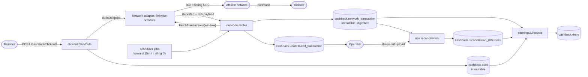
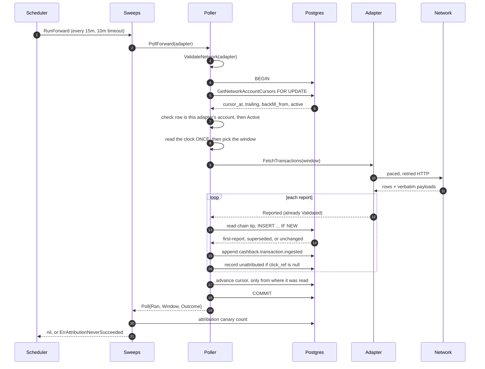
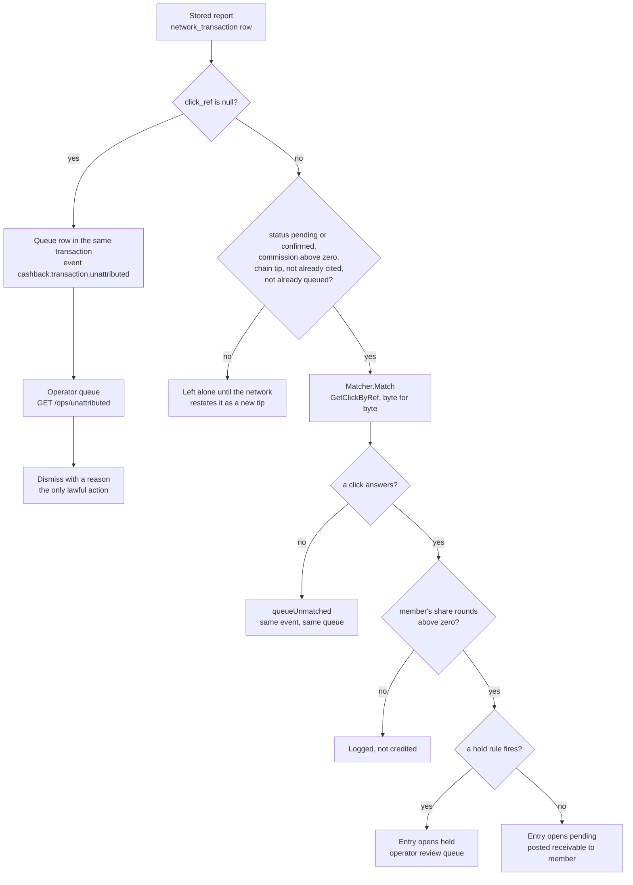

# Integration architecture — the affiliate networks

*How does an external party's account of what it owes become evidence Apivo can credit money from, and what absorbs each way that account can be wrong?*

**Status**: 2026-09-07 · `main @ 0461ad7`

---

## Contents

1. [Why this boundary is the risky one](#1-why-this-boundary-is-the-risky-one)
2. [The Network port](#2-the-network-port)
3. [The adapter matrix](#3-the-adapter-matrix)
4. [Conformance, and why no test touches a live network](#4-conformance-and-why-no-test-touches-a-live-network)
5. [Polling](#5-polling)
6. [Evidence](#6-evidence)
7. [Attribution](#7-attribution)
8. [The path outward — click-out and deeplinks](#8-the-path-outward--click-out-and-deeplinks)
9. [Reconciliation](#9-reconciliation)
10. [Failure modes and the mechanism that absorbs each](#10-failure-modes-and-the-mechanism-that-absorbs-each)
11. [Maturity at this boundary](#11-maturity-at-this-boundary)
12. [Open questions and known gaps](#12-open-questions-and-known-gaps)

---

## 1. Why this boundary is the risky one

Commission is the only revenue in the cashback product, and all of it arrives from third parties. An affiliate network decides what a purchase earned, whether it is validated, and whether it is later taken back. Apivo observes; it does not decide.

Three properties follow, and everything in this document is built from them.

**The network is the only source of a credit.** No HTTP route creates one. Polling is the sole credit-creating path, which is why there is no `POST /transactions` anywhere in [api/openapi.json](../../api/openapi.json) — 26 of the 44 operations are cashback operations, and none of them ingests a transaction.

**The network's answer changes over time.** Validation takes up to 90 days ([ADR-0003](../adr/0003-affiliate-network-integration.md)), so the same question asked twice legitimately gives two answers. That is not a fault to design around; it is the mechanism by which `pending` ever becomes `confirmed`.

**A silent failure here is indistinguishable from a quiet week.** A click reference placed in a parameter the network does not read produces working redirects, real purchases, stored reports and no credits at all. Nothing goes red. Several of the mechanisms below exist only to make that state say something.



Sources for the diagram: [internal/cashback/clickout/clickout.go](../../internal/cashback/clickout/clickout.go), [internal/cashback/networks/poller.go](../../internal/cashback/networks/poller.go), [internal/cashback/networks/sweeps.go](../../internal/cashback/networks/sweeps.go), [internal/cashback/earnings/lifecycle.go](../../internal/cashback/earnings/lifecycle.go), [internal/cashback/ops/reconciliation.go](../../internal/cashback/ops/reconciliation.go).

---

## 2. The Network port

### 2.1 The interface

From [internal/cashback/networks/network.go](../../internal/cashback/networks/network.go), verbatim:

```go
type Network interface {
	ID() NetworkID
	Account() PublisherAccount
	BuildDeeplink(ctx context.Context, target DeeplinkTarget, ref IssuedClickRef) (string, error)
	FetchTransactions(ctx context.Context, window QueryWindow) (iter.Seq2[Reported, error], error)
	FetchCatalogue(ctx context.Context) (iter.Seq2[ReportedMerchant, error], error)
	Limits() Limits
}
```

Five abilities and one declaration. A member can be sent to a retailer, what the network reported can be read back, the catalogue can be read back, and the network says how it may be queried. Everything the cashback domain does with a network is assembled from those, once, identically over every adapter.

### 2.2 Why the consumer defines it

[ADR-0003](../adr/0003-affiliate-network-integration.md) makes this a decision rather than a habit. Networks differ in authentication, pagination, rate limits, window limits, status vocabulary, currency handling, deeplink construction and the name of the click-reference parameter. None of that is stable, and the founder's choice of networks was — and partly still is — an open business process.

So the interface states what the domain needs, never what any network offers. Adapters live one package deep under [internal/cashback/networks/](../../internal/cashback/networks), and nothing outside an adapter package knows a network's vocabulary. That rule is checked rather than asserted: [internal/arch/network_isolation_test.go](../../internal/arch/network_isolation_test.go) proves a vendor SDK is importable only by its own adapter package, that every adapter is reachable from the composition root, and — crucially — that the isolation rules actually fire.

Three deliberate absences shape the port.

- **No credential.** `PublisherAccount` carries an id, a network and the network's own publisher identifier, and nothing else. An adapter is *constructed* with what it needs to authenticate, from configuration; the port never carries it.
- **No database type.** No signature speaks one, the file imports no driver and no generated store, and a test refuses one. Contract rule 6 — adapters translate and nothing else — cannot be checked by construction, so the package withholds the means instead.
- **No retrieval facts.** When a read happened and which window it covered are Apivo's account of Apivo's own behaviour. They are supplied by the poller as a [`Retrieval`](../../internal/cashback/networks/retrieval.go), not by the adapter.

### 2.3 One adapter, one publisher account

`Account()` is the adapter's identity, not `ID()`. `cashback.network_account` is unique on `(network_id, external_publisher_id)` and each row carries its own cursors, so two accounts at one network are two independent walks. The poller keys its registry by `PublisherAccount.ID()`; keying by network id would give two adapters one map entry, and the second account would never be polled, its cursor null forever, with nothing raised.

`ValidateNetwork(n)` holds an adapter to what it says about itself — a valid id, a real account, that account held at this adapter's own network, and usable limits. It runs at wiring ([internal/cashback/networks/sweeps.go](../../internal/cashback/networks/sweeps.go)) **and again on every poll** ([internal/cashback/networks/poller.go](../../internal/cashback/networks/poller.go)). Unset `Limits` is the worst of the three failures it catches: a `MaxWindow` of zero makes every window empty, so a poll succeeds, stores nothing, moves no cursor, and repeats forever with no error anywhere.

### 2.4 The nine contract rules

Stated on the interface, specified in [specs/002-apivo-cashback-alpha/contracts/ports.md](../../specs/002-apivo-cashback-alpha/contracts/ports.md) section 2, and asserted by the shared suite in [internal/cashback/networks/conformance_test.go](../../internal/cashback/networks/conformance_test.go).

| # | Rule | What it prevents | Enforcement |
|---|---|---|---|
| 1 | Every `Reported` carries the verbatim payload fragment | A normalisation bug that cannot be re-derived once the network stops serving the window | `Reported.Validate`, `TestConformanceEveryValueCarriesItsRawPayload` |
| 2 | Status mapping is total; an unknown word is `ErrUnmappableStatus` | A default that withholds or releases a member's money silently | [status.go](../../internal/cashback/networks/status.go), `TestConformanceStatusMappingIsTotal` |
| 3 | Windows never exceed `Limits.MaxWindow`; requests are paced to `RequestsPerMinute` | A cursor advanced past a silently truncated answer | `Limits.ValidateWindow`, `TestConformanceAWindowWiderThanTheLimitIsRefused` |
| 4 | Iteration is resumable **from the window start**; a re-read is the same question, not the same answer | A memoised window that freezes every member's money at `pending` | `TestConformanceAnAbandonedWindowRunsAgainFromTheBeginning` |
| 5 | `BuildDeeplink` places the reference in the network's own parameter, or errors — never a partial URL | A redirect that works and is never credited | `ValidateDeeplinkInputs`, `TestConformanceADeeplinkCarriesTheReferenceBack` |
| 6 | Adapters never write to the database and never decide credits | A mis-translation that moves money on its own | The port withholds database types; `fixture/port_test.go` reads the package's own imports |
| 7 | Every yielded value has passed its own `Validate` | A window that fails at its last INSERT | `TestConformanceEveryYieldedValueHasPassedItsOwnValidate` |
| 8 | Iteration that ends early says so, via `AbandonedIteration` | A half-read window recorded as whole — and a catalogue import marking 4,600 live routes `left_network` | [iteration.go](../../internal/cashback/networks/iteration.go), `TestConformanceAnAbandonedReadSaysSo` |
| 9 | Failures are classified: unavailable, rate-limited, refused | Retrying a revoked credential forever, or giving up on a blip | [iteration.go](../../internal/cashback/networks/iteration.go), `TestConformanceAFailureSaysWhichKindItIs` |

Rule 8 is the one an adapter must not get wrong. A range-over-func that ends having yielded no error is the caller's *only* evidence that a window was read to the end, and that evidence is what a durable cursor advances on.

---

## 3. The adapter matrix

| Adapter | Package | Auth | API shape | Port coverage | Shipped |
|---|---|---|---|---|---|
| **fixture** | [networks/fixture](../../internal/cashback/networks/fixture) | none | recorded JSON files, embedded | complete | yes |
| **linkwise** | [networks/linkwise](../../internal/cashback/networks/linkwise) | HTTP Basic, two values | `GET https://affiliate.linkwi.se/api/1.1/*.html`, `format=json` | complete | yes |
| **awin** | [networks/awin](../../internal/cashback/networks/awin) | bearer token | `https://api.awin.com` | **partial — no `FetchTransactions`, no `Limits`** | **no** |

The shipped set is one map in [cmd/apivo/registry.go](../../cmd/apivo/registry.go), holding the driver's `Documented()` declaration and its constructor together. That map exists because two lists once disagreed: `connect-network --driver awin` seeded a `cashback.network` row the binary could not poll. A driver is now seedable and servable together or neither.

### 3.1 linkwise

The Greek network, and the only real one in the shipped set. Its file comments are unusually blunt about provenance, because Linkwise publishes no rate limit, no paging contract and no maximum query window — *its API documentation is the usage text a 400 returns*. Every number in [linkwise.go](../../internal/cashback/networks/linkwise/linkwise.go) was measured against the live API on 2026-09-04 and written down beside its measurement.

**The finding that shapes the adapter**: query cost tracks the *width of the date window*, not the size of the answer. The measured table, against windows that returned nothing at all, is 1 day 1.0 s, 7 days 2.1 s, 30 days 6.2 s, 92 days 11.8 s, 365 days 81–102 s — and a year once exceeded ninety seconds and returned nothing. Roughly 0.2 s per day of window over a fixed second of overhead. So the thing to ration is days of window per request, not requests per minute.

One caveat on that number, because it is the kind that gets copied. The file's own prose summarises the three-month case as twenty-five seconds while its measurement table records 11.8 s for 92 days. The table is the measurement and the figures above are taken from it; the prose sentence is unreconciled with it in the source and is worth settling at the next re-recording.

**No paging exists.** Nine paging parameters were each sent and each ignored; the response came back byte-identical every time. The date window is the only lever, which is why `maxWindow` is seven days — a latency budget, not a limit Linkwise imposes — and why a year of backfill is 52 bounded, individually committed slices rather than one 81-second request.

Quirks, each in its own file:

- **Transport** ([client.go](../../internal/cashback/networks/linkwise/client.go)). `format=json` travels on *every* request including ones expected to fail, because the same malformed request answers 400 with an HTML page without it and a structured `{code, name, description}` object with it — and that description is the API's only documentation. Dates are day-first (`31/12/2010`); month-first is a different window the API answers perfectly happily. `timezone=UTC` is sent although UTC is the documented default, so a revised default cannot shift every window seasonally at the seams. The credential is a username/password pair sent as HTTP Basic — Linkwise's own integrators put it in the URL; this does not.
- **Amounts** ([amounts.go](../../internal/cashback/networks/linkwise/amounts.go)). Money arrives as decimal strings. `float64(x) * 100` truncated is wrong on 573 of the 10,000 hundredths from 0.00 to 99.99 — the first is 0.29. Rounded, it is exact at retail sizes and stops being exact somewhere above 1e12 minor units, which is worse: it passes every test written at the scale of a shopping basket. So the string is read as a string — split at the point, pad, concatenate, parse once as an integer. No float is constructed at any step. A third decimal place is refused rather than rounded, because it means the two-decimal assumption is wrong for that programme and rounding would hide the evidence.
- **Currencies** ([currencies.go](../../internal/cashback/networks/linkwise/currencies.go)). **The transaction report carries no currency field at all.** The programme list carries one per programme, and across the 334 programmes the recorded account is joined to they are not all the same: 329 EUR, three PLN, two USD. A single declared currency would be right for 98.5 % of them and silently store zloty as euro. So the currency is a join, cached for an hour, keyed by programme id, with one immediate re-read on a miss (the obvious cause is a newly joined programme). An unknown programme is `ErrUnknownProgrammeCurrency` and never a fallback: a window that cannot be read is visible, a window read in the wrong currency is not.
- **Status** ([status.go](../../internal/cashback/networks/linkwise/status.go)). Three entries, not four: `pending`, `validated` → confirmed, `cancelled` → declined. Lookup is case-folded, because the filter spells it `validated` and the report answers `Validated`. `pending_validated` is deliberately unmapped — it is a *filter* value meaning "pending OR validated", not a state. And **Linkwise cannot distinguish a decline from a reversal**: one status field, one word for both. `StatusReversed` is therefore unreachable on this network, which is a property of the network rather than a hole in the table. Where the distinction survives is the supersede chain — a report arriving declined whose current stored row is confirmed is a reversal by definition — and that is knowledge the ingestion path has and an adapter deliberately does not.
- **Deeplinks** ([deeplink.go](../../internal/cashback/networks/linkwise/deeplink.go)). Five sub-id slots, `subid1`..`subid5`, established from both the usage text and Linkwise's own live click script. Assembled locally, never through `rest_deeplink.php`: a request costs a second at minimum here, and calling it would put that in front of the one action a member takes and make attribution depend on the network being reachable at the moment of the click. The adapter adds two refusals of its own — an unreadable slot, and a destination URL nested unescaped in the outer query.
- **Catalogue** ([catalogue.go](../../internal/cashback/networks/linkwise/catalogue.go)). Asks `joined=yes` and `status=all`. The second matters: the endpoint's default is `status=active`, under which a paused advertiser simply *vanishes* — and absence is how an import spells "left the network". The default would read every temporary pause as a departure.

One value in the adapter is honestly labelled a hypothesis. `clickRefParam = "subid1"` is **inferred, not verified**: the transaction report returns and searches on `subid1`, but Linkwise's creatives endpoint returns no tracking URL, so the click side could not be read from the API at all. It is stored on `cashback.network.click_ref_param` precisely so an operator can correct it without a release, and the adapter's own comment says it must be confirmed against one real tracking link before a member is ever sent through one. This is exactly the failure the attribution canary (§5.6) exists to catch.

### 3.2 awin

Awin was the reference network in [ADR-0003](../adr/0003-affiliate-network-integration.md) and remains the reference case for the limits vocabulary: 31 days maximum window, 20 API calls a minute, `clickref` as the click parameter, `pending → approved | declined` with validation up to 90 days.

What exists: [client.go](../../internal/cashback/networks/awin/client.go) (paced, retried transport), [catalogue.go](../../internal/cashback/networks/awin/catalogue.go), [deeplink.go](../../internal/cashback/networks/awin/deeplink.go), [documented.go](../../internal/cashback/networks/awin/documented.go). What does not: `FetchTransactions` and `Limits`. So `*awin.Client` does not satisfy `networks.Network`, and the compiler is what says so. Its absence from `shippedNetworks` is stated in [cmd/apivo/registry.go](../../cmd/apivo/registry.go) as the point rather than an oversight — it returns when it implements the port, deferred by founder decision of 2026-09-04.

Its deeplink builder is worth reading even so, for the one refusal Awin adds to the port's own. Awin's Link Builder emits two kinds of tracking link: a specific one with the publisher id substituted, and a general one carrying a literal `!!!id!!!` a partner is expected to replace by hand. The two are a paste apart. A general link redirects perfectly, the member buys, and the click is attributed to the publisher named by the string `!!!id!!!`, which is nobody. `refuseUnreplacedPlaceholder` refuses any template containing `!!!` at all — a half-typed placeholder is as wrong as a whole one.

### 3.3 fixture

Not a mock. [fixture/doc.go](../../internal/cashback/networks/fixture/doc.go) states the claim plainly: every one of the port's contract rules applies to it exactly as to a real network's package, and what differs is only where the bytes come from — a file instead of a socket, confined to [recording.go](../../internal/cashback/networks/fixture/recording.go).

What is recorded is one transaction across four successive polls — click, pending, approved, reversed — which is the whole lifecycle the ingestion chain exists to handle. The network reports the sale before joining it to a click reference, so the transaction first appears *unattributed* and gains its reference on the next poll. A second transaction shares the window, is never attributed at all, is re-reported once completely unchanged, then changes its status and both amounts at once.

Everything else is deliberate awkwardness: transactions of one window arrive on different pages, the last page of the final observation is empty as a real network's usually is, the two transactions are in different currencies, one merchant is bound to no country, and a status word nobody mapped is reachable through `WithUnmappableStatus`.

**The clock is polls, not wall time.** Which observation a read returns is the fixture's own state, advanced by each read that runs to completion. Wall time would be useless — a network takes up to 90 days to validate — and the advance is on completion, never on the call, so a caller that breaks out of the range gets the same observation again. That is contract rule 4 implemented rather than asserted.

One limit the fixture states about itself: its recordings carry amounts as integer minor units beside an explicit currency, not as the decimal strings a real network sends. C-6 admits no decimal, the repository ships no decimal parser, and a fixture that invented one would be where a rounding error entered a product built to have none. An adapter for a network that really sends `"49.99"` owns that problem in its own package — which is exactly what linkwise's `amounts.go` is.

---

## 4. Conformance, and why no test touches a live network

`Network` is a contract, not an interface shape. A suite written per adapter cannot show that a caller need not know which adapter it was handed: each author reads the same prose and reaches their own reading, and the readings only have to differ a little for the poller to be right over one network and wrong over another — where "wrong" means a member's money.

So [conformance_test.go](../../internal/cashback/networks/conformance_test.go) asserts the contract once and runs it against every adapter that implements the port, through a table. Today that table holds two entries, fixture and linkwise; awin is absent from it for the same reason it is absent from the shipped set, which is that `*awin.Client` is not a `Network`. A scenario is written against the *port*: it may not name a network's vocabulary, know its pagination, or assume which transactions its recording holds. Everything adapter-specific reaches a scenario through five capabilities on the table entry — open a fresh adapter, name a window with data in it, name a deeplink target, make the network report a word nobody mapped, and make it unwell in a named way. Only the first is required; every other one is optional, and nil means "cannot". A capability an adapter cannot offer is a **skip reported per adapter and per scenario**, never a softened assertion, so a run that exercised one capability cannot read as a run that exercised them all.

Seventeen scenarios run today, including identity, verbatim payloads, payload ownership, status totality, window refusal before any I/O, deeplink round-trip, abandonment mid-window and mid-catalogue, resumption from the window start, a caller stopping without it being a failure, failure classification, and rate adherence under concurrency.

Linkwise's entry is [conformance_linkwise_test.go](../../internal/cashback/networks/conformance_linkwise_test.go), and the way it is driven is the answer to "why not a live account". The adapter is pointed at a local TLS server answering the recordings in [linkwise/testdata](../../internal/cashback/networks/linkwise/testdata) — **that server is the knob**. A real adapter has a transport to lie to, so "a network that is rate limited" and "a network that reports a word nobody mapped" are both just a different response to the same request. Nothing test-only was added to the adapter to make the suite run.

The recordings are evidence, and [linkwise/recording_test.go](../../internal/cashback/networks/linkwise/recording_test.go) is explicit about what they are evidence *for*. They were captured from the live API against a real publisher account on 2026-09-04, with credentials that have since expired. Linkwise publishes no schema, so these files *are* the schema, and every assertion about them is about **structure** — field names, nesting, types — not values. Pinning `commission is 2.93` would break on the next re-recording and teach nothing. The one exception is `subid1`, asserted by name because its presence is the finding the whole Linkwise plan turned on: if the network did not echo a publisher-supplied reference back on a transaction, this adapter would not exist.

The fixture's own recordings are files rather than Go literals for the same reason, and `TestRecordedPayloadsAreVerbatimFileBytes` reads them off disk and finds each payload inside them — a test worth writing only because the two can differ.

Consequences worth stating plainly. The suite is evidence about the *port* and about each adapter's translation of recorded bytes. It is not evidence that Linkwise still answers the way it did on 2026-09-04. Nothing in CI would notice a renamed field, which is why the base URL pins `/api/1.1` and why re-recording is the stated prerequisite for adding a requested field.

---

## 5. Polling

### 5.1 Two cursors, one account

Both live on `cashback.network_account` and both belong to the *account*, never to the network.

| Cursor | Job | Cadence | Advanced |
|---|---|---|---|
| `cursor_at` | forward sweep | `ForwardInterval = 15m` | only after the whole window is persisted (FR-031) |
| `trailing_cursor_at` | trailing re-read | `TrailingInterval = 6h`, at `DefaultTrailingLag = 100 days` behind | same, and constrained by the schema to stay behind `cursor_at` |
| `backfill_from` | — | — | set once by the operator; migration [0023](../../internal/platform/db/migrations/0023_network_account_backfill_from.up.sql) keeps it behind the cursor |

Job names are built from the *account*: `ForwardJobName` is `network-poll:<network>:<externalID>` and `TrailingJobName` likewise ([sweeps.go](../../internal/cashback/networks/sweeps.go)). Two accounts at one network are two walks over two cursor pairs, and one lock name between them would make each wait for the other for nothing.

The trailing sweep walks *forward* and never wraps. A sweep cycling over a fixed trailing span would re-read recent windows repeatedly while older ones aged out of it unseen; walking forward re-reads every period exactly once, at the right remove, and needs no state beyond the cursor the schema already carries.

### 5.2 The window arithmetic

Pure functions in [poll.go](../../internal/cashback/networks/poll.go), tested on their own in `poll_internal_test.go`.

`QueryWindow` is half-open — `From <= t < To` — which is what lets adjacent windows partition a backfill with nothing counted twice and nothing lost in a seam. Both bounds are required, unlike the wallet's `Window` whose zero values mean the opposite; the two types are one import line apart and the name difference is deliberate.

`nextForwardWindow` ends at a **horizon of `now - reportingLag`**, never at now. A network that is behind answers cleanly and emptily for ground it has not reached, and the cursor would advance past it — after which only the trailing sweep revisits it, roughly a hundred days later. Nothing is lost; a member waits a quarter for a credit earned today, and no error stream shows it. That is SC-001 broken in the one way nothing goes red for.

The lag is modelled as a column rather than a constant: `cashback.network.reporting_lag_minutes`, migration [0033](../../internal/platform/db/migrations/0033_network_reporting_lag_minutes.up.sql). Minutes, for the reason [0026](../../internal/platform/db/migrations/0026_network_rate_limit_per_minute.up.sql) moved the rate to per-minute — it is the unit that can express the truth. Days would round a two-hour lag to zero or to a whole day, and both are wrong in the direction that costs money. Default 0, and zero is the *ordinary* value here; negative is refused, because a network cannot report the future.

**The column is not yet what the poller reads.** `linkwise.Limits()` returns the package's own constants, `reportingLag` among them, and nothing in the composition root converts a seeded row back into `Limits`. So the column is today the value `connect-network` writes and the value an operator can edit, not the value the running poller applies. §12 states the same gap for the rate limit, which has the identical shape.

### 5.3 One poll is one transaction



Every non-committing path leaves the account exactly as it was found: nothing to read, a network that failed, a cursor somebody else moved. A crash re-reads at most one window and never skips one, and the re-read is safe because an unchanged report is recognised as one already stored.

Two ordering details are load-bearing. The row is checked against the adapter's account **before** `Active`, because "that account is switched off" is a misleading thing to say about a row that is not the account at all. And the clock is read **once** per poll, so the window's end and every row's `retrieved_at` agree; two readings would put rows outside the window they were read for.

Exclusion across a fleet is the `FOR UPDATE` cursor read, not the scheduler interval. A second poller waits, then reads the cursor where the first left it and takes the *next* window. The conditional advance (`ErrCursorMoved`) covers what remains: a write that took no lock, such as an operator moving a cursor by hand.

### 5.4 Rate limiting

Rate is modelled on the row, `cashback.network.rate_limit_per_minute`, so that a revised limit is configuration and a restart rather than a release. Migration [0026](../../internal/platform/db/migrations/0026_network_rate_limit_per_minute.up.sql) renamed the column from `_per_second` and multiplied by 60, because Awin's published 20-a-minute *cannot be expressed* in a positive per-second integer — the smallest storable value was three times too fast, in a row that looked correct.

**That intent is not yet wired.** Both real clients offer `WithRateLimitPerMinute`, and [cmd/apivo/registry.go](../../cmd/apivo/registry.go) calls neither — linkwise is constructed with its credential alone and paces itself to the package constant `requestsPerMinute = 20`. Editing the column today changes what a new `connect-network` would seed, not what the poller does. §12 carries this as an open gap.

[ratelimiter.go](../../internal/cashback/networks/ratelimiter.go) is a token bucket over an injectable `RateLimitClock`, with `Wait`, `Pace`, and two accessors — `Rate()` and `Burst()` — that exist so contract rule 3 is checkable from outside an adapter. That is not decoration: the per-minute-to-per-second division is where a unit bug would hide, and the conformance suite compares what the limiter is holding to against what the port declares. Reservations are restored when the context dies, so a cancelled call does not spend a token. Every bound is applied before the conversion that could overflow, because a float-to-int overflow lands on `math.MinInt64` on amd64 — a negative wait that grants the request immediately, the exact inversion of the rule.

The poller does **not** pace. The port puts pacing on the adapter, and a poller that paced as well would hold every adapter to a rate its network never documented.

### 5.5 Backoff and classification

[retryable.go](../../internal/cashback/networks/retryable.go) is the vocabulary: `RetryableError` carries the cause and the wait the network asked for, built only through `NewRetryableError` so it cannot be half-built; `RetryableHTTPStatus` and `RetryAfterFromHeader` make the ordinary HTTP case one line rather than a judgement re-made per adapter. Classification is the adapter's, because only an adapter knows what its network's 503 looks like.

[backoff.go](../../internal/cashback/networks/backoff.go) is full jitter — `random × min(cap, base × 2^n)` — chosen over decorrelated jitter because the failure being defended against is a herd of pollers that failed at the same moment coming back at the same moment. Defaults: base 500 ms, cap 30 s, five attempts, five minutes elapsed. A `Retry-After` the network sent is honoured as a floor with jitter on top, never as a replacement.

The composition matters and is documented at the call site: the limiter goes **inside** the attempt, because a limiter outside would spend a single token on an entire retry sequence.

The three classes decide different things. `ErrNetworkUnavailable` and `ErrNetworkRateLimited` mean run the window again — correct, because rule 4 offers no resumption point inside one. `ErrNetworkRefused` is terminal until a human changes a credential, and re-running it is an infinite loop with a frozen cursor.

### 5.6 The attribution canary

The one check that can tell a misconfigured click side from a slow week ([canary.go](../../internal/cashback/networks/canary.go)).

A network's click side can be wrong in two ways that look identical from outside: the tracking URL carries the reference in a parameter the network does not read, so every transaction comes back with none; or the parameter truncates it, so every transaction comes back with a reference matching no click. Either way every redirect works, every member reaches the shop, every purchase is reported and stored, and nobody is credited a cent. The reports go to the unattributed queue, so the failure is visible to an operator who looks — but nothing says *look*, and a queue that grows by three rows in a product's first week reads like a product in its first week.

While a network has never once credited a click, the canary counts distinct transactions that went unattributed since Apivo's first click through it. At `AttributionCanaryThreshold = 3` it refuses, every forward sweep, until somebody fixes the parameter or the first credit lands. Three, with the arithmetic stated: one stray transaction is ordinary, but three in a row with none attributed is one chance in eight even at a one-in-two attribution rate, and one in a thousand at the nine-in-ten a working network shows.

Four properties of the design are worth naming.

- It **retires for good** after the first attributed transaction. The reference has round-tripped; how many *later* transactions go unattributed is a different question with a different owner.
- It rides the forward sweep rather than being a job of its own, because the sweep is the moment new evidence arrives and therefore the only moment the answer can change.
- It refuses the **run**, not the poll. The cursor has advanced and the reports are stored, and the error says so — an operator reading "job failed" must not conclude the network was not read.
- A count that could not be taken is reported as a failure *of the canary*, never as a clean bill.

Its refusal message names the remedy: check `cashback.network.click_ref_param` and the maximum length of that parameter. Given that linkwise's `subid1` is explicitly inferred rather than verified, this check is currently the deployment's main defence on that value.

---

## 6. Evidence

### 6.1 What is captured

One row of `cashback.network_transaction` per stored report ([migration 0012](../../internal/platform/db/migrations/0012_cashback_clicks_evidence.up.sql)), assembled in [evidence.go](../../internal/cashback/networks/evidence.go) from two halves.

What the **network** said, carried in [`Reported`](../../internal/cashback/networks/reported.go): `external_id`, `click_ref` (nullable, never blank), `status_raw` beside normalised `status`, `sale_amount_minor`, `commission_minor`, one `currency` for both, `transacted_at`, and `raw_payload`.

What **Apivo** knows, carried in [`Retrieval`](../../internal/cashback/networks/retrieval.go): `network_account_id`, `retrieved_at`, and `query_window_start`/`query_window_end`.

The split is the port's design, not a coincidence of the schema. An adapter reporting the moment of a read would be reporting on the poller rather than on the network; and `retrieved_at` is stated rather than left to a column default so every row of one window carries one instant.

`Reported.Validate` is called by the adapter (rule 7) and **again** by the writer, and the doc comment says why: the row is immutable, a bad one cannot be corrected, and the last gate before permanence is worth paying for twice. Payload validation is stricter than `json.Valid` because `json.Valid` and `jsonb` disagree on two classes of bytes affiliate payloads produce routinely — a mis-encoded merchant name that is not UTF-8, and a `\u0000` or lone-surrogate escape. Both pass in Go and fail at the INSERT, which is exactly the batch-fails-at-its-last-row outcome the check moves earlier. A payload of `null`, `{}`, `[]` or a bare scalar is refused too: `jsonb` would take all of them, and the column would then hold something satisfying "a payload is present" while carrying nothing a fix could be re-derived from.

The raw payload is why this matters. When normalisation is later found wrong, the fix re-derives from stored payloads; nothing is re-fetched, because the network may no longer serve that window. Linkwise's report asks for more fields than the adapter reads for precisely this reason — `subid2`, `subid3`, payout categories, payment status are in the answer so they are in the payload.

### 6.2 The digest

`content_digest` is computed **by the database**, in `cashback.network_transaction_guard()`:

```
sha256( click_ref ∥ status_raw ∥ status ∥ sale ∥ commission ∥ currency ∥ transacted_at )
```

separated by `chr(31)`, with a null click reference folded to the empty string. A caller-supplied value is discarded — the caller is not the authority on it. `sha256()` is used as a `pg_catalog` builtin in preference to pgcrypto's `digest()`, because this body is resolved at call time and the extension does not live in the same schema on every deployment.

Nothing in Go recomputes it, and [digest.go](../../internal/cashback/networks/digest.go) says why: a second implementation of the formula is the place the two would eventually disagree, and the disagreement would show up as either a duplicate credit or a status change nobody noticed.

**The payload is deliberately not in the digest.** Networks stamp response timestamps and pagination metadata into a payload, so a trailing re-read returns the same transactions inside different bytes every time. A digest that saw the payload would call every one of those a change.

Three schema rules turn the digest into behaviour:

| Constraint | Effect |
|---|---|
| `network_transaction_unique_report unique (network_id, external_id, content_digest)` | An identical re-report is a no-op |
| `network_transaction_superseded_once unique (supersedes_id)` | One successor per row; the loser of a race re-reads rather than forking history |
| `network_transaction_one_root` (partial unique on `(network_id, external_id) where supersedes_id is null`) | Exactly one root per transaction |

Plus `network_transaction_not_own_predecessor`, a same-transaction/same-network guard on any superseding row, and `network_transaction_immutable` / `_no_truncate`.

### 6.3 Supersede

[supersede.go](../../internal/cashback/networks/supersede.go). One read and one write, and the decision is the database's both times: the read finds the chain tip (derived, because an immutable table cannot mark a row superseded), the write offers the report with that tip as predecessor, and the unique constraint over the digest decides whether it is a change.

| Outcome | Meaning | Written | Announced |
|---|---|---|---|
| `first-report` | the network had never reported this transaction | root row | yes |
| `superseded` | the facts changed | new row naming the old, which is untouched | yes |
| `unchanged` | the same facts again | nothing | no |

`unchanged` is most of every trailing re-read, and it is what keeps a quiet period from republishing the same fact four times a day forever. Nothing compares two reports field by field in Go; what Go decides is only which row to name as predecessor.

A concurrent poller that superseded the same tip first gets `ErrSupersededConcurrently`, distinguished from `ErrEvidenceNotWritten` by reading the *constraint name* rather than the SQLSTATE — three different rules on this table refuse with 23505 and they mean different things.

### 6.4 What is still missing, and where it is written down

[specs/005-provable-evidence/spec.md](../../specs/005-provable-evidence/spec.md) is the honest audit of this design, and it names five gaps. The two most relevant here: **each digest fingerprints one row and nothing links row *N* to row *N−1***, so a run of rows deleted and replaced with a consistent alternative history still verifies row by row; and **the immutability triggers bind the application's role, not a superuser, a `disable trigger`, or a restore from a doctored dump**. The spec is Draft, gated on founder questions Q14–Q16 and queued behind the local demo. Nothing of it is built.

---

## 7. Attribution

### 7.1 The join

A click reference minted by Apivo goes out in the network's own parameter and comes back on a transaction. The join is exact:

```sql
select ... from cashback.click where click_ref = @click_ref
```

[clickout/queries/click.sql](../../internal/cashback/clickout/queries/click.sql) states the discipline in its own comment: **no trimming, no case folding, no unescaping**. Every one of those would widen the set of network strings that resolve to a member's click, and the reference is the only thing standing between one member's purchase and another's credit.

The type system carries the same distinction. [clickref.go](../../internal/cashback/networks/clickref.go) defines two types that never mix:

- `IssuedClickRef` — what **Apivo minted**. At least 22 URL-safe characters, mirroring `click_ref_url_safe_and_long_enough`, built only through `NewIssuedClickRef`, and required to exist before the redirect.
- `ClickRef` — what a **network echoed**. Arbitrary text, legitimately absent, constrained only not to be blank. Absence is a first-class state, not an empty string, because the digest folds null to `''` and `click_ref is not null` counts a blank as attribution present.

One type for both would compile the confusion: reconciliation code holding a `Reported` could re-issue a redirect with the reference the *network* echoed, and the member would buy and never be credited. Both types carry explicit `MarshalJSON`/`UnmarshalJSON`, because the unexported fields mean an attributed report would otherwise marshal to `{}` and unmarshal back as a perfectly valid *unattributed* one — no error anywhere.

Minting is [clickout/mint.go](../../internal/cashback/clickout/mint.go): 16 bytes of `crypto/rand`, base64url without padding, which is 22 characters — the 128 bits FR-020 specifies and the length the schema checks, the same fact seen twice. `io.ReadFull`, so a short read is a failure rather than a shorter and weaker reference. The result goes back through `NewIssuedClickRef` rather than being wrapped directly, so a broken encoding fails at minting rather than after the member has been redirected.

### 7.2 The decision



The awaiting-credit predicate is [earnings/queries/lifecycle.sql](../../internal/cashback/earnings/queries/lifecycle.sql): a report carries a reference, the network still intends to pay it, commission is above zero, nothing supersedes it, no entry cites any row of that transaction, and it is not in the unattributed queue — **open or closed**. Closed matters: a report an operator dismissed is decided, and re-matching it every pass would re-ask a question a human already answered.

A miss is ordinary, not exceptional. Networks echo references minted by other publishers and by links predating a deployment, so `Matcher.Match` reports it as a value rather than an error, precisely so a caller processing a window cannot mistake it for a failure and stop. The queue write happens inside `Match` rather than being left to the caller because the two are one decision: a caller that resolved a reference, found nothing and forgot the second call would leave money in no queue at all, and nothing downstream would notice.

A read that **failed** is not a read that found nothing. `Match` returns the error rather than queueing, because queueing would turn a dropped connection into a permanent record — one migration 0013 freezes and nothing later re-examines.

The database is the backstop: trigger `entry_evidence_guard` (migration [0013](../../internal/platform/db/migrations/0013_cashback_earnings.up.sql)) refuses an entry that does not cite the click the network named, or cites a different one. That is C-2 held in the schema rather than in the matcher.

### 7.3 The unattributed queue

Two different kinds of thing, and keeping them apart is the whole design ([unattributed.go](../../internal/cashback/networks/unattributed.go)).

**What was seen** is written once and never edited. `cashback.unattributed_transaction` records that *this report* went unattributed at *this instant*. Migration 0013 freezes both; migration [0024](../../internal/platform/db/migrations/0024_unattributed_queue_guards.up.sql) closes the two holes that were left: the row can no longer be deleted or the table truncated, and a recorded resolution can no longer be un-written by setting `resolved_by`, `resolved_reason` and `resolved_at` back to null. A mistaken dismissal is corrected by appending to `domain_event`, where every operator action already goes.

**Whether it is still work** is a property of the transaction *now*, and is asked at read time. A later report carrying a reference does not make the earlier observation false, any more than a reversal makes a confirmation false. So a row is open only while the report it names is still the chain tip, nobody has resolved it, and nothing has been credited against it.

The write shares the poll's transaction, and must. A report stored without its observation would never be re-examined, because the digest makes every later identical re-report `unchanged` and writes nothing — a permanent, silent hole, in exactly the money nobody can be credited for.

Two writers reach this queue, from opposite sides. The poller writes when the *stored column* is null — the predicate is the statement's, never the caller's, because the same column `entry_evidence_guard` later reads is the authority on what the network said. The earnings matcher writes when a reference matched no click. The SQL comment is explicit that the poller deliberately does not ask about clicks: matching is the attribution step and belongs to another module.

An operator reads the queue at `GET /api/v1/cashback/ops/unattributed` and may do exactly one thing to a row: **dismiss it with a reason** ([ops/dismiss.go](../../internal/cashback/ops/dismiss.go)). `OpenByID` re-asks the open question inside the operator's own transaction before acting, so a page rendered before the last poll cannot become a second credit. `OpenReport.Attributable` is carried on the wire and is false where the network named a reference matching no click — there the evidence guard refuses an entry citing no click and there is no click to cite, so dismissal is the only lawful outcome.

**There is no attribute-by-hand endpoint.** `POST /ops/unattributed/{id}/attribute` is called by [web/src/lib/cashback/api.ts](../../web/src/lib/cashback/api.ts) and served by nothing: [ops/handler.go](../../internal/cashback/ops/handler.go) lists 13 routes and that is not one of them. Unattributed money can currently be closed, never rescued.

---

## 8. The path outward — click-out and deeplinks

### 8.1 The order inside `Issue`

[clickout/clickout.go](../../internal/cashback/clickout/clickout.go), and the order is the whole function.

1. **The rate rule**, before the catalogue is read and long before anything is minted. It is the cheapest refusal, it protects every step after it, and a member who meets it is left exactly as they were.
2. **One clock reading**, against which liveness, the snapshotted band and the click all decide. Three readings can straddle a band's edge and snapshot a rate the member was never shown.
3. `LiveOffer` — an offer outside its validity window or on a dead route is refused.
4. **Mint**, because `ValidateDeeplinkInputs` refuses to build a redirect without a reference. FR-020's ordering, checked rather than remembered.
5. **Build the redirect**, *before* the click is recorded. That makes "nothing is recorded when the deeplink fails" true by construction rather than by a rollback somebody has to get right, and it keeps an adapter call out of the middle of a database transaction.
6. **Record the click**, with the band and share snapshotted whole — this, and not the offer as it stands when the money is finally paid, governs the credit (FR-013).

The one ordering deliberately not taken is record-then-build. It would satisfy FR-020 too, and it would leave a click row behind every time a template was wrong — rows matching nothing, in the very table the unattributed queue is measured against.

### 8.2 Building the URL

The port supplies the shared half ([deeplink.go](../../internal/cashback/networks/deeplink.go)). `DeeplinkTarget` carries four facts and deliberately not the catalogue's `Offer`: an `Offer` would drag the Postgres driver and generated store into every adapter's dependency graph, and an adapter that can read `MemberShare` can log it or append it to a subid "to help reconciliation" — and rule 6 says an adapter decides nothing about the rate. What it cannot see, it cannot decide from.

`ValidateDeeplinkInputs` refuses five things before a character of URL exists: an adapter with no usable id, a target published on another network, a template that is not an absolute http/https URL (the column only requires non-blank, the value is operator-edited, and the result goes straight into a `Location` header), a target with no click-reference parameter, and a reference that was never minted.

Every refusal wraps `ErrDeeplinkNotFormed`. Refusals that are *deterministic* also wrap `ErrDeeplinkInputsRefused`, and that second sentinel is not decoration: without it the click-out handler answers 502 and pages the on-call towards a network that is working perfectly, when the defect is one line in a handler or one row an operator has to fix.

`AppendClickRef` keeps two rules an adapter would get wrong silently. The template's own query is carried through **byte for byte** rather than re-encoded, because `url.Values.Encode` reorders parameters and normalises escaping — a change to data some networks are famously fussy about, made to a value an operator was told would pass through. And a template already carrying the click-reference parameter is **refused** rather than given a second one, because which of two same-named parameters a network reads is its own business, and that choice would decide whether a member is credited.

Both real builders assemble locally rather than calling the network's link builder, for the same two reasons in different proportions: Awin's is rationed behind its own quota endpoint and would cap the product at twenty click-outs a minute across all members; Linkwise's costs a second at minimum and would make attribution depend on the network being reachable at the moment of the click.

The redirect side of the wiring is narrower than the port on purpose. `clickout.Redirector` asks only for `ID()` and `BuildDeeplink` ([clickout/deeplinks.go](../../internal/cashback/clickout/deeplinks.go)) — the polling half has nothing to do with issuing a redirect. The map is fixed at construction, so two requests for one offer cannot take different adapters, and two adapters claiming one network is a wiring error rather than last-one-wins.

### 8.3 The click rule

[clickrule.go](../../internal/cashback/clickout/clickrule.go): two numbers and one window. The window is a package constant rather than a knob, because two numbers and one window is a rule somebody can hold in their head.

`PerMember` is always applied — the account id is the caller's own identity, so that half is always keyed on the right thing. `PerContext` is **off by default**, and the reasoning is worth repeating: a digest built from the address the API sees is the *proxy's* address when the API sits behind one, so every member shares one context and a per-context limit would throttle the whole site the moment any one member clicked briskly. The composition root turns it on only where the deployment names a header it trusts (`CLICK_CONTEXT_HEADER`).

A refusal is `TooManyClicks`, carrying which half fired and when it lifts, answered as HTTP 429 with `Retry-After` rounded **up** and never zero — a `Retry-After` of nothing tells a client to try again immediately.

---

## 9. Reconciliation

A statement is the counterparty's account of what it **paid**. The reports are its intention to pay. FR-043 turns on that difference: nothing confirms until a statement has accounted for it *and* no unresolved difference disagrees about it ([earnings/confirm.go](../../internal/cashback/earnings/confirm.go)).

### 9.1 The run

`POST /api/v1/cashback/ops/reconciliation/runs` imports a statement as an immutable run ([ops/statement.go](../../internal/cashback/ops/statement.go), [ops/reconciliation.go](../../internal/cashback/ops/reconciliation.go)). The document is stored verbatim, and the lines are read *from* it, in the shape `{"lines": [{"transaction_id": ..., "paid": {"minor": ..., "currency": ...}}]}`. Any other member is kept and ignored — a network's statement carries totals this module has no opinion about, and stripping them would store less than was supplied.

Because the run cannot be corrected, the file is mostly refusal: every line is checked before anything reaches the database. And because an operator retrying an upload that timed out after the commit would otherwise get two runs — two queues, one report needing two resolutions — migration [0028](../../internal/platform/db/migrations/0028_reconciliation_statement_once.up.sql) adds a database-computed `statement_digest` and `reconciliation_run_statement_once unique (network_account_id, period_start, period_end, statement_digest)`. `jsonb`'s text form is canonical, so two uploads differing only in formatting hash the same and two differing in one amount do not.

### 9.2 Difference identity and verdict

`Derive(lines, reports, period)` is pure ([ops/differences.go](../../internal/cashback/ops/differences.go)), so detection is repeatable by construction and re-runnable without doubling the queue. The comparison is in Go rather than SQL so the lines are read by exactly the code that read them at import.

| Kind | Shape enforced by `reconciliation_difference_shape_matches_kind` |
|---|---|
| `reported_not_paid` | names a report, `expected_minor` set, `actual_minor` null |
| `paid_not_reported` | names a statement line, `actual_minor` set, `expected_minor` null |
| `amount_mismatch` | names a report, both amounts set and different |

Migration [0029](../../internal/platform/db/migrations/0029_reconciliation_difference_identity.up.sql) added `statement_transaction_id` because a `paid_not_reported` difference previously named nothing: *"250 EUR, paid, not reported"* is exact and useless, and two such lines for the same amount were the same row twice. Its two partial unique indexes — one per `(run, report)`, one per `(run, line)` — are what let detection be re-run: a repeat inserts what is new and skips what is there, resolved or not.

Migration [0030](../../internal/platform/db/migrations/0030_reconciliation_difference_verdict.up.sql) added the verdict. Two values, and both lift the difference from the confirmation gate: `explained` (another fact accounts for it — a later statement paid it, the network restated the report) and `absorbed` (the delta is the business's to bear or keep, and the member's figure stands). What is deliberately **not** a verdict is "the network owes us and we are chasing it" — an open difference *is* the chase, and it keeps the gate shut until the money arrives. Resolving early would confirm a member's balance out of money never received. All four resolution columns are set together or none.

One consequence of the linkwise status gap (§3.1) is benign here: a reversal arriving as a decline still answers "the network owes nothing", which is what `CurrentReport.owed` compares, so reconciliation is unaffected.

---

## 10. Failure modes and the mechanism that absorbs each

| The network… | What happens | What absorbs it |
|---|---|---|
| **is down** | the adapter yields `ErrNetworkUnavailable`; the poll's transaction rolls back whole and the cursor stays | [backoff.go](../../internal/cashback/networks/backoff.go) full jitter inside the attempt; the next tick re-reads the same window. At most one window re-fetched, never one skipped (FR-031) |
| **is slow** | `sweepTimeout = 10m` cuts the run; a single request is bounded separately (30 s in both real clients) so one hung connection cannot eat the retry budget | The run's context ends, the transaction rolls back, the next tick reads the same window. Linkwise's seven-day `maxWindow` exists to keep a request inside seconds rather than minutes |
| **is behind** (reports late) | the forward window would end at now and cover ground nobody has reported | `Limits.ReportingLag` stops the window at `now - lag`, so the cursor never passes unreported ground. The value comes from the adapter's own constants today; `network.reporting_lag_minutes` ([0033](../../internal/platform/db/migrations/0033_network_reporting_lag_minutes.up.sql)) is seeded but not read back (§5.2) — and Linkwise's constant is zero, so on the one connected network this defence is currently inert |
| **rate limits us** | `ErrNetworkRateLimited`, distinct from unavailable — it says the pacing was wrong, not that anything is broken | The token bucket paces to the adapter's declared rate — the package constant, not yet `rate_limit_per_minute` (§5.4); `Retry-After` is honoured as a floor with jitter on top |
| **refuses us** (revoked credential) | `ErrNetworkRefused`, terminal | The poller stops, leaves the cursor where it is and raises the account rather than looping forever. This class exists so a dead credential does not read as a network having a bad day |
| **reports the same thing twice** | the digest matches a row already in the chain | `network_transaction_unique_report`; the insert writes nothing, `OutcomeUnchanged`, no event. This is most of every trailing re-read |
| **revises a transaction** | facts differ, so the digest differs | A **new row** names the old one; `network_transaction_superseded_once` allows one successor and `network_transaction_one_root` allows one root. The old row is untouched and stays readable |
| **reverses after confirming** | a new tip arrives as `declined` or `reversed` | `earnings.Reversals.Reverse` writes a **new entry born reversed** citing the superseding report; nothing edits the original. If the money was already paid out, it is a house loss, not a clawback from the member |
| **reports an unknown click reference** | `GetClickByRef` finds nothing | Queued as unattributed with an event; an operator may dismiss it. If it is the *first* transactions at a network and none has ever matched, the canary refuses the run at three |
| **reports no click reference** | `click_ref is null` in the stored row | The poller's own queue write, inside the poll's transaction; the earnings scan skips the report because it is queued |
| **invents a status word** | `ErrUnmappableStatus` from the adapter's map, never a default | The report is refused at translation and the window fails visibly. Rule 2: the two available guesses — withhold or pay — are each wrong in a way nobody would notice |
| **changes a currency** | a transaction naming a programme whose currency the list does not carry | `ErrUnknownProgrammeCurrency`, never a fallback. A report whose sale and commission carry different currencies is refused by `Reported.Validate`, because the evidence row stores one currency column for both |
| **truncates iteration** (deadline, cancelled context) | one final pair carrying `AbandonedIteration` | The cursor does not advance; a catalogue import may not mark absentees `left_network`. Without it, a poller interrupted at report 400 of 900 records the window as read |
| **answers a wider window than asked** | — | `Limits.ValidateWindow` refuses a too-wide window before any I/O, and refuses rather than clamps: a caller silently given 31 of the 90 days it asked for advances its cursor past 59 it never saw |
| **echoes the reference into a parameter it never reads** | every redirect works, nothing is ever credited | The attribution canary, and only the canary. This is the failure with no other signal |

---

## 11. Maturity at this boundary

| Thing | State |
|---|---|
| The `Network` port and its nine rules | Built, and asserted by a shared suite over every adapter |
| Poller, two cursors, window arithmetic, reporting lag | Built and integration-tested ([poller_integration_test.go](../../internal/cashback/networks/poller_integration_test.go), [ingest_integration_test.go](../../internal/cashback/networks/ingest_integration_test.go)). The lag arithmetic is built; the lag *value* still comes from the adapter's constants rather than the network row (§5.2) |
| Evidence capture, database-computed digest, supersede chain | Built, and enforced by the schema rather than by the poller |
| Unattributed detection and queue guards | Built; the operator can dismiss, not attribute |
| Rate limiter, backoff, retry classification, canary | Built and unit-tested |
| linkwise adapter | Complete against the port, driven by recordings from one live capture on 2026-09-04 |
| fixture adapter | Complete; the local default |
| awin adapter | **Partial** — no `FetchTransactions`, no `Limits`; not a shipped driver |
| Reconciliation import, derivation, resolution | Built; the run listing endpoint the frontend calls is not served |
| The ingested/unattributed events | Written to the outbox, and **consumed by nothing** — no dispatcher is registered in [cmd/apivo/main.go](../../cmd/apivo/main.go) |
| Chained evidence, external witnessing, member-checkable receipts | Specified only ([spec 005](../../specs/005-provable-evidence/spec.md)), gated on Q14–Q16 |

Two deployment facts are worth stating without softening. Only **one** network is connected per deployment: [cmd/apivo/networks.go](../../cmd/apivo/networks.go) resolves one adapter and one publisher account, so the schema's support for two accounts at one network is exercised by tests and not by any running configuration. And a deployment configured ahead of the operator action that connects an account starts anyway, with an ERROR line saying ingestion is off — refusing to start would take the public news site down until somebody ran an INSERT.

---

## 12. Open questions and known gaps

**The Linkwise click parameter is a hypothesis.** `clickRefParam = "subid1"` is inferred from the transaction report and search filter, never confirmed against a real tracking URL, because the creatives endpoint returns no tracking URL. The adapter's own comment says it must be confirmed before a member is ever sent through one. Until then the canary is the only thing standing behind it.

**The network row's limits are seeded but not read back.** `Documented()` seeds `max_query_window_days`, `rate_limit_per_minute` and `reporting_lag_minutes`, and `Documented.Limits()` exists to convert a row into `Limits` — but nothing in the composition root calls it. `linkwise.Client.Limits()` returns the package's own constants, and [cmd/apivo/registry.go](../../cmd/apivo/registry.go) constructs the client without `WithRateLimitPerMinute`. So the claim that "a revised limit is configuration and a restart rather than a release" is true of the seeded row and **not yet true of the running adapter**: today an operator editing `rate_limit_per_minute` or `reporting_lag_minutes` changes what a new `connect-network` would seed, not what the poller does.

**Reversal is unreachable on Linkwise.** One status field, one word for both a decline and a clawback. The distinction is recoverable from the supersede chain — a declined report whose current row is confirmed is a reversal by definition — and no code derives it. The `amended` field in every recorded row is a candidate signal deliberately not read, because no recording carries a `"Yes"` to test against.

**Unattributed money can be dismissed, not rescued.** The frontend calls `POST /ops/unattributed/{id}/attribute`; nothing serves it. The domain carries `OpenReport.Attributable` for exactly this decision and no handler consumes it.

**Two operator listings the frontend calls are unserved**: `GET /ops/withdrawals?state=…` and `GET /ops/reconciliation/runs` ([web/src/lib/cashback/api.ts](../../web/src/lib/cashback/api.ts)).

**The outbox has no reader.** `cashback.transaction.ingested` and `cashback.transaction.unattributed` are appended in the poll's own transaction, which is the guarantee that matters — but the dispatcher in [internal/platform/events/dispatcher.go](../../internal/platform/events/dispatcher.go) is registered nowhere, so nothing consumes them.

**Awin is deferred, not abandoned.** Client, catalogue and deeplink exist; the port methods do not. The founder decision of 2026-09-04 is what parked it.

**Nothing in CI notices a network changing its wire format.** Every test runs against recordings. That is the right trade — the alternative is live credentials in CI — but it means the recordings' capture date, 2026-09-04, is the date the Linkwise claims were last true.

**The evidence chain is per-row, not sequential, and the triggers bind the application rather than its operator.** Both are stated as gaps G1 and G2 in [spec 005](../../specs/005-provable-evidence/spec.md), which is Draft and unbuilt, queued behind the local demo and gated on founder questions Q14–Q16.
