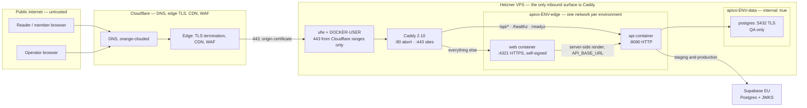
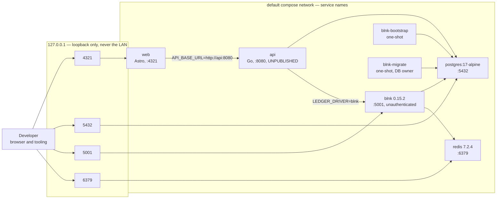
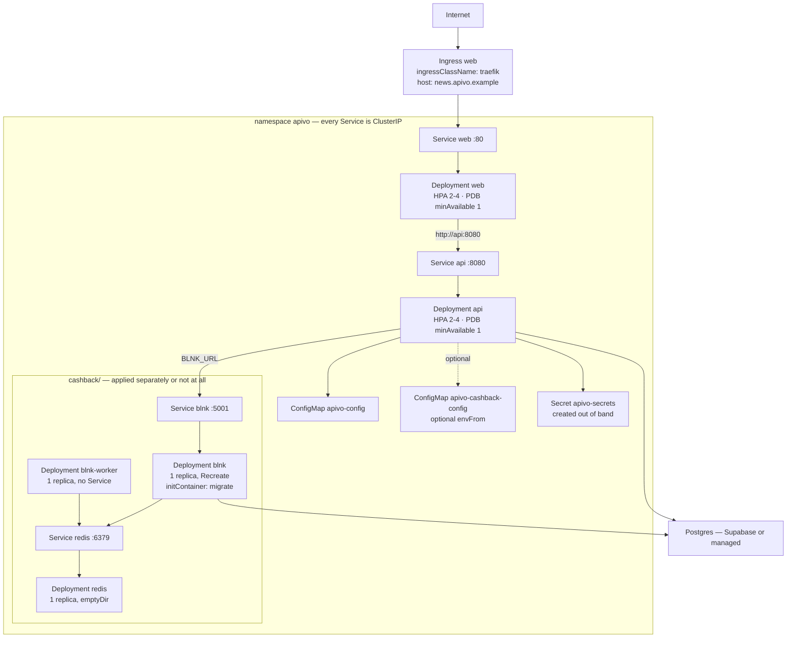

# Network and infrastructure architecture — Apivo

*Where does this system run, what path does a request take through it, and what does it reach outward?*

**Status**: 2026-09-07 · `main @ 0461ad7`

---

## Contents

1. [The three environments](#1-the-three-environments)
2. [Hosts, domains and provisioning status](#2-hosts-domains-and-provisioning-status)
3. [The request path, end to end](#3-the-request-path-end-to-end)
4. [Ports, and which of them are loopback-only](#4-ports-and-which-of-them-are-loopback-only)
5. [The local development topology](#5-the-local-development-topology)
6. [The cashback sidecars](#6-the-cashback-sidecars)
7. [The Kubernetes-ready manifests](#7-the-kubernetes-ready-manifests)
8. [Egress — what this system calls outward, and from where](#8-egress--what-this-system-calls-outward-and-from-where)
9. [Nothing pushes to a host, and what that means for the network surface](#9-nothing-pushes-to-a-host-and-what-that-means-for-the-network-surface)
10. [Rate limiting: a reference implementation, and a gap](#10-rate-limiting-a-reference-implementation-and-a-gap)
11. [DNS, TLS and certificates](#11-dns-tls-and-certificates)
12. [Environment and endpoint table](#12-environment-and-endpoint-table)
13. [Open questions and known gaps](#13-open-questions-and-known-gaps)

---

## 1. The three environments

Three environments, two hosts, one mechanism. The authority is
[docs/ENVIRONMENTS.md](../ENVIRONMENTS.md); this section is its network view.

| | QA | Staging | Production |
|---|---|---|---|
| **Deploys on** | every push to `main` | a `-rc` tag | a final semver tag |
| **Gate** | none — automatic | none — automatic | one human approval on the `production` GitHub Environment |
| **Host** | pre-production VPS | pre-production VPS (the same box) | its own VPS |
| **Database** | Postgres container on the host, over TLS | nonprod Supabase EU project | its own Supabase EU project |
| **Auth issuer** | nonprod Supabase project | nonprod Supabase project | its own Supabase project |
| **Channel tag** | `:qa` | `:staging` | `:prod` |
| **`APP_ENV`** | `prod` | `prod` | `prod` |
| **Cashback** | off | off | off |
| **Provisioned** | **yes — serving** | **host yes, no release has ever run** | **not yet — no VPS, no Supabase project, no DNS record** |

Three facts about that table are worth stating plainly rather than leaving in
a cell.

**QA is provisioned and serving.** Every merge to `main` publishes the `:qa`
channel and the host converges within the minute.

**Staging's host exists and has never had a release.** Its Caddy site answers
with a 502, correctly, because no release candidate has moved the `:staging`
channel and there is nothing to proxy to. `APIVO_STAGING_URL` in
[deploy/hetzner/environments.env](../../deploy/hetzner/environments.env) is
still empty, and that emptiness is the guard: the release workflow refuses a
release to any channel whose URL is unset, so an `-rc` tag is refused today.

**Production is not provisioned.** There is no production VPS, no production
Supabase project and no production DNS record. What exists is the *role*,
written ahead of the box:
[deploy/hetzner/caddy/Caddyfile.prod](../../deploy/hetzner/caddy/Caddyfile.prod)
says so in its own header — *"NOTHING RUNS HERE YET"* — as does
[docker-compose.edge.prod.yml](../../deploy/hetzner/compose/docker-compose.edge.prod.yml).
Provisioning production later is running one script, not designing a
deployment on the day it is first needed.

All three run `APP_ENV=prod`. In this codebase `prod` means *hardened* — JSON
logs, `Secure` on every cookie, and a `DATABASE_URL` the api refuses to accept
unless it is encrypted — not "the production instance". That is why QA's
Postgres container serves TLS and QA connects with `sslmode=require`
([docker-compose.local-db.yml](../../deploy/hetzner/compose/docker-compose.local-db.yml)
carries the whole argument).

`require` rather than `verify-full` for the container: the server is one hop
away on a network marked `internal: true`, and a self-signed certificate
cannot prove an identity. Encrypting without claiming to verify is honest.
Production reaches Supabase across the public internet and uses `verify-full`
— the shape the Kubernetes secret stub also carries
([deploy/k8s/examples/secret.example.yaml](../../deploy/k8s/examples/secret.example.yaml)).

**Production is alone on its host, and that is not about load.** QA runs
whatever was merged minutes ago, and a host is a shared blast radius: one
compromised dependency with a shell in a QA container is a `docker exec` away
from production's `DATABASE_URL` if they share a Docker daemon. Two boxes, and
that sentence stops being true.

---

## 2. Hosts, domains and provisioning status

The domain assignment is settled and committed in
[deploy/hetzner/environments.env](../../deploy/hetzner/environments.env), which
is the only place these are written down. Two of the four values are
deliberately empty, because an empty release URL *is* the guard in
[release.yml](../../.github/workflows/release.yml).

| Host role | Domains | Caddyfile | Status |
|---|---|---|---|
| Pre-production VPS | `ra1ze.com` (QA), `reapie.com` (staging), `*.ra1ze.com` (previews) | [Caddyfile.preprod](../../deploy/hetzner/caddy/Caddyfile.preprod) | provisioned; QA serving, staging 502 by design |
| Production VPS | `apivo.com` (reserved) | [Caddyfile.prod](../../deploy/hetzner/caddy/Caddyfile.prod) | **does not exist** |

A pull request additionally gets `pr-<n>.ra1ze.com` a couple of minutes after
it opens, and loses it within a minute of closing —
[apivo-previews](../../deploy/hetzner/bin/apivo-previews) lists `pr-*` tags in
the registry every minute and converges. Previews share a network with each
other and reach neither QA, staging, nor either of their databases, and their
ingestion is off (`POLL_INTERVAL=0`, `TRANSLATION_INTERVAL=0` in
[docker-compose.preview.yml](../../deploy/hetzner/compose/docker-compose.preview.yml)).
What they do share is one Postgres of their own, `apivo-preview-postgres` on
`apivo-preview-data`
([docker-compose.preview-db.yml](../../deploy/hetzner/compose/docker-compose.preview-db.yml)),
on a tmpfs, so a reboot leaves no orphaned volume behind. Previews are all
equally unreviewed code from open branches, so one network and one database
between them costs nothing. What matters is the boundary they do not cross.

One environment per host role, one compose file for all of them:
[deploy/hetzner/compose/docker-compose.yml](../../deploy/hetzner/compose/docker-compose.yml)
serves QA, staging and production alike, with `APIVO_ENV` naming the
environment and everything that differs living in `/etc/apivo/<env>/`. Every
container and every Docker network is namespaced by that variable, so two
environments on one box never share a network:
`apivo-qa-edge` cannot reach `apivo-staging-data`.

**The README's environment table is stale on this point.**
[README.md](../../README.md) still records QA and staging as "not yet"
provisioned and staging's database as a Postgres container.
[docs/ENVIRONMENTS.md](../ENVIRONMENTS.md) is the single source of truth and
supersedes it; this document follows ENVIRONMENTS.md.

---

## 3. The request path, end to end



Read left to right, the hops are these.

**Client to Cloudflare.** DNS is Cloudflare's and the record is orange-clouded,
so the browser's TLS terminates at the edge, which also carries the CDN and
the WAF. This is Cloudflare's whole remaining job: the application no longer
runs there ([section 10](#10-rate-limiting-a-reference-implementation-and-a-gap)).

**Cloudflare to the origin.** Cloudflare connects to the VPS on 443 and is
presented a **Cloudflare Origin Certificate** — free, valid for years, trusted
by Cloudflare and by nothing else. The zone must be set to **Full (strict)** so
it is actually verified. The firewall
[provision.sh](../../deploy/hetzner/provision.sh) installs admits 443 from
Cloudflare's published ranges only, plus ssh.

**Caddy.** One Caddy per host, in front of every environment on it
([docker-compose.edge.yml](../../deploy/hetzner/compose/docker-compose.edge.yml)),
publishing the only two ports on the whole box. It is deliberately **not**
reconciled from a registry channel the way the application stacks are: a proxy
that rolls itself forward automatically can take every environment down at
once, including the one serving the evidence of what broke.

The routing rule is one shared snippet,
[`(apivo-routes)`](../../deploy/hetzner/caddy/snippets.caddy):

```
@api path /api/* /healthz /readyz
handle @api  { reverse_proxy {args[0]}:8080 }
handle       { reverse_proxy {args[1]}:4321 { transport http { tls; tls_insecure_skip_verify } } }
```

The API answers `/api/…`, `/healthz` and `/readyz`; the Astro frontend answers
everything else. **The api is not published on a host port in any environment,
and Caddy is the only thing that talks to it.**

Two site-wide behaviours are applied before the routing:
`(hardening)` sets `Strict-Transport-Security` (deliberately without
`preload`), strips the `Server` header and enables compression;
`(crawler-fence)` refuses declared crawlers with 403 and a `Vary: User-Agent`,
because `/api/…` is routed *around* the web container and the fence that
everything else relies on
([web/src/middleware.ts](../../web/src/middleware.ts)) ships inside it.

**Caddy to the web container: HTTPS, and the reason is not decoration.**
`@astrojs/node` builds `Astro.url` from the socket and the `Host` header and
never consults `X-Forwarded-Proto`. Over plain HTTP the frontend would believe
it is on `http://` while the browser sends `https://`, and Astro's own CSRF
middleware compares the two with `===` and refuses every form post the site
makes of itself. So each web container holds a self-signed certificate
(`provision.sh` writes one per environment; compose mounts it at
`/run/web-certs`, and `SERVER_CERT_PATH`/`SERVER_KEY_PATH` switch the
standalone entry to HTTPS). Caddy proxies to it over TLS and does not verify
it — the same trade the Postgres connection makes with `sslmode=require`.

**Caddy to the api container: plain HTTP**, one hop on a private compose
network. It always was, and the CSRF problem above does not apply to it.

**Web to api: private, by container name.** `API_BASE_URL` is
`http://apivo-<env>-api:8080`. On Cloudflare Containers a container was
reachable only through its Durable Object, so the deployment's own public
origin was the only address the web container had for the api — a hop out to
the internet and back. That is gone.

**Api to Postgres.** On QA, a container on the `apivo-<env>-data` network,
which is `internal: true` — no route to the internet from it at all. On
staging and production, Supabase across the public internet, which the api
reaches over the `edge` network instead. The `data` network is declared in
every environment so the api's network list does not change between them.

**Anything else arriving at the box** meets `:443 { tls internal; abort }` and
`:80 { abort }` in both Caddyfiles: a scan straight at the VPS IP is refused
without learning what lives there. That is the third layer, after the
Cloudflare-only firewall and Cloudflare itself.

---

## 4. Ports, and which of them are loopback-only

On a deployed host, **the only ports published to any interface are 80 and
443**, by the edge stack. Everything else is a container port reachable only
inside a Docker network.

| Process | Port | Published on a deployed host? | Reachable by |
|---|---|---|---|
| Caddy | 80, 443 | **yes — the only two** | Cloudflare (firewall admits its ranges only) |
| Caddy admin API | 2019 | no — loopback *inside* the container | its own healthcheck |
| `apivo-<env>-web` | 4321 (HTTPS) | no | Caddy, on `apivo-<env>-edge` |
| `apivo-<env>-api` | 8080 (HTTP) | no | Caddy and the web container |
| `apivo-<env>-postgres` | 5432 (TLS) | no — `data` network, `internal: true` | the api only; `apivoctl psql qa` for a shell |
| `apivo-<env>-blnk` | 5001 | no | the api, on `data` |
| `apivo-<env>-blnk-worker` | 5004 | no | nothing; probed by its own healthcheck |
| `apivo-<env>-redis` | 6379 | no — `data` only | Blnk and its worker |

`deploy/hetzner/validate.sh` asserts two of that table's properties on every
pull request, by rendering each environment's compose configuration and
refusing any `published:` key outside the edge stack, and refusing a `data`
network that is not `internal: true`.

**`ufw` alone does not cover this edge, and believing otherwise is the
dangerous part.** Docker publishes a container port by writing its own DNAT
and FORWARD rules, consulted before ufw's INPUT chain ever sees the packet, so
`ufw deny 443` would leave Caddy wide open while `ufw status` said the
opposite. `provision.sh` therefore also writes `DOCKER-USER` rules — and its
first rule, `! -i <ext_if> -j RETURN`, is not optional: `DOCKER-USER` hangs off
FORWARD and carries container traffic in *both* directions, so a bare
`--dport 443 -j DROP` would match a container dialling *out* to 443 as
readily as the internet dialling in. The symptom of getting that wrong is
nasty and says nothing about a firewall: the api's JWKS fetch times out at
boot, `NewVerifier` fails construction, the api crash-loops and the site
answers 502 — while the same URL fetched from the host works perfectly.
[validate.sh](../../deploy/hetzner/validate.sh) asserts the shape of those
rules for exactly that reason.

`APIVO_CONFIGURE_FIREWALL` has **no default** and `provision.sh` refuses to run
until it is `yes` or `no`, because both answers are dangerous in different
directions.

---

## 5. The local development topology



[docker-compose.yml](../../docker-compose.yml) states the shape in its own
header: **the web app is the only published HTTP surface**, on
`127.0.0.1:4321`; the api publishes no host port and is reachable only by
service name on the compose network; Postgres is published on loopback for
local tooling and tests.

Two reasons that shape was chosen, and neither is convenience.

**It is the contract topology, in every deployment.** The API is not publicly
routable anywhere — not here, not on the VPS, not in the Kubernetes manifests.
Making the api unreachable from the host in local development means the
frontend cannot accidentally be written against an address that will not exist
in production. `web` talks to `http://api:8080` locally, to
`http://apivo-<env>-api:8080` on a VPS, and to `http://api:8080` again in
Kubernetes.

**Every host binding is loopback.** `127.0.0.1:` prefixes every published port,
so the dev stack never listens on the LAN — which matters most for the one
service that runs unauthenticated: the local Blnk ledger. `server.secure`
defaults to false in Blnk 0.15.2, so the local ledger accepts anything able to
reach it, and loopback is what keeps that a local affordance rather than an
exposure. Every deployed environment sets `BLNK_SERVER_SECURE=true`.

The **Docker-free path** is the documented default in
[.env.example](../../.env.example) and needs none of this:

```sh
CASHBACK_ENABLED=true LEDGER_DRIVER=memory \
  NETWORKS=fixture NETWORK_FIXTURE_ACCOUNT_ID=fixture-publisher go run ./cmd/apivo
```

Catalogue, click-out, the entry state machine, the wallet and payout
orchestration all run against the in-memory ledger. What does not run is the
Blnk conformance suite, the cross-schema zero-sum check and every
`DATABASE_URL`-keyed invariant test — expected skips, not failures.

Both container images are small and non-root by construction: the Go binary is
built `CGO_ENABLED=0` onto `gcr.io/distroless/static-debian12:nonroot` and
probes its own `/healthz` with no curl in the image
([Dockerfile](../../Dockerfile)); the frontend runs the pruned standalone
bundle as the `node` user and probes itself with Node's built-in fetch,
choosing the scheme from whether the certificate paths are set
([web/Dockerfile](../../web/Dockerfile)).

---

## 6. The cashback sidecars

Cashback adds two runtime services — the Blnk ledger and the Redis it requires
— under the one exception ADR-0002 records to one-process-per-application. On
a Hetzner host they arrive as an overlay,
[deploy/hetzner/compose/docker-compose.cashback.yml](../../deploy/hetzner/compose/docker-compose.cashback.yml);
in Kubernetes as a subdirectory,
[deploy/k8s/cashback/](../../deploy/k8s/cashback/). **Listing the overlay is
the whole decision** — the nine keys that follow from it are set there, not in
`/etc/apivo/<env>/api.env`, because two answers to "does this environment run
cashback" disagree the first time one of them is edited in a hurry, and the
disagreement is silent.

**Cashback is off on every environment today.** It stays off until the
ADR-0002 spikes have passed on that environment.

Four services, and their network placement is the point:

| Service | Networks | Published | Role |
|---|---|---|---|
| `blnk-migrate` | `edge`, `data` | no | one-shot, `blnk migrate up`, as the **database owner** |
| `blnk` | `edge`, `data` | no | `blnk start`, as **`blnk_app`**, `BLNK_SERVER_SECURE=true` |
| `blnk-worker` | `edge`, `data` | no | `blnk workers`, as `blnk_app`; own `/health` on 5004 |
| `redis` | `data` only | no | queue and cache; needs nothing from the internet and nothing needs it |

The ledger runs against **the same Postgres instance as the api**, in its own
`blnk` schema — one database, one backup, one point-in-time recovery, and the
C-1 zero-sum check stays a plain SQL query over real rows instead of a
distributed reconciliation. It reaches that database as **two roles**, which is
a founder decision of 2026-08-24 and not an implementation detail: migrations
run as the owner, the long-lived server and worker run as `blnk_app`, which
owns nothing. Blnk reads the DSN from `BLNK_DATA_SOURCE_DNS` whichever job it
is doing, so the split is expressed by *which file* each container reads —
`blnk-migrate.env` versus `blnk.env` — which makes the owner's credential
**absent** from the long-lived processes rather than merely unused by them.
Both validators assert it.

Blnk and Redis are `edge`-attached for one reason only: staging and production
reach Supabase across the public internet, and `data` is `internal: true`.
Exactly the api's network list, for exactly the api's reason.

Redis holds **no source of truth**. It is configured with no persistence at all
and `maxmemory-policy noeviction`, so a full queue refuses a write visibly
rather than dropping a transfer quietly. Losing it loses throughput, not money.

Both third-party images are pinned by **digest** in every file that runs them
— `jerryenebeli/blnk:0.15.2@sha256:796518b1…` and
`redis:7.2.4-alpine@sha256:c8bb255c…`, identical across
[docker-compose.yml](../../docker-compose.yml), the Hetzner overlay and
[deploy/k8s/cashback/](../../deploy/k8s/cashback/). The api and web images are
pinned by digest too, but resolved at *runtime* by the reconciler, because a
channel tag moves and a third-party version does not: bumping one is a
deliberate decision and belongs in a diff somebody approves.

The api depends on the ledger with `service_started`, **not**
`service_healthy`. This host serves a newspaper as well as a wallet, and one
binary serves both: a ledger that cannot pass its probe must not keep the api
from starting and take the public site down with it. The rollout is still
gated on the ledger being healthy, because `up -d --wait` waits on every
service that declares a healthcheck.

---

## 7. The Kubernetes-ready manifests

Plain manifests, no Helm, in [deploy/k8s/](../../deploy/k8s/). Nothing in this
project runs on Kubernetes today; the set exists so the deployment is not
locked to one substrate, and it is validated on every pull request.



**The topology is the contract's.** Every Service is `ClusterIP`; there is
exactly one `Ingress` and it may name only the frontend. The ledger has no
Ingress and no NodePort, because an internet-reachable ledger API is an
internet-reachable way to move members' money. The worker has no Service at
all — nothing calls a worker.

Traefik is the ingress controller
([deploy/k8s/README.md](../../deploy/k8s/README.md) gives the reasoning: the
upstream project retired ingress-nginx, and Traefik's open-source distribution
fully supports the `networking.k8s.io/v1` Ingress used here). Switching
controllers later means changing only
[web-ingress.yaml](../../deploy/k8s/web-ingress.yaml).

**Autoscaling and disruption.** `spec.replicas` is deliberately omitted from
both application Deployments — the HPAs own the number, `minReplicas: 2`,
`maxReplicas: 4`, CPU target 75 %, which means **metrics-server** is a
prerequisite or they never scale. Both PDBs keep `minAvailable: 1` through a
node drain. The cashback Deployments have neither, and both absences are
argued rather than forgotten: Blnk runs `blnk migrate up` in an initContainer
before `blnk start`, so two replicas rolling out together would race the
migration; Redis at two replicas behind one Service would split the queue
between two unrelated instances; and a PDB with `minAvailable: 1` on a
single-replica Deployment blocks node drains rather than protecting anything.

**The opt-in is the same switch in Kubernetes vocabulary.**
`kubectl apply -f deploy/k8s/` does not recurse into subdirectories, so
`cashback/` is applied on purpose or not at all — the same property that keeps
`examples/secret.example.yaml` from ever overwriting a real credential. The api
Deployment references `apivo-cashback-config` with `optional: true`, so a
cluster that never applied it starts normally.

**Pod hardening** is uniform: `runAsNonRoot`, `seccompProfile: RuntimeDefault`,
`allowPrivilegeEscalation: false`, `readOnlyRootFilesystem: true`, all
capabilities dropped, `automountServiceAccountToken: false`, and
`topologySpreadConstraints` across `kubernetes.io/hostname` for the two
application Deployments.

**Two CI gates, answering two different questions.**

| Gate | Where | Answers |
|---|---|---|
| `kubeconform` v0.8.0, `-strict`, Kubernetes 1.32.0, recursive | the `kubeconform` job in [ci.yml](../../.github/workflows/ci.yml) | is this a well-formed manifest? |
| [deploy/k8s/validate.sh](../../deploy/k8s/validate.sh) | its own workflow, [k8s-topology.yml](../../.github/workflows/k8s-topology.yml) | is this Service publicly routable? is the cashback set a genuine opt-in? do the addresses the api is handed resolve to Services that exist? |

They are separate because kubeconform's own documentation puts every property
that is about what a manifest *means* out of scope, and both answers are
perfectly valid YAML. `validate.sh` has its own test suite,
[validate_test.sh](../../deploy/k8s/validate_test.sh), which the same workflow
runs first — a gate nobody proves is a gate nobody can rely on.

**What is not shipped**: image references are `:latest` placeholders and the
Ingress host is `news.apivo.example`, both of which must be replaced before
applying. There is no `NetworkPolicy` anywhere in the set, so pod-to-pod
traffic is unrestricted by default — see
[section 13](#13-open-questions-and-known-gaps). `BRAND_DIR` is deliberately in
no manifest, because no value this repository could ship would be anything but
a lie about a real company.

---

## 8. Egress — what this system calls outward, and from where

Inbound is one port on one process. Outbound is wider, and every call has a
named origin.

| Called | From | When | Configured by |
|---|---|---|---|
| Feed sources (arbitrary publisher HTTP/S) | **api** container | the poll loop, `POLL_INTERVAL` (15m default; `0` disables) | source rows; [internal/ingestion/fetch.go](../../internal/ingestion/fetch.go) |
| The model provider — any host speaking the chat-completions request shape | **api** container | the translation pipeline, `TRANSLATION_INTERVAL` | `TRANSLATION_BASE_URL`, `TRANSLATION_MODEL`, `TRANSLATION_API_KEY`; [openaicompat/client.go](../../internal/translation/providers/openaicompat/client.go) |
| Affiliate network APIs — Linkwise `https://affiliate.linkwi.se` | **api** container | forward sweep every 15m, trailing sweep every 6h, catalogue import | `NETWORKS` + `NETWORK_<DRIVER>_*`; [linkwise/client.go](../../internal/cashback/networks/linkwise/client.go) |
| Awin `https://api.awin.com` | — | **never today**: the adapter does not implement the port and is not a shipped driver | [awin/client.go](../../internal/cashback/networks/awin/client.go), [cmd/apivo/registry.go](../../cmd/apivo/registry.go) |
| Supabase **JWKS** endpoint | **api** container | **at startup**, and cached in-process thereafter | `JWKS_URL`; [internal/identity/verifier.go](../../internal/identity/verifier.go) |
| Supabase **Postgres** | **api** container (and **blnk**/**blnk-worker** when cashback is on) | continuously, on staging and production | `DATABASE_URL`, `BLNK_DATA_SOURCE_DNS` |
| Supabase **Auth** (sign-in) | **web** container, server-side | editorial sign-in | `PUBLIC_SUPABASE_URL`, `PUBLIC_SUPABASE_ANON_KEY`, declared `context: 'server'` in [web/astro.config.mjs](../../web/astro.config.mjs) |
| GHCR (`ghcr.io/nomos-n4s/apivo-news`) | **the host itself**, not a container | every minute, per environment | [apivo-reconcile](../../deploy/hetzner/bin/apivo-reconcile) |
| `https://www.cloudflare.com/ips-v4` and `-v6` | **the host**, during provisioning only | building the firewall rules | [provision.sh](../../deploy/hetzner/provision.sh) |

Three consequences worth naming.

**The browser talks to nothing but Cloudflare.** The Supabase keys are declared
`context: 'server'`, so sign-in is a server-side call from the web container,
not a call the browser makes. There is one origin in a reader's network tab.

**Egress from a container traverses the FORWARD chain**, which is why the
`DOCKER-USER` rule ordering in [section 4](#4-ports-and-which-of-them-are-loopback-only)
is load-bearing: the JWKS fetch is the first thing that ever needed outbound
HTTPS from a container, and it is what exposed the mistake.

**The nonprod Supabase project pauses after about a week idle**, and the
failure is asymmetric: a running api keeps working because the JWKS is cached,
the *next rollout* fails to boot because `NewVerifier` fetches at startup and
fails construction, and the reconciler rolls the environment back to the digest
that was serving. Staging additionally loses its database, which is in the same
project. QA does not, which is one more reason its Postgres container stays.

**QA and staging must never hold production's publisher credentials.** A poll
is a real call against a real publisher account, counted against a real rate
limit, and QA reconciles on every merge to `main`.

---

## 9. Nothing pushes to a host, and what that means for the network surface

The mechanism belongs to the CI/CD view; the network property is this
document's.

**No CI job holds an SSH key, no agent has a shell on a VPS, and there is no
inbound webhook.** The deploy is a channel tag moving in the registry; the host
asks the registry every minute whether its channel has changed
([apivo-reconcile](../../deploy/hetzner/bin/apivo-reconcile), run by a systemd
timer per environment). What that buys, in network terms:

- **No inbound endpoint on the host beyond 443**, and 443 is admitted from
  Cloudflare's ranges only. A push-based deploy would need a listener, a shared
  secret to present to it, and a path into the box that exists whether or not a
  deploy is happening.
- **No credential in CI that can reach a production box.** The registry
  credential the host holds is a `read:packages` token, in one direction.
- **Convergence after a partition with nobody re-triggering anything**, and
  self-healing: the reconciler runs `up -d` whether or not the channel moved,
  so a container that died between ticks comes back on the next one.

The cost is latency — up to a minute before the host looks. The same property
governs previews: teardown is a **deleted tag**, not a message, because a
webhook straight to the host would leak an environment forever the one time it
was dropped.

An agent therefore cannot reach a VPS: there is no key to hold, and no
mechanism to add one.

---

## 10. Rate limiting: a reference implementation, and a gap

**State this plainly, because it is a risk and the README already states it:
the Hetzner deployment has no rate limit on the editorial endpoints at all.**

The retired Cloudflare Worker carried one.
[deploy/cloudflare/routing.js](../../deploy/cloudflare/routing.js) expressed it
as an **inversion**: everything the api answers is limited *except* an explicit
list of public reader paths, so a route added later is limited from its first
request. It normalised the path first — decoding once and collapsing repeated
slashes — because `/api/v1/%65ditorial/queue` is editorial to the Go router and
looked like nothing in particular to a naive prefix test, and a path that
slipped past the test went unlimited. The key was the **caller**, not the
connection: a request carrying a bearer token was counted against that token's
subject, and only a tokenless request fell back to the address — because
`API_BASE_URL` makes every editorial call server-side from the web container,
so the address on that hop buckets all editors together. The binding is
declared in [wrangler.jsonc](../../wrangler.jsonc) as
`EDITORIAL_RATE_LIMIT`, 60 requests per 60 seconds, and a **missing binding
refuses rather than passes** — that last property lives in
[worker.js](../../deploy/cloudflare/worker.js), which answers the editorial
paths 429 when the binding is absent rather than serving them unlimited while
believing them limited. The reader paths are untouched by that refusal, the
same trade a missing `JWKS_URL` already makes.

None of that is deployed. Caddy does not carry it and does not pretend to —
[snippets.caddy](../../deploy/hetzner/caddy/snippets.caddy) says so in the
`(apivo-routes)` comment. What survives in the tree is the *design and its
tests*: CI still runs `wrangler deploy --dry-run` and
`node --test 'deploy/cloudflare/*.test.mjs'`, and the `wrangler` job in
[ci.yml](../../.github/workflows/ci.yml) says why in its own header — *"a rule
nobody proves is a rule nobody can safely port"*.

What is **unaffected** is authorisation: a valid JWT and the database's second
check of the editor role are enforced in Go, by the same code, whatever proxy
is in front. What is **absent** is the bound on invalid-token load — an
attacker who cannot get *in* can still make the api do JWT verification work
all day.

**Porting the limit to Go middleware is required before the first public
deployment**, and it is a precondition rather than a follow-up. In the api it
is in-repo, testable, applies in every environment including local development,
and is independent of which proxy is in front. Nothing is publicly reachable
today, which is the only reason this is a gap rather than a live defect.

Two things must be true before anything is publicly reachable, and both are
recorded in [docs/ENVIRONMENTS.md](../ENVIRONMENTS.md): the rate limit, and the
firewall on every host.

---

## 11. DNS, TLS and certificates

Four certificates, four different jobs, and each one is chosen for what it can
actually prove.

| Hop | Certificate | Verified? | Where it comes from |
|---|---|---|---|
| Browser → Cloudflare | Cloudflare's edge certificate | yes, by the browser | Cloudflare |
| Cloudflare → Caddy | **Cloudflare Origin Certificate**, free, valid for years, trusted by Cloudflare and nothing else | yes — the zone must be **Full (strict)** | installed by `provision.sh` at `/etc/apivo/edge/certs`, mounted read-only |
| Caddy → web container | self-signed, one per environment | **no**, deliberately | `provision.sh` writes it; mounted at `/run/web-certs` |
| api → QA Postgres | self-signed, generated with the uid read out of the Postgres image | **no** — `sslmode=require` | `provision.sh`; [docker-compose.local-db.yml](../../deploy/hetzner/compose/docker-compose.local-db.yml) |

The two unverified hops are one hop away on a private network, addressed by
container name. Encrypting without claiming to have authenticated is the honest
setting; a self-signed certificate cannot prove an identity, and `verify-full`
on a local socket would mean shipping a CA bundle to make it look like
Supabase. Production reaches Supabase across the public internet and uses
`verify-full`.

**There is deliberately no ACME on the box.** HTTP-01 through an
orange-clouded record is unreliable, and DNS-01 would put a Cloudflare API
token with DNS edit rights on the VPS — a much larger key than the one problem
it solves. Wildcard per-PR preview hostnames would change that calculation;
nothing else does. Caddy's `auto_https disable_redirects` is set for the same
family of reasons: every site names its certificate explicitly, so Caddy never
issues one and never needs an ACME account, and the automatic `:80 → :443`
redirect vhost would exist purely to be scanned.

**Two origin certificates, not one.** QA and previews share `origin` because
previews live in the QA hostname's zone and Cloudflare includes the apex and
the first-level wildcard together — `ra1ze.com` and `*.ra1ze.com` on one
certificate. Staging is a different zone and gets `origin-staging`. A
certificate spanning zones can only be issued by Cloudflare's API, which would
have put a curl and an Origin CA Key between a new host and its first byte
served, to save copying one more file.

**The preview wildcard's matcher is the security boundary.** Only
`^pr-[0-9]+\.` reaches the routing snippet, so no other label can be turned
into a container name to proxy at; everything else on the wildcard is aborted.
It matches on the host *prefix* rather than a label index because `{labels.N}`
counts from the right, so `{labels.3}` is correct for `pr-1.qa.example.com` and
the empty string for `pr-1.example.com` — a difference `caddy validate` cannot
see. [validate.sh](../../deploy/hetzner/validate.sh) exercises preview routing
at two preview-domain depths for that reason.

---

## 12. Environment and endpoint table

Public endpoints, per environment. Only `/api/v1/front`,
`/api/v1/articles/{id}`, `/api/v1/openapi.json`, `/healthz` and `/readyz` are
open; every one of the 22 `/api/v1/cashback/*` paths requires a bearer token.
The document served at `/api/v1/openapi.json` currently declares 37 paths and
44 operations.

| | QA | Staging | Production | Preview |
|---|---|---|---|---|
| **Public base URL** | `https://ra1ze.com` | `https://reapie.com` | `https://apivo.com` (reserved) | `https://pr-<n>.ra1ze.com` |
| **Recorded in `environments.env`** | `APIVO_QA_URL`, set | `APIVO_STAGING_URL`, **empty** | `APIVO_PROD_URL`, **empty** | `APIVO_PREVIEW_DOMAIN`, set |
| **Serving?** | yes | 502 by design — no release has moved `:staging` | no host | on demand, cap `APIVO_PREVIEW_MAX` (default 5) |
| **Frontend** | `/` and everything not below | same | same | same |
| **Reader API** | `/api/v1/front`, `/api/v1/articles/{id}` | same | same | same |
| **Editorial API** | `/api/v1/editorial/*` — 404 when `JWKS_URL` is unset | same | same | same |
| **Cashback API** | `/api/v1/cashback/*` — 404 today, cashback is off | same | same | fixtures only (`CASHBACK_PREVIEW_FIXTURES=1`) |
| **Health** | `/healthz` (liveness), `/readyz` (readiness, DB ping) | same | same | same |
| **Ledger** | not deployed | not deployed | not deployed | not deployed |
| **Ingestion / translation** | on | on | on | **off** (`POLL_INTERVAL=0`, `TRANSLATION_INTERVAL=0`) |

`/api/v1/editorial/queue` answering **404 rather than 401** is the signal that a
host has no `JWKS_URL` — the composition root logs one line and leaves every
editorial route unmounted, so an environment without auth configured exposes
nothing that would have needed it.

Ask what is actually running, from anywhere, with no credentials:
`sh scripts/env_status.sh` (add `--json`). It makes one HTTPS request per
environment and reports what each one *serves*, which is the only account of a
deployment that cannot be wrong.

---

## 13. Open questions and known gaps

**The editorial rate limit does not exist on the deployed shape.** The only
implementation is in a Worker nothing deploys. Porting it to Go middleware is a
precondition for public reachability, not a follow-up, and deleting
[deploy/cloudflare/](../../deploy/cloudflare/) is what that port unblocks. This
is the largest open item in this document.

**Production is not provisioned.** No VPS, no Supabase project, no DNS record.
The Caddy site, the compose stack, the systemd units and the approval gate are
written and rehearsed by staging, but the first production release will still
be the first time that pipeline runs to a *new host*.

**Staging has never had a release.** Its host answers and its Caddy site is
correct; `APIVO_STAGING_URL` is empty and the release workflow refuses an `-rc`
tag until it is filled in. Filling it in and cutting the first candidate are
the two remaining steps, in that order.

**No backups anywhere.** Supabase covers production once it exists. QA and
staging are containers on the VPS with no backup at all. Nothing on a VPS holds
state that matters yet — and the moment production exists, that sentence needs
re-checking.

**Cashback is off on every environment**, so the ledger topology in
[section 6](#6-the-cashback-sidecars) is proved by CI in both database shapes
and has never run on a host.

**No `NetworkPolicy` in the Kubernetes set.** Every Service is `ClusterIP` and
only the frontend is routable from outside, but pod-to-pod traffic inside the
namespace is unrestricted, so a compromised web pod could reach the ledger
Service directly. The compose deployment expresses the equivalent restriction
structurally, through per-environment networks and `internal: true`; the
Kubernetes set has no counterpart, and `validate.sh` does not check for one.

**The Kubernetes manifests carry placeholders.** `:latest` image references and
`news.apivo.example` as the Ingress host must both be replaced before a real
apply. They are shape, validated as shape.

**The web container has no dedicated health route.** Its Kubernetes probes hit
`/`, which [deploy/k8s/README.md](../../deploy/k8s/README.md) records as a
placeholder to move when one lands. Its compose healthcheck fetches `/` too.

**`linux/arm64` images are not built.** `amd64` only. Hetzner's ARM line needs
`TARGETARCH` and `--platform=$BUILDPLATFORM` in the
[Dockerfile](../../Dockerfile) first. The two pinned third-party digests are
already multi-architecture indexes, so only our own images are the constraint.

**Two documents disagree about provisioning status.**
[README.md](../../README.md) records QA and staging as unprovisioned and
staging's database as a container; [docs/ENVIRONMENTS.md](../ENVIRONMENTS.md)
records QA as serving and staging on the nonprod Supabase project.
ENVIRONMENTS.md is the stated source of truth and is what this document
follows; the README's table needs the same edit.

**One section of [deploy/k8s/README.md](../../deploy/k8s/README.md) is stale.**
Its *"What applying this set does today"* paragraph says the binary on `main`
reads none of `CASHBACK_ENABLED`, `LEDGER_DRIVER`, `BLNK_URL`, `REDIS_URL` or
`NETWORKS` and mounts no cashback routes. That was true when it was written;
the api now parses all of them and serves 22 cashback paths when they are set.
The manifests themselves are correct — only the prose has not caught up.

**Deferred by choice, and recorded as such**: the production host until there
is something to protect; DNS-01 and ACME on the box until wildcard preview
hostnames justify a DNS-edit token on a VPS; a Hetzner Cloud Firewall in front
of the host, which `provision.sh` recommends because it sits outside the
machine where no container runtime can route around it.
