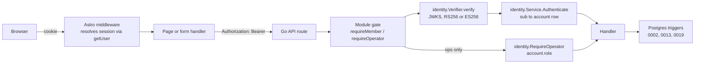
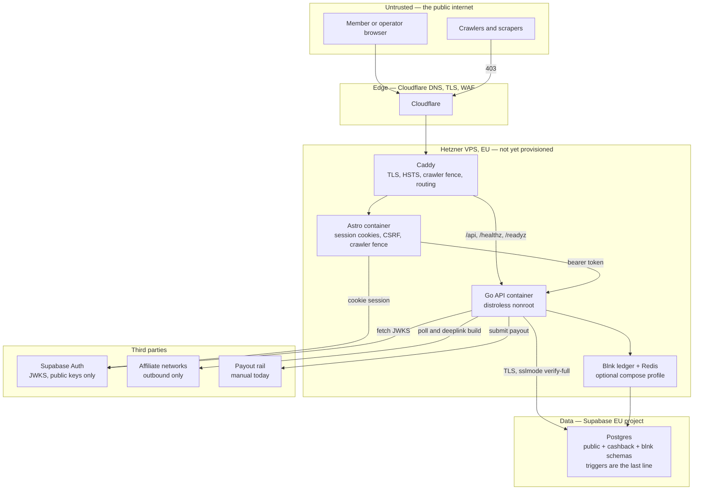
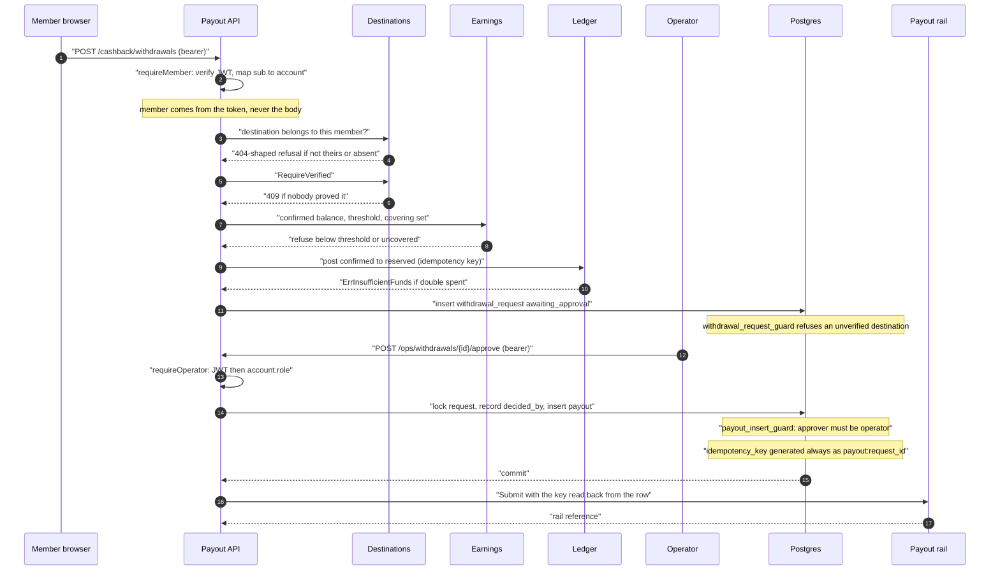

# Security architecture

*Who is allowed to move a member's money, what stops everybody else, and where the defences are not yet built.*

**Status**: 2026-09-07 — `main @ 0461ad7`

This document is cross-cutting: it sits off the C4 ladder and applies at every level of [the document set](README.md). The maturity labels — **Built**, **Partial**, **Specified**, **Retired** — are defined once in [README.md](README.md#the-maturity-legend) and used here without restating them.

## Contents

- [The shape of the problem](#the-shape-of-the-problem)
- [Identity and authentication](#identity-and-authentication)
- [Authorisation](#authorisation)
- [Trust boundaries](#trust-boundaries)
- [Authorisation decision for a withdrawal](#authorisation-decision-for-a-withdrawal)
- [Secrets](#secrets)
- [Data protection](#data-protection)
- [Threat model](#threat-model)
- [The money invariants as security controls](#the-money-invariants-as-security-controls)
- [Supply chain](#supply-chain)
- [Open questions and known gaps](#open-questions-and-known-gaps)

## The shape of the problem

Two products share one binary, one database and one auth provider. The news side publishes; the cashback side owes people money. The security posture is written for the second, because the second is the one where a mistake is a transfer rather than a correction.

Three properties carry most of the weight, and none of them is application discipline:

1. **A decision that moves or withholds money records the named human who made it, and the database refuses the row without one.** This is C-4 for payouts, and it is the same idea as I-1 for articles ([constitution](../../.specify/memory/constitution.md), Principles II and IX).
2. **Evidence is immutable.** Clicks, network transaction reports and imported statements reject `UPDATE`, `DELETE` and `TRUNCATE` by trigger. A status change is a new superseding row, never an edit (C-3).
3. **Balances are not stored.** A member's money exists only as the sum of immutable ledger postings whose transfers net to zero per currency, and a job checks that every minute (C-1).

An attacker who reaches the API therefore cannot set a balance, cannot edit the evidence behind one, and cannot make money leave without a row naming an operator who approved it. What they can do is covered in [the threat model](#threat-model), including the places where the honest answer is *no mitigation yet*.

## Identity and authentication

### The provider

Sign-in is Supabase Auth, in an EU project. The frontend uses the JS SDK through `@supabase/ssr`; the Go binary never talks to Supabase's API and never holds a service-role key — it verifies tokens against the project's public JWKS.

| Where | What it does | File |
|---|---|---|
| Astro middleware | Resolves the cookie-backed session **once per request**, and only for paths that need one — the editorial screens, the cashback member surfaces, `/ops`, and `/api/cashback` | [web/src/middleware.ts](../../web/src/middleware.ts) |
| Astro SDK glue | Builds a request-scoped server client, reads cookies from the request and writes refreshed ones back through Astro's cookie store | [web/src/lib/editorial/supabase.ts](../../web/src/lib/editorial/supabase.ts) |
| Session mapping | Maps the Supabase user onto the shape the screens read, including the token the API is called with | [web/src/lib/editorial/session.ts](../../web/src/lib/editorial/session.ts) |
| Go verifier | RS256/ES256 signature verification against a cached, auto-refreshing JWKS, plus `exp`/`iat`/`nbf` and optional `aud` | [internal/identity/verifier.go](../../internal/identity/verifier.go) |
| Go service | Maps the token subject to a `public.account` row | [internal/identity/service.go](../../internal/identity/service.go) |

Three decisions in that chain are worth stating because each closes a specific hole.

**The frontend calls `getUser()`, not `getSession()`, to decide who is signed in.** `getUser()` asks the auth server; the cookie's own contents are whatever the browser sent. The access token is read afterwards, only to be forwarded to the API ([supabase.ts](../../web/src/lib/editorial/supabase.ts)).

**Session cookies are forced `HttpOnly`, and `Secure` is decided by one function.** `astroCookieOptions` overrides whatever the SDK asked for: `httpOnly` is always true because no page script in this application is a Supabase browser client ([session.ts](../../web/src/lib/editorial/session.ts)). `Secure` comes from [secure-request.ts](../../web/src/lib/secure-request.ts), which treats `APP_ENV=prod` as authoritative, falls back to `X-Forwarded-Proto`, and only then to the request URL — because `@astrojs/node` builds the request URL from the socket and the `Host` header and ignores the forwarded scheme, so a deployed site behind TLS termination previously shipped its refresh token without `Secure`.

**State-changing form posts are same-origin checked.** [csrf.ts](../../web/src/lib/csrf.ts) compares the request's `Origin` (falling back to `Referer`) against the site host; a request carrying neither is refused. The comparison is on host rather than whole origin, for the proxy reason the file documents. This is a floor: there is no per-session CSRF token yet.

### Where the token is actually verified



The bearer token is verified **in the Go binary, on every request, in the module gate** — not in the frontend, not once at sign-in, and not at the edge. Caddy terminates TLS and routes; it performs no token check ([deploy/hetzner/caddy/snippets.caddy](../../deploy/hetzner/caddy/snippets.caddy)).

### What is trusted from a token, and what is not

| Claim | Trusted? | Why |
|---|---|---|
| Signature (`alg` in `{RS256, ES256}`) | Yes | [`checkAlgorithms`](../../internal/identity/verifier.go) rejects by *protected header*, before any key is consulted, so `alg: none` and an HS256 downgrade against a public key fail deterministically |
| `exp`, `iat`, `nbf` | Yes, with skew | `DefaultAcceptableSkew = 30s`, hard-bounded by `MaxAcceptableSkew = 2m`; a config value outside `(0, 2m]` fails construction |
| `aud` | Only when `JWT_AUDIENCE` is set | An audience without a JWKS endpoint fails startup ([.env.example](../../.env.example)) |
| `sub` | Yes — as an **identifier**, then resolved | It must parse as a UUID and must map to a `public.account` row; a valid token for an unprovisioned subject is `ErrUnknownAccount` → 401 ([service.go](../../internal/identity/service.go)) |
| `email` | Yes, cosmetically | Used for display; provenance reporting reads the account row |
| **role** | **No** | The role is read from `account.role` by [`AccountRoles.Role`](../../internal/identity/role.go) on every operator request. The frontend maps `app_metadata.role` for *labelling only*, and says so in [session.ts](../../web/src/lib/editorial/session.ts): "The screens use it to name the role, never to permit anything." [account/register.go](../../internal/account/register.go) returns the role read from the row for the same reason — "a client that showed an operator queue on the strength of a claim would show it to whoever could mint the claim." |

### The gates, module by module

Each cashback module defines its own narrow authenticator interface and its own gate. They are deliberately not shared: a change made for one surface must not reach another by refactor.

| Module | Interface | Gate | What it yields to handlers |
|---|---|---|---|
| [catalogue/auth.go](../../internal/cashback/catalogue/auth.go) | `AuthenticateReader(ctx, token) error` | `requireMember` | **Nothing.** It proves a caller exists and forgets them, so no read can quietly scope by member |
| [clickout/auth.go](../../internal/cashback/clickout/auth.go) | `AuthenticateMember` | `requireMember` | `Member{ID}` — the account the click row is written against (FR-023) |
| [wallet/auth.go](../../internal/cashback/wallet/auth.go) | `AuthenticateMember` | `requireMember` | `Member{ID}`, taken from the token and never from a path or query parameter |
| [payout/auth.go](../../internal/cashback/payout/auth.go) | `AuthenticateMember` | `requireMember` | `Member{ID}` — the only member a route here will act for |
| [ops/auth.go](../../internal/cashback/ops/auth.go) | `AuthenticateOperator` | `requireOperator` | `Operator{ID, Email, DisplayName}` — what a decision row records |

Two structural properties hold in all five:

- **The gate wraps the whole mux, not each route**, so a route added later cannot be left open by omission, and a probe of an unserved path is refused before it learns whether the path exists.
- **The member is taken from the token.** No route accepts an account id from the caller. Reading or spending another member's balance is therefore unrepresentable rather than merely refused.

The composition root wires the identity module behind all five ([cmd/apivo/main.go](../../cmd/apivo/main.go): `memberAuth`, `catalogueAuth`, `walletAuth`, `payoutAuth`, `newOperatorAuth`). `ErrInvalidToken` and `ErrUnknownAccount` both map to 401; a role refusal maps to 403; anything else is a 500 and is never reported as a verdict about the caller.

**A deployment with no `JWKS_URL` mounts no authenticated routes at all.** [main.go](../../cmd/apivo/main.go) logs one ERROR line naming the unmounted surfaces and serves the reader endpoints only. Because cashback has no anonymous surface, that includes every cashback route — the member wallet and the operator queues alike. A misconfigured deployment exposes nothing rather than something unguarded.

### The contract agrees

[api/openapi.json](../../api/openapi.json) declares 44 operations over 37 paths. 26 of them are `/api/v1/cashback/*` and **all 26 carry `security`**. Exactly five operations are open: `GET /api/v1/front`, `GET /api/v1/articles/{id}`, `GET /api/v1/openapi.json`, `/healthz` and `/readyz`. [cmd/apivo/openapi_routes_test.go](../../cmd/apivo/openapi_routes_test.go) compares served routes against the document in both directions, so a route that appears without a contract entry fails the build.

## Authorisation

### The role model

`account.role` is a three-value closed set: `reader`, `editor`, `operator`.

| Role | Added by | Authority |
|---|---|---|
| `reader` | [0002](../../internal/platform/db/migrations/0002_roles_withdrawal_costs.up.sql), as the column default | Their own account, their own clicks, their own wallet, their own withdrawal requests |
| `editor` | [0002](../../internal/platform/db/migrations/0002_roles_withdrawal_costs.up.sql) | Approving an article. `article.approved_by` is `NOT NULL` and a `BEFORE INSERT` trigger reads the approver's role **with `FOR SHARE`**, so a concurrent demotion cannot slip past |
| `operator` | [0019](../../internal/platform/db/migrations/0019_operator_role.up.sql) | Releasing money and closing the queues that decide who gets it |

Migration 0019 does four things, and each is a control rather than a convenience: it rewrites `account_role_known` to admit `operator`; it **refuses to apply** if any existing `payout.approved_by` is not an operator; it adds `cashback.payout_insert_guard()` so the database rejects a payout whose approver does not hold the role; and it extends `account_role_guard()` so an operator's role is frozen while any payout references them — the approver on a historical payout cannot be edited away.

**An editor is not an operator with less, and an operator is not an editor with more.** [role.go](../../internal/identity/role.go) carries two separate functions rather than one parameterised by role, and says why: "A helper taking the required role as an argument would make 'operator or editor' as easy to write as either one alone, and the first place that was convenient would be the place the separation quietly ended." [role_test.go](../../internal/identity/role_test.go) asserts the non-overlap directly (`TestTheTwoRoleGatesDoNotOverlap`). The TypeScript union in [session.ts](../../web/src/lib/editorial/session.ts) is the same decision on the frontend.

### Which role reaches which route

| Surface | Requires | Enforced at |
|---|---|---|
| `GET /api/v1/front`, `GET /api/v1/articles/{id}`, `/healthz`, `/readyz`, `GET /api/v1/openapi.json` | nothing | — |
| `POST /api/v1/account` (self-registration) | a **verified token** whose subject may have no row yet; the row is created as `reader` | [account/register.go](../../internal/account/register.go), via `Service.Verify` rather than `Authenticate` |
| `/api/v1/editorial/*` | `editor` | `identity.RequireEditor`, then the 0002 trigger on write |
| `/api/v1/cashback/{merchants,clickouts,wallet,participation,export,withdrawals,payout-destinations}` | any authenticated account | the module gates above |
| `/api/v1/cashback/ops/*` | `operator` | `requireOperator` → `identity.RequireOperator` → `account.role`, then the 0019 trigger on write |

### Three layers, and the frontend is not one of them

[web/src/lib/cashback/ops-guard.ts](../../web/src/lib/cashback/ops-guard.ts) states the layering in its own words: the screen check "is the third of three and the only one that can explain itself to the person at the screen. It is never the only one." It also separates *may they act* from *may they look*, so operator screens remain reviewable against fixtures without ever rendering a real queue row to a non-operator — with a live API the queue is 403 regardless of what the screen decides.

### A decision that moves or withholds money names its decider

This is the cashback analogue of invariant I-1, and it is enforced the same way — by the schema, not by a code review.

| Decision | Row | The named decider | Constraint |
|---|---|---|---|
| Approve a payout | `cashback.payout` | `approved_by` | `NOT NULL` + `payout_insert_guard()` requires role `operator` ([0014](../../internal/platform/db/migrations/0014_cashback_payout.up.sql), [0019](../../internal/platform/db/migrations/0019_operator_role.up.sql)) |
| Reject a withdrawal | `cashback.withdrawal_request` | `decided_by`, plus a mandatory reason | `withdrawal_request_rejection_has_reason` |
| Release or reject a held credit | `cashback.entry_transition` | `actor_id` and `reason` | [earnings/review.go](../../internal/cashback/earnings/review.go); a rejection writes a **new** entry born `reversed` beside the untouched original |
| Dismiss an unattributed transaction | `cashback.unattributed_transaction` | `resolved_by`, `resolved_reason`, `resolved_at` | `unattributed_resolution_all_or_none` |
| Resolve a reconciliation difference | `cashback.reconciliation_difference` | `resolved_by`, `resolved_reason`, `resolved_at`, `resolution` | the four-column all-or-none constraint from [0030](../../internal/platform/db/migrations/0030_reconciliation_difference_verdict.up.sql) |
| Import a statement | `cashback.reconciliation_run` | `imported_by` `NOT NULL`, row immutable | [0015](../../internal/platform/db/migrations/0015_cashback_reconciliation.up.sql), [0028](../../internal/platform/db/migrations/0028_reconciliation_statement_once.up.sql) |
| Verify a payout destination | `cashback.payout_destination` | `verified_at` **and** `verified_method`, together | `payout_destination_verification_all_or_none` |

In every case the operator is taken from the **token**, never from the request body ([ops/auth.go](../../internal/cashback/ops/auth.go)).

C-8 and C-9 extend the same rule to *claim* decisions. There is no claim table, no package and no route, so there is nothing to enforce — see [known gaps](#open-questions-and-known-gaps).

## Trust boundaries



What each boundary is actually worth:

- **Public → edge.** Declared crawlers are refused 403. The list exists in three places — [web/src/middleware.ts](../../web/src/middleware.ts), [deploy/hetzner/caddy/snippets.caddy](../../deploy/hetzner/caddy/snippets.caddy) and [deploy/cloudflare/routing.js](../../deploy/cloudflare/routing.js) — and `deploy/hetzner/validate.sh` asserts two of them agree so they cannot drift silently. The middleware copy names its own limit: a crawler that fully impersonates a browser defeats a User-Agent test.
- **Edge → host.** Caddy stamps `Strict-Transport-Security: max-age=31536000; includeSubDomains` (deliberately without `preload`) and strips the `Server` header. The API is **not published on a host port in any environment**; Caddy is the only thing that talks to it.
- **Web container → API.** A bearer token, per request. The web container never reads `account.role` from the database and never holds a database credential.
- **API → Postgres.** `APP_ENV=prod` makes the binary **refuse to start** on a `DATABASE_URL` that permits a cleartext session — `disable`, `allow`, `prefer` or absent ([deploy/hetzner/env/api.env.example](../../deploy/hetzner/env/api.env.example)). Managed environments use `sslmode=verify-full`.
- **Inside the database.** The cashback role is granted `SELECT` on only `public.account`, `public.place` and `public.language`, plus `SELECT`/`INSERT` on `public.domain_event` ([0010](../../internal/platform/db/migrations/0010_cashback_schema.up.sql)). Every news table is deliberately ungranted, and [cashback_boundary_test.go](../../internal/platform/db/cashback_boundary_test.go) proves it. No foreign key crosses a product schema boundary — checked by [scripts/lint-migrations.sh](../../scripts/lint-migrations.sh) in [migration-lint.yml](../../.github/workflows/migration-lint.yml).
- **API → third parties.** All three are **outbound only**. There is no inbound webhook, no callback URL and no postback endpoint anywhere in the tree: the network transaction poller is the only path that can create a credit ([networks/poller.go](../../internal/cashback/networks/poller.go)). That single decision removes an entire class of forged-report attacks.
- **Containers.** Both images are distroless static, non-root, no shell, no package manager ([Dockerfile](../../Dockerfile)). The Kubernetes manifests add `runAsNonRoot`, `runAsUser: 65532`, `seccompProfile: RuntimeDefault`, `allowPrivilegeEscalation: false`, `readOnlyRootFilesystem: true` and `capabilities: drop: ALL` ([deploy/k8s/api-deployment.yaml](../../deploy/k8s/api-deployment.yaml)).

## Authorisation decision for a withdrawal

The money-leaving path, with every refusal in the order the code applies it. Nothing touches the ledger until every cheap refusal has passed ([payout/withdrawal.go](../../internal/cashback/payout/withdrawal.go), [payout/approval.go](../../internal/cashback/payout/approval.go)).



Three details in that flow are the whole defence, and each is stated where it is enforced:

- **The double-spend defence is the reservation, not a uniqueness constraint on open requests.** There is deliberately no one-open-request rule on `withdrawal_request`; the ledger refuses a member stage account going negative ([wallet/ledger.go](../../internal/cashback/wallet/ledger.go), `ErrInsufficientFunds`).
- **The approval and the rail call are two phases.** Transaction 1 locks the request, records the decision, resolves the brand and inserts the payout, then commits. Only then is the rail called, outside any transaction ([approval.go](../../internal/cashback/payout/approval.go)). A rail that hangs cannot hold a lock on the decision.
- **The idempotency key is read back from the generated column, never recomputed in Go** ([approval.go](../../internal/cashback/payout/approval.go)) — a second authority on the one thing C-5 rests on would be a second thing that can disagree.

## Secrets

### What lives where

| Environment | Where secrets live | Mode / owner |
|---|---|---|
| Local development | `.env`, git-ignored; [.env.example](../../.env.example) is the only committed template | developer's machine |
| Hetzner (QA, staging, prod) | `/etc/apivo/<env>/api.env`, read by the Docker daemon as the api service's `env_file` | `0600 root:root` ([deploy/hetzner/env/api.env.example](../../deploy/hetzner/env/api.env.example)) |
| Hetzner, structural config | `/etc/apivo/<env>/stack.env`, sourced by the reconciler | `0640 root:root` ([deploy/hetzner/env/stack.env.example](../../deploy/hetzner/env/stack.env.example)) |
| Kubernetes | a `Secret` named `apivo-secrets`, **created out of band** with `kubectl create secret` | [deploy/k8s/examples/secret.example.yaml](../../deploy/k8s/examples/secret.example.yaml) is a structure-only stub |

The Hetzner split is deliberate and it is a security property, not tidiness: `api.env` is read by the Docker daemon directly, so `DATABASE_URL` "never enter[s] the reconciler's process environment nor `docker compose config` output" — the database password does not travel through a shell that also writes logs.

The Kubernetes example is equally deliberate about what it does and does not stub. `BLNK_SECRET_KEY` / `BLNK_SERVER_SECRET_KEY` **are** stubbed with a `CHANGE-ME` placeholder, because the cashback Deployments map them as required `secretKeyRef`s and a cluster that applies the ledger without setting them gets pods that refuse to start and say why. `TRANSLATION_API_KEY` and the `NETWORK_<DRIVER>_API_*` pairs are **not** stubbed, because a placeholder would be forwarded to the binary as if an operator had chosen a provider. Two ledger DSNs are kept apart — a migration DSN owned by the schema owner, read only by an init container that lives for seconds, and a `blnk_app` DSN that owns nothing — so the long-lived server never carries the owning credential.

### What must never be in the repository

- Any real `DATABASE_URL`, Supabase project password or service-role key. `.gitignore` allows `.env.example` and nothing else matching `.env*`.
- `BLNK_SECRET_KEY` / `BLNK_SERVER_SECRET_KEY`. The api refuses to start under `APP_ENV=prod` with cashback enabled and no key: "a ledger reachable without a credential is a ledger anybody on that network can post to, and postings are money."
- `NETWORK_<DRIVER>_API_KEY` and `_API_SECRET`. `NETWORK_<DRIVER>_ACCOUNT_ID` is **not** a credential — the config package logs it in clear — and lives in a ConfigMap beside the `NETWORKS` list.
- Any bank detail. See the vault below.

`JWKS_URL` is *not* a secret: it names where the auth provider publishes its public keys. `PUBLIC_SUPABASE_ANON_KEY` is publishable by design.

### Secrets in memory: `config.Secret`

[internal/platform/config/secret.go](../../internal/platform/config/secret.go) is a struct — not a named string type, which is load-bearing — implementing `fmt.Formatter`, `fmt.Stringer`, `fmt.GoStringer`, `slog.LogValuer`, `json.Marshaler` and `encoding.TextMarshaler`. Between them there is no path from a `Secret` to its own contents that does not go through `Reveal()`, so every reveal is greppable and the default thing to do with one — pass it, log it, print it — is the safe thing. It is write-only for encoders: it marshals to `[REDACTED]` and has no unmarshaller. Two silent gaps it was written to close are documented in the file: `%d` on a `Stringer` prints the raw operand through `fmt.badVerb`, and `encoding/json` encodes a string *kind* by reflection without asking the type.

It is explicitly not protection against a caller who reveals a secret and then logs the result.

### The payout vault

[internal/cashback/payout/vault.go](../../internal/cashback/payout/vault.go) is the port that names where bank details go, because `cashback.payout_destination` stores a **reference and never the details**:

```
details_ref text not null   -- "Losing this database must not be losing anybody's IBAN."
```

`DetailsVault` has one method, and it is deliberately one-way:

```go
Store(ctx context.Context, kind Kind, details json.RawMessage) (string, error)
```

It can put details in and get a reference back; it **cannot read them out**. Nothing in this product needs to — a rail resolves the reference itself, which is why `DestinationRef` carries the reference rather than the details. "A port that could read them would be a port somebody eventually reads them through." The reference must not embed the details: "a 'reference' that was the details in another encoding would put them back in the column this whole arrangement exists to keep them out of." `Destination` carries no details, and [destination.go](../../internal/cashback/payout/destination.go) says so at the field: not in the schema, not in logs, not in errors, not in test failures.

**No implementation ships.** [cmd/apivo/main.go](../../cmd/apivo/main.go) passes `nil`, so `POST /payout-destinations` answers 503 (`ErrNoVault`) in every deployment while every other route on the surface — including withdrawing to a destination that already exists — keeps working. That is a chosen absence, not an oversight: a vault is somebody's KMS, somebody's secrets manager, or a processor's tokenisation endpoint, and picking one here would pick it for every deployment. The operational consequence is in [known gaps](#open-questions-and-known-gaps).

## Data protection

### Residency

EU residency is a property of the host, not a setting. The application runs as containers on a Hetzner VPS in the EU, behind Caddy, behind Cloudflare for DNS, edge TLS, CDN and WAF; production's database is its own Supabase **EU** project ([README.md](../../README.md), [docs/ENVIRONMENTS.md](../ENVIRONMENTS.md)). There is no configuration flag that moves data out of the EU, and equally none that would keep it in if the host changed. **All three hosts are listed as not yet provisioned.**

### What personal data the system holds

Read from the migrations, not from a data map:

| Table | Personal data | Where |
|---|---|---|
| `public.account` | `email`, `display_name` | [0001](../../internal/platform/db/migrations/0001_init.up.sql) — and `role` from [0002](../../internal/platform/db/migrations/0002_roles_withdrawal_costs.up.sql) |
| `cashback.click` | `account_id` (`NOT NULL`), `clicked_at`, and `context_digest` — a **digest**, never the inputs | [0012](../../internal/platform/db/migrations/0012_cashback_clicks_evidence.up.sql) |
| `cashback.payout_destination` | `account_id`, `kind`, `details_ref` — a reference; the IBAN is not here | [0014](../../internal/platform/db/migrations/0014_cashback_payout.up.sql) |
| `cashback.entry`, `withdrawal_request`, `payout` | `account_id` and amounts — a financial history | [0013](../../internal/platform/db/migrations/0013_cashback_earnings.up.sql), [0014](../../internal/platform/db/migrations/0014_cashback_payout.up.sql) |
| `cashback.participation` | opt-in, `terms_version`, `left_at` | [0017](../../internal/platform/db/migrations/0017_participation.up.sql) |
| `cashback.network_transaction` | `raw_payload` — the network's verbatim report, which may name a purchase | [0012](../../internal/platform/db/migrations/0012_cashback_clicks_evidence.up.sql) |
| `public.domain_event` | `subject` and payloads across 19 cashback event types | [0018](../../internal/platform/db/migrations/0018_domain_event_envelope.up.sql) |

The click context is the one place where an address could have been stored, and it is not. [clickout/context.go](../../internal/cashback/clickout/context.go) digests exactly two parts — the client address as the deployment can best determine it, and the user agent — and stores only the digest: "Enough for an abuse rule to tell one device's flood from a busy afternoon, and nothing that reconstructs who or where somebody is." The header it reads is never a default: `CLICK_CONTEXT_HEADER` is a deployment's statement of trust in its own edge, because "a header a client can set is a context a client can choose". Left unset, the per-context half of the click rule stays off rather than throttling every member behind one proxy address.

### GDPR posture

| Right | Position today |
|---|---|
| Access / portability | Partially served by design: `GET /api/v1/cashback/export` gives a member their own wallet history ([wallet/export.go](../../internal/cashback/wallet/export.go)). There is no whole-account export. |
| Rectification | `account.display_name` and `email` are ordinary columns. Financial rows are frozen by trigger and must not be rectified — a correction is a new row. |
| Erasure | **Structurally constrained, and correctly so.** Participation is closed, never deleted: `cashback.participation_guard()` refuses `DELETE` outright, because "the financial record built on it outlives the preference" ([0017](../../internal/platform/db/migrations/0017_participation.up.sql)). Clicks, reports, statements, entries and payouts are immutable by trigger. Erasure of a member therefore means closing participation and removing the profile fields, never removing the money history — and **the handler for that does not exist** (see gaps). |
| Objection / opt-out | `DELETE /api/v1/cashback/participation` closes participation as a status and a date. |
| Retention | **Open.** The constitution records "data retention periods (default: no automated deletion)" for news and click-log retention as founder question **Q8** for cashback; claim evidence retention is **Q11** ([constitution](../../.specify/memory/constitution.md), Governance). Nothing in the tree deletes anything on a schedule. |

Two supporting controls: the site is `noindex, nofollow` with a disallow-all `robots.txt` served from the middleware ([web/src/middleware.ts](../../web/src/middleware.ts)), and there is no anonymous cashback surface at all, so no member-facing cashback data is reachable without a token.

## Threat model

STRIDE, scoped to the cashback product. Every row names the mitigation with its file, or says there is none.

| # | Threat (STRIDE) | Scenario | Mitigation | Status |
|---|---|---|---|---|
| T1 | **Elevation / abuse** — click-stuffing | A member or script issues thousands of click-outs to seed attribution, or to farm a network's cookie window | Rule counted over the **append-only click table** rather than an in-process counter, so it survives restarts and cannot be evaded by hitting another replica: `PerMember` 60/hour, `PerContext` 120/hour, [clickrule.go](../../internal/cashback/clickout/clickrule.go), [ratelimit.go](../../internal/cashback/clickout/ratelimit.go). Refusal is 429 with `Retry-After`. Every click is authenticated (FR-023) so there is always an account to hold responsible | **Partial** — the per-context half is off unless `CLICK_CONTEXT_HEADER` is set, and there is **no rate limit on any other API route**: the retired Cloudflare Worker was the only per-caller limiter and the Hetzner deployment has none ([README.md](../../README.md)) |
| T2 | **Spoofing / repudiation** — self-referral and fraudulent claims | One person makes many accounts and buys through their own links; or claims a purchase they never made | Four hold rules, evaluated first-match-wins before any credit is spendable: `shared-context` (several accounts from one device), `new-account`, `sale-cap`, `member-velocity` — [holdrules.go](../../internal/cashback/earnings/holdrules.go). A rule that cannot be asked is `ErrHoldUnread`, never a silent pass. Held credits queue for a named operator ([ops/held.go](../../internal/cashback/ops/held.go)); a rejection writes a new entry born `reversed` beside the untouched original. C-2 makes an evidence-free credit unrepresentable | **Partial** — the rules are heuristics, `shared-context` depends on the context digest being meaningful, and there is **no KYC or sanctions posture** (constitution Q6, open). Claims (spec 003) are unbuilt, so C-8/C-9/C-10 protect nothing yet |
| T3 | **Tampering** — duplicate or forged network reports | A network re-reports the same transaction, or an attacker inserts a report to manufacture a credit | Polling is the **only** credit-creating path — there is no inbound webhook to forge. `content_digest` is computed **by the database** in `cashback.network_transaction_guard()`, so application code cannot get it wrong; `network_transaction_unique_report`, `network_transaction_superseded_once` and `network_transaction_one_root` make a duplicate a no-op and give each transaction exactly one current row; `network_transaction_immutable` and `_no_truncate` refuse edits ([0012](../../internal/platform/db/migrations/0012_cashback_clicks_evidence.up.sql)). `entry_one_per_report` allows one credit per report ([0032](../../internal/platform/db/migrations/0032_entry_one_credit_per_report.up.sql)) and `entry_evidence_guard` refuses an entry that does not cite the click the network named | **Built** |
| T4 | **Elevation** — withdrawal to an unverified or someone else's destination | A member withdraws to an account they never proved is theirs, or names another member's destination id | `withdrawal_request.destination_id` is composite-FK'd to `(id, account_id)` of `payout_destination`, so it **must** be the caller's own; `withdrawal_request_guard` refuses a request naming an unverified destination ([0014](../../internal/platform/db/migrations/0014_cashback_payout.up.sql)); `RequireVerified` refuses in the application first ([verification.go](../../internal/cashback/payout/verification.go)); a destination belonging to someone else and one that does not exist are deliberately the **same** error, so the endpoint cannot confirm another member's id is real ([destination.go](../../internal/cashback/payout/destination.go)) | **Built** — but see T4b |
| T4b | **Availability of the control** | Nobody can verify a destination through the API at all | `Destinations.Verify` exists and is tested, and has **no HTTP route and no production caller**; `POST /payout-destinations` answers 503 because no `DetailsVault` is wired | **No mitigation yet** — a member cannot complete a withdrawal through the API alone, and any destination that does exist was verified out of band |
| T5 | **Elevation / repudiation** — operator privilege abuse | An operator approves their own withdrawal, releases held credits for a confederate, or is demoted to hide a decision | Every decision records the operator taken from the **token** ([ops/auth.go](../../internal/cashback/ops/auth.go)); `payout.approved_by` is `NOT NULL` and `payout_insert_guard()` requires the role; `account_role_guard()` **freezes an operator's role while any payout references them**; migration 0019 refuses to apply against history that violates the rule; `payout_guard()` freezes the approver, amount, currency, rail and request, and `settled` is terminal; the full chain is queryable through `cashback.provenance` ([0016](../../internal/platform/db/migrations/0016_cashback_provenance_view.up.sql)). Race covered by `TestOperatorDemotionRaceIsSerialized` ([cashback_operator_role_test.go](../../internal/platform/db/cashback_operator_role_test.go)) | **Partial** — everything is *attributable*, nothing is *prevented*. There is **no second-approver rule at any amount** (constitution Q13, open) and **no separation between requester and approver**: an operator with a member account can approve their own withdrawal, and only the audit trail would show it |
| T6 | **Tampering** — replay of a payout | A retry, a crash between transactions, or a deliberate second submit pays twice | `payout.idempotency_key` is `GENERATED ALWAYS AS ('payout:' || request_id) STORED` with a unique constraint, and is read back from the column rather than recomputed; `payout_one_per_request UNIQUE(request_id)`; `payout_pays_the_requested_amount` composite FK on `(request_id, amount_minor, currency)` so a payout cannot restate the approved amount ([0014](../../internal/platform/db/migrations/0014_cashback_payout.up.sql)). The ledger is idempotent on the transfer key, with `ErrIdempotencyConflict` when a replay differs by content ([wallet/ledger.go](../../internal/cashback/wallet/ledger.go)). Proved by [payout/exactly_once_test.go](../../internal/cashback/payout/exactly_once_test.go) and `TestConcurrentDoubleSubmitProducesOnePayout` | **Built** |
| T7 | **Spoofing** — JWT forgery, downgrade or leakage | `alg: none`, an HS256 downgrade using the public key as an HMAC secret, a stolen token, or a token for an account that does not exist | Algorithm allowlist enforced **on the protected header before any key is consulted** ([verifier.go](../../internal/identity/verifier.go)); keys from the provider's JWKS, cached and auto-refreshing, with an unreachable endpoint failing construction at wiring time; `exp`/`iat`/`nbf` with skew hard-bounded at 2 minutes; the subject must resolve to an account row; cookies are `HttpOnly` and `Secure` ([session.ts](../../web/src/lib/editorial/session.ts), [secure-request.ts](../../web/src/lib/secure-request.ts)); HSTS at the edge; **no role is ever read from a claim** | **Partial** — a stolen bearer token is bearer authority for its lifetime. There is **no revocation list, no token binding and no re-authentication step in front of a withdrawal**; token lifetime is the auth provider's default |
| T8 | **Tampering / information disclosure** — malicious deeplink, open redirect, SSRF | An operator-edited `deeplink_template` carries `javascript:`, a relative path, or a URL pointing at an internal host | The URL is **returned to the client as `redirect_url` in JSON**, never fetched by the server and never emitted as a `Location` header by this binary ([clickout/handlers.go](../../internal/cashback/clickout/handlers.go)), so the class here is open redirect rather than SSRF. `validateDeeplinkTemplate` requires an absolute `http`/`https` URL with a host, unpadded — the column only requires non-blank and the value is operator-edited, so this is the only check between an `UPDATE` and a member's browser ([networks/deeplink.go](../../internal/cashback/networks/deeplink.go)). `Publisher.tryTemplate` builds a probe deeplink through the real adapter **at publish time** ([catalogue/publish.go](../../internal/cashback/catalogue/publish.go)). Linkwise additionally refuses an unescaped nested destination ([linkwise/deeplink.go](../../internal/cashback/networks/linkwise/deeplink.go)). Outbound network base URLs come from constants and config, never from row data ([linkwise/client.go](../../internal/cashback/networks/linkwise/client.go)) | **Partial** — the destination **host** is not constrained to the merchant's own domain, so an operator (or anyone who can write `offer.deeplink_template`) can point an authenticated member's browser at any `https` host. There is no allowlist |
| T9 | **Information disclosure** — PII exposure through exports | An export leaks member data, or a CSV cell executes in a spreadsheet | `/ops/exports/*` sits behind `requireOperator` on the whole mux; `spreadsheetCell` prefixes any value starting with `= + - @ \t \r`, the CSV formula-injection defence ([ops/exports_http.go](../../internal/cashback/ops/exports_http.go)); windows are validated and bounded at `MaxExportRows = 50_000` — a window holding more is refused rather than truncated, "because a truncated journal is one an accountant sums"; the member's own export is scoped by the token ([wallet/export.go](../../internal/cashback/wallet/export.go)) | **Partial** — the ops exports legitimately carry member account ids, amounts and network references; there is no field-level redaction, no export audit log, and nothing rate-limits an operator pulling every window |
| T10 | **Spoofing** — CSRF against an editorial or ops action | A cross-site form drives a privileged action using a signed-in browser | Same-origin check on `Origin`, falling back to `Referer`, refusing a request carrying neither ([csrf.ts](../../web/src/lib/csrf.ts)); session cookies are `HttpOnly`; the Go API takes a bearer token rather than a cookie, so it is not reachable by ambient credential at all | **Built for the API, Partial for the screens** — the file names its own ceiling: "a per-session token belongs here too once there are sessions to bind one to" |
| T11 | **Information disclosure** — cross-product data leakage | The cashback module reads or is joined to news tables | Schema-level grants: `cashback_domain` reaches only `public.account`, `public.place`, `public.language` and `public.domain_event` ([0010](../../internal/platform/db/migrations/0010_cashback_schema.up.sql)); no FK leaves the cashback schema, checked by [scripts/lint-migrations.sh](../../scripts/lint-migrations.sh) and [cashback_catalogue_test.go](../../internal/platform/db/cashback_catalogue_test.go); module boundaries enforced by [internal/arch/arch_test.go](../../internal/arch/arch_test.go), which also proves the scan is not passing vacuously | **Built** |
| T12 | **Tampering** — direct ledger manipulation | Someone with database access posts an unbalanced transfer or edits a balance | Balances are never stored — they are summed from postings (C-1). The Postgres ledger makes `account`, `transfer` and `posting` immutable by trigger, with a deferred constraint trigger enforcing zero-sum **per transfer per currency** and a member-stage-not-negative trigger ([0022](../../internal/platform/db/migrations/0022_pg_ledger.up.sql)). [ZeroSumCheck](../../internal/cashback/wallet/zerosum.go) runs **every minute** on a constant, non-configurable interval — "an env-settable cadence would be an off switch for a constitutional invariant" — reports each non-zero currency as an ERROR on every tick, and distinguishes "clean" from "there was nothing to sum". [wallet/invariants_test.go](../../internal/cashback/wallet/invariants_test.go) plants an imbalance in raw SQL behind the port's back and requires both the check and Postgres to catch it | **Built** — with the honest caveat that the adopted ledger is an external service (ADR-0002); the check is the price of that exception |
| T13 | **Denial of service** — scraping and unbounded reads | A crawler or scripted client drains the API | Crawler fence in three places, tested for drift; `X-Robots-Tag: noindex, nofollow`; request bodies bounded (`maxStatementBytes = 4 MB` for statement import, `MaxBytesReader` on click-out) | **Partial** — a browser-impersonating client defeats the User-Agent test by design, and there is **no per-caller rate limit on the Go API at all** |

## The money invariants as security controls

C-1…C-10 are usually read as data rules. Read as security controls, this is what each one denies an attacker — including one with a valid operator token.

| Invariant | Denies | Enforced by |
|---|---|---|
| **C-1** Double entry | Setting a balance. There is no number to set; money can only be moved by a transfer that nets to zero per currency | `ledger.posting_zero_sum` deferred trigger ([0022](../../internal/platform/db/migrations/0022_pg_ledger.up.sql)); `Transfer.Validate`; [zerosum.go](../../internal/cashback/wallet/zerosum.go) every 60s |
| **C-2** Attribution | Inventing a credit. Every credit cites exactly one network report and, through it, at most one click — and only a click the same member made | `entry.network_transaction_id NOT NULL`; `entry_one_per_report`; `entry_click_belongs_to_member` composite FK; `entry_evidence_guard()` ([0013](../../internal/platform/db/migrations/0013_cashback_earnings.up.sql), [0032](../../internal/platform/db/migrations/0032_entry_one_credit_per_report.up.sql)) |
| **C-3** Immutable evidence | Rewriting history to justify a credit already taken | `click_immutable`, `network_transaction_immutable`, `reconciliation_run_immutable`, plus `_no_truncate` on each ([0012](../../internal/platform/db/migrations/0012_cashback_clicks_evidence.up.sql), [0015](../../internal/platform/db/migrations/0015_cashback_reconciliation.up.sql)) |
| **C-4** Named approver | Money leaving with nobody's name on it, or with the name of somebody who never held the authority | `payout.approved_by NOT NULL`; `payout_insert_guard()`; `account_role_guard()` freezing a referenced operator's role ([0014](../../internal/platform/db/migrations/0014_cashback_payout.up.sql), [0019](../../internal/platform/db/migrations/0019_operator_role.up.sql)) |
| **C-5** Exactly once | Paying twice — by retry, by race, or on purpose | Generated `idempotency_key`, `payout_one_per_request`, the amount composite FK, ledger idempotency ([0014](../../internal/platform/db/migrations/0014_cashback_payout.up.sql), [exactly_once_test.go](../../internal/cashback/payout/exactly_once_test.go)) |
| **C-6** Integer money | Rounding attacks and currency confusion. No float exists in a money column; a posting in a currency its account does not hold is unrepresentable | `bigint` + `char(3)` everywhere; `ledger.posting_account_holds_currency`; [money.go](../../internal/platform/money/money.go); `TestNoFractionalMoneyTypeExistsInTheCashbackSchema` |
| **C-7** Traceability | Getting away with it quietly. One query returns payout → approver → postings → entries → report → click → the rate at click time | View `cashback.provenance` ([0016](../../internal/platform/db/migrations/0016_cashback_provenance_view.up.sql)), `ledger_link` ([0013](../../internal/platform/db/migrations/0013_cashback_earnings.up.sql), [0027](../../internal/platform/db/migrations/0027_ledger_link_per_entry.up.sql)) |
| **C-8** Named claim decider | — | **Nothing to enforce: no claim table, no package, no route** |
| **C-9** Append-only claim decisions | — | **Nothing to enforce.** The pattern exists elsewhere (`entry_transition_immutable`, `unattributed_transaction_guard`) |
| **C-10** A claim never moves money by itself | Half-enforced: C-2 already makes an evidence-free credit unrepresentable. The named remedy — a goodwill transfer from a named house account — has **no account to make it from** | [config/cashback.go](../../internal/platform/config/cashback.go) declares three house accounts: rounding, clawback, network receivable. There is no goodwill account |

## Supply chain

| Control | What it is | Status |
|---|---|---|
| Lint version pinning | `GOLANGCI_LINT_VERSION ?= v2.12.2` in [Makefile](../../Makefile), matched by `golangci-lint-action` `version: v2.12.2` in [ci.yml](../../.github/workflows/ci.yml). A different version on `PATH` does not count as having run the lint | **Built** |
| Generated-code drift | The `sqlc-drift` job regenerates with a pinned `sqlc/sqlc:1.31.1`, **proves the generator actually wrote something**, refuses a generated file that is git-ignored, then `git add -A && git diff --cached --exit-code` over the whole tree ([ci.yml](../../.github/workflows/ci.yml)) | **Built** |
| Type drift, frontend | A `ts-types-drift` job holds the generated database types to the schema ([ci.yml](../../.github/workflows/ci.yml)) | **Built** |
| Contract drift | `openapi` job plus [cmd/apivo/openapi_routes_test.go](../../cmd/apivo/openapi_routes_test.go) — served routes and the document must agree in both directions; [openapi_money_test.go](../../cmd/apivo/openapi_money_test.go) refuses decimal money in the contract | **Built** |
| Migration boundary lint | [scripts/lint-migrations.sh](../../scripts/lint-migrations.sh) in [migration-lint.yml](../../.github/workflows/migration-lint.yml) — no FK crosses a product schema | **Built** |
| Commit hygiene | The `commit-hygiene` job checks out the **branch head rather than the merge ref GitHub writes**, proves it did so in a step of its own, derives the commit range from the event, and runs [scripts/lint-refs.sh](../../scripts/lint-refs.sh) and [scripts/lint-commit-authors.sh](../../scripts/lint-commit-authors.sh) over both the messages and the two identities in each commit header | **Built** |
| Base images | Build on `golang:1.26`, ship on `gcr.io/distroless/static-debian12:nonroot`; `CGO_ENABLED=0`, `-trimpath` ([Dockerfile](../../Dockerfile)) | **Built** — the final stage is pinned by tag, not by digest |
| Deployment path | **Nothing pushes to a host.** No CI job holds an SSH key, no agent has a shell on a VPS, and there is no inbound endpoint on one. Each host polls the registry, pulls **by digest**, rolls out and then proves the roll-forward, rolling back on a mismatch ([README.md](../../README.md), [deploy/hetzner/bin/apivo-reconcile](../../deploy/hetzner/bin/apivo-reconcile)) | **Built** |
| Signed commits | The constitution requires every commit to be signed and show as Verified. No CI job checks a signature — the enforcement point is GitHub branch protection, which lives outside this repository | **Partial** |
| Dependency updates | **There is no `.github/dependabot.yml` and no renovate configuration.** `.github/` contains `workflows/` only | **No mitigation yet** |
| Secret scanning | No gitleaks, trufflehog or equivalent job in [.github/workflows/](../../.github/workflows/). `.gitignore` excluding `.env*` is the whole of the pre-commit defence | **No mitigation yet** |

## Open questions and known gaps

Stated bluntly, because this is the section a launch decision rests on.

### Gaps that block taking real money

1. **No payout destination can be created or verified through the API.** No `DetailsVault` implementation exists; [cmd/apivo/main.go](../../cmd/apivo/main.go) passes `nil`, so `POST /payout-destinations` is 503 everywhere, and `Destinations.Verify` has no route and no production caller. Since `withdrawal_request_guard` refuses an unverified destination, **a member cannot complete a withdrawal through the API alone**. Choosing a vault is a prerequisite, not a polish item.
2. **One payout rail, hard-coded, and it settles by hand.** [main.go](../../cmd/apivo/main.go) returns `manual.New()`; it is not configurable. `payout_destination.kind` admits `sepa` and no SEPA rail exists. The manual rail's `Status` always answers `submitted` — a person must record that the money landed.
3. **The money loop does not close in the ledger.** Settlement writes `payout.state='settled'` and `withdrawal_request.state='paid'` and touches no entry; `postingsFor` returns `ErrNotThisPackagesToPost` for `to == StatePaid` ([earnings/postings.go](../../internal/cashback/earnings/postings.go)) and no production caller supplies that posting. **After settlement a member's wallet shows the same money twice** — still in `Reserved` in the ledger, and again in `PaidOut` summed from `cashback.payout`. C-1 still holds; the member-facing figure does not.
4. **No per-caller rate limit anywhere on the Go API.** The retired Cloudflare Worker was the only implementation; the Hetzner deployment has none, and [README.md](../../README.md) already names porting one to Go middleware as required before anything is publicly reachable. The click rule is the single exception, and it protects one route.
5. **No second approver at any amount, and no requester/approver separation.** Constitution Q13 is open. An operator who also holds a member account can approve their own withdrawal; only the audit trail would show it.
6. **No KYC or sanctions posture.** Constitution Q6, open. Nothing screens a destination or a member.

### Gaps in the security machinery itself

7. **The outbox has no reader.** The dispatcher, checkpoints, dead-letter table and requeue are implemented and unit-tested; nothing registers a handler in [main.go](../../cmd/apivo/main.go). Nineteen event types are written and never consumed — so there is **no alerting, no anomaly detection and no security monitoring built on the event stream**, and `identity.account.deleted` handling (close participation, flag in-flight withdrawals, never delete financial rows) does not exist because there is nothing to register it with.
8. **No dependency update automation and no secret scanning in CI.**
9. **No revocation, token binding or step-up authentication.** A stolen bearer token is authority for its remaining lifetime, on every surface including withdrawals.
10. **The deeplink host is unconstrained.** An `https` URL is required; the merchant's own domain is not. Anyone who can write `offer.deeplink_template` can point an authenticated member's browser anywhere.
11. **Operator exports are unaudited.** No record is kept of who exported which window; nothing bounds how often.
12. **Participation is recorded, not enforced.** Neither [clickout](../../internal/cashback/clickout) nor [catalogue](../../internal/cashback/catalogue) checks it, so a member who left can still click out and be credited.
13. **`GET /catalogue`, `GET /ops/withdrawals?state=…`, `GET /ops/reconciliation/runs` and `POST /ops/unattributed/{id}/attribute` are called by [web/src/lib/cashback/api.ts](../../web/src/lib/cashback/api.ts) and served by nothing.** Unattributed transactions can be dismissed but not attributed — the only way to correct a mis-attributed credit is to leave it uncredited.
14. **The frontend CSRF check has no per-session token**, by its own admission.
15. **Signed commits are policy, not a CI gate.** The identity and message lints are enforced; the signature is not.

### Founder questions that are security questions

Recorded open in the [constitution](../../.specify/memory/constitution.md), Governance, and carrying safe defaults rather than decisions:

| Question | Security consequence of leaving it open |
|---|---|
| **Q3** clawback posture after payout | Default is *absorb the loss*; the `HOUSE_ACCOUNT_CLAWBACK` account is required in prod config and **debited by nothing** |
| **Q6** KYC and sanctions | No screening exists at all |
| **Q7** tax treatment and member reporting | No reporting surface exists |
| **Q8** click-log retention | Clicks accumulate indefinitely; there is no automated deletion anywhere in the tree |
| **Q10** goodwill budget and cap | The goodwill house account C-10 names does not exist |
| **Q11** claim evidence retention | Moot until claims are built |
| **Q13** second approver above an amount | See gap 6 |

### Whole features that do not exist

- **Claims (spec 003)** — 45 tasks, none done. C-8, C-9 and C-10 have nothing to enforce. `grep -rli claim` over the migrations finds only prose.
- **Provable evidence / member-checkable ledger (spec 005)** — spec and research only.
- **The `HOUSE_ACCOUNT_ROUNDING` posting.** The D6 remainder is computed in [earnings/share.go](../../internal/cashback/earnings/share.go) and stays in the receivable. Zero-sum holds, so this is an attribution gap rather than a solvency one — but [.env.example](../../.env.example)'s description of it does not describe running code.

### Finally

**No environment is provisioned.** QA, staging and production are all listed as *not yet* in [README.md](../../README.md). Every control above that depends on a host — TLS termination, HSTS, the Caddy crawler fence, `sslmode=verify-full`, file modes on `api.env` — is asserted by configuration that has never been applied. The database-level controls are the ones that have actually been proved, against a real Postgres, in CI, on every pull request.
