# Sequence diagrams

*What actually happens, step by step, when a member earns and is paid — and which file, table and invariant carries each step.*

**Status** — 2026-09-07, `main @ 0461ad7`.

Every diagram below is drawn from the code in this checkout, not from a
specification. Where the code and a specification disagree, the code is what is
drawn and the difference is stated. Where a step is designed and not built, it is
marked and the marking is part of the diagram.

The audience is cashback. The news side appears once, at the end, so the shared
substrate — the outbox, the scheduler, the identity gate, the named-approver
pattern — is visible as one thing rather than two.

---

## Contents

1. [Member discovers a merchant and clicks out](#1-member-discovers-a-merchant-and-clicks-out)
2. [The network reports a transaction](#2-the-network-reports-a-transaction)
3. [Attribution, and the unattributed queue](#3-attribution-and-the-unattributed-queue)
4. [An earnings entry through its whole life](#4-an-earnings-entry-through-its-whole-life)
5. [Reversal](#5-reversal)
6. [Supersede](#6-supersede)
7. [The held queue](#7-the-held-queue)
8. [Withdrawal, complete](#8-withdrawal-complete)
9. [Reconciliation](#9-reconciliation)
10. [Accounting export](#10-accounting-export)
11. [Sign-in and the identity path](#11-sign-in-and-the-identity-path)
12. [Catalogue import, publication, and the rate on the screen](#12-catalogue-import-publication-and-the-rate-on-the-screen)
13. [One news sequence, for contrast](#13-one-news-sequence-for-contrast)
14. [The patterns these sequences share](#14-the-patterns-these-sequences-share)
15. [Open questions and known gaps](#15-open-questions-and-known-gaps)

---

## 1. Member discovers a merchant and clicks out

The click is the first fact in the money chain. Nothing downstream — no credit, no
confirmation, no payout — can exist without it, because
`cashback.entry.click_id` is composite-keyed to a click the same member made
(C-2). So the click-out endpoint is arranged around one rule: the member must not
reach the retailer unless the row that will earn them money already exists, and
the rate they were shown must be frozen onto that row at the instant they left.
Everything else in this sequence — the rate limit, the liveness check, the order
of minting and building — exists to make that rule cheap to keep.

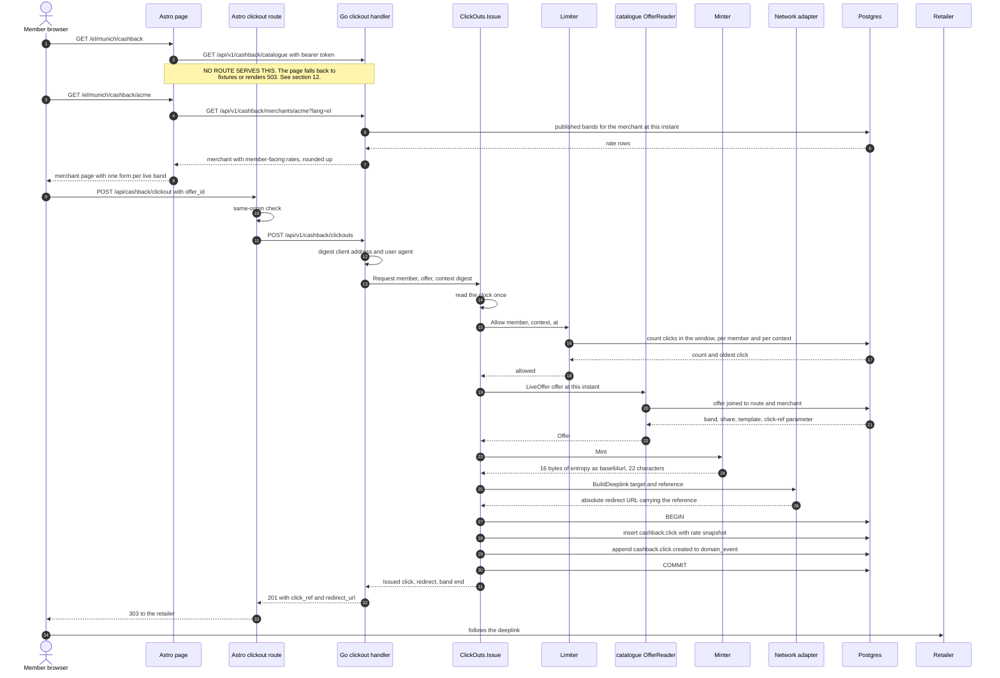

### Walkthrough

1. **Catalogue listing** — [the catalogue listing page](../../web/src/pages/%5Blang%5D/%5Bplace%5D/cashback/index.astro)
   calls `api.catalogue(...)`, which issues `GET /catalogue` in
   [web/src/lib/cashback/api.ts](../../web/src/lib/cashback/api.ts). **No Go route
   serves that path.** The route table in
   [internal/cashback/catalogue/handlers.go](../../internal/cashback/catalogue/handlers.go)
   holds exactly one entry, `GET /api/v1/cashback/merchants/{slug}`, while
   `Browser.Browse` in [browse.go](../../internal/cashback/catalogue/browse.go)
   is implemented and integration-tested with nothing calling it over HTTP. In a
   deployed environment the page therefore fails and renders its 503 branch; the
   fixture client answers it locally.
2. **Merchant detail** — `MerchantReader.Detail`
   ([detail.go](../../internal/cashback/catalogue/detail.go)) reads
   `cashback.merchant`, `merchant_copy`, `merchant_network` and `offer`, and
   converts each network commission into the *member's* rate through
   `RateBand.Earned(share, MemberFavour)` with `MemberFavour = money.RoundCeil`.
   The member never sees the network's commission, only their share of it.
3. **The click-out is a POST** —
   [web/src/pages/api/cashback/clickout.ts](../../web/src/pages/api/cashback/clickout.ts)
   refuses cross-origin submissions, forwards the offer id, and 303s to whatever
   the API returns and only to that. A GET would let a prefetcher manufacture
   clicks that later become evidence.
4. **Context digest** — `Handler.contextOf`
   ([context.go](../../internal/cashback/clickout/context.go)) digests the client
   address and user agent. The address comes from `CLICK_CONTEXT_HEADER` when the
   deployment names one and from the connection otherwise; unset, the per-device
   half of the click rule is effectively off, because behind a proxy every request
   digests to the proxy.
5. **One clock reading** — `ClickOuts.Issue`
   ([clickout.go](../../internal/cashback/clickout/clickout.go)) reads `now()`
   once and pins the rate limit, the liveness check and the snapshot to it. Three
   readings could straddle a band's edge and snapshot a rate nobody was shown.
6. **Rate limit first** — `Limiter.Allow`
   ([ratelimit.go](../../internal/cashback/clickout/ratelimit.go)) applies
   `ClickRule` ([clickrule.go](../../internal/cashback/clickout/clickrule.go))
   over `CountRecentClicksByAccount` and `CountRecentClicksByContext`
   ([queries/click.sql](../../internal/cashback/clickout/queries/click.sql)). Both
   statements return the count *and* the oldest click in the window in one read,
   because the second is the `Retry-After` the 429 owes the member.
7. **Liveness** — `OfferReader.LiveOffer`
   ([offer.go](../../internal/cashback/catalogue/offer.go)) refuses a band outside
   its validity window or on a route whose merchant has left the network. The
   handler answers 409, not 500: the member is on a stale page.
8. **Mint, then build, then record** — `Minter.Mint`
   ([mint.go](../../internal/cashback/clickout/mint.go)) draws exactly
   `entropyBytes = 16` and encodes base64url without padding, which is 22
   characters — the same number `click_ref_url_safe_and_long_enough` checks in
   [0012](../../internal/platform/db/migrations/0012_cashback_clicks_evidence.up.sql).
   The deeplink is built **before** the row is written, so a broken template
   leaves no orphan click; the row is written **before** the redirect is returned,
   so no member reaches a shop untracked.
9. **One commit** — `AnnouncedClicks.Record`
   ([recorder.go](../../internal/cashback/clickout/recorder.go)) opens the only
   transaction in the module and writes the click and its `cashback.click.created`
   event together. `cashback.click` is then immutable: triggers `click_immutable`
   and `click_no_truncate` (0012) refuse UPDATE, DELETE and TRUNCATE (C-3).

### What can go wrong, and what absorbs it

| Failure | What absorbs it |
| --- | --- |
| Member is clicking far too fast | `TooManyClicks` → 429 with `Retry-After` derived from the oldest click in the window. Nothing minted, nothing recorded. |
| Band expired between page render and click | `ErrOfferNotAvailable` → 409, before any reference exists. |
| Deeplink template cannot carry the reference | `ErrNoRedirect` → 502, and **no click row**. The publish-time probe in [publish.go](../../internal/cashback/catalogue/publish.go) is meant to catch this earlier. |
| Entropy source fails or returns short | `ErrNoClickReference`, hard failure with no fallback. A weak reference is a guessable claim on someone else's purchase. |
| Outbox append fails | The whole transaction rolls back: the member sees a failed click-out rather than a click that will never be announced. |
| Reference collision | The unique violation on `click_ref_unique` is deliberately **not** swallowed ([queries/click.sql](../../internal/cashback/clickout/queries/click.sql)). |

---

## 2. The network reports a transaction

Polling is the only path that creates evidence. There is no inbound webhook and no
operator route that writes a `network_transaction` row, which is what makes the
evidence table trustworthy: everything in it was read from the network by a poll
whose window, cursor and retrieval instant are recorded on the row itself. The
sequence below is one tick of one sweep, and the whole of it is one database
transaction — the reports and the cursor advance commit together or neither does.

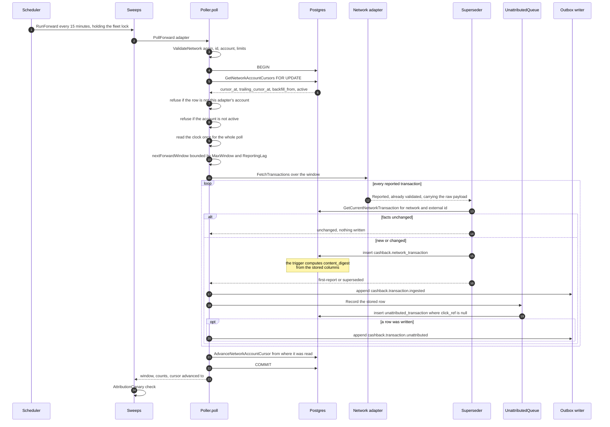

### Walkthrough

1. **Two sweeps per publisher account** —
   [sweeps.go](../../internal/cashback/networks/sweeps.go) registers
   `ForwardJobName(account)` at `ForwardInterval = 15 * time.Minute` and
   `TrailingJobName(account)` at `TrailingInterval`. The job is named after the
   *account*, not the network, because the account owns the cursors and two
   accounts at one network are two independent walks.
2. **Exclusion is the row lock, not the interval** — `GetNetworkAccountCursors`
   takes `FOR UPDATE`
   ([queries/network_account.sql](../../internal/cashback/networks/queries/network_account.sql)).
   The scheduler's fleet lock and the interval are latency controls; the lock is
   the correctness control.
3. **The account row is the authority** — the poll compares the adapter's
   `NetworkID` and external publisher id against the row before checking `active`,
   so "that account is switched off" is never said about a row that is not the
   account at all ([poller.go](../../internal/cashback/networks/poller.go)).
4. **Window arithmetic is pure** — `nextForwardWindow` and `nextTrailingWindow`
   in [poll.go](../../internal/cashback/networks/poll.go) take the cursor, the
   backfill start, the clock, `MaxWindow` and `ReportingLag` and return a window
   or nothing. The forward window never crosses the reporting horizon
   (`network.reporting_lag_minutes`,
   [0033](../../internal/platform/db/migrations/0033_network_reporting_lag_minutes.up.sql)),
   because a network that has not finished reporting a period would otherwise be
   asked about it once and never again.
5. **The adapter holds itself to its limits** — contract rule 3: never a window
   wider than `MaxWindow` (`ErrWindowTooWide`, **never silently clamped**) and
   every request paced to `RequestsPerMinute` through the token bucket in
   [ratelimiter.go](../../internal/cashback/networks/ratelimiter.go), whose rate
   comes from `cashback.network.rate_limit_per_minute`
   ([0026](../../internal/platform/db/migrations/0026_network_rate_limit_per_minute.up.sql)).
6. **The digest is the database's** — `cashback.network_transaction_guard()` in
   [0012](../../internal/platform/db/migrations/0012_cashback_clicks_evidence.up.sql)
   computes `content_digest` over the click reference, both status columns, the
   sale, the commission, the currency and `transacted_at`, separated by `chr(31)`.
   Application code cannot get it wrong, and
   `network_transaction_unique_report UNIQUE(network_id, external_id, content_digest)`
   turns an identical re-report into a no-op.
7. **Detection shares the transaction** —
   [unattributed.go](../../internal/cashback/networks/unattributed.go) writes the
   observation in the poll's own transaction. It must: once a report is stored,
   every later identical re-report is `unchanged` and writes nothing, so a report
   stored without its observation would never be re-examined.
8. **The cursor moves last, and conditionally** — `advance` updates only from the
   value the poll read. `pgx.ErrNoRows` becomes `ErrCursorMoved` and the whole
   transaction rolls back, which re-reads the window rather than skipping it
   (FR-031).
9. **The canary** — `Sweeps.checkAttribution`
   ([canary.go](../../internal/cashback/networks/canary.go)) reports `Suspect()`
   when attribution has never once succeeded and at least
   `AttributionCanaryThreshold = 3` transactions have gone unattributed since the
   first click. This is the guard against a wrong click-ref parameter silently
   losing every member's money.

### What can go wrong, and what absorbs it

| Failure | What absorbs it |
| --- | --- |
| Process dies mid-window | Nothing committed, cursor unmoved. The window is re-read; the supersede logic makes the re-read a no-op. |
| Network truncates an answer | `AbandonedIteration` ([iteration.go](../../internal/cashback/networks/iteration.go)) ends the iteration with a cause, `persist` stops, the cursor does not move. |
| Network rate-limits or is down | `ErrNetworkRateLimited` / `ErrNetworkUnavailable` — retryable, backoff honours `Retry-After` ([backoff.go](../../internal/cashback/networks/backoff.go)). |
| Credential rejected | `ErrNetworkRefused` — terminal until a human changes a credential. |
| Adapter shipped with empty `Limits` | `ValidateNetwork` refuses on **every** poll. A `MaxWindow` of zero would make every window empty, so the poll would "succeed" forever with nothing stored and no error anywhere. |
| Account never had a backfill start | `ErrNoBackfillStart`. A start in the future is `ErrBackfillStartInFuture` rather than permanent silence. |

---

## 3. Attribution, and the unattributed queue

Attribution is the step where a purchase becomes *somebody's*. It is a single
byte-for-byte lookup of the reference the network echoed against
`cashback.click.click_ref` — no trimming, no case folding, no unescaping. Widening
that match by any amount widens the set of network strings that can claim a
member's credit, which is the one thing standing between one member's purchase and
another's money. A miss is ordinary, not exceptional: networks echo references
minted by other publishers and by links that predate the deployment. So the miss
has a routine handling — a queue row and an event — and the report leaves the
awaiting set by being in the queue.

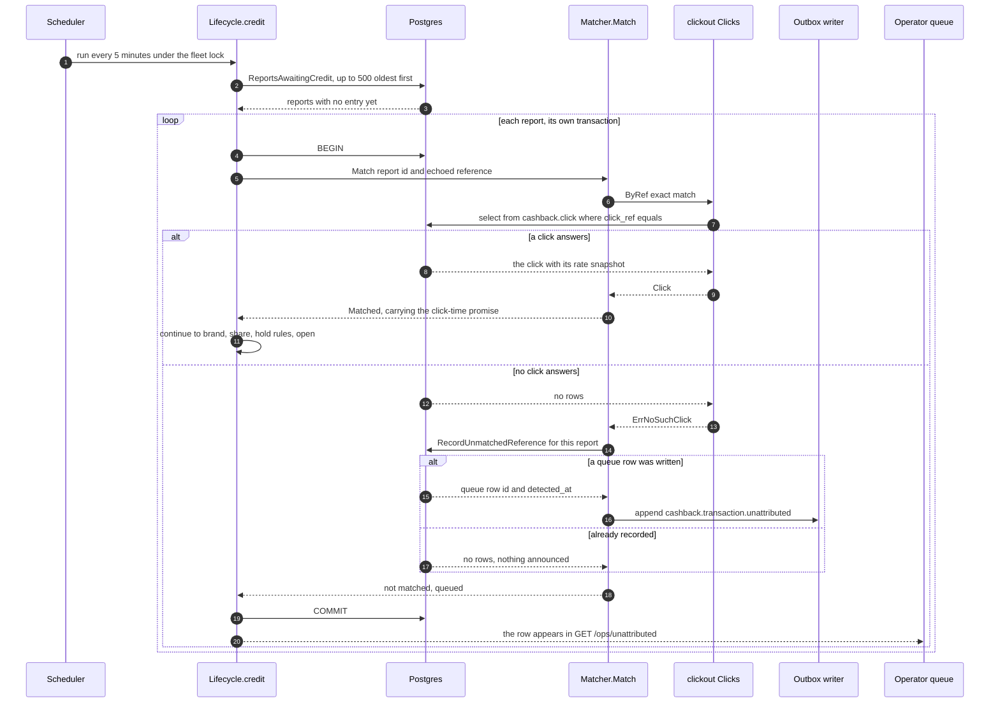

### Walkthrough

1. **Who asks the question** — `Lifecycle.creditOne`
   ([lifecycle.go](../../internal/cashback/earnings/lifecycle.go)) builds a
   `Matcher` over the item's own transaction and calls `Match` before anything
   else. Nothing above it decides money.
2. **The join** — `Clicks.ByRef`
   ([click.go](../../internal/cashback/clickout/click.go)) runs `GetClickByRef`
   ([queries/click.sql](../../internal/cashback/clickout/queries/click.sql)),
   whose comment states the rule: *"a reference that does not match this row byte
   for byte is not this click's, whatever it looks like."*
3. **A read that failed is not a read that found nothing** —
   [attribution.go](../../internal/cashback/earnings/attribution.go) returns the
   error rather than queueing. Queueing on a dropped connection would write a
   permanent, frozen record that this purchase went unattributed, and nothing
   later re-examines it.
4. **Two writers, one queue** — the networks module queues a report that carried
   **no reference at all**
   ([networks/unattributed.go](../../internal/cashback/networks/unattributed.go));
   the earnings module queues a reference that **matched no click**
   ([earnings/unmatched.go](../../internal/cashback/earnings/unmatched.go)). Both
   write `cashback.unattributed_transaction` and both emit
   `cashback.transaction.unattributed`, because an operator looking at
   unattributed money should see one list rather than two.
5. **The statement decides, not Go** — both queue writes are `insert ... select ...
   where` statements whose predicate reads the stored columns. A second
   implementation in Go is where the two would eventually disagree, and the
   disagreement would show up as a member never paid.
6. **The database backstop** — even if the match were wrong, trigger
   `entry_evidence_guard`
   ([0013](../../internal/platform/db/migrations/0013_cashback_earnings.up.sql))
   refuses an entry that omits the click the report named, or cites a different
   one (C-2).
7. **What an operator can do with a queue row** — dismiss it, and only dismiss it.
   `POST /ops/unattributed/{id}/dismiss`
   ([dismiss.go](../../internal/cashback/ops/dismiss.go)) records
   `resolved_by`, `resolved_reason` and `resolved_at` all-or-none
   (`unattributed_resolution_all_or_none`, 0013) and emits
   `cashback.unattributed.dismissed`. **There is no attribute-by-hand route.**
   [web/src/lib/cashback/api.ts](../../web/src/lib/cashback/api.ts) calls
   `POST /ops/unattributed/{id}/attribute`; nothing serves it.

### What can go wrong, and what absorbs it

| Failure | What absorbs it |
| --- | --- |
| A reference that matched nothing is later matched | Cannot happen through this path — the observation is frozen, and `OpenReport.Attributable` is derived from the immutable evidence rather than stored. |
| Two queue rows for one purchase | `unattributed_one_per_report UNIQUE`, plus the matcher refusing a report with no reference at all (`ErrNoReference`) so the networks module's row is not duplicated. |
| A crash between queueing and committing | The report is read again next run; the insert is `on conflict do nothing` and announces nothing the second time. |
| Attribution silently failing for every click | `AttributionCanary` goes `Suspect()` after three, and `ErrAttributionNeverSucceeded` is reported by the sweep. |
| Operator acting on a stale page | `ErrNoLongerOpen` — resolved, credited, or superseded since the page was rendered. |

---

## 4. An earnings entry through its whole life

An entry is money one member is owed by one brand for one reported purchase. Its
life is a small, closed state machine, and every move in it is two writes that
cannot be separated: a ledger transfer, and a row saying which transfer carried
which hop. `entry_transition.ledger_transfer_ref` is `NOT NULL`, so a state
recorded without its posting is unrepresentable; a deferred constraint trigger
checks at COMMIT that every change to `entry.state` is accompanied by a transition
recording that same hop. That is D7, and it is why the double-entry postings below
are drawn as real messages rather than as a note.

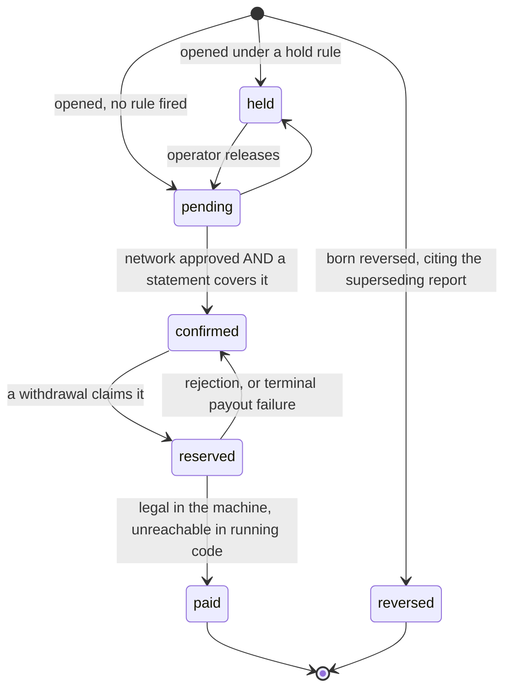

The absent arrows are the design. Nothing ever *becomes* `reversed` — a reversal is
a **new** entry, born reversed, citing the superseding report and carrying
`reversal_of_id`. Nothing leaves `paid` or `reversed`. `confirmed` never returns to
`pending`; un-confirmation is a reversal. `held` releases to `pending`, never
straight to `confirmed`, because an operator can assert that a credit is ordinary
and cannot assert that the network confirmed it. All of this is stated in
[state.go](../../internal/cashback/earnings/state.go) and enforced twice, in Go and
in `cashback.entry_guard()`.

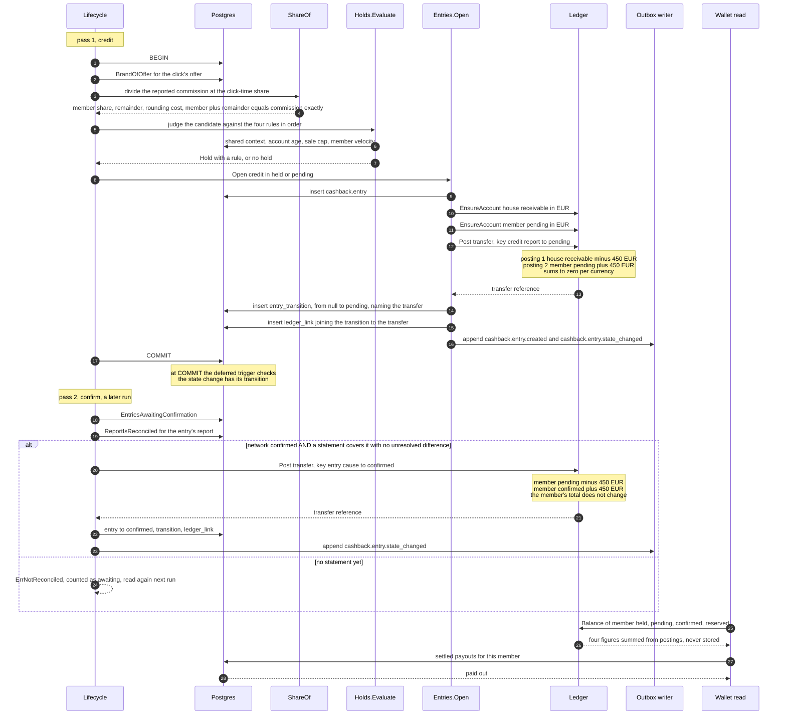

### Walkthrough

1. **The job** — `LifecycleJobName = "cashback-earnings-lifecycle"`, every
   `LifecycleInterval = 5 * time.Minute`, `lifecycleBatch = 500`, three passes in
   order: credit, confirm, reverse
   ([lifecycle.go](../../internal/cashback/earnings/lifecycle.go)). Each item runs
   in its own transaction, so one report the rules cannot judge does not roll back
   the ones beside it.
2. **The split** — `ShareOf(commission, click.Promised)`
   ([share.go](../../internal/cashback/earnings/share.go)) uses the rate from the
   **click**, never from the offer as it now stands. `MemberFavour =
   money.RoundCeil`; `Share.Member + Share.Remainder == commission` exactly, which
   is how C-1 is held by arithmetic rather than by anyone remembering to check.
   A commission that rounds to nothing at the promised share is logged and not
   credited.
3. **Hold rules, first match wins** —
   [holdrules.go](../../internal/cashback/earnings/holdrules.go) evaluates
   `shared-context`, `new-account`, `sale-cap`, `member-velocity` in that order. A
   rule that cannot be *asked* is `ErrHoldUnread`, never a silent pass.
   `entry_hold_rule_iff_held` requires a held entry to name a rule and every other
   entry to name none, on the row as a whole.
4. **Insert, post, record** — `Entries.Open`
   ([open.go](../../internal/cashback/earnings/open.go)) is the one place the
   insert comes first, because `entry_one_per_report` should refuse a duplicate
   *before* the ledger is asked to move anything. What makes it safe is the key:
   `openingKey` is derived from the **report**, so a retry after a failed commit
   re-posts to the same transfer instead of crediting a second time.
5. **Which accounts** — `postingsFor`
   ([postings.go](../../internal/cashback/earnings/postings.go)) derives the
   movement from what the states mean. Opening takes money out of
   `HouseAccount(receivable)`; a stage-to-stage move has the member on both sides,
   which is why a confirmation is not a credit.
6. **Two gates on confirmation** — `Confirmations.Confirm`
   ([confirm.go](../../internal/cashback/earnings/confirm.go)) requires both the
   report's own status to be `confirmed` **and** `ReportIsReconciled` to be true.
   That second read
   ([queries/confirm.sql](../../internal/cashback/earnings/queries/confirm.sql))
   asks two things: a statement covering the purchase's `transacted_at` was
   imported, and nothing unresolved on it disagrees about this transaction — matched
   along the supersede chain by network and external id, not by row, so an entry
   cannot confirm past a disagreement filed against a newer row of the same
   purchase.
7. **What the member sees** — `Wallets.Of`
   ([wallet.go](../../internal/cashback/wallet/wallet.go)) returns five figures.
   Four are projected from ledger balances on every read
   ([projection.go](../../internal/cashback/wallet/projection.go)); the fifth,
   `PaidOut`, is summed from settled payouts, because money that has left the
   business sits in no account. The wallet is denominated in the **threshold's**
   currency, which is the only currency the deployment has actually stated.

### What can go wrong, and what absorbs it

| Failure | What absorbs it |
| --- | --- |
| Two runs credit one report | `entry_one_per_report` (partial unique index since [0032](../../internal/platform/db/migrations/0032_entry_one_credit_per_report.up.sql), so a reversal may cite the same report) → `ErrAlreadyCredited`, before the ledger. |
| Crash between posting and recording | `ErrNotRecorded` — money moved, the row did not. Never swallowed. The retry re-posts under the derived key, the ledger records nothing new, and the transition is written against the same transfer. |
| Ledger refuses the transfer | `ErrNotPosted`; the entry is unchanged, nothing recorded for a posting that did not happen. |
| Entry moved between the read and the write | `ErrEntryMoved`, before any I/O cost — the conditional `MoveEntry` returns no rows. |
| Rounding quietly disappearing | `Share.Rounding` is computed and returned; `Member + Remainder` is exact, so zero-sum holds regardless. |
| Ledger silently out of balance | `ZeroSumCheck` ([zerosum.go](../../internal/cashback/wallet/zerosum.go)) runs every `ZeroSumInterval = time.Minute` — a constant, not a knob — and distinguishes "every currency nets zero" from "there were no rows at all". |

---

## 5. Reversal

A network that withdraws a commission has not made the earlier confirmation false;
it has said something new. So a reversal never edits the credit it undoes. It
writes a **new entry, born reversed**, citing the superseding report and carrying
`reversal_of_id`, and the original row is left exactly as it was. A member's
history therefore shows both rows, which is what US3 asks for, and an auditor can
see what was said and when it changed. The money goes back to the receivable —
never to the clawback account, which absorbs a loss already paid out and is a
different fact entirely.

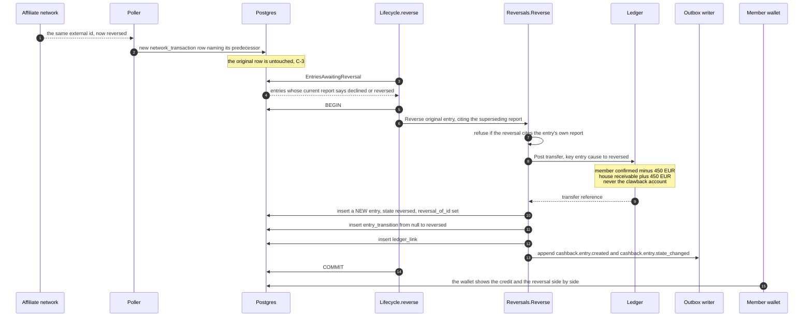

### Walkthrough

1. **Trigger** — `Lifecycle.reverse` reads `EntriesAwaitingReversal`
   ([queries/lifecycle.sql](../../internal/cashback/earnings/queries/lifecycle.sql))
   and calls `reverseOne` with the current report and its status, so the recorded
   reason is *"the network declined the commission"* in the network's own verdict.
2. **The reversing entry cites the reversing report** —
   [reversal.go](../../internal/cashback/earnings/reversal.go) refuses a reversal
   whose report is the original's own (`ErrNoReversingReport`). The evidence for
   taking money back is the new report, not the old one.
3. **The ledger move** — `postingsFor(member, <original state>, StateReversed,
   receivable)` moves out of whichever stage held the money and back to the
   receivable ([postings.go](../../internal/cashback/earnings/postings.go)).
4. **The pair is enforced** — `cashback.entry_guard()`
   ([0013](../../internal/platform/db/migrations/0013_cashback_earnings.up.sql))
   makes `paid` and `reversed` terminal and freezes the money facts;
   `entry_reversal_is_reversed` requires a row with `reversal_of_id` to be
   reversed, `entry_reversed_at_most_once` allows one reversal per entry, and the
   schema test `TestReversalLeavesAnAuditablePair`
   ([cashback_earnings_test.go](../../internal/platform/db/cashback_earnings_test.go))
   refuses a reversal that changed the original's state.
5. **The member's view** — the wallet entry list shows the reversal as a row of its
   own beside the credit, with its reason; there is no filter that can hide one
   ([wallet.astro](../../web/src/pages/%5Blang%5D/%5Bplace%5D/cashback/wallet.astro)).

### What can go wrong, and what absorbs it

| Failure | What absorbs it |
| --- | --- |
| Reversal of money already paid out | Out of reach: `paid` is terminal, and `postingsFor` has no movement out of it. Constitutionally this is Q3's absorbed loss against the house — **and the clawback house account is configured but posted to by nothing**. |
| Reversal of an entry holding nothing | `ErrNotReversible`. |
| Two reversals for one credit | `entry_reversed_at_most_once UNIQUE(reversal_of_id)`. |
| The original silently edited instead | `entry_guard()` freezes it; the schema test proves the guard fires. |

---

## 6. Supersede

Networks revise. A transaction reported as pending in March is confirmed in April
and may be reversed in June, and each of those is the same external id saying
something different. The supersede chain is how that is recorded without ever
editing a row: a new row names its predecessor, the predecessor stays exactly as it
was, and one partial unique index guarantees exactly one root per transaction while
another guarantees at most one successor per row. The third outcome — the network
saying the same thing again — writes nothing at all, and that outcome is most of
every trailing sweep.

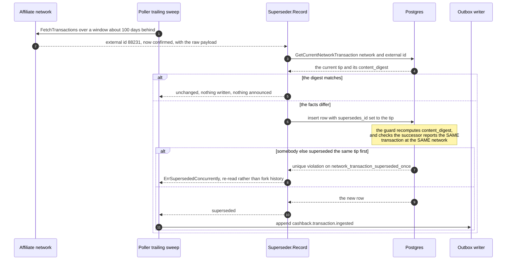

### Walkthrough

1. **Three outcomes, not two** — `Outcome` in
   [supersede.go](../../internal/cashback/networks/supersede.go) is
   `first-report`, `superseded` or `unchanged`. Announcing per stored row rather
   than per report read is what keeps a trailing sweep over a quiet period from
   republishing the same fact four times a day forever.
2. **Why the answer is allowed to change** — contract rule 4: re-issuing a window
   asks the same question but does not promise the same answer. That is the entire
   mechanism by which `pending` becomes `confirmed`. An adapter that memoised
   pages would freeze every member's money at pending with no error anywhere.
3. **The schema does the work** — in
   [0012](../../internal/platform/db/migrations/0012_cashback_clicks_evidence.up.sql):
   `network_transaction_superseded_once UNIQUE(supersedes_id)`,
   `network_transaction_one_root` (a partial unique index on
   `(network_id, external_id) WHERE supersedes_id IS NULL`),
   `network_transaction_not_own_predecessor`, plus the same-transaction check
   inside the guard and the `network_transaction_immutable` /
   `_no_truncate` triggers.
4. **Downstream** — the entry that was opened on an earlier row of the chain is
   still valid: the evidence guard reads the click reference from whichever report
   the entry names. The confirmation read deliberately matches differences along
   the chain rather than on the row
   ([queries/confirm.sql](../../internal/cashback/earnings/queries/confirm.sql)),
   and the ops queue's `ErrNoLongerOpen` stops an operator acting on a stale root
   while the automatic path credits the tip.

### What can go wrong, and what absorbs it

| Failure | What absorbs it |
| --- | --- |
| Two pollers supersede the same tip | One wins; the loser gets `ErrSupersededConcurrently` and re-reads. History does not fork. |
| A digest computed differently in Go and SQL | Impossible — only the trigger computes it, and the row is read back. |
| An unchanged re-report spamming the event stream | `unchanged` writes nothing and announces nothing. |
| A "successor" that is really a different transaction | The guard refuses a superseding row whose network or external id differs. |

---

## 7. The held queue

A hold is the product saying *this credit looks like abuse, and a person should
look before the member can spend it*. The money is credited — it exists, it is in
the member's `held` stage account, and it counts toward nothing — so the decision
an operator makes is about releasing it into the ordinary path or reversing it, and
either way the decision is recorded with a named human and a reason. Rejection
leaves the held credit exactly where it is and writes a reversing entry beside it,
because the operator's decision is a new fact and not an erasure of the old one.

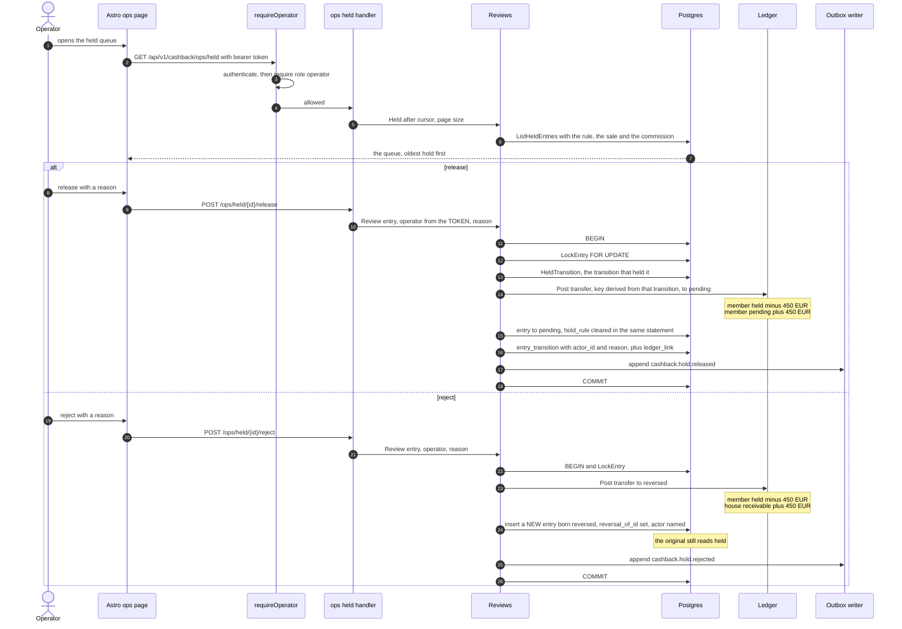

### Walkthrough

1. **The gate wraps the mux** — `requireOperator`
   ([ops/auth.go](../../internal/cashback/ops/auth.go)) wraps the whole route
   table, not each route, so a route added later cannot be left open by omission
   and a probe of an unknown path is refused before it learns the path exists. 401
   for no or invalid token, 403 for a valid token whose account is not
   `role='operator'` ([identity/role.go](../../internal/identity/role.go),
   introduced by
   [0019](../../internal/platform/db/migrations/0019_operator_role.up.sql)).
2. **The operator comes from the token** — every handler in
   [ops/held.go](../../internal/cashback/ops/held.go) reads the operator from the
   request context, never from the body. A body that could name the decider would
   be a body that could name somebody else.
3. **Locked, so two operators serialise** — `heldForDecision`
   ([review.go](../../internal/cashback/earnings/review.go)) takes `LockEntry FOR
   UPDATE`; the second operator reads what the first did and is told
   (`NotHeldError`, `ErrAlreadyRejected`).
4. **The release key is derived from the holding transition** — an entry can be
   held more than once in its life, so a key naming only the entry would make the
   second release a replay of the first: the ledger would move nothing while the
   row moved.
5. **The reason is mandatory and bounded** — `MaxReviewReasonRunes = 2000`,
   non-blank, recorded on `entry_transition.reason` with `actor_id` (FR-061).
6. **Rejection is append-only** — the reversing entry is a new row; the held row is
   untouched. This is the same shape as every other decision in the product.

### What can go wrong, and what absorbs it

| Failure | What absorbs it |
| --- | --- |
| An editor tries to release money | 403 — `operator` is a distinct role, not `editor` with more added. |
| A held entry with no transition into held | `ErrNotReviewed` naming the impossibility — D7 forbids a state recorded without its posting. |
| Two operators deciding one credit | The row lock, then the conditional move; the second is told what the first decided. |
| A demoted operator's past decisions | `account_role_guard()` (0019) freezes an operator's role while any payout references them; the drill is `TestOperatorMayReleaseMoneyAndBeDemotedIfTheyNeverDid`. |
| Rule configured at a threshold that would hold everything | `HoldRules.Validate` refuses `shared-context` at 1 — the member's own account is counted. |

---

## 8. Withdrawal, complete

This is where money leaves the business, and it is the sequence with the most
deliberate ordering in the repository. Three properties are held at once: a member
cannot spend a balance twice (the reservation moves the money before any human sees
the request), no payment exists without a named human approver (C-4), and a retry
cannot create a second payment (C-5). The last is why approval is **two
transactions**: the first commits the payout row, which claims the generated
idempotency key, before the rail is contacted at all.

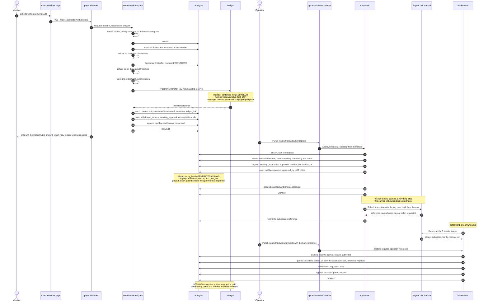

### Walkthrough

1. **Every refusal precedes the ledger** —
   [withdrawal.go](../../internal/cashback/payout/withdrawal.go) states it
   plainly: the ledger is not in the transaction, so a posted transfer is not
   rolled back by a failing INSERT. Cheap refusals, then destination, then the
   locked confirmed read, then the threshold, then `Covering` — and only then
   `Reserve`.
2. **The reservation is the double-spend defence** — there is deliberately **no**
   one-open-request constraint on `withdrawal_request`. Two concurrent requests
   serialise on the locked confirmed read, and the ledger refuses a member stage
   account going negative (`ErrInsufficientFunds`,
   [ledger.go](../../internal/cashback/wallet/ledger.go), enforced in SQL by
   `posting_member_not_negative` in
   [0022](../../internal/platform/db/migrations/0022_pg_ledger.up.sql)).
3. **Entries are reserved whole** — `Covering`
   ([reserve.go](../../internal/cashback/earnings/reserve.go)) takes oldest first
   and stops at the first entry that reaches the ask, so the reserved amount is at
   least what was requested and may exceed it. The endpoint returns
   `reserved_amount` for exactly that reason.
4. **The request id is minted in Go** — because `reserved_transfer_ref` is
   `NOT NULL` (the transfer must exist first) and `reservationKey` is derived from
   the request (the request's identity must exist first). Minting the id is the
   only thing that satisfies both.
5. **Approval claims the key before the rail is asked** —
   [approval.go](../../internal/cashback/payout/approval.go). The key is read back
   from the generated column, never recomputed in Go: *"a second authority on the
   one thing C-5 rests on"*. A second operator approving the same request loses on
   `payout_one_per_request` / `payout_idempotency_key_unique` rather than making a
   second payment.
6. **Who may approve** — `approved_by uuid NOT NULL REFERENCES public.account(id)`
   plus `cashback.payout_insert_guard()`, which requires the approver to hold role
   `operator`, plus `payout_pays_the_requested_amount`, a composite foreign key on
   `(request_id, amount_minor, currency)` so a payout cannot restate the approved
   amount
   ([0014](../../internal/platform/db/migrations/0014_cashback_payout.up.sql),
   [0019](../../internal/platform/db/migrations/0019_operator_role.up.sql)).
7. **The rail** — [rail.go](../../internal/cashback/payout/rail.go) defines the
   port and the three-way classification. Production wires exactly one:
   `newPayoutRail()` in [cmd/apivo/main.go](../../cmd/apivo/main.go) returns
   `manual.New()`, hard-coded. The manual rail derives its reference from the
   idempotency key and its `Status` **always** answers `submitted`, because a
   person is the only party who knows whether the money landed
   ([manual.go](../../internal/cashback/payout/manual/manual.go)).
8. **The loop does not close in the ledger.** `recordArrival`
   ([settle.go](../../internal/cashback/payout/settle.go)) writes
   `payout.state='settled'` and `withdrawal_request.state='paid'` and touches no
   entry. `postingsFor` returns `ErrNotThisPackagesToPost` for `to == StatePaid`
   ([postings.go](../../internal/cashback/earnings/postings.go)) and **no
   production caller supplies that posting**. After settlement the member's
   `Reserved` balance still holds the money *and* `PaidOut` reports it — the same
   money in two figures — and `entry.state = 'paid'` is reachable in the schema and
   unreachable in running code.

### Rejection, retry and abandonment

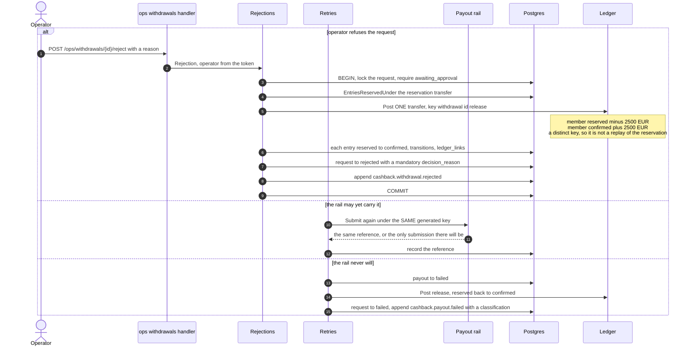

`ErrRailRetryable` and `ErrRailTerminal` are the two classifications, and
[rail.go](../../internal/cashback/payout/rail.go) states the cost of getting either
wrong: calling a timeout terminal releases a reservation for a payment that then
settles, and the member spends money that has already left; calling a rejection
retryable holds a member's balance hostage, silently, until somebody looks.

### What can go wrong, and what absorbs it

| Failure | What absorbs it |
| --- | --- |
| Member submits two withdrawals at once | The locked confirmed read serialises them; the second sees the reduced balance. The ledger refuses a negative member stage as the backstop. |
| Two operators approve one request | `payout_one_per_request` and the generated unique key → `ErrAlreadyApproved`. Test: `TestConcurrentDoubleSubmitProducesOnePayout`. |
| Rail times out after the payout row commits | The row stands, the key is fixed, `Retries.Retry` re-submits under it (FR-053). |
| Process dies before the submission reference is recorded | The payout sits `submitted` with no reference — the same recoverable state the retry picks up. |
| Reserved entries span two brands | `ErrBrandUnresolved`; `payout.brand_id` is a single frozen column and picking either would misattribute (ADR-0004). |
| Rejection with no reason | Refused in Go **and** by `withdrawal_request_rejection_has_reason`. |
| Destination is not the member's, or not verified | Composite FK `withdrawal_request_destination_is_the_members` and trigger `withdrawal_request_guard`; refused in Go first so the member reads a sentence rather than a constraint name. |

**Two gaps in this sequence, stated plainly.** `POST /payout-destinations` answers
**503 in every deployment**: [cmd/apivo/main.go](../../cmd/apivo/main.go) passes
`nil` for the vault and no `DetailsVault` implementation exists anywhere in the tree
([vault.go](../../internal/cashback/payout/vault.go)). And
`Destinations.Verify` ([verification.go](../../internal/cashback/payout/verification.go))
has no HTTP route and no production caller. Since `withdrawal_request_guard` refuses
an unverified destination, **a member cannot complete a withdrawal through the API
alone today.**

---

## 9. Reconciliation

Reconciliation is the second half of FR-043: the network's word that a commission
is approved, and Apivo's own evidence that the money actually arrived. An operator
imports the network's statement for a period; the system derives every disagreement
between what was reported and what was paid; each disagreement is closed by a named
human with a verdict and a reason. Until that happens, entries the network has
approved stay `pending` — visible to the member, never spendable — which is exactly
the intended behaviour rather than a delay to be engineered away.

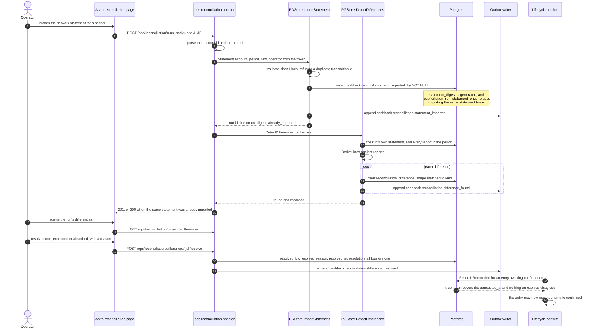

### Walkthrough

1. **One request does both halves** — `importStatement`
   ([reconciliation_http.go](../../internal/cashback/ops/reconciliation_http.go))
   imports and then derives. If detection fails the run is already committed, the
   failure is logged with the run id, and a retry of the same statement is the same
   run with detection run again.
2. **The run is immutable** — `reconciliation_run_immutable` and
   `_no_truncate` in
   [0015](../../internal/platform/db/migrations/0015_cashback_reconciliation.up.sql)
   (C-3), with `imported_by` NOT NULL and a generated `statement_digest` whose
   uniqueness ([0028](../../internal/platform/db/migrations/0028_reconciliation_statement_once.up.sql))
   refuses re-importing the same statement.
3. **Three kinds, three shapes** —
   [differences.go](../../internal/cashback/ops/differences.go) derives
   `reported_not_paid` (a report the statement does not pay),
   `paid_not_reported` (a statement line matching no report) and
   `amount_mismatch` (both, and different). Each kind's column shape is enforced by
   `reconciliation_difference_shape_matches_kind`
   ([0029](../../internal/platform/db/migrations/0029_reconciliation_difference_identity.up.sql)),
   with `_one_per_report` and `_one_per_line` partial unique indexes per run.
4. **The verdict is closed** — `VerdictExplained` or `VerdictAbsorbed`
   ([resolve.go](../../internal/cashback/ops/resolve.go)), reason non-blank and
   bounded, decider from the token. The four resolution columns are all-or-none
   after
   [0030](../../internal/platform/db/migrations/0030_reconciliation_difference_verdict.up.sql).
5. **What resolution unblocks** — the `ReportIsReconciled` read matches on
   `transacted_at`, because a statement covers when the *purchase* happened rather
   than when Apivo happened to poll for it, and it matches unresolved differences
   along the supersede chain.

### What can go wrong, and what absorbs it

| Failure | What absorbs it |
| --- | --- |
| The same statement imported twice | `reconciliation_run_statement_once` on the generated digest; the endpoint answers 200 with `already_imported`. |
| A statement naming one transaction twice | `Statement.Lines` refuses it by name and line number. |
| A statement larger than the process should read | `maxStatementBytes = 4 MB` on the request body. |
| Two operators resolving one difference | `AlreadyResolvedError` naming who decided, when, with what verdict and reason. |
| An entry confirming past a disagreement | The read matches the whole chain, not the row. |
| Detection fails after the import commits | The run stands and says so in the log; a retry re-derives. |

**Not built:** there is no `GET /ops/reconciliation/runs` listing, though
[web/src/lib/cashback/api.ts](../../web/src/lib/cashback/api.ts) calls one.

---

## 10. Accounting export

An export is the point where this system has to be believable to somebody outside
it — an accountant, an auditor, a founder checking a number. Two journals are
offered: the ledger journal (every entry transition with its transfer reference) and
the reconciliation journal (every difference with its verdict). Both are windowed,
both are bounded, and both are reproducible in the only sense that matters here:
they read immutable rows, so the same window asked twice gives the same answer
unless new immutable rows have appeared inside it.

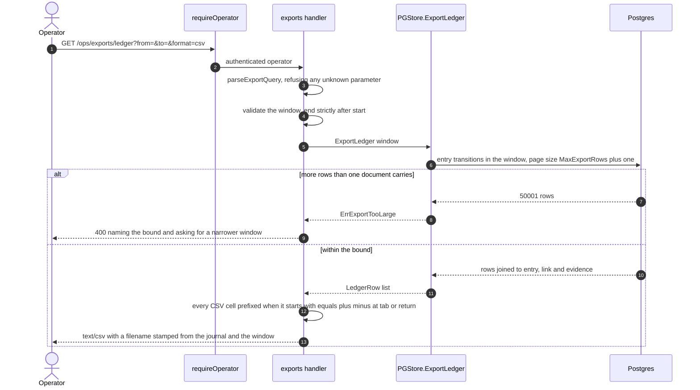

### Walkthrough

1. **Two journals, two endpoints** — `GET /ops/exports/ledger` and
   `GET /ops/exports/reconciliation`
   ([exports_http.go](../../internal/cashback/ops/exports_http.go)), both behind
   `requireOperator`, both accepting `from`, `to` and `format` and nothing else — an
   unknown query parameter is a 400 rather than a silently different export.
2. **Bounded** — `MaxExportRows = 50_000`
   ([exports.go](../../internal/cashback/ops/exports.go)); the query asks for one
   more than the bound so that "too large" is detected rather than truncated. A
   truncated export that looked complete is the failure this avoids.
3. **Formula injection** — `spreadsheetCell` prefixes any value beginning with
   `=`, `+`, `-`, `@`, tab or carriage return. An export is opened in a
   spreadsheet, and a merchant name is attacker-influenced text.
4. **Money crosses as integers** — every amount is `{minor, currency}` (C-6), and
   `minorOrBlank` writes the integer. No decimal is produced anywhere.
5. **What makes it reproducible** — the rows behind both journals are immutable:
   `entry_transition_immutable`, `ledger_link_immutable`,
   `network_transaction_immutable`, `reconciliation_run_immutable`. A resolution
   can be added to a difference (once, all-or-none), and nothing else about a
   listed row can change. Indexes for the two window reads were added by
   [0031](../../internal/platform/db/migrations/0031_accounting_export_indexes.up.sql).
6. **The related member-facing export** — `GET /api/v1/cashback/export`
   ([wallet/export.go](../../internal/cashback/wallet/export.go)) is the member's
   own copy of their entries, behind the member gate rather than the operator one.

### What can go wrong, and what absorbs it

| Failure | What absorbs it |
| --- | --- |
| Window too wide | `ErrExportTooLarge` → 400 naming the bound. |
| Window inverted or half-specified | `ErrInvalidWindow` → 400. |
| A cell that a spreadsheet would execute | `spreadsheetCell` prefixing. |
| Someone who is not an operator asking | 401 or 403 at the mux gate. |
| Two exports of one window disagreeing | Only by new immutable rows landing inside it; nothing already exported can be edited. |

---

## 11. Sign-in and the identity path

Every cashback route requires a bearer token — all 26 of them carry `security` in
[api/openapi.json](../../api/openapi.json). There is no anonymous cashback surface
at all, because `cashback.click.account_id` is `NOT NULL` (FR-023) and an anonymous
click could never be back-attributed. The token is issued by the hosted auth
provider, resolved in the Astro middleware once per request, forwarded to the Go
API as a bearer, verified there against JWKS, and mapped to a `public.account` row
before any handler runs. This sequence is honest about one thing: **the member
sign-in screen is not wired.** The session the cashback pages use today is the
editorial one.

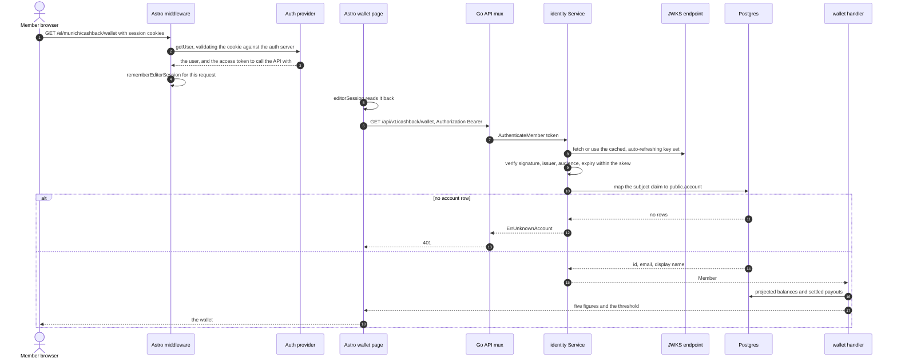

### Walkthrough

1. **The session is resolved once, in middleware** — `resolveEditorSession`
   ([web/src/lib/editorial/supabase.ts](../../web/src/lib/editorial/supabase.ts))
   calls `getUser()` rather than trusting the cookie's contents, and
   `rememberEditorSession`
   ([session.ts](../../web/src/lib/editorial/session.ts)) stores the result for
   the request ([web/src/middleware.ts](../../web/src/middleware.ts)).
2. **The token is used server-side only, which is not the same as a private
   API** — every cashback call is made from Astro's frontmatter with the
   member's own token, so the credential is never in the document and never in
   a page script ([api.ts](../../web/src/lib/cashback/api.ts)). Be exact about
   what that does and does not buy: the Go API is **not** private. The Hetzner
   Caddy configuration routes `/api/*`, `/healthz` and `/readyz` straight to
   the Go container and everything else to Astro
   ([the `apivo-routes` snippet](../../deploy/hetzner/caddy/snippets.caddy)),
   so every guard on the API is enforced in Go rather than by the API being
   unreachable. What this path rules out is a browser holding the token, not a
   browser reaching the API — and nothing is publicly reachable today only
   because no host is provisioned ([ENVIRONMENTS.md](../ENVIRONMENTS.md)).
3. **Verification** — [internal/identity/verifier.go](../../internal/identity/verifier.go)
   holds a cached, auto-refreshing JWKS, refuses `none` and symmetric algorithms,
   and applies `DefaultAcceptableSkew = 30s` bounded by `MaxAcceptableSkew = 2m`.
   An unreachable JWKS endpoint fails construction rather than at the first
   request.
4. **A valid token is not an authorised caller** — `Service.Authenticate`
   ([service.go](../../internal/identity/service.go)) maps the subject to
   `public.account`; a token for somebody never provisioned here is
   `ErrUnknownAccount` → 401.
5. **Each module names its own authenticator** — `wallet.MemberAuthenticator`,
   `payout.MemberAuthenticator`, `clickout.MemberAuthenticator`,
   `catalogue.MemberAuthenticator`, `ops.OperatorAuthenticator`, satisfied by thin
   adapters (`walletAuth`, `payoutAuth`, `memberAuth`, `catalogueAuth`,
   `newOperatorAuth`) in [cmd/apivo/main.go](../../cmd/apivo/main.go). This is the
   consumer-defines-the-interface rule, enforced by
   [internal/arch/arch_test.go](../../internal/arch/arch_test.go).
6. **The gap** — [the member sign-in page](../../web/src/pages/%5Blang%5D/signin.astro)
   is deliberately inert: every control carries the native `disabled` attribute,
   there is no form, no magic link, no OAuth href and no callback route, and the
   page says so in its own words. `signInWithPassword` appears exactly once in the
   repository, on the editorial sign-in. So the token the cashback pages send today
   is an editor's session token, and there is no member sign-up-to-wallet path.
   `POST /api/v1/account` ([internal/account/register.go](../../internal/account/register.go))
   now registers the caller from a verified token, which is the first half of
   closing this.

### What can go wrong, and what absorbs it

| Failure | What absorbs it |
| --- | --- |
| Token expired or malformed | 401 with `WWW-Authenticate`, before any handler. |
| Valid token, no account row | `ErrUnknownAccount` → 401, distinguished from a lookup failure. |
| Valid member token on an operator route | 403 — the role is read from `public.account.role`, the same column the database triggers read. |
| Cashback switched off in this deployment | Every `/api/v1/cashback/` route is unmounted and answers 404, with a start-up log line saying so — there is no half-on state. |
| Auth misconfigured | The wallet page renders 503 with `Retry-After` rather than an invented balance. |

---

## 12. Catalogue import, publication, and the rate on the screen

A rate a member can click is the end of a three-step chain, and each step is a
different authority. The network says which retailers a publisher account may send
traffic to; a person decides which of those to publish, at what member share, over
what window; and only then does a band appear on a merchant page. The import is
reconciling rather than additive — the whole catalogue is re-read each run, and a
retailer absent from a *complete* iteration is marked as having left the network,
which is why an abandoned iteration must announce itself.

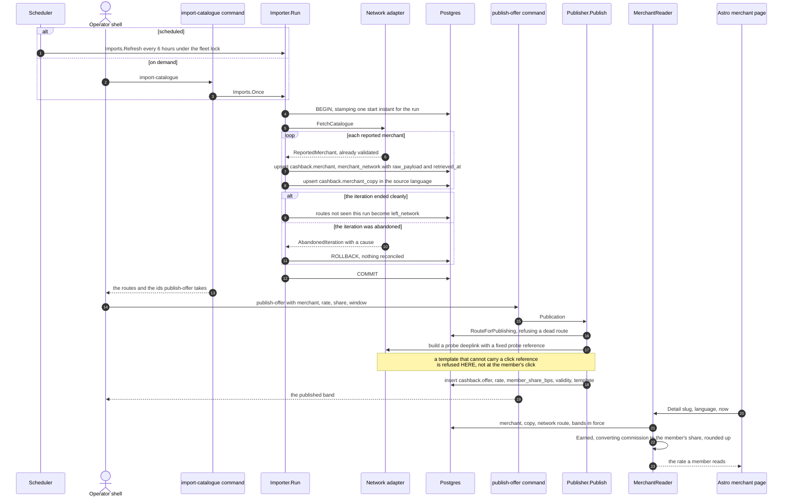

### Walkthrough

1. **The job and the command are the same code** — `Imports.Refresh` (scheduled,
   `ImportJobName = "cashback-catalogue-import"`, `ImportInterval = 6h`,
   `importTimeout = 15m`) and `Imports.Once` (on demand) both run
   `Importer.Run` ([schedule.go](../../internal/cashback/catalogue/schedule.go),
   [import.go](../../internal/cashback/catalogue/import.go)). The command is
   [cmd/apivo/import_catalogue.go](../../cmd/apivo/import_catalogue.go) and takes
   no network flag — the network comes from `NETWORKS`, because a network the
   running process does not serve is one it would never issue a click through.
2. **Why one instant matters** — two concurrent imports would each stamp their own
   start and then reconcile against it, so the slower one would mark everything the
   faster had just written as departed. The fleet-wide lock under the job name is
   what prevents that.
3. **Publication is a person's decision** — there is **no HTTP route** for it.
   [cmd/apivo/publish_offer.go](../../cmd/apivo/publish_offer.go) drives
   `Publisher.Publish` ([publish.go](../../internal/cashback/catalogue/publish.go)),
   which resolves the route, refuses a dead one, validates the rate, and probes the
   deeplink template with `probeClickRef = "publish-probe-000000000000000000"`
   through the real adapter before the band is stored.
   `DefaultMemberShare = 6000` basis points — 60% to the member.
4. **What the member sees** — `MerchantReader.Detail`
   ([detail.go](../../internal/cashback/catalogue/detail.go)) converts each band
   through `RateBand.Earned(share, MemberFavour)`. The network's commission never
   reaches the screen.
5. **Which adapters exist** — `shippedNetworks` in
   [cmd/apivo/registry.go](../../cmd/apivo/registry.go) is one map, so a driver is
   seedable and servable together or neither. `fixture` and `linkwise` are in it;
   `awin` is deliberately absent, because `*awin.Client` has no
   `FetchTransactions` and no `Limits` and therefore does not implement the port —
   deferred by founder decision of 2026-09-04.

### What can go wrong, and what absorbs it

| Failure | What absorbs it |
| --- | --- |
| Network answer truncated mid-catalogue | `AbandonedIteration` → the run does not reconcile, so thousands of live routes are not marked departed. |
| A template that drops the click reference | Refused at publish by the probe, rather than losing every click's attribution silently. |
| Publishing on a route whose merchant left | `refuseDeadRoute`. |
| Two instances importing at once | The scheduler's fleet lock under `ImportJobName`. |
| The catalogue listing not reaching members | **Unresolved** — `Browser.Browse` has no route, and the page calls one that does not exist. |

---

## 13. One news sequence, for contrast

The news product and the cashback product share a database, a scheduler, an outbox,
an identity gate and a shape of decision. Drawn side by side, `article.approved_by`
and `payout.approved_by` are the same idea: *the row is the approval*. The
differences are what each product's evidence is — a retrieved item with its
provenance on one side, a network transaction with its raw payload on the other —
and what a wrong decision costs.

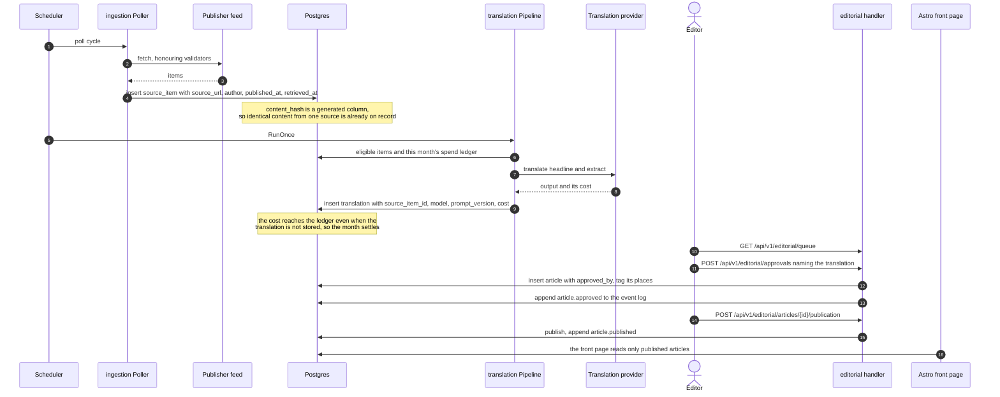

### Walkthrough

1. **Provenance at retrieval** — `Store.RecordRetrieval`
   ([internal/ingestion/store.go](../../internal/ingestion/store.go)) writes the
   source url, original title and author, publication instant and raw body, and
   reads back the generated `content_hash` and `retrieved_at`. The row's own clock
   is what an auditor reads — the same rule the click table and the unattributed
   queue follow.
2. **Lineage on the translation** — `Writer.Record`
   ([internal/translation/writer.go](../../internal/translation/writer.go)) stores
   `source_item_id`, `target_locale`, `model`, `prompt_version` and
   `cost_microusd`, and settles the month against the cap
   ([ledger.go](../../internal/translation/ledger.go)) even when the translation
   itself is not stored, because the provider billed either way.
3. **The named approver** — `PGStore.Approve`
   ([internal/editorial/approval.go](../../internal/editorial/approval.go)) writes
   `article.approved_by` and records an `article.approved` event in the same
   transaction. Invariant I-1 for news is C-4 for money, one file apart.
4. **One query answers the chain** — `PGStore.Provenance`
   ([provenance.go](../../internal/editorial/provenance.go)) returns source,
   source item, translation, approval, withdrawal and events for one article. Its
   cashback counterpart is the `cashback.provenance` view
   ([0016](../../internal/platform/db/migrations/0016_cashback_provenance_view.up.sql)),
   which answers C-7.

---

## 14. The patterns these sequences share

Read together, the thirteen sequences above use five patterns and almost nothing
else. Each is a constitutional invariant made into a shape of code, and each is
worth recognising on sight.

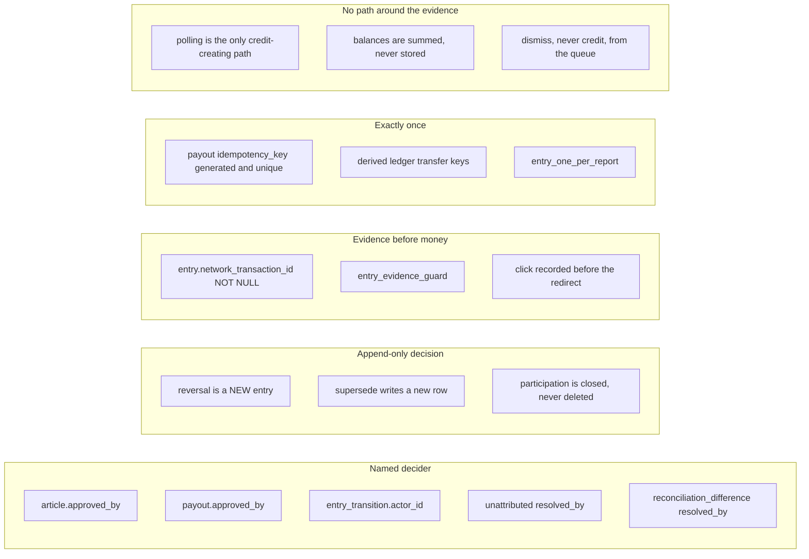

**A decision is a row with a named human on it.** `article.approved_by`,
`payout.approved_by`, `entry_transition.actor_id`,
`unattributed_transaction.resolved_by`, `reconciliation_difference.resolved_by`,
`withdrawal_request.decided_by`. In every case the decider is taken from the token
and never from the body, the reason is mandatory and bounded, and the database
refuses the row without them. Serves **C-4** and FR-061;
`cashback.payout_insert_guard()` goes further and refuses an approver who does not
hold the operator role.

**A decision is added, never edited.** A reversal is a new entry beside the credit;
a revised network report is a new row naming its predecessor; a resolved queue row
keeps its detection instant; participation that ends is a status and a date, and
DELETE is refused outright. Serves **C-3**, and it is the same pattern **C-9** asks
for on the claim decisions that do not exist yet. The machinery is already proved:
`click_immutable`, `network_transaction_immutable`, `entry_transition_immutable`,
`reconciliation_run_immutable`, `ledger_link_immutable`, `unattributed_transaction_guard`.

**Evidence comes before money, structurally.** A credit cannot exist without a
report (`network_transaction_id NOT NULL`), cannot cite a click the member did not
make (`entry_click_belongs_to_member`), and cannot omit the click the report named
(`entry_evidence_guard`). Upstream of that, the click row is committed before the
member is redirected. Serves **C-2**.

**Exactly once is a derived key plus a unique constraint, never a remembered set.**
`payout.idempotency_key` is `GENERATED ALWAYS` from the request and read back rather
than recomputed; ledger transfer keys are derived from the *cause* —
`credit:report:…`, `entry:…:cause:…:to:…`, `withdrawal:…:reserve`,
`withdrawal:…:release` — so a retry re-posts to the transfer the first attempt made.
Even the manual rail derives its reference from the key rather than remembering
which keys it has seen. Serves **C-5**, and D8.

**There is no path that reaches around the evidence.** Polling is the only
credit-creating path; there is no operator route that writes a network transaction
and no route that attributes one by hand. Balances are summed from immutable
postings on every read and are never stored, checked continuously by a job whose
interval is a constant rather than a knob. Money is integer minor units beside an
explicit currency everywhere, with no fractional type anywhere in the schema and no
decimal in the OpenAPI document. Serves **C-1**, **C-6** and **C-7**, with
ADR-0002's named exception mitigated by the zero-sum check and a working Postgres
implementation of the ledger port.

---

## 15. Open questions and known gaps

Ordered by how much they cost if left as they are.

1. **The money loop does not close in the ledger.** Settlement writes
   `payout.state='settled'` and `withdrawal_request.state='paid'` and moves no
   entry. `postingsFor` returns `ErrNotThisPackagesToPost` for `to == StatePaid`
   and no production caller supplies the posting, so after settlement the member's
   `Reserved` balance still holds the money *and* `PaidOut` reports it. No test
   asserts otherwise —
   [settle_integration_test.go](../../internal/cashback/payout/settle_integration_test.go)
   asserts only the request state. `entry.state = 'paid'` is reachable in the
   schema and unreachable in running code.
2. **A member cannot complete a withdrawal through the API alone.**
   `POST /payout-destinations` answers 503 everywhere (no `DetailsVault`
   implementation exists, and `nil` is passed), and `Destinations.Verify` has no
   route and no production caller, while `withdrawal_request_guard` refuses an
   unverified destination.
3. **Member sign-in is not wired.** The member sign-in page is deliberately inert;
   the cashback pages carry an editorial session token.
   `POST /api/v1/account` registers a caller from a verified token, which is the
   first half of the path.
4. **The outbox has no reader.** Eighteen distinct cashback event types are
   written — nineteen constants declare them, because
   `cashback.transaction.unattributed` is spelled in both
   [networks](../../internal/cashback/networks/events.go) and
   [earnings](../../internal/cashback/earnings/events.go), one type published
   from two places. The dispatcher, checkpoints, dead-letter table and requeue
   are implemented and unit-tested, and nothing in
   [cmd/apivo/main.go](../../cmd/apivo/main.go) registers one. `NewDispatcher`
   appears outside tests only where it is defined.
5. **Four surfaces the frontend calls that nothing serves.**
   [web/src/lib/cashback/api.ts](../../web/src/lib/cashback/api.ts) calls
   `GET /api/v1/cashback/catalogue`, `GET /ops/withdrawals?state=…`,
   `GET /ops/reconciliation/runs` and
   `POST /ops/unattributed/{id}/attribute`; none is in a `routes()` map — so
   unattributed work can be dismissed but never attributed. The two-way
   OpenAPI test cannot catch any of them: it compares the served document with
   the router, and the frontend client is in neither.
6. **Two house accounts are required in production and used by nothing.**
   `HOUSE_ACCOUNT_ROUNDING` and `HOUSE_ACCOUNT_CLAWBACK` are referenced by no
   posting path; the D6 rounding remainder is computed and stays in the receivable.
   Zero-sum still holds, so this is an attribution gap rather than a solvency one.
7. **One payout rail, hard-coded.** `newPayoutRail()` returns the manual rail and
   is not configurable; `payout_destination.kind` admits `sepa` and no SEPA rail
   exists. The manual rail's `Status` never advances, so settlement is
   operator-driven only.
8. **Participation is recorded and not enforced.** No click-out or catalogue path
   consults `cashback.participation`.
9. **Claims (spec 003) do not exist**, and with them **C-8, C-9 and C-10** have
   nothing to enforce: no table, no package, no route, no test. The goodwill house
   account C-10 names is not in `HouseAccountsConfig` either. The constitution
   amendment admitting claims is ratified, so this is unbuilt work rather than
   blocked work.
10. **Awin is not a shipped driver.** Client, catalogue fetch, deeplink and
    `Documented` exist; `FetchTransactions` and `Limits` do not, so the compiler
    refuses it as a `networks.Network`.
11. **`identity.account.deleted` has no handler** — closing participation, flagging
    in-flight withdrawals, never deleting financial rows. There is no dispatcher to
    register one with.
12. **A second-approver rule above an amount does not exist** (constitution Q13),
    and neither does a goodwill budget or cap (Q10). Both are open founder
    questions carrying safe defaults rather than decisions.
13. **Counts to be careful with.** No prose anywhere in this repository quotes a
    route total, and that is deliberate: the only trustworthy count is the one
    taken from [api/openapi.json](../../api/openapi.json) itself. At `0461ad7`
    that document declares **26 cashback operations over 22 cashback paths**,
    out of 44 operations over 37 paths in total, and every figure in this
    document is counted from it rather than quoted from another document.
    Likewise `specs/002-apivo-cashback-alpha/tasks.md` is not a status board —
    many unticked items are demonstrably present in the tree.
