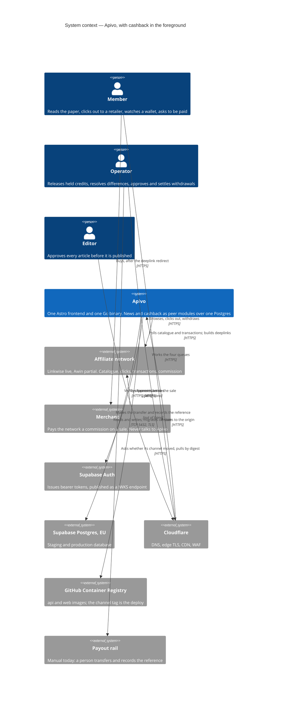
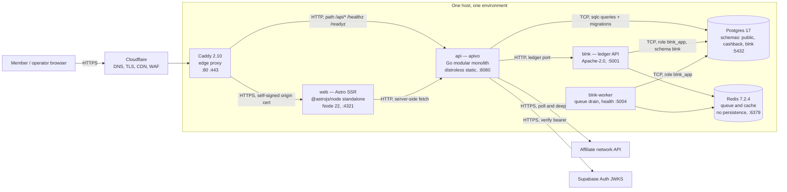
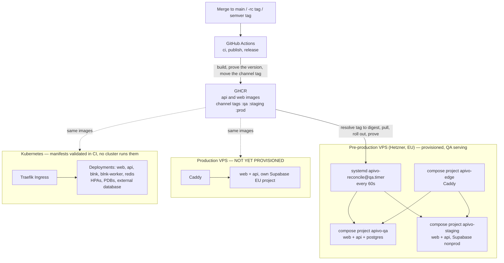

# Solution architecture — Apivo

*What is this system, who talks to it, what is deployed, and which properties the shape was chosen to buy?*

**Status**: 2026-09-07 · `main @ 0461ad7`

---

## Contents

1. [The business problem](#1-the-business-problem)
2. [The money flow in plain words](#2-the-money-flow-in-plain-words)
3. [Actors and external systems](#3-actors-and-external-systems)
4. [Level 1 — system context](#4-level-1--system-context)
5. [Level 2 — containers](#5-level-2--containers)
6. [Protocols, ports and networks](#6-protocols-ports-and-networks)
7. [The deployment view](#7-the-deployment-view)
8. [Quality attributes and the mechanism each one rests on](#8-quality-attributes-and-the-mechanism-each-one-rests-on)
9. [Key architectural decisions](#9-key-architectural-decisions)
10. [Deliberate non-goals](#10-deliberate-non-goals)
11. [Maturity, container by container](#11-maturity-container-by-container)
12. [Open questions and known gaps](#12-open-questions-and-known-gaps)

---

## 1. The business problem

Apivo is a super app for Greek communities abroad. Two products share one
deployment.

**epiloYES** is a multilingual local newspaper: a Greek speaker in Munich
reads Munich news in Greek, because language and place are independent axes.
It is the product the founders already understand, and it appears below only
where it shares substrate with the second.

**CASHBACK** is the money product, and it is the subject of this document. A
member shops at a retailer through Apivo; the retailer pays an affiliate
network a commission for the sale; Apivo passes a share of that commission
to the member and keeps the rest. That is the entire business model — the
only revenue in the product arrives from third-party affiliate networks
([ADR-0003](../adr/0003-affiliate-network-integration.md)).

Nothing about that is difficult until it is examined. Money that is promised
must be traceable to the sale that earned it; a network can reverse a
transaction months later; a member who is paid twice is a loss that no
apology recovers; and a regulator, an auditor or a member asking "why is this
number what it is" must get one answer, from one query. The architecture is
almost entirely a response to those four sentences, and the constitution
([.specify/memory/constitution.md](../../.specify/memory/constitution.md),
Principle IX) states them as ten invariants, C-1 to C-10, that the schema and
not the application is required to enforce.

## 2. The money flow in plain words

1. **Apivo imports a catalogue.** The network is asked, on a schedule, for
   every retailer it can send traffic to. Each answer is stored verbatim
   beside the parsed row, and a retailer absent from a complete read is
   reconciled to `left_network` rather than deleted
   ([internal/cashback/catalogue/import.go](../../internal/cashback/catalogue/import.go)).
2. **An operator publishes a rate band.** A band says what commission a route
   pays and what share of it the member is promised — 60 % where the operator
   names none
   ([internal/cashback/catalogue/publish.go](../../internal/cashback/catalogue/publish.go)).
3. **A member clicks out.** Apivo mints a click reference, builds the
   network's deeplink around it, and stores the click with the rate *as it
   stood at that moment*. The click record is immutable, and it carries the
   member — there is no anonymous click
   ([internal/cashback/clickout/clickout.go](../../internal/cashback/clickout/clickout.go)).
4. **The member buys.** Apivo sees none of this. The retailer pays the
   network; the network is the only party that knows a sale happened.
5. **Apivo polls the network.** Every fifteen minutes forward, every six hours
   back over a hundred-day trailing window, because a network changes its mind
   about a transaction long after it first reports it
   ([internal/cashback/networks/sweeps.go](../../internal/cashback/networks/sweeps.go)).
   Each report is stored as evidence; a changed report is a **new row
   superseding the old one**, never an edit
   ([internal/cashback/networks/supersede.go](../../internal/cashback/networks/supersede.go)).
6. **Attribution.** The report names the click reference Apivo minted, and the
   two are matched byte for byte. A report that matches nothing goes to an
   operator queue and credits nobody
   ([internal/cashback/earnings/attribution.go](../../internal/cashback/earnings/attribution.go)).
7. **The credit opens.** The commission is split at the promised share, in
   integer minor units, rounding in the member's favour, and the member's part
   is posted from a house receivable account into the member's *pending*
   stage. Fraud rules may open it *held* instead, naming the rule, for an
   operator to release or reject
   ([internal/cashback/earnings/share.go](../../internal/cashback/earnings/share.go),
   [holdrules.go](../../internal/cashback/earnings/holdrules.go)).
8. **Confirmation.** Two gates, both required: the network says confirmed,
   *and* an imported statement covering that purchase reconciles without an
   unresolved difference
   ([internal/cashback/earnings/confirm.go](../../internal/cashback/earnings/confirm.go)).
   Only confirmed money counts toward the payout threshold — €20 in the
   deployed configuration
   ([deploy/k8s/cashback/cashback-configmap.yaml](../../deploy/k8s/cashback/cashback-configmap.yaml)).
9. **Withdrawal.** The member asks; the covering entries move to *reserved*;
   a named operator approves; a payout row is written whose idempotency key
   the database itself generates from the request id, so a retry cannot
   create a second payment
   ([internal/platform/db/migrations/0014_cashback_payout.up.sql](../../internal/platform/db/migrations/0014_cashback_payout.up.sql)).
10. **Payment.** Today the rail is *manual*: an operator makes the transfer
    and records the bank reference
    ([internal/cashback/payout/manual/manual.go](../../internal/cashback/payout/manual/manual.go)).

The residue — the commission minus the member's share — is Apivo's revenue.
It is not a separate transfer; it is what stays in the house receivable
account after the member's part has left it.

Every member-facing figure is summed from ledger postings. No balance is ever
stored as a settable number
([internal/cashback/wallet/ledger.go](../../internal/cashback/wallet/ledger.go)).

## 3. Actors and external systems

| Actor or system | Kind | What it does here | Reached how |
|---|---|---|---|
| **Member** | person | Reads the paper, browses retailers, clicks out, watches a wallet, asks to be paid | Browser, HTTPS |
| **Operator** | person | Releases or rejects held credits, dismisses unattributed transactions, resolves reconciliation differences, approves, rejects and settles withdrawals. Role `operator` ([internal/identity/role.go](../../internal/identity/role.go)) | Browser, HTTPS, bearer token |
| **Editor** | person | Approves every article before publication. Role `editor`. News only | Browser, HTTPS, bearer token |
| **Affiliate network** | external system | Reports catalogue, clicks, transactions and commission; owns the tracking parameter. Linkwise has a complete adapter; Awin has a client, a catalogue fetch and a deeplink builder but **does not implement the port** ([cmd/apivo/registry.go](../../cmd/apivo/registry.go)) | Outbound HTTPS, polled |
| **Merchant / retailer** | external party | Pays the network a commission on a sale. **Never talks to Apivo** — it appears in the system only as a catalogue row and as the destination of a deeplink | none |
| **Supabase Auth** | external system | Issues bearer tokens; the Go binary verifies them against a JWKS endpoint and refuses `none` and symmetric algorithms ([internal/identity/verifier.go](../../internal/identity/verifier.go)) | Outbound HTTPS |
| **Supabase Postgres (EU)** | external system | The database for staging and production; QA runs a Postgres container instead ([docs/ENVIRONMENTS.md](../ENVIRONMENTS.md)) | TCP 5432, `sslmode=verify-full` in production |
| **Cloudflare** | external system | DNS, edge TLS, CDN and WAF in front of the host ([README.md](../../README.md)) | HTTPS |
| **GitHub Container Registry** | external system | Holds the `api` and `web` images. A channel tag (`:qa`, `:staging`, `:prod`) is what an environment tracks; a digest is what it runs ([.github/workflows/publish.yml](../../.github/workflows/publish.yml)) | Outbound HTTPS, polled every minute |
| **Payout rail** | external system | Where money actually leaves. Manual today — the port exists, one implementation is a person ([internal/cashback/payout/rail.go](../../internal/cashback/payout/rail.go)) | none, by construction |

## 4. Level 1 — system context

Two edges are worth reading twice. **The merchant never talks to Apivo** — the
commission arrives as a claim made by the network, which is why network
reports are treated as legal evidence and made immutable rather than as data
to be tidied. And **nothing pushes to Apivo from the outside except a
member's browser**: the network is polled, the registry is polled, and no
deployment endpoint exists to be called.

## 5. Level 2 — containers

Five processes run in a cashback-enabled deployment, plus the edge proxy. The
Go binary is one deployable that serves both products; splitting it was
considered and rejected in [ADR-0001](../adr/0001-super-app-architecture.md).

**web** — the Astro frontend
([web/](../../web/), [web/astro.config.mjs](../../web/astro.config.mjs)) is
the only public HTTP surface. It renders reader pages, the member cashback
surfaces under `/{lang}/{place}/cashback/…` and the operator queues under
`/ops/…`, and calls the Go API server-side through
[web/src/lib/cashback/api.ts](../../web/src/lib/cashback/api.ts). It also
carries the crawler fence — a deny list enforced in middleware inside the
container, so the block holds wherever the container runs
([web/src/middleware.ts](../../web/src/middleware.ts)).

**api** — one Go binary, `cmd/apivo`
([cmd/apivo/main.go](../../cmd/apivo/main.go)), built to
`gcr.io/distroless/static-debian12:nonroot` with no shell and no package
manager ([Dockerfile](../../Dockerfile)). It migrates the schema on start,
serves 44 HTTP operations over 37 paths — 26 of them under
`/api/v1/cashback/`, every one of them requiring a bearer token
([api/openapi.json](../../api/openapi.json)) — and runs the scheduled work in
goroutines beside the server, under Postgres advisory locks so a second
replica does not double-poll
([internal/platform/scheduler/advisorylock.go](../../internal/platform/scheduler/advisorylock.go)).
The jobs are the continuous ledger zero-sum check (every minute), the
earnings lifecycle (5 min), the payout settlement sweep (5 min), the forward
and trailing network sweeps (15 min and 6 h) and the catalogue import
([cmd/apivo/main.go](../../cmd/apivo/main.go)).

**postgres** — one database, one backup, one point-in-time recovery. News
lives in `public`, cashback in its own `cashback` schema with its own role,
and the ledger in `blnk`. No foreign key crosses a product boundary, and that
is linted ([scripts/lint-migrations.sh](../../scripts/lint-migrations.sh)).
On QA it is a container
([deploy/hetzner/compose/docker-compose.local-db.yml](../../deploy/hetzner/compose/docker-compose.local-db.yml));
on staging and production it is Supabase.

**blnk** and **blnk-worker** — the double-entry ledger and its queue drain,
adopted in [ADR-0002](../adr/0002-cashback-money-substrate.md) as the one
permitted exception to one-process-per-application. Both run as `blnk_app`,
which has usage on one schema and DML on its tables; the schema migration is
a separate one-shot container running as the database owner, because the
first migration issues `CREATE SCHEMA IF NOT EXISTS` and Postgres checks the
database-level `CREATE` privilege before taking the shortcut
([deploy/hetzner/compose/docker-compose.cashback.yml](../../deploy/hetzner/compose/docker-compose.cashback.yml)).
Both images are pinned by digest, not by tag: the ledger is the one place a
silent retag would change the binary that moves members' money.

**redis** — Blnk's queue and cache, configured with no RDB snapshot, no AOF
and `maxmemory-policy noeviction`. It holds no source of truth; a full Redis
must refuse a write rather than drop a queued transfer silently.

**caddy** — one edge proxy per host, in its own compose project, fronting
every environment on that host. It terminates public TLS, adds HSTS, applies
the crawler fence a second time, proxies `/api/*`, `/healthz` and `/readyz` to
the API and everything else to the web container
([deploy/hetzner/caddy/snippets.caddy](../../deploy/hetzner/caddy/snippets.caddy)).
It is deliberately not on a self-updating timer: the application stacks roll
themselves forward, the proxy does not, because a proxy that rolled itself
forward could take every environment on the host down at once
([deploy/hetzner/systemd/apivo-edge.service](../../deploy/hetzner/systemd/apivo-edge.service)).

## 6. Protocols, ports and networks

| Container | Image | Listens | Protocol | Published to the host | Network |
|---|---|---|---|---|---|
| caddy | `caddy:2.10-alpine` | 80, 443 | HTTP, HTTPS | yes — the only one | `edge` (external per environment) |
| web | built from [web/Dockerfile](../../web/Dockerfile) | 4321 | HTTPS with a self-signed origin certificate on Hetzner; plain HTTP under Kubernetes | no | `edge` |
| api | built from [Dockerfile](../../Dockerfile) | 8080 | HTTP | no | `edge` + `data` |
| postgres | `postgres:17-alpine` | 5432 | TCP, TLS on | no (loopback only in local dev) | `data` |
| blnk | `jerryenebeli/blnk:0.15.2` pinned by digest | 5001 | HTTP, `BLNK_SERVER_SECURE=true` | no | `edge` + `data` |
| blnk-worker | same image | 5004 (health, monitoring) | HTTP | no | `edge` + `data` |
| redis | `redis:7.2.4-alpine` pinned by digest | 6379 | RESP | no | `data` only |

The `data` network is `internal: true`
([deploy/hetzner/compose/docker-compose.yml](../../deploy/hetzner/compose/docker-compose.yml)):
nothing on it can reach the internet. The api and blnk sit on both networks
because staging and production reach Supabase across the public internet.
Redis sits on `data` alone — it needs nothing from the internet and nothing
from the internet needs it.

Health is not assumed anywhere. The api probes its own `/healthz` from inside
the image; blnk and its worker are probed with a real HTTP GET rather than a
port knock, because a listening socket says nothing about whether the ledger
reached its database.

## 7. The deployment view

Three environments, two hosts, one mechanism
([docs/ENVIRONMENTS.md](../ENVIRONMENTS.md)). All three run `APP_ENV=prod`,
which in this codebase means *hardened*, not *the production instance*.

**Nothing pushes to a host.** No CI job holds an SSH key, no agent has a shell
on a VPS, and there is no inbound endpoint on one. CI builds both images,
proves the published artefact names its own version, and moves a channel tag —
and that is the deploy. Each host asks the registry every minute whether its
channel has moved, resolves the tag to a digest *without pulling*, pins the
digest, rolls out, proves the roll-forward, and rolls back on the spot if the
proof fails
([deploy/hetzner/bin/apivo-reconcile](../../deploy/hetzner/bin/apivo-reconcile),
[deploy/hetzner/systemd/apivo-reconcile@.timer](../../deploy/hetzner/systemd/apivo-reconcile@.timer)).
A tag is what an environment tracks; a digest is what it runs.

**Cashback is off on every environment**, and the switch is not a variable
anyone can flip in a hurry: on a Hetzner host it is the presence of
`docker-compose.cashback.yml` in that environment's `COMPOSE_FILE`, and under
Kubernetes it is whether `deploy/k8s/cashback/` was applied. Listing the
overlay *is* the decision, and the eight keys that follow from it are set
there rather than in the operator's `api.env`, so two answers to "does this
environment run cashback" cannot disagree
([docs/ENVIRONMENTS.md](../ENVIRONMENTS.md)).

The Kubernetes path is a genuine second target, not a diagram: Deployments,
Services, HPAs, PodDisruptionBudgets and an Ingress exist for web and api
([deploy/k8s/](../../deploy/k8s/)), the cashback overlay adds blnk, its worker
and redis ([deploy/k8s/cashback/](../../deploy/k8s/cashback/)), and CI checks
them twice: `kubeconform` for schema shape
([.github/workflows/ci.yml](../../.github/workflows/ci.yml)) and a topology
gate for what the manifests *mean* — whether a Service is publicly routable,
for one, which is valid YAML either way and stops being a matter of taste once
a ledger is in the set
([.github/workflows/k8s-topology.yml](../../.github/workflows/k8s-topology.yml),
[deploy/k8s/validate.sh](../../deploy/k8s/validate.sh)).
No cluster runs them today. There is no Postgres manifest, deliberately: a
cluster deployment expects an external database.

Cloudflare Containers is **retired** — nothing deploys there.
[wrangler.jsonc](../../wrangler.jsonc) and
[deploy/cloudflare/](../../deploy/cloudflare/) stay in the tree, still
validated by CI, as the reference implementation of the per-caller rate limit
on the editorial endpoints. Keeping the code is not keeping the protection:
**the Hetzner deployment has no editorial rate limit at all**.

## 8. Quality attributes and the mechanism each one rests on

The architecture is not optimised for throughput, and it is not optimised for
developer velocity in the abstract. It is optimised for five properties, each
bought with a named, testable mechanism.

| Attribute | Why it dominates | The mechanism | Where |
|---|---|---|---|
| **Correctness of money** | A wrong balance is not a bug report, it is a loss and a liability | Double entry: no balance is stored, every figure is summed from immutable postings, and every transfer's postings sum to zero **per currency**. A deferred constraint trigger enforces it in raw SQL; a scheduled check re-reads it every minute and treats an imbalance as an incident, not a metric | [wallet/ledger.go](../../internal/cashback/wallet/ledger.go), [wallet/zerosum.go](../../internal/cashback/wallet/zerosum.go), [migrations/0022](../../internal/platform/db/migrations/0022_pg_ledger.up.sql) |
| **Exactly-once payment** | A duplicate payout cannot be recalled | The payout's idempotency key is a **generated column** — `'payout:' || request_id` — with a unique constraint, and the application reads it back rather than recomputing it. One payout per request, enforced by the database | [migrations/0014](../../internal/platform/db/migrations/0014_cashback_payout.up.sql), [payout/approval.go](../../internal/cashback/payout/approval.go), [payout/exactly_once_test.go](../../internal/cashback/payout/exactly_once_test.go) |
| **Auditability** | "Why is this number what it is" must have one answer | Evidence is append-only: click records, network transaction records and imported statements refuse UPDATE, DELETE and TRUNCATE by trigger, and a status change is a new superseding row. Every operator decision — release, reject, dismiss, resolve, approve, settle — is a row naming the human and the reason. One view walks payout → approver → postings → entries → evidence → click → the rate at click time | [migrations/0012](../../internal/platform/db/migrations/0012_cashback_clicks_evidence.up.sql), [migrations/0016](../../internal/platform/db/migrations/0016_cashback_provenance_view.up.sql), [db/cashback_provenance_test.go](../../internal/platform/db/cashback_provenance_test.go) |
| **Legal defensibility** | Content licensing and money handling are two different liabilities on one host | News: licence terms are snapshotted into the immutable `source_item` row at retrieval, in the same transaction as the content, and no article exists without a named approver. Cashback: a credit without evidence is unrepresentable, and a payout without a named operator is unrepresentable. The two products are isolated by schema and by grant — the cashback role can read exactly `account`, `place`, `language` and the outbox, and no news table at all | [migrations/0001](../../internal/platform/db/migrations/0001_init.up.sql), [migrations/0010](../../internal/platform/db/migrations/0010_cashback_schema.up.sql), [db/cashback_boundary_test.go](../../internal/platform/db/cashback_boundary_test.go) |
| **Rebrandability** | The product is meant to be re-skinned for another community without a code change | One brand definition, loaded once at start-up on both sides, and **zero brand literals** in code, templates or migrations — checked by a lint that greps for the brand's proper nouns on every pull request and every merge | [ADR-0004](../adr/0004-white-label-rebranding.md), [internal/platform/brand/brand.go](../../internal/platform/brand/brand.go), [.github/workflows/brand-lint.yml](../../.github/workflows/brand-lint.yml) |
| **Operability by one person** | Every extra deployable is a pipeline, an on-call surface and a version skew paid forever | One binary, one frontend, one database, one stack. The second runtime service is the ledger, and it required an ADR to admit | [ADR-0001](../adr/0001-super-app-architecture.md), [ADR-0005](../adr/0005-cashback-stack.md) |

Two of these are enforced structurally rather than by review. Module
boundaries — no product domain importing another, at any depth; a vendor SDK
importable only by its own adapter package — are a test, and the test also
proves it actually scanned something rather than passing vacuously
([internal/arch/arch_test.go](../../internal/arch/arch_test.go),
[internal/arch/network_isolation_test.go](../../internal/arch/network_isolation_test.go)).
And the HTTP contract is compared against the served route table in both
directions, so an undocumented route and a documented endpoint nobody serves
both fail the build
([cmd/apivo/openapi_routes_test.go](../../cmd/apivo/openapi_routes_test.go)).

## 9. Key architectural decisions

| ADR | Decision | Status | The consequence that shows up in this document |
|---|---|---|---|
| [0001](../adr/0001-super-app-architecture.md) | One repository, one Go module, one deployable. Product domains as peer modular monoliths under `internal/`, isolated by schema, connected only by asynchronous events, boundaries enforced by tests | Accepted 2026-08-24 | There is one `api` container, not two. `cashback` cannot import `content`, and the database grant makes that true at the schema level as well |
| [0002](../adr/0002-cashback-money-substrate.md) | Adopt Blnk (Apache-2.0) as the double-entry ledger, pointed at the same Postgres in its own schema. Redis comes with it and holds no source of truth | Accepted 2026-08-24 | Two extra containers, and the one named softening of the constitution's database-enforced-invariants principle — paid for with a continuous zero-sum check and a working Postgres implementation of the same port, so the decision is reversible in days |
| [0003](../adr/0003-affiliate-network-integration.md) | Networks behind a consumer-defined port with a shared conformance suite; a fixture adapter first; polling, not webhooks | Accepted 2026-08-24 | The only credit-creating path is a poll. No inbound endpoint exists for a network to call, and no network can create money by calling Apivo |
| [0004](../adr/0004-white-label-rebranding.md) | Single brand per deployment, fully configuration driven; brand id carried in the domain from day one so multi-tenancy is a migration, not a rewrite | Accepted 2026-08-24 | `BRAND_DIR` is mounted read-only into the api; a lint fails the build on a brand literal; multi-tenant isolation is explicitly not built |
| [0005](../adr/0005-cashback-stack.md) | No second stack. Cashback is Go and Astro, as today | Accepted 2026-08-24 | One CI pipeline, one linter, one build image, one set of debugging know-how |

## 10. Deliberate non-goals

These are choices, not omissions, and each has a reason that would survive the
question being asked again.

- **No microservices.** One person operates this. Every additional deployable
  is a release pipeline, an on-call surface, a version skew and a debugging
  hop paid forever ([ADR-0001](../adr/0001-super-app-architecture.md)).
- **No second stack for cashback.** Go and Astro, the same as news. The
  decisive constraint is the fixed per-stack tax, not technical fit
  ([ADR-0005](../adr/0005-cashback-stack.md)).
- **No inbound push to hosts.** No CI job holds an SSH key, no webhook exists
  to forge, no agent has a shell on a VPS. The host converges after a network
  partition without anyone re-triggering anything
  ([deploy/hetzner/systemd/apivo-reconcile@.timer](../../deploy/hetzner/systemd/apivo-reconcile@.timer)).
- **No webhooks from affiliate networks.** Credits are created only from a
  polled, stored, superseded-not-edited evidence row
  ([ADR-0003](../adr/0003-affiliate-network-integration.md)).
- **No multi-tenancy.** One brand live per deployment. Brand id is on the
  rows where a tenant boundary would fall, so the door is open; tenant
  scoping, per-tenant secrets and per-tenant operator views are not built
  ([ADR-0004](../adr/0004-white-label-rebranding.md)).
- **No stored balances, anywhere.** Not as a cache, not as a projection
  table. A stored balance is a second authority on the one number that must
  have exactly one ([internal/cashback/wallet/ledger.go](../../internal/cashback/wallet/ledger.go)).
- **No anonymous click-out.** `click.account_id` is `NOT NULL`; there is no
  path in which a click exists without the member who made it.
- **No self-service edit of anything financial.** Evidence is immutable and
  decisions are append-only; a correction is a new row citing the old one.
- **No deployment to Cloudflare Containers.** Retired
  ([README.md](../../README.md)).

## 11. Maturity, container by container

Blunt, because this goes in front of founders.

| Container | Built | Deployed | Honest status |
|---|---|---|---|
| **web** (Astro) | yes | QA serving on the pre-production host | Reader pages, member cashback surfaces and the four operator queues all exist. With `API_BASE_URL` unset the pages answer from built-in fixtures and every one of them says so in a band at the top. Three endpoints it calls are not served by anything — see below |
| **api** (Go `apivo`) | yes | QA serving; staging host ready, no release yet; production not provisioned | 44 operations over 37 paths, contract-tested against the route table in both directions. Migrates on start. Cashback is mounted only when the overlay is loaded, which no environment does |
| **postgres** | yes | QA: a container on the host. Staging: Supabase nonprod. Production: its own Supabase project, **not yet created** | Migrations `0001`–`0033`, all invariant tests run against a real Postgres in CI and are never skipped |
| **blnk** (ledger) | yes | **nowhere** | Runs locally and in CI. Digest-pinned, `BLNK_SERVER_SECURE=true`, split owner/runtime roles. Off on every deployed environment until the ADR-0002 spikes have passed there |
| **blnk-worker** | yes | **nowhere** | Same as above. Its own health route on 5004 is probed, because a dead worker with a live server means every transaction sits queued with nothing saying so |
| **redis** | yes | **nowhere** | No persistence by design; `noeviction` so a full instance refuses a write rather than dropping a transfer |
| **caddy** (edge) | yes | pre-production host: serving. Production: written, rehearsed, never run | The production Caddyfile is deliberately the staging one with one site instead of two, so production is not the environment with a bespoke proxy config nothing has exercised |
| **Kubernetes manifests** | yes | **no cluster** | Schema-validated in CI on every change. No Postgres manifest: an external database is assumed |
| **Cloudflare worker** | yes | retired | Kept as the reference rate-limit implementation only. The Hetzner deployment has no editorial rate limit at all |
| **Payout rail** | port + manual implementation | n/a | `newPayoutRail()` returns `manual.New()`, hard-coded and not configurable ([cmd/apivo/main.go](../../cmd/apivo/main.go)). `payout_destination.kind` admits `sepa`; no SEPA rail exists |

## 12. Open questions and known gaps

Stated here rather than discovered later.

**Nothing is in production.** The production VPS, its Supabase project and its
DNS record do not exist. QA serves; staging's host answers with a correct 502
because no release candidate has ever moved its channel
([docs/ENVIRONMENTS.md](../ENVIRONMENTS.md)).

**Cashback is switched off everywhere it is deployed, and switched on nowhere
that is deployed.** The ledger has never run outside a laptop and CI.

**A member cannot sign in.** Member sign-in is drawn and disabled: every
control on [web/src/pages/[lang]/signin.astro](../../web/src/pages/%5Blang%5D/signin.astro)
carries the native `disabled` attribute, and the file states plainly that
Supabase Auth is not wired for members and nothing creates a member session.
The API half exists — `POST /api/v1/account` exchanges a verified token for an
account row ([internal/account/register.go](../../internal/account/register.go))
— but every cashback route requires a bearer token that no member surface can
currently obtain.

**The money loop does not close in the ledger.** Settlement writes
`payout.state='settled'` and `withdrawal_request.state='paid'` and moves no
entry: nothing posts `reserved → paid`, so after settlement the member's
reserved balance still holds the money *and* the paid-out figure reports it.
`entry.state='paid'` is legal in the schema and in the state machine, and
unreachable in running code
([internal/cashback/earnings/postings.go](../../internal/cashback/earnings/postings.go),
[internal/cashback/payout/settle.go](../../internal/cashback/payout/settle.go)).

**Payout destinations cannot be created or verified through the API.**
`POST /payout-destinations` answers 503 in every deployment because no details
vault implementation exists, and `Destinations.Verify` has no route and no
production caller. Since the database refuses a withdrawal naming an
unverified destination, a member cannot complete a withdrawal through the API
alone.

**The outbox has no reader.** Nineteen event types are appended
transactionally with the state changes that cause them; the dispatcher,
checkpoints, dead-letter table and requeue are implemented and unit-tested,
and nothing in the composition root registers a subscriber. The outbox is
write-only in the running binary
([internal/platform/events/dispatcher.go](../../internal/platform/events/dispatcher.go)).

**Two of the three house accounts are required in production and used by
nothing.** `HOUSE_ACCOUNT_ROUNDING` and `HOUSE_ACCOUNT_CLAWBACK` are refused
at startup if unset or shared, and no posting path references either. The
rounding remainder is computed and stays in the receivable. Zero-sum still
holds; this is an attribution gap, not a solvency one
([internal/cashback/wallet/house.go](../../internal/cashback/wallet/house.go)).

**Three endpoints the frontend calls are served by nobody**: the operator
withdrawal queue listing, the reconciliation run listing, and attributing an
unattributed transaction by hand. Unattributed work can be dismissed but not
attributed. The catalogue browse endpoint is in the same position — the
domain code and its integration tests exist, no route serves it
([web/src/lib/cashback/api.ts](../../web/src/lib/cashback/api.ts) against
[internal/cashback/ops/handler.go](../../internal/cashback/ops/handler.go)).

**Claims are specified and unbuilt**, and with them invariants C-8, C-9 and
C-10. No table, no package, no route
([specs/003-cashback-claims/](../../specs/003-cashback-claims/)). The goodwill
house account C-10 names as the only evidence-free remedy does not exist in
the configuration surface.

**Awin does not implement the network port** — no `FetchTransactions`, no
`Limits` — and is deliberately absent from the shipped driver registry,
deferred by founder decision of 2026-09-04
([cmd/apivo/registry.go](../../cmd/apivo/registry.go)).

**There is no editorial rate limit on the deployed path**, and porting one to
Go middleware is required before anything is publicly reachable
([README.md](../../README.md)).

**Founder questions still carrying safe defaults rather than decisions**: Q1
which networks to join, Q3 post-payout clawback, Q5 rails and threshold, Q6
KYC and sanctions, Q7 tax, Q8 click-log retention, Q9 the repository and
product rename, Q10–Q13 claims — including Q13, whether a second approver is
required above an amount, for which there is no mechanism today
([.specify/memory/constitution.md](../../.specify/memory/constitution.md)).
